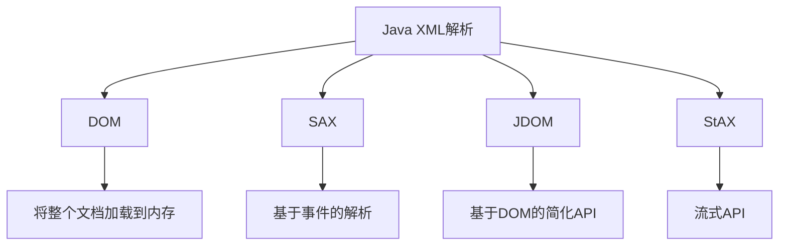
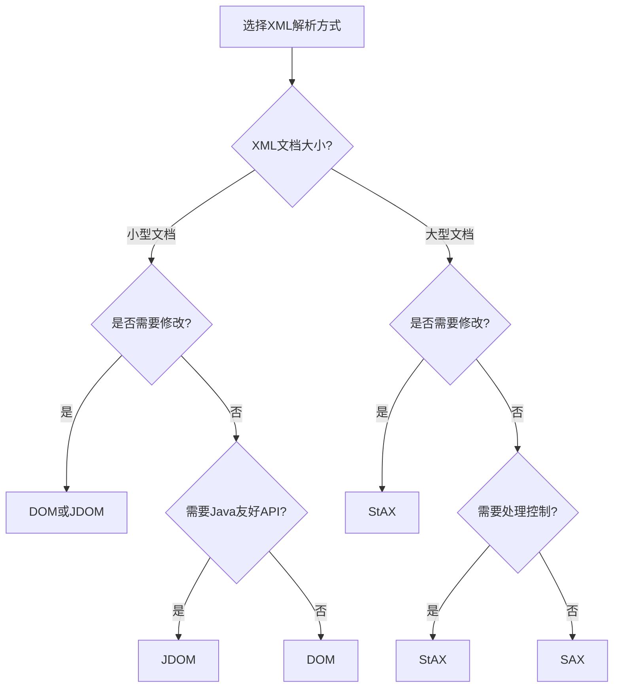

# Java XML概述

## 什么是XML？

XML（可扩展标记语言，Extensible Markup Language）是一种用于存储和传输数据的标记语言。与HTML不同，XML被设计用来传输和存储数据，而非显示数据。XML的特点是自我描述性强，具有良好的可读性，并且独立于软件和硬件平台。

:::note 特点
- 自定义标签 - XML允许创建自定义标签
- 可读性强 - XML具有树形结构，层次分明
- 平台无关 - 可跨平台交换数据
- 严格的语法 - 比HTML更严格，必须正确嵌套和关闭标签
:::

XML文档示例：

```xml
<?xml version="1.0" encoding="UTF-8"?>
<students>
    <student id="1">
        <name>张三</name>
        <age>20</age>
        <grade>A</grade>
    </student>
    <student id="2">
        <name>李四</name>
        <age>21</age>
        <grade>B</grade>
    </student>
</students>
```

## Java 中处理XML的意义

Java提供了多种API来处理XML文档，使开发者能够轻松创建、读取、更新和解析XML数据。在企业级应用中，XML常用于：

1. 配置文件（如Spring框架配置）
2. Web服务（SOAP协议）
3. 数据交换与存储
4. 应用程序间的通信

## Java XML解析方式

Java提供了四种主要的XML解析方式：



### 1. DOM解析

DOM（Document Object Model，文档对象模型）解析器将XML文档加载到内存中，构建一个树形结构，允许程序随机访问文档的各个部分。

**优点**：
- 可以随机访问文档的任何部分
- 可以修改文档内容

**缺点**：
- 内存消耗大，对于大文档不友好
- 解析速度相对较慢

**使用示例**：

```java
import javax.xml.parsers.DocumentBuilder;
import javax.xml.parsers.DocumentBuilderFactory;
import org.w3c.dom.Document;
import org.w3c.dom.Element;
import org.w3c.dom.Node;
import org.w3c.dom.NodeList;

public class DOMParserExample {
    public static void main(String[] args) {
        try {
            // 创建DocumentBuilderFactory
            DocumentBuilderFactory factory = DocumentBuilderFactory.newInstance();
            DocumentBuilder builder = factory.newDocumentBuilder();
            
            // 解析XML文件
            Document document = builder.parse("students.xml");
            
            // 标准化XML结构
            document.getDocumentElement().normalize();
            
            // 获取根元素
            System.out.println("根元素: " + document.getDocumentElement().getNodeName());
            
            // 获取所有student元素
            NodeList nodeList = document.getElementsByTagName("student");
            
            // 遍历student节点
            for (int i = 0; i < nodeList.getLength(); i++) {
                Node node = nodeList.item(i);
                
                System.out.println("\n当前元素: " + node.getNodeName());
                
                if (node.getNodeType() == Node.ELEMENT_NODE) {
                    Element element = (Element) node;
                    System.out.println("学生ID: " + element.getAttribute("id"));
                    System.out.println("姓名: " + element.getElementsByTagName("name").item(0).getTextContent());
                    System.out.println("年龄: " + element.getElementsByTagName("age").item(0).getTextContent());
                    System.out.println("成绩: " + element.getElementsByTagName("grade").item(0).getTextContent());
                }
            }
        } catch (Exception e) {
            e.printStackTrace();
        }
    }
}
```

**输出**：
```
根元素: students

当前元素: student
学生ID: 1
姓名: 张三
年龄: 20
成绩: A

当前元素: student
学生ID: 2
姓名: 李四
年龄: 21
成绩: B
```

### 2. SAX解析

SAX（Simple API for XML）是一种基于事件的解析器，它在读取XML文档时触发事件，不将整个文档加载到内存。

**优点**：
- 内存效率高，适合处理大型XML文档
- 解析速度快

**缺点**：
- 只能顺序访问，无法随机访问文档
- 只读，无法修改XML内容

**使用示例**：

```java
import javax.xml.parsers.SAXParser;
import javax.xml.parsers.SAXParserFactory;
import org.xml.sax.Attributes;
import org.xml.sax.SAXException;
import org.xml.sax.helpers.DefaultHandler;

public class SAXParserExample {
    public static void main(String[] args) {
        try {
            // 创建SAXParserFactory
            SAXParserFactory factory = SAXParserFactory.newInstance();
            SAXParser saxParser = factory.newSAXParser();
            
            // 创建默认处理器
            DefaultHandler handler = new DefaultHandler() {
                boolean bName = false;
                boolean bAge = false;
                boolean bGrade = false;
                
                @Override
                public void startElement(String uri, String localName, String qName, Attributes attributes) {
                    System.out.println("开始元素: " + qName);
                    
                    if (qName.equalsIgnoreCase("student")) {
                        String id = attributes.getValue("id");
                        System.out.println("学生ID: " + id);
                    } else if (qName.equalsIgnoreCase("name")) {
                        bName = true;
                    } else if (qName.equalsIgnoreCase("age")) {
                        bAge = true;
                    } else if (qName.equalsIgnoreCase("grade")) {
                        bGrade = true;
                    }
                }
                
                @Override
                public void endElement(String uri, String localName, String qName) {
                    System.out.println("结束元素: " + qName);
                }
                
                @Override
                public void characters(char[] ch, int start, int length) {
                    if (bName) {
                        System.out.println("姓名: " + new String(ch, start, length));
                        bName = false;
                    } else if (bAge) {
                        System.out.println("年龄: " + new String(ch, start, length));
                        bAge = false;
                    } else if (bGrade) {
                        System.out.println("成绩: " + new String(ch, start, length));
                        bGrade = false;
                    }
                }
            };
            
            // 解析XML文件
            saxParser.parse("students.xml", handler);
            
        } catch (Exception e) {
            e.printStackTrace();
        }
    }
}
```

### 3. JDOM解析

JDOM是对DOM的简化和优化，专为Java设计，使XML解析更加Java化。

**优点**：
- 比DOM更符合Java编程习惯
- API简洁易用
- 读写XML文档更加容易

**缺点**：
- 需要额外引入JDOM库
- 与DOM类似，需要将整个文档加载到内存

**使用示例**：

```java
import org.jdom2.Document;
import org.jdom2.Element;
import org.jdom2.input.SAXBuilder;
import java.io.File;
import java.util.List;

public class JDOMParserExample {
    public static void main(String[] args) {
        try {
            // 创建SAXBuilder对象
            SAXBuilder saxBuilder = new SAXBuilder();
            
            // 解析XML文件
            Document document = saxBuilder.build(new File("students.xml"));
            
            // 获取根元素
            Element rootElement = document.getRootElement();
            System.out.println("根元素: " + rootElement.getName());
            
            // 获取所有student元素
            List<Element> studentList = rootElement.getChildren("student");
            
            // 遍历student元素
            for (Element student : studentList) {
                System.out.println("\n当前元素: " + student.getName());
                System.out.println("学生ID: " + student.getAttributeValue("id"));
                System.out.println("姓名: " + student.getChildText("name"));
                System.out.println("年龄: " + student.getChildText("age"));
                System.out.println("成绩: " + student.getChildText("grade"));
            }
            
        } catch (Exception e) {
            e.printStackTrace();
        }
    }
}
```

### 4. StAX解析

StAX（Streaming API for XML）是Java 6引入的流式API，结合了DOM和SAX的优点。

**优点**：
- 比SAX更易于使用且控制更好
- 比DOM更高效，不需要加载整个文档
- 支持读和写XML

**缺点**：
- 只能顺序访问

**使用示例**：

```java
import javax.xml.stream.XMLInputFactory;
import javax.xml.stream.XMLStreamConstants;
import javax.xml.stream.XMLStreamReader;
import java.io.FileReader;

public class StAXParserExample {
    public static void main(String[] args) {
        try {
            // 创建XMLInputFactory
            XMLInputFactory factory = XMLInputFactory.newInstance();
            XMLStreamReader reader = factory.createXMLStreamReader(new FileReader("students.xml"));
            
            String currentElement = "";
            String studentId = "";
            
            // 遍历XML
            while(reader.hasNext()) {
                int event = reader.next();
                
                switch(event) {
                    case XMLStreamConstants.START_ELEMENT:
                        currentElement = reader.getLocalName();
                        
                        if (currentElement.equals("student")) {
                            studentId = reader.getAttributeValue(0);
                            System.out.println("\n学生ID: " + studentId);
                        }
                        break;
                        
                    case XMLStreamConstants.CHARACTERS:
                        String text = reader.getText().trim();
                        if (!text.isEmpty()) {
                            switch(currentElement) {
                                case "name":
                                    System.out.println("姓名: " + text);
                                    break;
                                case "age":
                                    System.out.println("年龄: " + text);
                                    break;
                                case "grade":
                                    System.out.println("成绩: " + text);
                                    break;
                            }
                        }
                        break;
                        
                    case XMLStreamConstants.END_ELEMENT:
                        currentElement = "";
                        break;
                }
            }
            
        } catch (Exception e) {
            e.printStackTrace();
        }
    }
}
```

## XML在Java项目中的实际应用

### 1. Spring配置文件

在Spring框架中，XML常用于配置Bean和依赖注入：

```xml
<?xml version="1.0" encoding="UTF-8"?>
<beans xmlns="http://www.springframework.org/schema/beans"
       xmlns:xsi="http://www.w3.org/2001/XMLSchema-instance"
       xsi:schemaLocation="http://www.springframework.org/schema/beans
                           http://www.springframework.org/schema/beans/spring-beans.xsd">

    <bean id="studentService" class="com.example.service.StudentServiceImpl">
        <property name="studentDao" ref="studentDao" />
    </bean>
    
    <bean id="studentDao" class="com.example.dao.StudentDaoImpl" />
</beans>
```

### 2. Web服务通信

在SOAP Web服务中，XML用于消息传递：

```xml
<?xml version="1.0" encoding="UTF-8"?>
<soap:Envelope
    xmlns:soap="http://www.w3.org/2003/05/soap-envelope/"
    soap:encodingStyle="http://www.w3.org/2003/05/soap-encoding">
    <soap:Body>
        <m:GetStudentResponse xmlns:m="http://www.example.org/student">
            <m:Student>
                <m:Name>张三</m:Name>
                <m:Age>20</m:Age>
                <m:Grade>A</m:Grade>
            </m:Student>
        </m:GetStudentResponse>
    </soap:Body>
</soap:Envelope>
```

### 3. Maven项目配置

Maven项目使用pom.xml配置项目依赖和构建过程：

```xml
<project xmlns="http://maven.apache.org/POM/4.0.0"
         xmlns:xsi="http://www.w3.org/2001/XMLSchema-instance"
         xsi:schemaLocation="http://maven.apache.org/POM/4.0.0 
                             http://maven.apache.org/xsd/maven-4.0.0.xsd">
    <modelVersion>4.0.0</modelVersion>
    
    <groupId>com.example</groupId>
    <artifactId>xml-tutorial</artifactId>
    <version>1.0-SNAPSHOT</version>
    
    <dependencies>
        <dependency>
            <groupId>org.jdom</groupId>
            <artifactId>jdom2</artifactId>
            <version>2.0.6</version>
        </dependency>
    </dependencies>
</project>
```

### 4. Android应用布局

Android开发中，XML用于定义用户界面布局：

```xml
<?xml version="1.0" encoding="utf-8"?>
<LinearLayout xmlns:android="http://schemas.android.com/apk/res/android"
    android:layout_width="match_parent"
    android:layout_height="match_parent"
    android:orientation="vertical">
    
    <TextView
        android:id="@+id/textView"
        android:layout_width="wrap_content"
        android:layout_height="wrap_content"
        android:text="学生信息"
        android:textSize="24sp" />
        
    <Button
        android:id="@+id/button"
        android:layout_width="wrap_content"
        android:layout_height="wrap_content"
        android:text="查看详情" />
</LinearLayout>
```

## 选择合适的XML解析方式

:::tip 选择指南
- **DOM**：适合小型文档，需要随机访问和修改文档时使用
- **SAX**：处理大型文档，只需读取不需修改时使用
- **JDOM**：希望使用更Java化的API，处理中小型文档
- **StAX**：需要高效处理大型文档，同时需要更多控制权
:::

选择XML解析方式的决策树：



## XML验证

XML文档可以通过DTD（文档类型定义）或XSD（XML Schema Definition）进行验证：

```java
import javax.xml.XMLConstants;
import javax.xml.transform.stream.StreamSource;
import javax.xml.validation.Schema;
import javax.xml.validation.SchemaFactory;
import javax.xml.validation.Validator;
import java.io.File;

public class XMLValidationExample {
    public static void main(String[] args) {
        try {
            // 创建SchemaFactory
            SchemaFactory factory = SchemaFactory.newInstance(XMLConstants.W3C_XML_SCHEMA_NS_URI);
            
            // 加载XSD
            Schema schema = factory.newSchema(new File("students.xsd"));
            
            // 创建验证器
            Validator validator = schema.newValidator();
            
            // 验证XML文档
            validator.validate(new StreamSource(new File("students.xml")));
            System.out.println("XML文档验证成功！");
            
        } catch (Exception e) {
            System.out.println("验证失败: " + e.getMessage());
        }
    }
}
```

## 总结

Java提供了多种处理XML的方式，每种方式都有其优缺点和适用场景：

1. **DOM**：将整个XML加载到内存中，适合小文档和随机访问
2. **SAX**：基于事件的解析，内存效率高，适合大文档
3. **JDOM**：Java特有的简化DOM API
4. **StAX**：流式API，结合了DOM和SAX的优点

选择合适的XML解析方式取决于你的具体需求：
- 文档大小
- 是否需要随机访问
- 是否需要修改文档
- 内存限制
- 性能要求

XML在Java应用中有广泛的应用，如配置文件、Web服务通信、项目构建配置等。掌握XML解析技术对Java开发者来说非常重要。

## 练习与资源

### 练习

1. 创建一个简单的XML文件，包含图书信息（书名、作者、出版年份、ISBN）
2. 使用DOM解析器读取并显示图书信息
3. 使用SAX解析器读取同一XML文件
4. 使用StAX解析器修改XML文件的内容
5. 创建一个XSD架构来验证你的XML文件

### 进一步学习资源

- [Java官方文档 - XML处理](https://docs.oracle.com/javase/tutorial/jaxp/index.html)
- [W3Schools XML教程](https://www.w3schools.com/xml/)
- [JDOM项目官网](http://www.jdom.org/)
- [XML Schema教程](https://www.w3schools.com/xml/schema_intro.asp)

:::caution 注意
XML处理在Java中是一个广泛的主题，本文只是提供了基础概念和入门示例。实际应用中，可能需要处理更复杂的场景，如命名空间、XPath查询、XML转换（XSLT）等。
:::