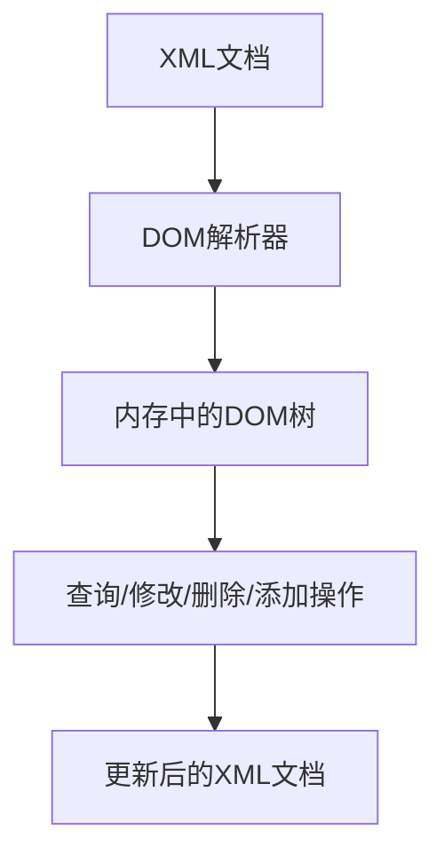

# Java DOM解析

## DOM解析概述

DOM(Document Object Model，文档对象模型)是W3C组织推荐的处理XML的一种方式。DOM将XML文档解析成一个树形结构，可以方便地通过API进行节点的查找、修改、删除和添加操作。

在Java中，DOM解析是通过JAXP(Java API for XML Processing)中的接口实现的。使用DOM解析XML的过程中，整个XML文档会被加载到内存中形成一颗树，这使得DOM解析适合处理小型XML文档。



## DOM解析的优缺点

### 优点
- 可以对文档进行随机访问
- 可以修改文档内容
- API使用简单直观
- 完整的文档树结构

### 缺点
- 需要将整个文档加载到内存，不适合处理大型文档
- 初始解析速度较慢
- 内存消耗较大

## Java DOM解析基础

在Java中使用DOM解析XML需要使用以下包：

```java
import javax.xml.parsers.DocumentBuilder;
import javax.xml.parsers.DocumentBuilderFactory;
import org.w3c.dom.Document;
import org.w3c.dom.Element;
import org.w3c.dom.Node;
import org.w3c.dom.NodeList;
```

## DOM解析步骤

1. 创建DocumentBuilderFactory实例
2. 通过DocumentBuilderFactory创建DocumentBuilder实例
3. 使用DocumentBuilder解析XML文档，生成Document对象
4. 通过Document对象访问和操作XML文档内容

## 基本DOM解析示例

假设我们有一个简单的XML文件`books.xml`，内容如下：

```xml
<?xml version="1.0" encoding="UTF-8"?>
<bookstore>
    <book category="编程">
        <title>Java编程思想</title>
        <author>Bruce Eckel</author>
        <year>2007</year>
        <price>89.00</price>
    </book>
    <book category="网络">
        <title>TCP/IP详解</title>
        <author>W. Richard Stevens</author>
        <year>2000</year>
        <price>99.00</price>
    </book>
</bookstore>
```

下面是使用DOM解析这个XML文件的Java代码：

```java
import javax.xml.parsers.DocumentBuilder;
import javax.xml.parsers.DocumentBuilderFactory;
import org.w3c.dom.Document;
import org.w3c.dom.Element;
import org.w3c.dom.Node;
import org.w3c.dom.NodeList;
import java.io.File;

public class DOMParserDemo {
    public static void main(String[] args) {
        try {
            // 1. 创建DocumentBuilderFactory实例
            DocumentBuilderFactory factory = DocumentBuilderFactory.newInstance();
            
            // 2. 创建DocumentBuilder实例
            DocumentBuilder builder = factory.newDocumentBuilder();
            
            // 3. 解析XML文件，创建Document对象
            Document document = builder.parse(new File("books.xml"));
            
            // 可选：标准化文本节点
            document.getDocumentElement().normalize();
            
            // 4. 获取所有book元素
            NodeList bookList = document.getElementsByTagName("book");
            System.out.println("共有 " + bookList.getLength() + " 本书");
            
            // 5. 遍历每个book元素
            for (int i = 0; i < bookList.getLength(); i++) {
                Node bookNode = bookList.item(i);
                System.out.println("====== 第 " + (i+1) + " 本书 ======");
                
                if (bookNode.getNodeType() == Node.ELEMENT_NODE) {
                    Element bookElement = (Element) bookNode;
                    
                    // 获取book的category属性
                    String category = bookElement.getAttribute("category");
                    System.out.println("类别: " + category);
                    
                    // 获取title元素内容
                    String title = bookElement.getElementsByTagName("title").item(0).getTextContent();
                    System.out.println("书名: " + title);
                    
                    // 获取author元素内容
                    String author = bookElement.getElementsByTagName("author").item(0).getTextContent();
                    System.out.println("作者: " + author);
                    
                    // 获取year元素内容
                    String year = bookElement.getElementsByTagName("year").item(0).getTextContent();
                    System.out.println("年份: " + year);
                    
                    // 获取price元素内容
                    String price = bookElement.getElementsByTagName("price").item(0).getTextContent();
                    System.out.println("价格: " + price);
                }
            }
        } catch (Exception e) {
            e.printStackTrace();
        }
    }
}
```

**运行结果**：

```
共有 2 本书
====== 第 1 本书 ======
类别: 编程
书名: Java编程思想
作者: Bruce Eckel
年份: 2007
价格: 89.00
====== 第 2 本书 ======
类别: 网络
书名: TCP/IP详解
作者: W. Richard Stevens
年份: 2000
价格: 99.00
```

## DOM节点操作

DOM提供了丰富的API用于操作XML文档中的元素和属性。

### 常用DOM方法

#### 创建元素和属性

```java
// 创建新元素
Element newBook = document.createElement("book");

// 设置属性
newBook.setAttribute("category", "数据库");

// 创建子元素
Element titleElement = document.createElement("title");
titleElement.setTextContent("MySQL实战");

// 添加子元素到父元素
newBook.appendChild(titleElement);

// 将新元素添加到文档
document.getDocumentElement().appendChild(newBook);
```

#### 修改节点

```java
// 修改元素内容
Element priceElement = (Element) bookElement.getElementsByTagName("price").item(0);
priceElement.setTextContent("129.00");

// 修改属性值
bookElement.setAttribute("category", "计算机科学");
```

#### 删除节点

```java
// 删除元素
Node parentNode = bookElement.getParentNode();
parentNode.removeChild(bookElement);

// 删除属性
bookElement.removeAttribute("category");
```

## 保存修改后的DOM文档

修改DOM文档后，可以将更改写回XML文件：

```java
import javax.xml.transform.Transformer;
import javax.xml.transform.TransformerFactory;
import javax.xml.transform.dom.DOMSource;
import javax.xml.transform.stream.StreamResult;
import java.io.File;

public class SaveDOMDocument {
    public static void saveDocument(Document document, String filePath) {
        try {
            TransformerFactory transformerFactory = TransformerFactory.newInstance();
            Transformer transformer = transformerFactory.newTransformer();
            DOMSource source = new DOMSource(document);
            StreamResult result = new StreamResult(new File(filePath));
            transformer.transform(source, result);
            System.out.println("XML文件已保存为 " + filePath);
        } catch (Exception e) {
            e.printStackTrace();
        }
    }
}
```

## 实际应用场景

### 场景1：配置文件处理

DOM解析常用于读取和修改应用程序的XML配置文件。

```java
public class ConfigManager {
    private Document configDocument;
    private String configPath = "config.xml";
    
    public ConfigManager() {
        try {
            DocumentBuilderFactory factory = DocumentBuilderFactory.newInstance();
            DocumentBuilder builder = factory.newDocumentBuilder();
            configDocument = builder.parse(new File(configPath));
            configDocument.getDocumentElement().normalize();
        } catch (Exception e) {
            e.printStackTrace();
        }
    }
    
    public String getConfigValue(String element) {
        NodeList nodeList = configDocument.getElementsByTagName(element);
        if (nodeList.getLength() > 0) {
            return nodeList.item(0).getTextContent();
        }
        return null;
    }
    
    public void setConfigValue(String element, String value) {
        NodeList nodeList = configDocument.getElementsByTagName(element);
        if (nodeList.getLength() > 0) {
            nodeList.item(0).setTextContent(value);
            saveDocument();
        }
    }
    
    private void saveDocument() {
        try {
            TransformerFactory transformerFactory = TransformerFactory.newInstance();
            Transformer transformer = transformerFactory.newTransformer();
            DOMSource source = new DOMSource(configDocument);
            StreamResult result = new StreamResult(new File(configPath));
            transformer.transform(source, result);
        } catch (Exception e) {
            e.printStackTrace();
        }
    }
}
```

### 场景2：数据导入导出

DOM解析可用于导入导出系统中的数据，例如将数据库记录导出为XML文件：

```java
public class DataExporter {
    public Document createXmlDocument(List<Product> products) {
        try {
            DocumentBuilderFactory factory = DocumentBuilderFactory.newInstance();
            DocumentBuilder builder = factory.newDocumentBuilder();
            Document document = builder.newDocument();
            
            // 创建根元素
            Element rootElement = document.createElement("products");
            document.appendChild(rootElement);
            
            // 为每个产品创建元素
            for (Product product : products) {
                Element productElement = document.createElement("product");
                productElement.setAttribute("id", String.valueOf(product.getId()));
                
                Element nameElement = document.createElement("name");
                nameElement.setTextContent(product.getName());
                productElement.appendChild(nameElement);
                
                Element priceElement = document.createElement("price");
                priceElement.setTextContent(String.valueOf(product.getPrice()));
                productElement.appendChild(priceElement);
                
                rootElement.appendChild(productElement);
            }
            
            return document;
        } catch (Exception e) {
            e.printStackTrace();
            return null;
        }
    }
    
    public void exportToXml(Document document, String filePath) {
        try {
            TransformerFactory transformerFactory = TransformerFactory.newInstance();
            Transformer transformer = transformerFactory.newTransformer();
            transformer.setOutputProperty(OutputKeys.INDENT, "yes");
            transformer.setOutputProperty("{http://xml.apache.org/xslt}indent-amount", "2");
            
            DOMSource source = new DOMSource(document);
            StreamResult result = new StreamResult(new File(filePath));
            transformer.transform(source, result);
        } catch (Exception e) {
            e.printStackTrace();
        }
    }
}
```

## 高级DOM操作

### 使用XPath查询DOM

XPath是一种在XML文档中查找信息的语言，可以与DOM配合使用，实现更复杂的查询：

```java
import javax.xml.xpath.XPath;
import javax.xml.xpath.XPathConstants;
import javax.xml.xpath.XPathFactory;

public class XPathExample {
    public static void queryWithXPath(Document document) {
        try {
            XPathFactory xpathFactory = XPathFactory.newInstance();
            XPath xpath = xpathFactory.newXPath();
            
            // 查找所有价格超过90的书
            String expression = "/bookstore/book[price > 90]";
            NodeList bookNodes = (NodeList) xpath.evaluate(expression, document, XPathConstants.NODESET);
            
            System.out.println("价格超过90的书:");
            for (int i = 0; i < bookNodes.getLength(); i++) {
                Element bookElement = (Element) bookNodes.item(i);
                String title = bookElement.getElementsByTagName("title").item(0).getTextContent();
                String price = bookElement.getElementsByTagName("price").item(0).getTextContent();
                System.out.println(title + " - " + price);
            }
        } catch (Exception e) {
            e.printStackTrace();
        }
    }
}
```

:::tip
XPath是一个强大的工具，可以大大简化XML文档的查询操作。学习XPath表达式可以帮助你更高效地处理DOM文档。
:::

### 处理命名空间

当XML文档使用命名空间时，DOM解析需要特别处理：

```java
public class NamespaceExample {
    public static void parseWithNamespace() {
        try {
            DocumentBuilderFactory factory = DocumentBuilderFactory.newInstance();
            // 设置命名空间感知
            factory.setNamespaceAware(true);
            
            DocumentBuilder builder = factory.newDocumentBuilder();
            Document document = builder.parse(new File("namespace_example.xml"));
            
            // 处理带命名空间的元素
            Element root = document.getDocumentElement();
            NodeList nodeList = root.getElementsByTagNameNS("http://www.example.org/books", "book");
            
            for (int i = 0; i < nodeList.getLength(); i++) {
                Element element = (Element) nodeList.item(i);
                // 处理元素...
            }
        } catch (Exception e) {
            e.printStackTrace();
        }
    }
}
```

## 性能考虑

:::caution
DOM解析将整个XML文档加载到内存中，因此不适合处理非常大的XML文档（通常大于几MB的文档）。对于大型文档，应考虑使用SAX或StAX等基于事件的解析方式。
:::

如果必须使用DOM处理大型文档，可以考虑：
1. 增加JVM堆内存
2. 只加载必要的文档片段
3. 使用文档构建器的过滤功能

## 总结

Java DOM解析是处理XML文档的一种强大方式，它提供了完整的文档树结构和丰富的API，使得XML操作变得直观和灵活。本文介绍了DOM解析的基本概念、解析步骤、节点操作以及实际应用场景。

DOM解析的主要优点是可以随机访问和修改文档，但缺点是需要将整个文档加载到内存，不适合处理大型文档。在选择XML解析技术时，需要根据具体应用场景和文档大小做出适当的选择。

## 练习

1. 创建一个XML文件，包含多个学生信息（学号、姓名、年龄、班级），使用DOM解析读取并显示这些信息。
2. 修改上述程序，添加一个新学生到XML文档中，并保存修改后的文档。
3. 实现一个程序，使用DOM解析从XML文件中删除特定的学生信息。
4. 使用XPath查询年龄大于20的学生信息。

## 扩展阅读

- Java官方文档：[JAXP文档](https://docs.oracle.com/javase/tutorial/jaxp/)
- W3C DOM规范：[Document Object Model](https://www.w3.org/DOM/)
- 其他XML解析方式：SAX、StAX、JDOM、DOM4J

通过掌握Java DOM解析，你将能够有效地处理和操作XML文档，为后续的Java开发工作奠定基础。