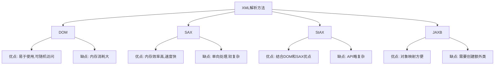

# Java XML最佳实践

## 引言

XML(可扩展标记语言)作为一种通用的数据交换格式，在Java开发中扮演着重要角色。无论是配置文件、Web服务还是数据存储，XML都有着广泛的应用。然而，如果使用不当，XML处理可能导致性能问题、安全漏洞或代码维护困难。本文将介绍Java XML处理的最佳实践，帮助你以更高效、更安全的方式处理XML数据。

## XML解析方法的选择

Java提供了多种XML处理API，选择合适的API对于不同的应用场景至关重要。

### 常见的XML解析方法比较



### 最佳实践1：基于场景选择合适的解析方法

- **小型XML文件**：使用DOM解析，简单直观
- **大型XML文件**：选择SAX或StAX，避免内存溢出
- **需要对象映射**：优先考虑JAXB或更现代的框架如Jackson XML

让我们看一个简单的例子，展示如何根据不同场景选择解析方法：

```java
// DOM解析示例 - 适合小型XML文件
public void parseWithDOM(String xmlFile) throws Exception {
    DocumentBuilderFactory factory = DocumentBuilderFactory.newInstance();
    DocumentBuilder builder = factory.newDocumentBuilder();
    Document doc = builder.parse(new File(xmlFile));
    
    NodeList userNodes = doc.getElementsByTagName("user");
    for (int i = 0; i < userNodes.getLength(); i++) {
        Element userElement = (Element) userNodes.item(i);
        String username = userElement.getElementsByTagName("username").item(0).getTextContent();
        System.out.println("用户名: " + username);
    }
}

// SAX解析示例 - 适合大型XML文件
public void parseWithSAX(String xmlFile) throws Exception {
    SAXParserFactory factory = SAXParserFactory.newInstance();
    SAXParser saxParser = factory.newSAXParser();
    
    DefaultHandler handler = new DefaultHandler() {
        boolean inUsername = false;
        
        @Override
        public void startElement(String uri, String localName, String qName, 
                                 Attributes attributes) {
            if (qName.equalsIgnoreCase("username")) {
                inUsername = true;
            }
        }
        
        @Override
        public void characters(char ch[], int start, int length) {
            if (inUsername) {
                System.out.println("用户名: " + new String(ch, start, length));
                inUsername = false;
            }
        }
    };
    
    saxParser.parse(new File(xmlFile), handler);
}
```

## 安全处理XML

XML解析可能导致多种安全风险，包括XXE(XML外部实体)攻击、XML炸弹等。

### 最佳实践2：预防XXE攻击

:::warning
XXE攻击可以导致敏感信息泄露、服务器端请求伪造、拒绝服务等严重问题！
:::

以下是安全配置DOM解析器的示例：

```java
public Document parseXMLSafely(String xmlFile) throws Exception {
    DocumentBuilderFactory dbf = DocumentBuilderFactory.newInstance();
    
    // 禁用外部实体处理
    dbf.setFeature("http://apache.org/xml/features/disallow-doctype-decl", true);
    dbf.setFeature("http://xml.org/sax/features/external-general-entities", false);
    dbf.setFeature("http://xml.org/sax/features/external-parameter-entities", false);
    dbf.setXIncludeAware(false);
    dbf.setExpandEntityReferences(false);
    
    DocumentBuilder builder = dbf.newDocumentBuilder();
    return builder.parse(new File(xmlFile));
}
```

对于其他解析器类型：

```java
// SAX解析器安全设置
SAXParserFactory spf = SAXParserFactory.newInstance();
spf.setFeature("http://apache.org/xml/features/disallow-doctype-decl", true);
spf.setFeature("http://xml.org/sax/features/external-general-entities", false);
spf.setFeature("http://xml.org/sax/features/external-parameter-entities", false);

// StAX解析器安全设置
XMLInputFactory xif = XMLInputFactory.newInstance();
xif.setProperty(XMLInputFactory.SUPPORT_DTD, false);
xif.setProperty(XMLInputFactory.IS_SUPPORTING_EXTERNAL_ENTITIES, false);
```

## XML处理性能优化

### 最佳实践3：复用解析器实例

创建XML解析器是一个相对昂贵的操作，应尽可能复用它们：

```java
// 不推荐: 每次解析都创建新解析器
public void parseMultipleFiles(List<String> files) throws Exception {
    for (String file : files) {
        DocumentBuilderFactory factory = DocumentBuilderFactory.newInstance();
        DocumentBuilder builder = factory.newDocumentBuilder();
        Document doc = builder.parse(new File(file));
        // 处理文档...
    }
}

// 推荐: 复用解析器实例
public void parseMultipleFilesOptimized(List<String> files) throws Exception {
    DocumentBuilderFactory factory = DocumentBuilderFactory.newInstance();
    // 设置安全特性...
    DocumentBuilder builder = factory.newDocumentBuilder();
    
    for (String file : files) {
        Document doc = builder.parse(new File(file));
        // 处理文档...
    }
}
```

### 最佳实践4：使用StAX进行高效流处理

StAX(流式API for XML)结合了DOM的易用性和SAX的效率，对于大文件处理特别有效：

```java
public void processLargeXMLWithStAX(String xmlFile) throws Exception {
    XMLInputFactory factory = XMLInputFactory.newInstance();
    // 设置安全特性
    factory.setProperty(XMLInputFactory.SUPPORT_DTD, false);
    factory.setProperty(XMLInputFactory.IS_SUPPORTING_EXTERNAL_ENTITIES, false);
    
    XMLStreamReader reader = factory.createXMLStreamReader(new FileInputStream(xmlFile));
    
    while (reader.hasNext()) {
        int event = reader.next();
        
        if (event == XMLStreamConstants.START_ELEMENT) {
            if ("user".equals(reader.getLocalName())) {
                System.out.println("找到用户元素");
                // 处理用户元素
            }
        }
    }
    
    reader.close();
}
```

## 结构化XML数据处理

### 最佳实践5：使用JAXB进行对象绑定

对于结构化数据，JAXB(Java Architecture for XML Binding)能将XML直接映射到Java对象，使代码更清晰：

```java
// 定义模型类
@XmlRootElement(name = "user")
public class User {
    private String username;
    private String email;
    private int age;
    
    // Getter和Setter...
    
    @XmlElement
    public String getUsername() { return username; }
    public void setUsername(String username) { this.username = username; }
    
    @XmlElement
    public String getEmail() { return email; }
    public void setEmail(String email) { this.email = email; }
    
    @XmlElement
    public int getAge() { return age; }
    public void setAge(int age) { this.age = age; }
}

// 使用JAXB解析
public User unmarshallUser(String xmlFile) throws Exception {
    JAXBContext context = JAXBContext.newInstance(User.class);
    Unmarshaller unmarshaller = context.createUnmarshaller();
    return (User) unmarshaller.unmarshal(new File(xmlFile));
}

// 使用JAXB生成XML
public void marshallUser(User user, String outputFile) throws Exception {
    JAXBContext context = JAXBContext.newInstance(User.class);
    Marshaller marshaller = context.createMarshaller();
    marshaller.setProperty(Marshaller.JAXB_FORMATTED_OUTPUT, true);
    marshaller.marshal(user, new File(outputFile));
}
```

:::note
在Java 11之后，JAXB已经从JDK中移除，需要单独添加依赖。例如，使用Maven：

```xml
<dependency>
    <groupId>javax.xml.bind</groupId>
    <artifactId>jaxb-api</artifactId>
    <version>2.3.1</version>
</dependency>
<dependency>
    <groupId>org.glassfish.jaxb</groupId>
    <artifactId>jaxb-runtime</artifactId>
    <version>2.3.1</version>
</dependency>
```
:::

## XML验证最佳实践

### 最佳实践6：使用Schema验证XML

验证XML可以确保数据符合预期的格式和规则：

```java
public boolean validateXMLWithSchema(String xmlFile, String xsdFile) throws Exception {
    try {
        SchemaFactory factory = SchemaFactory.newInstance(XMLConstants.W3C_XML_SCHEMA_NS_URI);
        Schema schema = factory.newSchema(new File(xsdFile));
        
        Validator validator = schema.newValidator();
        validator.validate(new StreamSource(new File(xmlFile)));
        System.out.println("XML验证成功");
        return true;
    } catch (Exception e) {
        System.out.println("XML验证失败: " + e.getMessage());
        return false;
    }
}
```

## 实际应用案例：构建配置文件处理器

让我们构建一个完整的应用案例，展示如何安全、高效地处理XML配置文件：

```java
public class ConfigManager {
    private static final String CONFIG_FILE = "config.xml";
    private static ConfigManager instance;
    private Document configDoc;
    private DocumentBuilder builder;
    
    // 私有构造函数，单例模式
    private ConfigManager() throws Exception {
        DocumentBuilderFactory factory = DocumentBuilderFactory.newInstance();
        
        // 安全设置
        factory.setFeature("http://apache.org/xml/features/disallow-doctype-decl", true);
        factory.setFeature("http://xml.org/sax/features/external-general-entities", false);
        factory.setFeature("http://xml.org/sax/features/external-parameter-entities", false);
        factory.setXIncludeAware(false);
        factory.setExpandEntityReferences(false);
        
        builder = factory.newDocumentBuilder();
        reload();
    }
    
    // 重新加载配置
    public void reload() throws Exception {
        configDoc = builder.parse(new File(CONFIG_FILE));
    }
    
    // 获取实例
    public static synchronized ConfigManager getInstance() throws Exception {
        if (instance == null) {
            instance = new ConfigManager();
        }
        return instance;
    }
    
    // 获取配置值
    public String getConfigValue(String nodePath) {
        try {
            XPathFactory xPathfactory = XPathFactory.newInstance();
            XPath xpath = xPathfactory.newXPath();
            XPathExpression expr = xpath.compile(nodePath);
            return expr.evaluate(configDoc);
        } catch (Exception e) {
            return null;
        }
    }
    
    // 设置配置值
    public void setConfigValue(String nodePath, String value) throws Exception {
        XPathFactory xPathfactory = XPathFactory.newInstance();
        XPath xpath = xPathfactory.newXPath();
        XPathExpression expr = xpath.compile(nodePath);
        Node node = (Node) expr.evaluate(configDoc, XPathConstants.NODE);
        
        if (node != null) {
            node.setTextContent(value);
            saveConfig();
        }
    }
    
    // 保存配置
    private void saveConfig() throws Exception {
        TransformerFactory transformerFactory = TransformerFactory.newInstance();
        Transformer transformer = transformerFactory.newTransformer();
        transformer.setOutputProperty(OutputKeys.INDENT, "yes");
        
        DOMSource source = new DOMSource(configDoc);
        StreamResult result = new StreamResult(new File(CONFIG_FILE));
        transformer.transform(source, result);
    }
    
    // 使用示例
    public static void main(String[] args) {
        try {
            ConfigManager manager = ConfigManager.getInstance();
            
            // 读取配置
            String dbUrl = manager.getConfigValue("/configuration/database/url");
            System.out.println("数据库URL: " + dbUrl);
            
            // 更新配置
            manager.setConfigValue("/configuration/database/username", "newuser");
            System.out.println("配置已更新");
        } catch (Exception e) {
            e.printStackTrace();
        }
    }
}
```

配置文件示例 (config.xml):

```xml
<?xml version="1.0" encoding="UTF-8"?>
<configuration>
    <database>
        <url>jdbc:mysql://localhost:3306/mydb</url>
        <username>admin</username>
        <password>secret</password>
    </database>
    <application>
        <name>MyApp</name>
        <version>1.0</version>
        <logLevel>INFO</logLevel>
    </application>
</configuration>
```

## 总结

在Java中处理XML时，遵循这些最佳实践可以帮助你编写更安全、更高效的代码：

1. **根据场景选择合适的解析方法**：小文件用DOM，大文件用SAX或StAX，需要对象映射用JAXB
2. **安全优先**：始终配置解析器防止XXE攻击和其他安全问题
3. **性能优化**：复用解析器实例，避免不必要的对象创建
4. **使用对象映射**：对于复杂数据结构，JAXB或现代框架可提高代码可读性和维护性
5. **验证XML**：使用Schema验证确保数据符合预期格式
6. **考虑现代替代方案**：在新项目中，考虑JSON等更轻量的数据格式

## 练习与资源

### 练习

1. 创建一个简单的XML文件，分别使用DOM、SAX和StAX解析它，比较三种方法的代码复杂度和执行效率。
2. 为一个包含学生信息的XML实现JAXB映射，并编写程序读取和修改学生信息。
3. 创建一个XSD文件来验证练习2中的XML数据，确保学生ID是唯一的，年龄在合理范围内。
4. 修改现有XML解析器代码，添加安全配置防止XXE攻击。
5. 实现一个简单的配置管理器，支持读取、修改和保存XML配置文件。

### 附加资源

- [Oracle Java XML教程](https://docs.oracle.com/javase/tutorial/jaxp/)
- [OWASP XXE防御指南](https://cheatsheetseries.owasp.org/cheatsheets/XML_External_Entity_Prevention_Cheat_Sheet.html)
- [Java StAX API指南](https://docs.oracle.com/javase/tutorial/jaxp/stax/index.html)
- [JAXB用户指南](https://javaee.github.io/jaxb-v2/)

:::tip
当选择XML技术栈时，也请考虑现代替代方案如JSON、YAML或Protocol Buffers，尤其是在新项目中。XML仍然有其价值，特别是在企业级应用和特定行业标准中，但较新的格式通常提供更简洁的语法和更好的性能。
:::

通过掌握这些Java XML最佳实践，你将能够构建更健壮、更安全的XML处理应用，同时避免常见的陷阱和性能问题。祝你编程愉快！