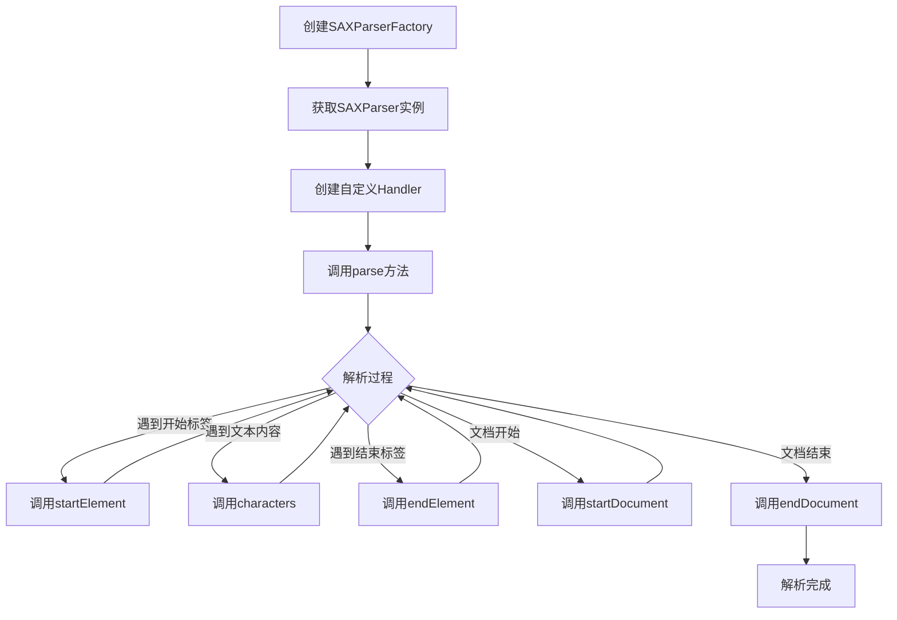

# Java SAX解析

## 什么是SAX解析？

SAX (Simple API for XML) 是一种用于解析XML文档的标准接口，它采用事件驱动的方式处理XML文档。与DOM(Document Object Model)解析不同，SAX解析器不会将整个XML文档加载到内存中，而是在解析XML文档的过程中触发一系列事件，应用程序通过实现特定的处理器（Handler）来响应这些事件。

:::note 事件驱动解析
SAX解析器在读取XML文档时，会逐行扫描，当遇到特定的XML元素时（如开始标签、结束标签、文本内容等），就会触发相应的事件，并调用相应的处理方法。
:::

## SAX解析的优缺点

### 优点：

1. **内存效率高**：不需要将整个文档加载到内存中，适合处理大型XML文档
2. **速度快**：一边读取一边处理，不需要等待整个文档加载完成
3. **流式处理**：可以实时处理XML数据，适合处理数据流

### 缺点：

1. **只读模式**：只能读取XML，不能修改、创建或操作XML
2. **单向处理**：只能从头到尾顺序处理，不能随机访问文档中的元素
3. **需要自己保存状态**：需要手动跟踪文档结构和元素之间的关系

## Java 中使用SAX的基本步骤

1. 创建SAXParserFactory实例
2. 从工厂获取SAXParser实例
3. 创建自定义的DefaultHandler子类
4. 调用parser的parse()方法解析XML文档

## 创建自定义Handler类

SAX解析的核心是创建一个Handler类来处理各种XML解析事件。这个类通常继承自`DefaultHandler`，并根据需要重写以下方法：

```java
public class MyHandler extends DefaultHandler {
    // 文档开始时调用
    @Override
    public void startDocument() throws SAXException {
        System.out.println("开始解析文档");
    }
    
    // 文档结束时调用
    @Override
    public void endDocument() throws SAXException {
        System.out.println("文档解析结束");
    }
    
    // 遇到开始标签时调用
    @Override
    public void startElement(String uri, String localName, String qName, 
                             Attributes attributes) throws SAXException {
        System.out.println("开始元素: " + qName);
        // 处理元素属性
        for (int i = 0; i < attributes.getLength(); i++) {
            System.out.println("  属性: " + attributes.getQName(i) + 
                               " = " + attributes.getValue(i));
        }
    }
    
    // 遇到结束标签时调用
    @Override
    public void endElement(String uri, String localName, String qName) 
                          throws SAXException {
        System.out.println("结束元素: " + qName);
    }
    
    // 遇到文本内容时调用
    @Override
    public void characters(char[] ch, int start, int length) 
                          throws SAXException {
        String content = new String(ch, start, length).trim();
        if (!content.isEmpty()) {
            System.out.println("文本内容: " + content);
        }
    }
}
```

## 完整SAX解析示例

假设我们有以下XML文档（`books.xml`）：

```xml
<?xml version="1.0" encoding="UTF-8"?>
<bookstore>
    <book category="JAVA">
        <title>Java编程思想</title>
        <author>Bruce Eckel</author>
        <year>2007</year>
        <price>108.00</price>
    </book>
    <book category="WEB">
        <title>HTML权威指南</title>
        <author>Chuck Musciano</author>
        <year>2006</year>
        <price>68.00</price>
    </book>
</bookstore>
```

下面是使用SAX解析这个XML文档的完整代码示例：

```java
import org.xml.sax.Attributes;
import org.xml.sax.SAXException;
import org.xml.sax.helpers.DefaultHandler;

import javax.xml.parsers.ParserConfigurationException;
import javax.xml.parsers.SAXParser;
import javax.xml.parsers.SAXParserFactory;
import java.io.File;
import java.io.IOException;
import java.util.ArrayList;
import java.util.List;

public class SAXParserDemo {
    
    public static void main(String[] args) {
        try {
            // 1. 获取SAXParserFactory实例
            SAXParserFactory factory = SAXParserFactory.newInstance();
            
            // 2. 从工厂获取SAXParser实例
            SAXParser saxParser = factory.newSAXParser();
            
            // 3. 创建Handler对象
            BookHandler handler = new BookHandler();
            
            // 4. 解析文档
            saxParser.parse(new File("books.xml"), handler);
            
            // 5. 获取解析结果
            List<Book> bookList = handler.getBookList();
            
            // 6. 输出结果
            for (Book book : bookList) {
                System.out.println(book);
            }
            
        } catch (ParserConfigurationException | SAXException | IOException e) {
            e.printStackTrace();
        }
    }
    
    // 定义Book类存储解析结果
    static class Book {
        private String category;
        private String title;
        private String author;
        private int year;
        private double price;
        
        // 省略getter和setter方法...
        
        @Override
        public String toString() {
            return "Book{" +
                    "category='" + category + '\'' +
                    ", title='" + title + '\'' +
                    ", author='" + author + '\'' +
                    ", year=" + year +
                    ", price=" + price +
                    '}';
        }
    }
    
    // 自定义Handler类
    static class BookHandler extends DefaultHandler {
        private List<Book> bookList = new ArrayList<>();
        private Book currentBook;
        private StringBuilder currentValue = new StringBuilder();
        
        // 用于跟踪当前正在解析哪个元素
        private boolean inTitle = false;
        private boolean inAuthor = false;
        private boolean inYear = false;
        private boolean inPrice = false;
        
        public List<Book> getBookList() {
            return bookList;
        }
        
        @Override
        public void startElement(String uri, String localName, String qName, 
                                Attributes attributes) throws SAXException {
            // 重置内容缓冲
            currentValue.setLength(0);
            
            if (qName.equalsIgnoreCase("book")) {
                // 创建新书对象并设置category属性
                currentBook = new Book();
                if (attributes != null) {
                    String category = attributes.getValue("category");
                    if (category != null) {
                        currentBook.category = category;
                    }
                }
            } else if (qName.equalsIgnoreCase("title")) {
                inTitle = true;
            } else if (qName.equalsIgnoreCase("author")) {
                inAuthor = true;
            } else if (qName.equalsIgnoreCase("year")) {
                inYear = true;
            } else if (qName.equalsIgnoreCase("price")) {
                inPrice = true;
            }
        }
        
        @Override
        public void endElement(String uri, String localName, String qName) throws SAXException {
            if (qName.equalsIgnoreCase("book")) {
                // 将完成的书对象添加到列表
                bookList.add(currentBook);
            } else if (qName.equalsIgnoreCase("title")) {
                currentBook.title = currentValue.toString();
                inTitle = false;
            } else if (qName.equalsIgnoreCase("author")) {
                currentBook.author = currentValue.toString();
                inAuthor = false;
            } else if (qName.equalsIgnoreCase("year")) {
                currentBook.year = Integer.parseInt(currentValue.toString());
                inYear = false;
            } else if (qName.equalsIgnoreCase("price")) {
                currentBook.price = Double.parseDouble(currentValue.toString());
                inPrice = false;
            }
        }
        
        @Override
        public void characters(char[] ch, int start, int length) throws SAXException {
            currentValue.append(ch, start, length);
        }
    }
}
```

### 执行结果

```
Book{category='JAVA', title='Java编程思想', author='Bruce Eckel', year=2007, price=108.0}
Book{category='WEB', title='HTML权威指南', author='Chuck Musciano', year=2006, price=68.0}
```

## SAX解析的工作流程

下面是SAX解析的基本工作流程图：



## 实际应用场景

### 场景1：处理大型XML数据文件

当需要处理几百MB甚至几GB的XML文件时，DOM解析会因为需要将整个文档加载到内存而导致内存溢出问题。此时，SAX解析是一个理想的选择，因为它只需要很少的内存就能处理大型文件。

### 场景2：数据流式处理

在某些应用场景中，XML数据可能不是一次性提供的，而是作为数据流逐渐到达。SAX解析允许我们在数据到达时即刻处理，而不需要等待整个文档完成。

### 场景3：配置文件解析

当只需要从XML配置文件中提取特定信息而不需要修改时，SAX是一个高效的选择。

## 处理错误和异常

SAX解析器可以通过扩展`DefaultHandler`中的错误处理方法来处理XML解析过程中遇到的问题：

```java
@Override
public void warning(SAXParseException e) throws SAXException {
    System.out.println("警告: " + e.getMessage());
}

@Override
public void error(SAXParseException e) throws SAXException {
    System.out.println("错误: " + e.getMessage());
}

@Override
public void fatalError(SAXParseException e) throws SAXException {
    System.out.println("致命错误: " + e.getMessage());
    throw e; // 重新抛出异常终止解析
}
```

## SAX解析器的高级功能

### 命名空间处理

SAX解析器可以处理XML命名空间。当使用命名空间时，`startElement`和`endElement`方法接收的参数会包含命名空间URI和本地名称：

```java
@Override
public void startElement(String uri, String localName, String qName, 
                        Attributes attributes) throws SAXException {
    System.out.println("命名空间URI: " + uri);
    System.out.println("本地名称: " + localName);
    System.out.println("限定名称: " + qName);
}
```

### 设置解析器特性

可以通过SAXParser工厂设置解析器的特性，如是否验证XML、是否处理命名空间等：

```java
SAXParserFactory factory = SAXParserFactory.newInstance();
// 启用命名空间处理
factory.setNamespaceAware(true);
// 启用验证
factory.setValidating(true);
```

## 总结

SAX解析是Java处理XML文档的强大工具，尤其适合处理大型XML文件或流式数据。它通过事件驱动的方式，在解析XML文档的过程中触发一系列回调方法，使应用程序能够实时响应和处理XML内容。虽然SAX解析相比DOM解析功能较为受限（只读、单向处理），但在内存效率和处理速度方面具有显著优势。

### 关键要点回顾：

1. SAX采用事件驱动模型，不需要将整个XML文档加载到内存
2. 通过继承`DefaultHandler`并重写相应方法来处理XML解析事件
3. 主要处理方法包括`startDocument`、`endDocument`、`startElement`、`endElement`和`characters`
4. 适合处理大型XML文件和流式数据

## 练习题

1. 创建一个SAX解析器，解析以下XML文件，并提取所有员工的姓名和职位：
```xml
<company>
    <employee id="1">
        <name>张三</name>
        <position>开发工程师</position>
        <age>28</age>
    </employee>
    <employee id="2">
        <name>李四</name>
        <position>测试工程师</position>
        <age>26</age>
    </employee>
</company>
```

2. 修改上面的代码，添加错误处理，当XML文件格式不正确时能够提供有用的错误信息。

3. 尝试解析一个包含命名空间的XML文件，并正确处理命名空间。

## 附加资源

- [Oracle官方SAX教程](https://docs.oracle.com/javase/tutorial/jaxp/sax/index.html)
- [W3C SAX规范](https://www.saxproject.org/)
- 推荐书籍：《Java XML与JSON》、《精通Java XML编程》

继续学习和实践SAX解析，将帮助你更好地理解XML处理的核心概念，为处理各种XML相关任务打下坚实基础。