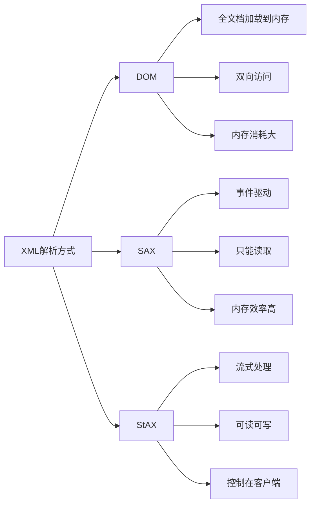

# Java StAX解析

## 什么是StAX？

StAX（Streaming API for XML）是Java平台中处理XML文档的一种API，它填补了DOM（Document Object Model）和SAX（Simple API for XML）之间的空白，提供了一种更加灵活高效的XML处理方式。

StAX是一种"拉式"解析API，这意味着客户端应用程序可以控制何时从解析器获取XML数据，而不是像SAX那样被动接收事件。这种控制方式使得StAX在很多场景下比SAX和DOM更加实用。

:::tip
StAX是JDK 6及以上版本的标准组件，你无需导入额外的依赖库即可使用它！
:::

## StAX API的优势

1. **内存效率**：与DOM相比，StAX不需要将整个文档加载到内存
2. **控制权**：与SAX不同，StAX允许开发者控制解析过程
3. **双向性**：不仅可以读取XML，还可以很方便地创建XML
4. **简单易学**：API设计直观，比SAX更容易掌握

## StAX的两种API

StAX提供了两种级别的API：

1. **Cursor API**：提供类似指针的方式遍历XML文档
2. **Event Iterator API**：将XML文档看作一系列事件，可以迭代这些事件

本文将主要介绍更为常用的Cursor API。

## 使用StAX读取XML

### 准备工作

首先，让我们准备一个简单的XML文件进行解析。假设我们有以下`books.xml`文件：

```xml
<?xml version="1.0" encoding="UTF-8"?>
<books>
    <book id="1">
        <title>Java编程思想</title>
        <author>Bruce Eckel</author>
        <year>2006</year>
        <price>128.00</price>
    </book>
    <book id="2">
        <title>Effective Java</title>
        <author>Joshua Bloch</author>
        <year>2018</year>
        <price>79.00</price>
    </book>
</books>
```

### 基本读取操作

以下是使用StAX Cursor API解析上述XML文件的基本代码：

```java
import java.io.FileInputStream;
import javax.xml.stream.XMLInputFactory;
import javax.xml.stream.XMLStreamConstants;
import javax.xml.stream.XMLStreamReader;

public class StAXCursorExample {
    public static void main(String[] args) {
        try {
            // 创建XMLInputFactory
            XMLInputFactory factory = XMLInputFactory.newInstance();
            
            // 创建XMLStreamReader
            XMLStreamReader reader = 
                factory.createXMLStreamReader(new FileInputStream("books.xml"));
            
            // 遍历XML文档
            while(reader.hasNext()) {
                int event = reader.next();
                
                // 根据事件类型处理
                switch(event) {
                    case XMLStreamConstants.START_ELEMENT:
                        System.out.println("开始元素: " + reader.getLocalName());
                        
                        // 处理属性
                        if ("book".equals(reader.getLocalName())) {
                            for (int i = 0; i < reader.getAttributeCount(); i++) {
                                System.out.println("属性: " + 
                                    reader.getAttributeName(i) + "=" + 
                                    reader.getAttributeValue(i));
                            }
                        }
                        break;
                        
                    case XMLStreamConstants.CHARACTERS:
                        String text = reader.getText().trim();
                        if (!text.isEmpty()) {
                            System.out.println("文本内容: " + text);
                        }
                        break;
                        
                    case XMLStreamConstants.END_ELEMENT:
                        System.out.println("结束元素: " + reader.getLocalName());
                        break;
                }
            }
            
            reader.close();
        } catch (Exception e) {
            e.printStackTrace();
        }
    }
}
```

**输出结果**：

```
开始元素: books
开始元素: book
属性: id=1
开始元素: title
文本内容: Java编程思想
结束元素: title
开始元素: author
文本内容: Bruce Eckel
结束元素: author
开始元素: year
文本内容: 2006
结束元素: year
开始元素: price
文本内容: 128.00
结束元素: price
结束元素: book
开始元素: book
属性: id=2
开始元素: title
文本内容: Effective Java
结束元素: title
开始元素: author
文本内容: Joshua Bloch
结束元素: author
开始元素: year
文本内容: 2018
结束元素: year
开始元素: price
文本内容: 79.00
结束元素: price
结束元素: book
结束元素: books
```

### 事件类型

在StAX中，XML文档被看作是一系列事件。主要的事件类型包括：

- `XMLStreamConstants.START_DOCUMENT`：文档开始
- `XMLStreamConstants.END_DOCUMENT`：文档结束
- `XMLStreamConstants.START_ELEMENT`：元素开始标签
- `XMLStreamConstants.END_ELEMENT`：元素结束标签
- `XMLStreamConstants.CHARACTERS`：文本内容
- `XMLStreamConstants.ATTRIBUTE`：属性
- `XMLStreamConstants.COMMENT`：注释
- `XMLStreamConstants.PROCESSING_INSTRUCTION`：处理指令

## 高级示例：提取特定信息

下面是一个更实用的例子，我们只提取书籍的标题和价格信息：

```java
import java.io.FileInputStream;
import javax.xml.stream.XMLInputFactory;
import javax.xml.stream.XMLStreamReader;
import javax.xml.stream.XMLStreamConstants;
import java.util.ArrayList;
import java.util.List;

public class BookInfoExtractor {
    
    static class Book {
        String title;
        double price;
        
        @Override
        public String toString() {
            return "书名: " + title + ", 价格: " + price + "元";
        }
    }
    
    public static void main(String[] args) {
        List<Book> books = new ArrayList<>();
        Book currentBook = null;
        String currentElement = null;
        
        try {
            XMLInputFactory factory = XMLInputFactory.newInstance();
            XMLStreamReader reader = factory.createXMLStreamReader(
                new FileInputStream("books.xml"));
            
            while (reader.hasNext()) {
                int event = reader.next();
                
                switch (event) {
                    case XMLStreamConstants.START_ELEMENT:
                        currentElement = reader.getLocalName();
                        
                        if ("book".equals(currentElement)) {
                            currentBook = new Book();
                        }
                        break;
                        
                    case XMLStreamConstants.CHARACTERS:
                        String text = reader.getText().trim();
                        if (currentBook != null && !text.isEmpty()) {
                            if ("title".equals(currentElement)) {
                                currentBook.title = text;
                            } else if ("price".equals(currentElement)) {
                                currentBook.price = Double.parseDouble(text);
                            }
                        }
                        break;
                        
                    case XMLStreamConstants.END_ELEMENT:
                        if ("book".equals(reader.getLocalName())) {
                            books.add(currentBook);
                            currentBook = null;
                        }
                        currentElement = null;
                        break;
                }
            }
            
            reader.close();
            
            // 打印结果
            for (Book book : books) {
                System.out.println(book);
            }
            
        } catch (Exception e) {
            e.printStackTrace();
        }
    }
}
```

**输出结果**：

```
书名: Java编程思想, 价格: 128.0元
书名: Effective Java, 价格: 79.0元
```

## 使用StAX创建XML

StAX不仅能读取XML，也能方便地创建XML文档。以下是创建XML的示例：

```java
import java.io.FileOutputStream;
import javax.xml.stream.XMLOutputFactory;
import javax.xml.stream.XMLStreamWriter;

public class StAXWriterExample {
    public static void main(String[] args) {
        try {
            XMLOutputFactory factory = XMLOutputFactory.newInstance();
            XMLStreamWriter writer = factory.createXMLStreamWriter(
                new FileOutputStream("new-books.xml"), "UTF-8");
            
            // 开始写XML文档
            writer.writeStartDocument("UTF-8", "1.0");
            
            // 添加根元素
            writer.writeStartElement("books");
            
            // 添加第一本书
            writer.writeStartElement("book");
            writer.writeAttribute("id", "3");
            
            writer.writeStartElement("title");
            writer.writeCharacters("Java核心技术");
            writer.writeEndElement();
            
            writer.writeStartElement("author");
            writer.writeCharacters("Cay S. Horstmann");
            writer.writeEndElement();
            
            writer.writeStartElement("year");
            writer.writeCharacters("2019");
            writer.writeEndElement();
            
            writer.writeStartElement("price");
            writer.writeCharacters("99.00");
            writer.writeEndElement();
            
            writer.writeEndElement(); // 结束book元素
            
            // 添加第二本书
            writer.writeStartElement("book");
            writer.writeAttribute("id", "4");
            
            writer.writeStartElement("title");
            writer.writeCharacters("Head First Java");
            writer.writeEndElement();
            
            writer.writeStartElement("author");
            writer.writeCharacters("Kathy Sierra");
            writer.writeEndElement();
            
            writer.writeStartElement("year");
            writer.writeCharacters("2005");
            writer.writeEndElement();
            
            writer.writeStartElement("price");
            writer.writeCharacters("89.00");
            writer.writeEndElement();
            
            writer.writeEndElement(); // 结束book元素
            
            writer.writeEndElement(); // 结束books元素
            
            writer.writeEndDocument();
            writer.flush();
            writer.close();
            
            System.out.println("XML文件已成功创建!");
            
        } catch (Exception e) {
            e.printStackTrace();
        }
    }
}
```

**输出结果**：
```
XML文件已成功创建!
```

生成的`new-books.xml`文件内容如下：

```xml
<?xml version="1.0" encoding="UTF-8"?>
<books>
    <book id="3">
        <title>Java核心技术</title>
        <author>Cay S. Horstmann</author>
        <year>2019</year>
        <price>99.00</price>
    </book>
    <book id="4">
        <title>Head First Java</title>
        <author>Kathy Sierra</author>
        <year>2005</year>
        <price>89.00</price>
    </book>
</books>
```

## 实际应用场景

### 场景一：处理大型XML数据

StAX 特别适合处理大型XML文件，因为它不需要将整个文档加载到内存中。比如在处理几GB大小的气象数据XML时，可以逐步读取并处理感兴趣的部分。

### 场景二：Web服务数据交换

在与Web服务通信时，经常需要解析SOAP或REST API返回的XML响应。使用StAX可以高效地提取所需的信息，而不必处理整个响应体。

### 场景三：配置文件处理

应用程序通常使用XML存储配置信息。使用StAX可以有选择地读取和更新这些配置，而不必重写整个文件。

## StAX vs DOM vs SAX

让我们比较一下Java中三种主要的XML解析方式：



| 特性 | DOM | SAX | StAX |
|------|-----|-----|------|
| 内存使用 | 高 | 低 | 低 |
| 速度 | 较慢 | 快 | 快 |
| 易用性 | 高 | 中等 | 高 |
| 读/写 | 读/写 | 只读 | 读/写 |
| 随机访问 | 支持 | 不支持 | 不支持 |
| 控制权 | 程序员 | 解析器 | 程序员 |

## 最佳实践与注意事项

1. **关闭资源**：总是记得关闭`XMLStreamReader`和`XMLStreamWriter`对象，以避免资源泄露。

2. **选择正确的API**：
   - 对于简单任务，使用Cursor API通常更直观
   - 对于复杂处理，Event Iterator API可能提供更好的结构

3. **错误处理**：
   ```java
   try {
       // StAX操作
   } catch (XMLStreamException e) {
       // 处理特定于XML解析的异常
   } catch (IOException e) {
       // 处理I/O异常
   }
   ```

4. **性能考虑**：
   - 避免在循环中反复创建`XMLInputFactory`和`XMLOutputFactory`
   - 注意StringBuffer/StringBuilder的使用，特别是处理大量文本时

## 总结

StAX提供了一种强大而灵活的XML处理机制，它结合了DOM的易用性和SAX的效率。对于需要处理大型XML文档或需要同时读写XML的应用程序，StAX是一个理想的选择。

StAX的主要优势在于：
- 内存效率高
- 编程模型直观
- 双向支持（读写）
- 客户端控制解析过程

通过本教程，你应该已经掌握了StAX的基础知识，并能够使用它进行XML的读写操作。随着你的深入学习，你会发现StAX在处理各种XML任务时都是一个非常有价值的工具。

## 练习

1. 修改上面的`BookInfoExtractor`示例，使其能够提取并打印每本书的所有信息，包括ID、标题、作者、年份和价格。

2. 创建一个程序，使用StAX读取XML文件，然后使用StAX Writer创建一个新的XML文件，该文件仅包含原始文件中价格高于特定值的书籍。

3. 尝试处理一个包含XML命名空间的文档，学习如何正确处理命名空间前缀和URI。

## 学习资源

- [Java StAX API官方文档](https://docs.oracle.com/javase/tutorial/jaxp/stax/index.html)
- 《Java XML与JSON》，这是一本专注于Java中XML和JSON处理的书籍
- Oracle的Java技术网络上的XML教程

Happy coding!