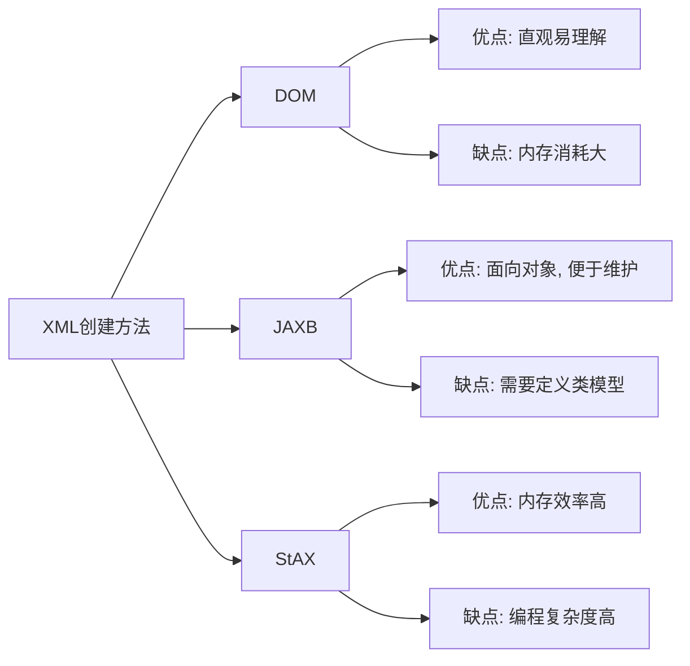

# Java XML创建

在Java开发中，XML(可扩展标记语言)是一种常用的数据交换和存储格式。它具有良好的可读性、跨平台特性和广泛的支持性，使其成为配置文件、Web服务和数据存储等场景的理想选择。本教程将向您介绍如何在Java中创建XML文档。

## XML基础知识

在开始创建XML文档前，让我们先了解XML的基本结构：

```xml
<?xml version="1.0" encoding="UTF-8"?>
<根元素>
  <子元素 属性名="属性值">元素内容</子元素>
  <空元素 属性名="属性值"/>
</根元素>
```

XML文档由以下部分组成：
- XML声明（可选但推荐）：指定XML版本和编码
- 元素：由开始标签、内容和结束标签组成
- 属性：提供元素的附加信息
- 注释：以`<!-- -->`形式表示
- 实体引用：如`&lt;`表示`<`字符

## Java 创建XML的主要方法

Java提供了多种创建XML的方法，我们将介绍三种最常用的方法：

1. DOM（Document Object Model）
2. JAXB（Java Architecture for XML Binding）
3. StAX（Streaming API for XML）

## 使用DOM创建XML

DOM是最传统的XML创建方式，它将整个XML文档加载到内存中形成树状结构。

### DOM创建XML的步骤

```java
import javax.xml.parsers.DocumentBuilder;
import javax.xml.parsers.DocumentBuilderFactory;
import javax.xml.parsers.ParserConfigurationException;
import javax.xml.transform.Transformer;
import javax.xml.transform.TransformerException;
import javax.xml.transform.TransformerFactory;
import javax.xml.transform.dom.DOMSource;
import javax.xml.transform.stream.StreamResult;
import org.w3c.dom.Document;
import org.w3c.dom.Element;

import java.io.FileOutputStream;
import java.io.IOException;

public class DOMXMLCreator {
    public static void main(String[] args) {
        try {
            // 1. 创建DocumentBuilderFactory
            DocumentBuilderFactory factory = DocumentBuilderFactory.newInstance();
            DocumentBuilder builder = factory.newDocumentBuilder();
            
            // 2. 创建Document
            Document document = builder.newDocument();
            
            // 3. 创建根元素
            Element rootElement = document.createElement("students");
            document.appendChild(rootElement);
            
            // 4. 创建子元素
            Element student = document.createElement("student");
            rootElement.appendChild(student);
            
            // 5. 设置属性
            student.setAttribute("id", "1001");
            
            // 6. 创建子元素并设置内容
            Element name = document.createElement("name");
            name.appendChild(document.createTextNode("张三"));
            student.appendChild(name);
            
            Element age = document.createElement("age");
            age.appendChild(document.createTextNode("20"));
            student.appendChild(age);
            
            // 7. 创建第二个学生记录
            Element student2 = document.createElement("student");
            student2.setAttribute("id", "1002");
            rootElement.appendChild(student2);
            
            Element name2 = document.createElement("name");
            name2.appendChild(document.createTextNode("李四"));
            student2.appendChild(name2);
            
            Element age2 = document.createElement("age");
            age2.appendChild(document.createTextNode("21"));
            student2.appendChild(age2);
            
            // 8. 将DOM树转换为XML文件
            TransformerFactory transformerFactory = TransformerFactory.newInstance();
            Transformer transformer = transformerFactory.newTransformer();
            DOMSource source = new DOMSource(document);
            StreamResult result = new StreamResult(new FileOutputStream("students.xml"));
            
            transformer.transform(source, result);
            
            System.out.println("XML文件已成功创建!");
            
        } catch (ParserConfigurationException | TransformerException | IOException e) {
            e.printStackTrace();
        }
    }
}
```

执行上述代码后，将生成如下XML文件：

```xml
<?xml version="1.0" encoding="UTF-8" standalone="no"?>
<students>
  <student id="1001">
    <name>张三</name>
    <age>20</age>
  </student>
  <student id="1002">
    <name>李四</name>
    <age>21</age>
  </student>
</students>
```

:::note
DOM方法将整个文档加载到内存中，对于大型XML文件可能会导致内存问题。
:::

## 使用JAXB创建XML

JAXB（Java Architecture for XML Binding）提供了一种更面向对象的方法来创建XML。它允许我们将Java对象直接映射到XML文档，反之亦然。

### JAXB创建XML的步骤

1. 首先，创建带有JAXB注解的Java类：

```java
import javax.xml.bind.annotation.*;

@XmlRootElement(name = "students")
@XmlAccessorType(XmlAccessType.FIELD)
public class Students {
    
    @XmlElement(name = "student")
    private List<Student> studentList;
    
    public Students() {
        studentList = new ArrayList<>();
    }
    
    public List<Student> getStudentList() {
        return studentList;
    }
    
    public void setStudentList(List<Student> studentList) {
        this.studentList = studentList;
    }
}

@XmlAccessorType(XmlAccessType.FIELD)
class Student {
    
    @XmlAttribute
    private int id;
    
    @XmlElement
    private String name;
    
    @XmlElement
    private int age;
    
    public Student() {
    }
    
    public Student(int id, String name, int age) {
        this.id = id;
        this.name = name;
        this.age = age;
    }
    
    // Getters and setters
    // ...
}
```

2. 使用JAXB生成XML文件：

```java
import java.io.File;
import java.util.ArrayList;
import java.util.List;

import javax.xml.bind.JAXBContext;
import javax.xml.bind.JAXBException;
import javax.xml.bind.Marshaller;

public class JAXBXMLCreator {
    public static void main(String[] args) {
        try {
            // 创建Students实例并添加学生
            Students students = new Students();
            List<Student> studentList = new ArrayList<>();
            
            studentList.add(new Student(1001, "张三", 20));
            studentList.add(new Student(1002, "李四", 21));
            
            students.setStudentList(studentList);
            
            // 初始化JAXB
            JAXBContext context = JAXBContext.newInstance(Students.class);
            Marshaller marshaller = context.createMarshaller();
            
            // 设置格式化输出
            marshaller.setProperty(Marshaller.JAXB_FORMATTED_OUTPUT, true);
            
            // 将Java对象序列化为XML文件
            marshaller.marshal(students, new File("students_jaxb.xml"));
            marshaller.marshal(students, System.out); // 打印到控制台
            
            System.out.println("JAXB XML文件已成功创建!");
            
        } catch (JAXBException e) {
            e.printStackTrace();
        }
    }
}
```

输出将类似于：

```xml
<?xml version="1.0" encoding="UTF-8" standalone="yes"?>
<students>
  <student id="1001">
    <name>张三</name>
    <age>20</age>
  </student>
  <student id="1002">
    <name>李四</name>
    <age>21</age>
  </student>
</students>
```

:::tip
JAXB方法代码量少，维护简单，尤其适合Java对象模型已经定义好的情况。在Java 9及以后，JAXB不再包含在JDK中，需要单独添加依赖。
:::

## 使用StAX创建XML

StAX（Streaming API for XML）提供了基于事件的XML处理方法，相比DOM消耗更少的内存资源。

### StAX创建XML的步骤

```java
import javax.xml.stream.XMLOutputFactory;
import javax.xml.stream.XMLStreamException;
import javax.xml.stream.XMLStreamWriter;
import java.io.FileOutputStream;
import java.io.IOException;

public class StAXXMLCreator {
    public static void main(String[] args) {
        try {
            // 创建XMLOutputFactory
            XMLOutputFactory factory = XMLOutputFactory.newInstance();
            
            // 创建XMLStreamWriter
            XMLStreamWriter writer = factory.createXMLStreamWriter(
                new FileOutputStream("students_stax.xml"), "UTF-8");
            
            // 开始写XML文档
            writer.writeStartDocument("UTF-8", "1.0");
            
            // 写根元素
            writer.writeStartElement("students");
            
            // 写第一个学生元素
            writer.writeStartElement("student");
            writer.writeAttribute("id", "1001");
            
            writer.writeStartElement("name");
            writer.writeCharacters("张三");
            writer.writeEndElement();
            
            writer.writeStartElement("age");
            writer.writeCharacters("20");
            writer.writeEndElement();
            
            writer.writeEndElement(); // 结束student元素
            
            // 写第二个学生元素
            writer.writeStartElement("student");
            writer.writeAttribute("id", "1002");
            
            writer.writeStartElement("name");
            writer.writeCharacters("李四");
            writer.writeEndElement();
            
            writer.writeStartElement("age");
            writer.writeCharacters("21");
            writer.writeEndElement();
            
            writer.writeEndElement(); // 结束student元素
            
            writer.writeEndElement(); // 结束students元素
            
            // 结束文档
            writer.writeEndDocument();
            
            // 关闭writer
            writer.flush();
            writer.close();
            
            System.out.println("StAX XML文件已成功创建!");
            
        } catch (XMLStreamException | IOException e) {
            e.printStackTrace();
        }
    }
}
```

生成的XML文件内容将类似于之前的示例。

:::caution
StAX API需要手动管理XML元素的开始和结束标签，容易出错，但它提供了更好的性能和内存效率。
:::

## 实际应用案例：生成产品目录XML

假设我们需要为一个电商系统生成产品目录的XML文件，以便与其他系统进行数据交换。

```java
import javax.xml.parsers.DocumentBuilder;
import javax.xml.parsers.DocumentBuilderFactory;
import javax.xml.transform.OutputKeys;
import javax.xml.transform.Transformer;
import javax.xml.transform.TransformerFactory;
import javax.xml.transform.dom.DOMSource;
import javax.xml.transform.stream.StreamResult;
import org.w3c.dom.Document;
import org.w3c.dom.Element;

import java.io.FileOutputStream;
import java.text.SimpleDateFormat;
import java.util.Date;

public class ProductCatalogGenerator {
    public static void main(String[] args) {
        try {
            DocumentBuilderFactory factory = DocumentBuilderFactory.newInstance();
            DocumentBuilder builder = factory.newDocumentBuilder();
            Document document = builder.newDocument();
            
            // 创建根元素
            Element catalog = document.createElement("product-catalog");
            catalog.setAttribute("generated-date", 
                new SimpleDateFormat("yyyy-MM-dd").format(new Date()));
            document.appendChild(catalog);
            
            // 添加分类
            Element category = document.createElement("category");
            category.setAttribute("id", "electronics");
            category.setAttribute("name", "电子产品");
            catalog.appendChild(category);
            
            // 添加产品1
            addProduct(document, category, "p001", "智能手机", 
                      "最新款智能手机，搭载高性能处理器", 3999.99, 50);
            
            // 添加产品2
            addProduct(document, category, "p002", "笔记本电脑", 
                      "轻薄便携商务本，续航持久", 5999.99, 20);
            
            // 添加另一个分类
            Element category2 = document.createElement("category");
            category2.setAttribute("id", "books");
            category2.setAttribute("name", "图书");
            catalog.appendChild(category2);
            
            // 添加产品3
            addProduct(document, category2, "b001", "Java编程思想", 
                      "Java经典教程，深入讲解Java编程", 89.00, 100);
            
            // 设置输出格式并保存XML
            TransformerFactory transformerFactory = TransformerFactory.newInstance();
            Transformer transformer = transformerFactory.newTransformer();
            transformer.setOutputProperty(OutputKeys.INDENT, "yes");
            transformer.setOutputProperty("{http://xml.apache.org/xslt}indent-amount", "2");
            
            DOMSource source = new DOMSource(document);
            StreamResult result = new StreamResult(new FileOutputStream("product_catalog.xml"));
            transformer.transform(source, result);
            
            System.out.println("产品目录XML已成功创建!");
            
        } catch (Exception e) {
            e.printStackTrace();
        }
    }
    
    private static void addProduct(Document document, Element category, 
                                  String id, String name, String description, 
                                  double price, int stock) {
        Element product = document.createElement("product");
        product.setAttribute("id", id);
        
        Element productName = document.createElement("name");
        productName.appendChild(document.createTextNode(name));
        product.appendChild(productName);
        
        Element productDesc = document.createElement("description");
        productDesc.appendChild(document.createTextNode(description));
        product.appendChild(productDesc);
        
        Element productPrice = document.createElement("price");
        productPrice.setAttribute("currency", "CNY");
        productPrice.appendChild(document.createTextNode(String.valueOf(price)));
        product.appendChild(productPrice);
        
        Element productStock = document.createElement("stock");
        productStock.appendChild(document.createTextNode(String.valueOf(stock)));
        product.appendChild(productStock);
        
        category.appendChild(product);
    }
}
```

生成的产品目录XML如下：

```xml
<?xml version="1.0" encoding="UTF-8" standalone="no"?>
<product-catalog generated-date="2023-10-30">
  <category id="electronics" name="电子产品">
    <product id="p001">
      <name>智能手机</name>
      <description>最新款智能手机，搭载高性能处理器</description>
      <price currency="CNY">3999.99</price>
      <stock>50</stock>
    </product>
    <product id="p002">
      <name>笔记本电脑</name>
      <description>轻薄便携商务本，续航持久</description>
      <price currency="CNY">5999.99</price>
      <stock>20</stock>
    </product>
  </category>
  <category id="books" name="图书">
    <product id="b001">
      <name>Java编程思想</name>
      <description>Java经典教程，深入讲解Java编程</description>
      <price currency="CNY">89.0</price>
      <stock>100</stock>
    </product>
  </category>
</product-catalog>
```

## 各种方法的比较

下面是三种XML创建方法的比较：



| 方法 | 优势 | 劣势 | 适用场景 |
|-----|------|------|---------|
| DOM | 直观易理解，功能完整 | 内存消耗大 | 小型XML文档 |
| JAXB | 面向对象，代码简洁 | 需要定义类模型，Java 9后需额外依赖 | 与Java对象模型对应的XML |
| StAX | 内存效率高，流式处理 | 编程复杂度高 | 大型XML文档 |

## 总结

在本教程中，我们学习了在Java中创建XML文档的三种主要方法：

1. **DOM**：通过构建文档对象模型创建XML，适用于小型文档和需要随机访问的场景。
2. **JAXB**：通过Java对象与XML的映射创建XML，代码简洁易维护。
3. **StAX**：通过事件流式方式创建XML，适用于大型文档和内存受限的环境。

根据您的具体需求和约束条件，您可以选择最适合的方法来创建XML文档。对于简单的应用，DOM可能是最直观的选择；对于与Java对象模型紧密集成的应用，JAXB是理想选择；而对于大型文档或资源受限的环境，StAX则可能是最佳选择。

## 练习

1. 使用DOM API创建一个包含自己个人信息（姓名、年龄、兴趣爱好等）的XML文件。
2. 创建一个表示图书馆的XML文档，包含多个图书类别和图书信息，使用JAXB实现。
3. 尝试使用StAX创建一个复杂的XML文档，如学校课程表或者电影院排片信息。

## 附加资源

- [Oracle官方JAXB教程](https://docs.oracle.com/javase/tutorial/jaxb/intro/index.html)
- [StAX API开发者指南](https://docs.oracle.com/javase/tutorial/jaxp/stax/index.html)
- [W3C XML规范](https://www.w3.org/TR/xml/)

通过掌握这些创建XML的方法，您将能够在各种Java应用程序中高效地处理XML数据交换和存储需求。