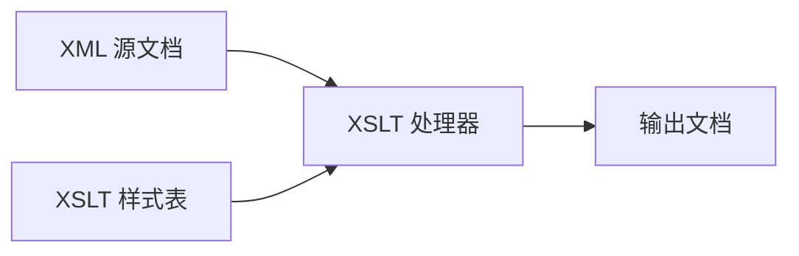

# Java XSLT

XSLT (eXtensible Stylesheet Language Transformations) 是一种用于将 XML 文档转换为其他格式的技术，如 HTML、文本文件或其他 XML 文档。在 Java 中，我们可以使用内置的 XSLT 处理器来执行这些转换操作，而无需依赖外部库。

## XSLT 简介

XSLT 是 XML 技术栈的重要组成部分，它允许开发者定义如何将一个 XML 文档转换为另一种格式。这种转换是通过 XSLT 样式表(stylesheet)实现的，样式表本身也是一个 XML 文档。



## Java 中的XSLT处理

Java 平台提供了强大的 XSLT 处理能力，主要通过 `javax.xml.transform` 包及其子包实现。核心类包括：

- `TransformerFactory`: 创建转换器实例的工厂类
- `Transformer`: 执行实际转换的类
- `Source`: 表示输入源的接口
- `Result`: 表示输出目标的接口

## 基本XSLT转换示例

让我们看一个将XML文档转换为HTML的简单例子：

### 示例XML文档 (students.xml)

```xml
<?xml version="1.0" encoding="UTF-8"?>
<students>
    <student id="1">
        <name>张三</name>
        <age>20</age>
        <grade>A</grade>
    </student>
    <student id="2">
        <name>李四</name>
        <age>22</age>
        <grade>B</grade>
    </student>
    <student id="3">
        <name>王五</name>
        <age>21</age>
        <grade>A</grade>
    </student>
</students>
```

### XSLT样式表 (students.xsl)

```xml
<?xml version="1.0" encoding="UTF-8"?>
<xsl:stylesheet version="1.0" xmlns:xsl="http://www.w3.org/1999/XSL/Transform">
    <xsl:output method="html" indent="yes"/>
    
    <xsl:template match="/">
        <html>
            <head>
                <title>学生列表</title>
                <style>
                    table {
                        border-collapse: collapse;
                        width: 100%;
                    }
                    th, td {
                        border: 1px solid #ddd;
                        padding: 8px;
                        text-align: left;
                    }
                    th {
                        background-color: #f2f2f2;
                    }
                </style>
            </head>
            <body>
                <h1>学生信息</h1>
                <table>
                    <tr>
                        <th>ID</th>
                        <th>姓名</th>
                        <th>年龄</th>
                        <th>成绩</th>
                    </tr>
                    <xsl:for-each select="students/student">
                        <tr>
                            <td><xsl:value-of select="@id"/></td>
                            <td><xsl:value-of select="name"/></td>
                            <td><xsl:value-of select="age"/></td>
                            <td><xsl:value-of select="grade"/></td>
                        </tr>
                    </xsl:for-each>
                </table>
            </body>
        </html>
    </xsl:template>
</xsl:stylesheet>
```

### Java 代码实现转换

```java
import javax.xml.transform.Transformer;
import javax.xml.transform.TransformerFactory;
import javax.xml.transform.stream.StreamResult;
import javax.xml.transform.stream.StreamSource;
import java.io.File;

public class XSLTExample {
    public static void main(String[] args) {
        try {
            // 创建TransformerFactory实例
            TransformerFactory factory = TransformerFactory.newInstance();
            
            // 加载XSLT样式表
            StreamSource xslt = new StreamSource(new File("students.xsl"));
            
            // 创建Transformer对象
            Transformer transformer = factory.newTransformer(xslt);
            
            // 设置源XML文件
            StreamSource source = new StreamSource(new File("students.xml"));
            
            // 设置输出目标
            StreamResult result = new StreamResult(new File("students.html"));
            
            // 执行转换
            transformer.transform(source, result);
            
            System.out.println("转换成功完成！");
        } catch (Exception e) {
            e.printStackTrace();
        }
    }
}
```

### 输出结果 (students.html)

执行上述代码后，将生成一个HTML文件，在浏览器中打开会看到格式化的学生信息表：

```html
<html>
  <head>
    <title>学生列表</title>
    <style>
      table {
          border-collapse: collapse;
          width: 100%;
      }
      th, td {
          border: 1px solid #ddd;
          padding: 8px;
          text-align: left;
      }
      th {
          background-color: #f2f2f2;
      }
    </style>
  </head>
  <body>
    <h1>学生信息</h1>
    <table>
      <tr>
        <th>ID</th>
        <th>姓名</th>
        <th>年龄</th>
        <th>成绩</th>
      </tr>
      <tr>
        <td>1</td>
        <td>张三</td>
        <td>20</td>
        <td>A</td>
      </tr>
      <tr>
        <td>2</td>
        <td>李四</td>
        <td>22</td>
        <td>B</td>
      </tr>
      <tr>
        <td>3</td>
        <td>王五</td>
        <td>21</td>
        <td>A</td>
      </tr>
    </table>
  </body>
</html>
```

## XSLT处理的关键概念

### 1. 模板匹配 (Template Matching)

XSLT 使用模板匹配来定义如何处理 XML 文档中的元素。`<xsl:template match="pattern">` 指定哪些元素应用这个模板。

```xml
<xsl:template match="student">
  <!-- 处理每个student元素的代码 -->
</xsl:template>
```

### 2. XPath表达式

XSLT 大量使用 XPath 来选择和处理 XML 元素。例如：

- `select="students/student"` - 选择所有student元素
- `select="@id"` - 选择id属性
- `select="name"` - 选择name元素

### 3. 输出方法

XSLT 可以生成不同类型的输出，通过 `<xsl:output>` 元素指定：

```xml
<xsl:output method="html" indent="yes"/>
```

可选的方法包括：`xml`、`html`、`text`。

## 进阶XSLT功能

### 条件处理

使用 `<xsl:if>` 和 `<xsl:choose>` 实现条件逻辑：

```xml
<xsl:template match="student">
  <tr>
    <td><xsl:value-of select="name"/></td>
    <td>
      <xsl:choose>
        <xsl:when test="grade = 'A'">
          <span style="color: green;">优秀</span>
        </xsl:when>
        <xsl:when test="grade = 'B'">
          <span style="color: blue;">良好</span>
        </xsl:when>
        <xsl:otherwise>
          <span style="color: red;">及格</span>
        </xsl:otherwise>
      </xsl:choose>
    </td>
  </tr>
</xsl:template>
```

### 排序

使用 `<xsl:sort>` 对输出进行排序：

```xml
<xsl:for-each select="students/student">
  <xsl:sort select="age" data-type="number" order="ascending"/>
  <!-- 处理每个学生的代码 -->
</xsl:for-each>
```

## 实际应用场景

### 1. 报表生成

XSLT 非常适合将数据库导出的 XML 数据转换为格式化的 HTML 报表。例如，可以生成销售报表、库存状态或用户活动摘要。

### 2. 数据转换和集成

在不同系统之间传输数据时，可以使用 XSLT 将一种 XML 格式转换为另一种格式，以满足接收系统的需求。

```java
public class DataIntegration {
    public static void main(String[] args) {
        try {
            // 创建TransformerFactory
            TransformerFactory factory = TransformerFactory.newInstance();
            
            // 加载转换样式表
            StreamSource xslt = new StreamSource(new File("format_converter.xsl"));
            Transformer transformer = factory.newTransformer(xslt);
            
            // 设置转换参数
            transformer.setParameter("current_date", new java.text.SimpleDateFormat("yyyy-MM-dd").format(new java.util.Date()));
            
            // 执行转换 - 从系统A的格式转换为系统B的格式
            StreamSource source = new StreamSource(new File("system_a_data.xml"));
            StreamResult result = new StreamResult(new File("system_b_data.xml"));
            transformer.transform(source, result);
            
        } catch (Exception e) {
            e.printStackTrace();
        }
    }
}
```

### 3. 网站内容管理

内容管理系统可以存储 XML 格式的内容，然后使用 XSLT 将其转换为适合不同设备和媒体的表现形式。

## 处理大型XML文档的性能优化

:::caution
处理大型XML文档时，需要注意内存使用。默认的DOM处理模式会将整个XML文档加载到内存中，这可能导致内存不足问题。
:::

对于大型文档，可以考虑使用基于SAX或StAX的转换方法：

```java
import javax.xml.transform.sax.SAXSource;
import org.xml.sax.InputSource;

// 使用SAX处理大文件
public void transformLargeFile(String xmlFile, String xsltFile, String outputFile) throws Exception {
    TransformerFactory factory = TransformerFactory.newInstance();
    Transformer transformer = factory.newTransformer(new StreamSource(new File(xsltFile)));
    
    // 使用SAXSource而非StreamSource
    SAXSource source = new SAXSource(new InputSource(new FileInputStream(xmlFile)));
    StreamResult result = new StreamResult(new File(outputFile));
    
    transformer.transform(source, result);
}
```

## 错误处理和调试

在处理XSLT转换时，设置错误处理器可以帮助定位问题：

```java
import javax.xml.transform.ErrorListener;
import javax.xml.transform.TransformerException;

public class XSLTErrorHandler implements ErrorListener {
    @Override
    public void warning(TransformerException e) {
        System.out.println("警告: " + e.getMessage());
    }
    
    @Override
    public void error(TransformerException e) {
        System.out.println("错误: " + e.getMessage());
    }
    
    @Override
    public void fatalError(TransformerException e) throws TransformerException {
        System.out.println("致命错误: " + e.getMessage());
        throw e;
    }
}

// 在代码中使用
TransformerFactory factory = TransformerFactory.newInstance();
factory.setErrorListener(new XSLTErrorHandler());
```

## 总结

Java XSLT 提供了强大的 XML 文档转换功能，使我们能够轻松地将 XML 数据转换为多种格式。在本教程中，我们学习了：

- XSLT 的基本概念和工作原理
- 如何在 Java 中使用 XSLT 处理器
- 创建样式表和执行转换的步骤
- 条件处理、排序等高级 XSLT 功能
- XSLT 的实际应用场景
- 处理大型 XML 文档的性能优化技巧

掌握 XSLT 技术可以为处理和转换 XML 数据提供强大而灵活的工具，特别是在企业应用、数据集成和报表生成等场景中。

## 练习

1. 创建一个将 XML 格式的图书列表转换为 HTML 表格的 XSLT 样式表
2. 编写一个 Java 程序，使用 XSLT 将 XML 数据转换为 CSV 文本文件
3. 实现一个根据不同条件(如价格范围)对产品 XML 数据进行过滤的 XSLT 转换
4. 尝试使用参数化的 XSLT 转换，通过 Java 代码传递参数到样式表

## 延伸阅读

- [W3C XSLT 规范](https://www.w3.org/TR/xslt/)
- [Java XML 处理官方文档](https://docs.oracle.com/javase/tutorial/jaxp/)
- 《XSLT Cookbook》- Sal Mangano
- 《Java XML and JSON》- Jeff Friesen

:::tip
XSLT 2.0 和 3.0 提供了更强大的功能，但在 Java 内置支持中可能需要额外的库，如 Saxon。对于大多数基本应用场景，Java 内置的 XSLT 1.0 支持已经足够使用。
:::