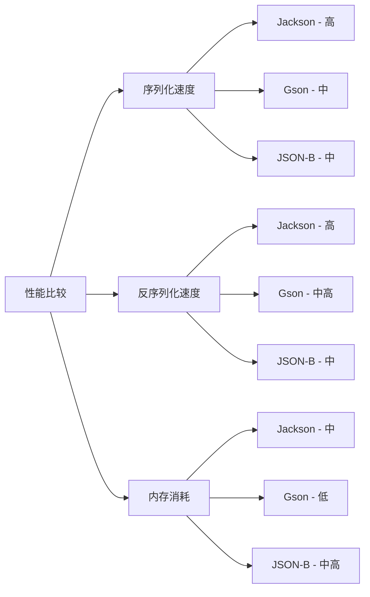

# Java JSON概述

JSON (JavaScript Object Notation) 是一种轻量级的数据交换格式。它易于人阅读和编写，同时也易于机器解析和生成。在当今的Web开发和微服务架构中，JSON已成为数据传输的标准格式之一。本文将介绍在Java中处理JSON的基本概念和常用库。

## 什么是JSON？

JSON是一种基于文本的数据格式，它使用了JavaScript语法的子集，但是与JavaScript无关，它是完全独立的数据格式。JSON的两种基本结构是：

1. **键值对集合** - 在各种语言中，它被实现为对象、记录、结构、字典等
2. **有序的值列表** - 在各种语言中，它被实现为数组、向量、列表等

### JSON的基本语法

```json
{
  "name": "John Doe",
  "age": 30,
  "isStudent": false,
  "courses": ["Java", "Python", "JavaScript"],
  "address": {
    "street": "123 Main St",
    "city": "Boston"
  }
}
```

## 为什么Java需要处理JSON？

在现代应用开发中，JSON的处理至关重要：

1. **API通信** - RESTful API普遍使用JSON作为数据交换格式
2. **配置文件** - 很多应用使用JSON格式的配置文件
3. **数据存储** - NoSQL数据库如MongoDB使用JSON格式存储数据
4. **前后端分离** - 前端和后端应用间通过JSON进行数据传输

## Java 中的JSON处理库

Java没有内置JSON处理功能，但有多个流行的第三方库可供选择：

### 1. Jackson

Jackson是最流行的JSON处理库之一，提供了高性能的JSON处理功能。

#### 添加依赖（Maven）

```xml
<dependency>
    <groupId>com.fasterxml.jackson.core</groupId>
    <artifactId>jackson-databind</artifactId>
    <version>2.15.2</version>
</dependency>
```

### 2. Gson

Gson是由Google开发的JSON库，API简单易用。

#### 添加依赖（Maven）

```xml
<dependency>
    <groupId>com.google.code.gson</groupId>
    <artifactId>gson</artifactId>
    <version>2.10.1</version>
</dependency>
```

### 3. JSON-B (Java API for JSON Binding)

JSON-B是Java EE的一部分，提供了标准化的JSON绑定API。

#### 添加依赖（Maven）

```xml
<dependency>
    <groupId>javax.json.bind</groupId>
    <artifactId>javax.json.bind-api</artifactId>
    <version>1.0</version>
</dependency>
<dependency>
    <groupId>org.eclipse</groupId>
    <artifactId>yasson</artifactId>
    <version>2.0.4</version>
</dependency>
```

### 4. JSON-P (Java API for JSON Processing)

JSON-P提供了低级别的JSON处理API。

#### 添加依赖（Maven）

```xml
<dependency>
    <groupId>javax.json</groupId>
    <artifactId>javax.json-api</artifactId>
    <version>1.1.4</version>
</dependency>
<dependency>
    <groupId>org.glassfish</groupId>
    <artifactId>javax.json</artifactId>
    <version>1.1.4</version>
</dependency>
```

## JSON处理的基本操作

使用Java处理JSON时，常见的操作包括：

1. **序列化（Java对象转JSON）**
2. **反序列化（JSON转Java对象）**
3. **JSON树模型操作**
4. **JSON流式处理**

下面我们将使用Jackson库演示这些操作：

### 序列化示例

```java
import com.fasterxml.jackson.databind.ObjectMapper;
import java.io.IOException;

public class SerializationExample {
    public static void main(String[] args) throws IOException {
        // 创建对象
        Person person = new Person();
        person.setName("John Doe");
        person.setAge(30);
        person.setEmailAddress("john@example.com");
        
        // 序列化为JSON
        ObjectMapper mapper = new ObjectMapper();
        String json = mapper.writeValueAsString(person);
        
        System.out.println(json);
    }
}

class Person {
    private String name;
    private int age;
    private String emailAddress;
    
    // Getters and setters
    public String getName() { return name; }
    public void setName(String name) { this.name = name; }
    public int getAge() { return age; }
    public void setAge(int age) { this.age = age; }
    public String getEmailAddress() { return emailAddress; }
    public void setEmailAddress(String emailAddress) { this.emailAddress = emailAddress; }
}
```

**输出：**

```json
{"name":"John Doe","age":30,"emailAddress":"john@example.com"}
```

### 反序列化示例

```java
import com.fasterxml.jackson.databind.ObjectMapper;
import java.io.IOException;

public class DeserializationExample {
    public static void main(String[] args) throws IOException {
        String json = "{\"name\":\"Jane Smith\",\"age\":25,\"emailAddress\":\"jane@example.com\"}";
        
        // JSON反序列化为Java对象
        ObjectMapper mapper = new ObjectMapper();
        Person person = mapper.readValue(json, Person.class);
        
        System.out.println("Name: " + person.getName());
        System.out.println("Age: " + person.getAge());
        System.out.println("Email: " + person.getEmailAddress());
    }
}
```

**输出：**

```
Name: Jane Smith
Age: 25
Email: jane@example.com
```

### JSON树模型操作

```java
import com.fasterxml.jackson.databind.JsonNode;
import com.fasterxml.jackson.databind.ObjectMapper;
import com.fasterxml.jackson.databind.node.ObjectNode;
import java.io.IOException;

public class TreeModelExample {
    public static void main(String[] args) throws IOException {
        String json = "{\"name\":\"John Doe\",\"age\":30,\"contact\":{\"email\":\"john@example.com\",\"phone\":\"555-1234\"}}";
        
        ObjectMapper mapper = new ObjectMapper();
        JsonNode rootNode = mapper.readTree(json);
        
        // 读取值
        String name = rootNode.path("name").asText();
        int age = rootNode.path("age").asInt();
        String email = rootNode.path("contact").path("email").asText();
        
        System.out.println("Name: " + name);
        System.out.println("Age: " + age);
        System.out.println("Email: " + email);
        
        // 修改值
        ((ObjectNode) rootNode).put("age", 31);
        ((ObjectNode) rootNode.path("contact")).put("phone", "555-5678");
        
        // 输出修改后的JSON
        System.out.println("\n修改后的JSON:");
        System.out.println(mapper.writerWithDefaultPrettyPrinter().writeValueAsString(rootNode));
    }
}
```

**输出：**

```
Name: John Doe
Age: 30
Email: john@example.com

修改后的JSON:
{
  "name" : "John Doe",
  "age" : 31,
  "contact" : {
    "email" : "john@example.com",
    "phone" : "555-5678"
  }
}
```

## 常见注解和高级特性

Jackson和其他JSON库提供了多种注解，可以控制JSON序列化和反序列化的行为。

### Jackson常用注解示例

```java
import com.fasterxml.jackson.annotation.*;
import com.fasterxml.jackson.databind.ObjectMapper;
import java.io.IOException;
import java.util.Date;

public class JacksonAnnotationsExample {
    public static void main(String[] args) throws IOException {
        Product product = new Product();
        product.setId(1001);
        product.setName("Laptop");
        product.setPrice(1299.99);
        product.setCreatedDate(new Date());
        product.setInStock(true);
        
        ObjectMapper mapper = new ObjectMapper();
        String json = mapper.writeValueAsString(product);
        
        System.out.println(json);
    }
}

@JsonPropertyOrder({ "productId", "productName", "price" })
class Product {
    private int id;
    private String name;
    private double price;
    private Date createdDate;
    private boolean inStock;
    
    @JsonProperty("productId")
    public int getId() { return id; }
    
    public void setId(int id) { this.id = id; }
    
    @JsonProperty("productName")
    public String getName() { return name; }
    
    public void setName(String name) { this.name = name; }
    
    public double getPrice() { return price; }
    
    public void setPrice(double price) { this.price = price; }
    
    @JsonFormat(shape = JsonFormat.Shape.STRING, pattern = "yyyy-MM-dd")
    public Date getCreatedDate() { return createdDate; }
    
    public void setCreatedDate(Date createdDate) { this.createdDate = createdDate; }
    
    @JsonIgnore
    public boolean isInStock() { return inStock; }
    
    public void setInStock(boolean inStock) { this.inStock = inStock; }
}
```

**输出示例：**

```json
{"productId":1001,"productName":"Laptop","price":1299.99,"createdDate":"2023-09-15"}
```

:::note
注意`inStock`属性因为有`@JsonIgnore`注解而没有出现在JSON结果中，并且属性顺序和命名都根据注解进行了修改。
:::

## 实际应用场景

### 场景1：REST API开发

在开发RESTful Web服务时，处理JSON请求和响应是基本需求。

```java
import com.fasterxml.jackson.databind.ObjectMapper;
import javax.servlet.http.HttpServletRequest;
import javax.servlet.http.HttpServletResponse;
import java.io.IOException;
import java.util.HashMap;
import java.util.Map;

public class UserController {
    private ObjectMapper mapper = new ObjectMapper();
    
    public void createUser(HttpServletRequest request, HttpServletResponse response) throws IOException {
        // 从请求中读取JSON
        User user = mapper.readValue(request.getInputStream(), User.class);
        
        // 处理业务逻辑（这里简化）
        user.setId(generateUserId());
        saveUser(user);
        
        // 创建响应
        Map<String, Object> responseData = new HashMap<>();
        responseData.put("success", true);
        responseData.put("message", "User created successfully");
        responseData.put("userId", user.getId());
        
        // 返回JSON响应
        response.setContentType("application/json");
        mapper.writeValue(response.getOutputStream(), responseData);
    }
    
    // 辅助方法（简化示例）
    private long generateUserId() {
        return System.currentTimeMillis();
    }
    
    private void saveUser(User user) {
        // 数据库操作（略）
    }
}

class User {
    private long id;
    private String username;
    private String email;
    
    // Getters and setters
    public long getId() { return id; }
    public void setId(long id) { this.id = id; }
    public String getUsername() { return username; }
    public void setUsername(String username) { this.username = username; }
    public String getEmail() { return email; }
    public void setEmail(String email) { this.email = email; }
}
```

### 场景2：配置文件处理

使用JSON作为应用程序配置文件格式。

```java
import com.fasterxml.jackson.databind.ObjectMapper;
import java.io.File;
import java.io.IOException;

public class ConfigLoader {
    public static AppConfig loadConfig() throws IOException {
        ObjectMapper mapper = new ObjectMapper();
        return mapper.readValue(new File("config.json"), AppConfig.class);
    }
    
    public static void main(String[] args) throws IOException {
        AppConfig config = loadConfig();
        System.out.println("App Name: " + config.getAppName());
        System.out.println("Max Connections: " + config.getDatabase().getMaxConnections());
    }
}

class AppConfig {
    private String appName;
    private String version;
    private DatabaseConfig database;
    
    // Getters and setters
    public String getAppName() { return appName; }
    public void setAppName(String appName) { this.appName = appName; }
    public String getVersion() { return version; }
    public void setVersion(String version) { this.version = version; }
    public DatabaseConfig getDatabase() { return database; }
    public void setDatabase(DatabaseConfig database) { this.database = database; }
}

class DatabaseConfig {
    private String url;
    private String username;
    private int maxConnections;
    
    // Getters and setters
    public String getUrl() { return url; }
    public void setUrl(String url) { this.url = url; }
    public String getUsername() { return username; }
    public void setUsername(String username) { this.username = username; }
    public int getMaxConnections() { return maxConnections; }
    public void setMaxConnections(int maxConnections) { this.maxConnections = maxConnections; }
}
```

**config.json 示例：**

```json
{
  "appName": "MyJavaApp",
  "version": "1.0.0",
  "database": {
    "url": "jdbc:mysql://localhost:3306/mydb",
    "username": "admin",
    "maxConnections": 100
  }
}
```

## JSON库的性能比较

不同的JSON库在性能上有所差异。下面是一个简单的性能概览：



:::tip
- **Jackson**：总体性能最佳，功能最丰富，但API相对复杂
- **Gson**：API最简单，内存消耗小，但性能略低于Jackson
- **JSON-B**：标准API，在标准Java EE环境中无需额外依赖
:::

## 最佳实践

以下是处理Java中JSON的一些最佳实践：

1. **选择合适的库**：根据项目需求选择最适合的JSON库
2. **使用数据传输对象(DTO)**：创建专门的DTO类用于JSON序列化和反序列化
3. **合理使用注解**：使用注解控制字段的命名、格式和可见性
4. **错误处理**：始终处理可能发生的JSON解析异常
5. **日期格式化**：明确指定日期的格式化方式
6. **大文件处理**：对大文件使用流式处理而非一次性加载
7. **缓存ObjectMapper**：重用ObjectMapper实例以提高性能

## 总结

Java处理JSON有多种成熟的库可供选择，其中Jackson、Gson和JSON-B是最常用的。根据应用场景的不同，这些库提供了从简单的对象序列化/反序列化到复杂的树模型操作等多种功能。掌握JSON处理是现代Java开发的基本技能，尤其在Web开发和微服务架构中至关重要。

## 练习

1. 创建一个简单的Java类，并使用Jackson将其序列化为JSON字符串。
2. 编写代码从文件中读取JSON，并反序列化为Java对象。
3. 使用树模型API修改已有的JSON数据。
4. 尝试使用不同的JSON库（Jackson、Gson、JSON-B）处理相同的数据，比较差异。
5. 创建一个简单的REST API，可以接收和返回JSON数据。

## 扩展资源

- [Jackson官方文档](https://github.com/FasterXML/jackson)
- [Gson用户指南](https://github.com/google/gson/blob/master/UserGuide.md)
- [JSON-B规范](https://javaee.github.io/jsonb-spec/)
- [JSON格式规范](https://www.json.org/)

通过本文的学习，你应该已经了解了Java中JSON处理的基础知识，以及如何使用不同的库来执行常见的JSON操作。在后续的章节中，我们将深入探讨更多高级主题，如自定义序列化/反序列化、处理复杂的JSON结构等。