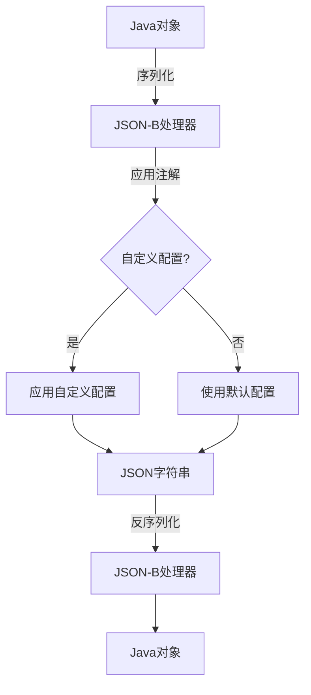

# Java JSON-B

## 什么是JSON-B？

JSON-B（JSON Binding）是Java EE 8引入的一个标准API，用于在Java对象和JSON文档之间进行序列化和反序列化。作为JCP（Java Community Process）下的JSR 367规范的实现，JSON-B提供了一种简单且标准化的方式来处理Java应用程序中的JSON数据。

:::note
JSON-B的官方名称是Jakarta JSON Binding，在Java EE被捐赠给Eclipse基金会后更名为Jakarta EE。
:::

## 为什么需要JSON-B？

在JSON-B出现之前，Java开发者主要依赖第三方库（如Jackson、Gson等）来处理JSON数据。虽然这些库功能强大，但缺乏标准化接口，导致不同项目之间的代码可能不兼容。JSON-B的引入解决了这个问题，提供了一个标准化的API，同时保留了足够的灵活性。

## JSON-B 基本用法

### 环境设置

首先，你需要在项目中添加JSON-B依赖。使用Maven可以添加参考实现Yasson：

```xml
<dependency>
    <groupId>jakarta.json.bind</groupId>
    <artifactId>jakarta.json.bind-api</artifactId>
    <version>2.0.0</version>
</dependency>
<dependency>
    <groupId>org.eclipse</groupId>
    <artifactId>yasson</artifactId>
    <version>2.0.2</version>
</dependency>
```

### 序列化（Java对象到JSON）

将Java对象转换为JSON字符串非常简单：

```java
import jakarta.json.bind.Jsonb;
import jakarta.json.bind.JsonbBuilder;

public class JSONBDemo {
    public static void main(String[] args) {
        // 创建要序列化的对象
        Person person = new Person("张三", 25, "北京");
        
        // 创建Jsonb实例
        Jsonb jsonb = JsonbBuilder.create();
        
        // 将对象序列化为JSON字符串
        String jsonString = jsonb.toJson(person);
        System.out.println(jsonString);
    }
}

class Person {
    private String name;
    private int age;
    private String city;
    
    // 无参构造函数（JSON-B需要）
    public Person() {}
    
    public Person(String name, int age, String city) {
        this.name = name;
        this.age = age;
        this.city = city;
    }
    
    // Getters and setters
    public String getName() { return name; }
    public void setName(String name) { this.name = name; }
    public int getAge() { return age; }
    public void setAge(int age) { this.age = age; }
    public String getCity() { return city; }
    public void setCity(String city) { this.city = city; }
}
```

输出：
```
{"age":25,"city":"北京","name":"张三"}
```

### 反序列化（JSON到Java对象）

从JSON字符串创建Java对象同样简单：

```java
// JSON字符串
String json = "{\"name\":\"李四\",\"age\":30,\"city\":\"上海\"}";

// 从JSON创建对象
Person person = jsonb.fromJson(json, Person.class);
System.out.println("姓名: " + person.getName());
System.out.println("年龄: " + person.getAge());
System.out.println("城市: " + person.getCity());
```

输出：
```
姓名: 李四
年龄: 30
城市: 上海
```

## JSON-B自定义配置

### 使用注解

JSON-B提供了多种注解来自定义序列化行为：

```java
import jakarta.json.bind.annotation.JsonbDateFormat;
import jakarta.json.bind.annotation.JsonbProperty;
import jakarta.json.bind.annotation.JsonbTransient;
import java.util.Date;

public class Employee {
    // 自定义属性名
    @JsonbProperty("employeeName")
    private String name;
    
    private int id;
    
    // 自定义日期格式
    @JsonbDateFormat("yyyy-MM-dd")
    private Date hireDate;
    
    // 不序列化该字段
    @JsonbTransient
    private double salary;
    
    // 构造函数、getters和setters
    // ...
}
```

### 自定义配置

通过`JsonbConfig`可以更改默认行为：

```java
import jakarta.json.bind.JsonbConfig;
import jakarta.json.bind.JsonbBuilder;
import jakarta.json.bind.config.PropertyNamingStrategy;

// 创建自定义配置
JsonbConfig config = new JsonbConfig()
    .withNullValues(true)  // 包含null值
    .withFormatting(true)  // 格式化输出
    .withPropertyNamingStrategy(PropertyNamingStrategy.UPPER_CAMEL_CASE);  // 使用大驼峰命名

// 使用配置创建Jsonb实例
Jsonb jsonb = JsonbBuilder.create(config);
```

## 处理复杂数据类型

### 集合和数组

JSON-B可以自动处理Java集合和数组：

```java
import java.util.List;
import java.util.ArrayList;

// 创建集合
List<Person> persons = new ArrayList<>();
persons.add(new Person("张三", 25, "北京"));
persons.add(new Person("李四", 30, "上海"));

// 序列化集合
String jsonArray = jsonb.toJson(persons);
System.out.println(jsonArray);

// 反序列化回集合
List<Person> personList = jsonb.fromJson(jsonArray, 
    new ArrayList<Person>(){}.getClass().getGenericSuperclass());
```

输出：
```
[{"age":25,"city":"北京","name":"张三"},{"age":30,"city":"上海","name":"李四"}]
```

### 嵌套对象

JSON-B能够处理复杂的嵌套对象结构：

```java
public class Department {
    private String name;
    private Person manager;
    private List<Person> employees;
    
    // 构造函数、getters和setters
    // ...
}

// 创建并序列化复杂对象
Department dept = new Department();
dept.setName("研发部");
dept.setManager(new Person("王五", 40, "广州"));
dept.setEmployees(persons);

String deptJson = jsonb.toJson(dept);
```

## 实际应用场景

### REST API开发

JSON-B在开发REST API时特别有用，可以轻松地在Java对象和JSON之间转换：

```java
@Path("/api/employees")
public class EmployeeResource {
    @GET
    @Produces(MediaType.APPLICATION_JSON)
    public Response getAllEmployees() {
        List<Employee> employees = employeeService.getAll();
        return Response.ok(employees).build();  // JAX-RS自动使用JSON-B
    }
    
    @POST
    @Consumes(MediaType.APPLICATION_JSON)
    public Response addEmployee(Employee employee) {  // 自动反序列化请求体
        employeeService.add(employee);
        return Response.status(Response.Status.CREATED).build();
    }
}
```

### 配置文件处理

使用JSON-B处理基于JSON的配置文件：

```java
public class ConfigLoader {
    public static AppConfig loadConfig(String path) throws IOException {
        Jsonb jsonb = JsonbBuilder.create();
        String content = Files.readString(Paths.get(path));
        return jsonb.fromJson(content, AppConfig.class);
    }
}
```

### 数据持久化

将对象序列化为JSON存储在NoSQL数据库中：

```java
public void saveDocument(Document document) {
    Jsonb jsonb = JsonbBuilder.create();
    String jsonDocument = jsonb.toJson(document);
    documentRepository.save(documentId, jsonDocument);
}

public Document loadDocument(String documentId) {
    String jsonDocument = documentRepository.findById(documentId);
    return jsonb.fromJson(jsonDocument, Document.class);
}
```

## JSON-B处理策略图解



## 最佳实践

1. **始终提供默认构造函数**：JSON-B需要一个无参构造函数来创建对象实例。

2. **使用getter和setter**：JSON-B使用JavaBean规范访问属性。

3. **合理使用注解**：使用注解自定义序列化行为，但避免过度使用。

4. **处理日期时间**：对日期时间字段使用`@JsonbDateFormat`确保格式一致。

5. **考虑性能**：对于高性能需求，可以重用Jsonb实例而不是每次都创建新实例。

:::tip
`Jsonb`实例是线程安全的，可以在应用中作为单例使用。
:::

## 常见问题及解决

### 无法序列化某些字段

问题：某些字段没有出现在生成的JSON中。
解决：检查是否有public getter方法，或者字段是否被标记为`@JsonbTransient`。

### 反序列化类型不匹配

问题：反序列化时出现类型转换错误。
解决：确保JSON中的值类型与Java类字段类型兼容，或使用自定义适配器处理类型转换。

### 处理泛型集合

问题：反序列化泛型集合时类型信息丢失。
解决：使用`jakarta.json.bind.TypeProvider`或运行时类型提供：

```java
List<Person> personList = jsonb.fromJson(jsonArray, 
    new jakarta.json.bind.TypeReference<List<Person>>(){});
```

## 总结

JSON-B为Java开发者提供了一个标准化、易于使用的API，用于在Java对象和JSON之间进行转换。它具有以下优点：

- 作为Java EE/Jakarta EE的标准API，确保代码的可移植性
- 简洁的API设计，易于上手
- 功能全面，支持自定义序列化行为
- 与JAX-RS等其他Java EE技术无缝集成

通过本教程，你应该已经了解了JSON-B的基本用法、自定义配置及实际应用场景，这将帮助你在Java应用中更有效地处理JSON数据。

## 练习

1. 创建一个`Book`类，包含标题、作者、发布日期和ISBN属性，使用JSON-B将其序列化和反序列化。

2. 实现一个使用JSON-B的图书管理系统，支持添加、删除和搜索图书，并将图书列表保存为JSON文件。

3. 使用`@JsonbProperty`和`@JsonbDateFormat`自定义图书对象的JSON表示形式。

## 扩展资源

- [Jakarta JSON Binding官方文档](https://jakarta.ee/specifications/jsonb/)
- [Eclipse Yasson - 参考实现](https://github.com/eclipse-ee4j/yasson)
- [JSR 367: Java API for JSON Binding](https://jcp.org/en/jsr/detail?id=367)