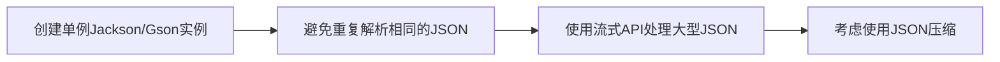

# Java JSON与对象转换

在现代Web开发中，JSON (JavaScript Object Notation) 已经成为数据交换的标准格式。对于Java开发者来说，掌握JSON与Java对象之间的转换技术是必不可少的技能。本文将详细介绍如何在Java中实现JSON与对象的相互转换。

## 什么是JSON？

JSON是一种轻量级的数据交换格式，易于人阅读和编写，也易于机器解析和生成。它基于JavaScript语言的一个子集，但完全独立于编程语言。

JSON的基本结构包括：
- 对象：键值对集合，由花括号包围 `{}`
- 数组：值的有序列表，由方括号包围 `[]`
- 值：可以是字符串、数字、布尔值、对象、数组或null

例如：
```json
{
  "name": "John Doe",
  "age": 30,
  "isStudent": false,
  "courses": ["Java", "Python", "JavaScript"],
  "address": {
    "city": "Shanghai",
    "zipCode": "200000"
  }
}
```

## Java 处理JSON的常用库

Java生态系统中有多个处理JSON的库，最常用的包括：

1. **Jackson** - 最流行的Java JSON处理库
2. **Gson** - 由Google开发的JSON库
3. **JSON-B (JSON Binding)** - Java EE标准
4. **org.json** - 简单的JSON处理库

我们将主要介绍Jackson和Gson的使用，因为它们最为广泛使用。

## 使用Jackson进行JSON转换

### Maven依赖

首先，添加Jackson依赖到你的项目中：

```xml
<dependency>
    <groupId>com.fasterxml.jackson.core</groupId>
    <artifactId>jackson-databind</artifactId>
    <version>2.14.1</version>
</dependency>
```

### Java 对象转JSON (序列化)

假设我们有以下Java类：

```java
public class Student {
    private String name;
    private int age;
    private boolean active;
    private List<String> courses;
    
    // 构造函数、getter和setter方法省略
}
```

将Student对象转换为JSON：

```java
import com.fasterxml.jackson.databind.ObjectMapper;

public class JsonExample {
    public static void main(String[] args) {
        try {
            // 创建ObjectMapper实例
            ObjectMapper mapper = new ObjectMapper();
            
            // 创建Student对象
            List<String> courses = new ArrayList<>();
            courses.add("Java");
            courses.add("Spring Boot");
            
            Student student = new Student();
            student.setName("张三");
            student.setAge(20);
            student.setActive(true);
            student.setCourses(courses);
            
            // 将Java对象转换为JSON字符串
            String jsonString = mapper.writeValueAsString(student);
            System.out.println(jsonString);
            
            // 将Java对象转换为JSON并写入文件
            mapper.writeValue(new File("student.json"), student);
            
        } catch (Exception e) {
            e.printStackTrace();
        }
    }
}
```

输出结果：
```
{"name":"张三","age":20,"active":true,"courses":["Java","Spring Boot"]}
```

### JSON转Java对象 (反序列化)

```java
import com.fasterxml.jackson.databind.ObjectMapper;

public class JsonExample {
    public static void main(String[] args) {
        try {
            ObjectMapper mapper = new ObjectMapper();
            
            // JSON字符串
            String jsonString = "{\"name\":\"张三\",\"age\":20,\"active\":true,\"courses\":[\"Java\",\"Spring Boot\"]}";
            
            // 从JSON字符串转换为Java对象
            Student student = mapper.readValue(jsonString, Student.class);
            
            System.out.println("姓名: " + student.getName());
            System.out.println("年龄: " + student.getAge());
            System.out.println("课程: " + student.getCourses());
            
            // 也可以从文件读取JSON
            Student studentFromFile = mapper.readValue(new File("student.json"), Student.class);
            
        } catch (Exception e) {
            e.printStackTrace();
        }
    }
}
```

输出结果：
```
姓名: 张三
年龄: 20
课程: [Java, Spring Boot]
```

### Jackson注解

Jackson提供了许多注解来控制JSON转换过程：

```java
import com.fasterxml.jackson.annotation.*;

public class Student {
    private String name;
    
    @JsonProperty("studentAge")  // 改变JSON字段名
    private int age;
    
    @JsonIgnore  // 在JSON中忽略该字段
    private String idNumber;
    
    @JsonFormat(pattern = "yyyy-MM-dd")  // 格式化日期
    private Date birthDate;
    
    // getter和setter方法
}
```

:::tip
使用适当的Jackson注解可以更好地控制JSON序列化和反序列化的行为，特别是在处理复杂对象或需要特殊格式时。
:::

## 使用Gson进行JSON转换

### Maven依赖

```xml
<dependency>
    <groupId>com.google.code.gson</groupId>
    <artifactId>gson</artifactId>
    <version>2.10.1</version>
</dependency>
```

### Java 对象转JSON

```java
import com.google.gson.Gson;

public class GsonExample {
    public static void main(String[] args) {
        // 创建Gson实例
        Gson gson = new Gson();
        
        // 创建Student对象
        List<String> courses = new ArrayList<>();
        courses.add("Java");
        courses.add("Spring Boot");
        
        Student student = new Student();
        student.setName("李四");
        student.setAge(22);
        student.setActive(true);
        student.setCourses(courses);
        
        // 转换为JSON字符串
        String jsonString = gson.toJson(student);
        System.out.println(jsonString);
    }
}
```

输出：
```
{"name":"李四","age":22,"active":true,"courses":["Java","Spring Boot"]}
```

### JSON转Java对象

```java
import com.google.gson.Gson;

public class GsonExample {
    public static void main(String[] args) {
        Gson gson = new Gson();
        
        String jsonString = "{\"name\":\"李四\",\"age\":22,\"active\":true,\"courses\":[\"Java\",\"Spring Boot\"]}";
        
        // 从JSON字符串转换为Java对象
        Student student = gson.fromJson(jsonString, Student.class);
        
        System.out.println("姓名: " + student.getName());
        System.out.println("年龄: " + student.getAge());
    }
}
```

输出：
```
姓名: 李四
年龄: 22
```

## 处理复杂JSON结构

### 嵌套对象

假设我们有以下复杂的对象结构：

```java
public class Student {
    private String name;
    private int age;
    private Address address;
    
    // getter和setter
}

public class Address {
    private String street;
    private String city;
    private String zipCode;
    
    // getter和setter
}
```

使用Jackson处理嵌套对象：

```java
ObjectMapper mapper = new ObjectMapper();

// 创建对象
Address address = new Address();
address.setStreet("人民路100号");
address.setCity("上海");
address.setZipCode("200000");

Student student = new Student();
student.setName("王五");
student.setAge(25);
student.setAddress(address);

// 转换为JSON
String json = mapper.writeValueAsString(student);
System.out.println(json);

// JSON转回对象
Student parsedStudent = mapper.readValue(json, Student.class);
System.out.println(parsedStudent.getAddress().getCity());
```

输出：
```
{"name":"王五","age":25,"address":{"street":"人民路100号","city":"上海","zipCode":"200000"}}
上海
```

### 处理JSON数组

处理包含多个对象的JSON数组：

```java
ObjectMapper mapper = new ObjectMapper();

// JSON数组字符串
String jsonArray = "[" +
    "{\"name\":\"张三\",\"age\":20}," +
    "{\"name\":\"李四\",\"age\":22}," +
    "{\"name\":\"王五\",\"age\":25}" +
    "]";

// 转换为Java对象数组
Student[] students = mapper.readValue(jsonArray, Student[].class);

// 或者转换为List
List<Student> studentList = mapper.readValue(jsonArray, 
    mapper.getTypeFactory().constructCollectionType(List.class, Student.class));

// 输出结果
for (Student s : studentList) {
    System.out.println(s.getName() + ": " + s.getAge());
}
```

输出：
```
张三: 20
李四: 22
王五: 25
```

## 实际应用案例

### 案例1：从API读取JSON数据

以下是一个从公开API获取数据并解析为Java对象的例子：

```java
import java.net.URL;
import com.fasterxml.jackson.databind.ObjectMapper;

public class ApiExample {
    public static void main(String[] args) {
        try {
            // 创建URL对象指向API
            URL url = new URL("https://jsonplaceholder.typicode.com/users/1");
            
            // 使用Jackson解析响应
            ObjectMapper mapper = new ObjectMapper();
            User user = mapper.readValue(url, User.class);
            
            System.out.println("用户名: " + user.getUsername());
            System.out.println("邮箱: " + user.getEmail());
            System.out.println("城市: " + user.getAddress().getCity());
            
        } catch (Exception e) {
            e.printStackTrace();
        }
    }
}

// 用户类
class User {
    private String name;
    private String username;
    private String email;
    private Address address;
    // getter和setter
}

class Address {
    private String street;
    private String city;
    private String zipcode;
    // getter和setter
}
```

### 案例2：构建RESTful API响应

在Spring Boot应用中构建返回JSON的REST API：

```java
import org.springframework.web.bind.annotation.*;
import com.fasterxml.jackson.databind.ObjectMapper;

@RestController
public class StudentController {

    @GetMapping("/students/{id}")
    public Student getStudent(@PathVariable int id) {
        // 在实际应用中，这里应该从数据库获取数据
        Student student = new Student();
        student.setName("学生" + id);
        student.setAge(20 + id);
        
        List<String> courses = new ArrayList<>();
        courses.add("Java编程");
        courses.add("Web开发");
        student.setCourses(courses);
        
        // Spring Boot自动将对象转换为JSON
        return student;
    }
    
    @PostMapping("/students")
    public String createStudent(@RequestBody Student student) {
        // 从JSON自动转换为Java对象
        System.out.println("创建新学生: " + student.getName());
        // 处理学生对象...
        
        return "{\"status\":\"success\",\"message\":\"学生创建成功\"}";
    }
}
```

:::caution
在实际生产环境中，应该添加适当的错误处理和验证逻辑，以确保API的稳定性和安全性。
:::

## JSON处理的最佳实践

1. **选择合适的库**：根据项目需求和复杂度选择合适的JSON库。小型项目可以使用简单的库如org.json，复杂企业级应用推荐使用Jackson或Gson。

2. **使用DTO模式**：创建专用的数据传输对象(DTO)来处理API请求和响应，避免直接暴露实体对象。

3. **处理日期和时间**：正确配置日期和时间格式，避免时区问题。

4. **添加错误处理**：实现健壮的异常处理，特别是处理格式不正确的JSON输入时。

5. **缓存ObjectMapper**：在高性能应用中，重用ObjectMapper实例而不是频繁创建。

```java
// 推荐做法：创建一个单例ObjectMapper
private static final ObjectMapper MAPPER = new ObjectMapper();

// 在方法中使用
public String convertToJson(Object obj) throws JsonProcessingException {
    return MAPPER.writeValueAsString(obj);
}
```

## 性能考虑

在处理大量JSON数据或高并发场景时：



对于大型JSON文件，可以使用流式处理来减少内存使用：

```java
JsonFactory factory = new JsonFactory();
JsonParser parser = factory.createParser(new File("largeFile.json"));

while (parser.nextToken() != null) {
    // 处理JSON令牌
}
```

## 总结

JSON与Java对象的互相转换是现代Java应用开发中的重要技能。通过使用Jackson或Gson等库，我们可以轻松地实现序列化和反序列化操作。本文介绍了基本转换、处理复杂结构以及实际应用案例，这些知识应该能够满足大多数应用场景的需求。

随着RESTful API的普及和微服务架构的兴起，JSON处理变得越来越重要。掌握本文中的技术将有助于你构建现代、高效的Java应用。

## 练习

1. 创建一个`Book`类，包含标题、作者、出版年份和标签列表，然后使用Jackson将其转换为JSON，再从JSON转回Java对象。

2. 从公开API (如https://jsonplaceholder.typicode.com/posts) 获取JSON数据，并将其解析为Java对象列表。

3. 实现一个简单的Spring Boot REST API，能够接收JSON格式的用户数据，并返回处理后的JSON响应。

## 进一步学习资源

- [Jackson官方文档](https://github.com/FasterXML/jackson)
- [Gson用户指南](https://github.com/google/gson/blob/master/UserGuide.md)
- [JSON官方网站](https://www.json.org/)
- [Java JSON技术比较](https://www.baeldung.com/jackson-vs-gson)

通过这些资源和练习，你将能够更深入地理解和应用Java中的JSON处理技术。