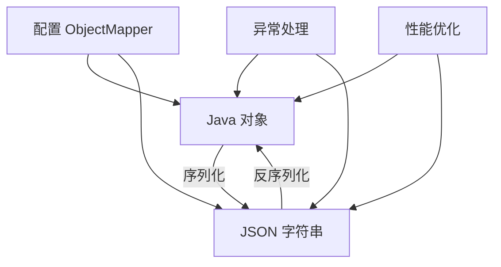

# Java JSON 最佳实践

JSON (JavaScript Object Notation) 已经成为现代应用程序中数据交换的标准格式。在 Java 开发中，正确高效地处理 JSON 数据对于开发健壮的应用程序至关重要。本文将介绍 Java 处理 JSON 的最佳实践，帮助你避免常见陷阱并提高代码质量。

## JSON 库的选择

在 Java 中，有多种处理 JSON 的库可供选择：

1. **Jackson** - 功能全面，性能优秀，是目前最流行的选择
2. **Gson** - 由 Google 开发，API 简洁易用
3. **JSON-B (javax.json.bind)** - Java EE 的标准 JSON 绑定 API
4. **org.json** - 轻量级但功能有限的库

:::tip
对于大多数项目，**Jackson** 是推荐选择，因为它结合了高性能、丰富功能和良好的社区支持。
:::

## 添加 Jackson 依赖

在 Maven 项目中添加 Jackson 依赖：

```xml
<dependency>
    <groupId>com.fasterxml.jackson.core</groupId>
    <artifactId>jackson-databind</artifactId>
    <version>2.15.2</version>
</dependency>
```

在 Gradle 项目中：

```groovy
implementation 'com.fasterxml.jackson.core:jackson-databind:2.15.2'
```

## 基本序列化与反序列化最佳实践

### 1. 使用对象映射器的单例实例

`ObjectMapper` 是线程安全的，创建它的实例开销较大，因此应该重用：

```java
// 好的做法
public class JsonUtils {
    private static final ObjectMapper OBJECT_MAPPER = new ObjectMapper();
    
    public static String toJson(Object obj) throws JsonProcessingException {
        return OBJECT_MAPPER.writeValueAsString(obj);
    }
    
    public static <T> T fromJson(String json, Class<T> clazz) throws JsonProcessingException {
        return OBJECT_MAPPER.readValue(json, clazz);
    }
}
```

### 2. 正确处理异常

不要吞掉异常，而应该适当处理它们：

```java
try {
    User user = objectMapper.readValue(jsonString, User.class);
    // 处理用户对象
} catch (JsonParseException e) {
    log.error("JSON 格式错误: {}", e.getMessage());
} catch (JsonMappingException e) {
    log.error("JSON 映射到对象失败: {}", e.getMessage());
} catch (IOException e) {
    log.error("读取 JSON 时 IO 异常: {}", e.getMessage());
}
```

### 3. 使用正确的类型引用处理泛型

当处理泛型类型时，使用 `TypeReference`：

```java
String json = "[{\"name\":\"张三\",\"age\":25}, {\"name\":\"李四\",\"age\":30}]";

List<User> users = objectMapper.readValue(json, new TypeReference<List<User>>() {});
```

## 高级配置最佳实践

### 1. 配置 ObjectMapper

根据项目需求正确配置 ObjectMapper：

```java
ObjectMapper objectMapper = new ObjectMapper()
    // 序列化时包含空字段
    .setSerializationInclusion(JsonInclude.Include.NON_NULL)
    // 未知属性不抛出异常
    .configure(DeserializationFeature.FAIL_ON_UNKNOWN_PROPERTIES, false)
    // 允许单引号
    .configure(JsonParser.Feature.ALLOW_SINGLE_QUOTES, true)
    // 允许没有引号的字段名
    .configure(JsonParser.Feature.ALLOW_UNQUOTED_FIELD_NAMES, true)
    // 日期格式化
    .setDateFormat(new SimpleDateFormat("yyyy-MM-dd HH:mm:ss"));
```

### 2. 使用注解自定义 JSON 行为

```java
public class User {
    private String id;
    
    @JsonProperty("full_name")  // 指定 JSON 属性名称
    private String name;
    
    @JsonFormat(pattern = "yyyy-MM-dd")  // 格式化日期
    private Date birthDate;
    
    @JsonIgnore  // 在序列化时忽略此字段
    private String password;
    
    // getters and setters
}
```

### 3. 处理复杂对象层次结构

使用 `@JsonTypeInfo` 和 `@JsonSubTypes` 处理多态：

```java
@JsonTypeInfo(
    use = JsonTypeInfo.Id.NAME,
    include = JsonTypeInfo.As.PROPERTY,
    property = "type")
@JsonSubTypes({
    @JsonSubTypes.Type(value = Dog.class, name = "dog"),
    @JsonSubTypes.Type(value = Cat.class, name = "cat")
})
public abstract class Animal {
    private String name;
    // getters and setters
}

public class Dog extends Animal {
    private String breed;
    // getters and setters
}

public class Cat extends Animal {
    private boolean isIndoor;
    // getters and setters
}
```

## 性能优化最佳实践

### 1. 使用流处理大型 JSON

处理大型 JSON 文件时，使用流式处理而不是一次性加载到内存：

```java
try (JsonParser parser = objectMapper.getFactory().createParser(new File("large.json"))) {
    // 寻找根数组
    if (parser.nextToken() != JsonToken.START_ARRAY) {
        throw new IllegalStateException("Expected an array");
    }
    
    // 读取数组元素
    while (parser.nextToken() == JsonToken.START_OBJECT) {
        User user = objectMapper.readValue(parser, User.class);
        // 处理单个用户
    }
}
```

### 2. 针对重复结构使用 JSON 模式

如果处理大量类似结构的 JSON，可以使用 `JsonNode` 直接访问：

```java
JsonNode rootNode = objectMapper.readTree(jsonString);
String name = rootNode.get("name").asText();
int age = rootNode.get("age").asInt();
```

### 3. 使用自定义序列化/反序列化器提高性能

```java
public class CustomDateSerializer extends JsonSerializer<Date> {
    private static final SimpleDateFormat formatter = new SimpleDateFormat("yyyy-MM-dd");
    
    @Override
    public void serialize(Date date, JsonGenerator gen, SerializerProvider provider) throws IOException {
        gen.writeString(formatter.format(date));
    }
}

// 使用方式
@JsonSerialize(using = CustomDateSerializer.class)
private Date createDate;
```

## 实际案例：构建 RESTful API

下面展示一个综合案例，演示如何在 Spring Boot RESTful API 中处理 JSON：

```java
@RestController
@RequestMapping("/api/users")
public class UserController {
    
    private final UserService userService;
    private final ObjectMapper objectMapper;
    
    public UserController(UserService userService, ObjectMapper objectMapper) {
        this.userService = userService;
        this.objectMapper = objectMapper;
    }
    
    @GetMapping("/{id}")
    public ResponseEntity<User> getUser(@PathVariable Long id) {
        return userService.findById(id)
            .map(ResponseEntity::ok)
            .orElse(ResponseEntity.notFound().build());
    }
    
    @PostMapping
    public ResponseEntity<User> createUser(@RequestBody User user) {
        User savedUser = userService.save(user);
        return ResponseEntity.status(HttpStatus.CREATED).body(savedUser);
    }
    
    @GetMapping("/search")
    public ResponseEntity<List<User>> searchUsers(@RequestParam String criteria) throws IOException {
        // 解析复杂的搜索条件
        SearchCriteria searchCriteria = objectMapper.readValue(criteria, SearchCriteria.class);
        List<User> users = userService.search(searchCriteria);
        return ResponseEntity.ok(users);
    }
}
```

上面的例子展示了如何在 Spring Boot 应用程序中接收和返回 JSON 数据。Spring Boot 自动使用 Jackson 处理 HTTP 请求和响应中的 JSON 数据转换。

## 常见陷阱和解决方案

### 1. 循环引用问题

当对象之间存在循环引用时，序列化会导致无限递归：

```java
public class Department {
    private String name;
    private List<Employee> employees;
}

public class Employee {
    private String name;
    private Department department;
}
```

解决方案：

```java
public class Department {
    private String name;
    private List<Employee> employees;
}

public class Employee {
    private String name;
    
    @JsonBackReference  // 避免循环引用
    private Department department;
}
```

### 2. 处理空值和默认值

```java
// 全局设置
objectMapper.setSerializationInclusion(JsonInclude.Include.NON_NULL);

// 类级别设置
@JsonInclude(JsonInclude.Include.NON_NULL)
public class User {
    // ...
}
```

### 3. 日期和时间处理

```java
// 使用 Java 8 日期时间 API
objectMapper.registerModule(new JavaTimeModule());
objectMapper.configure(SerializationFeature.WRITE_DATES_AS_TIMESTAMPS, false);

// 使用注解格式化
@JsonFormat(shape = JsonFormat.Shape.STRING, pattern = "yyyy-MM-dd'T'HH:mm:ss.SSSZ")
private ZonedDateTime timestamp;
```

### 4. 处理未知字段

默认情况下，如果 JSON 包含 Java 类中不存在的字段，Jackson 会抛出异常。解决方案：

```java
objectMapper.configure(DeserializationFeature.FAIL_ON_UNKNOWN_PROPERTIES, false);
```

## JSON 处理流程图

以下是 JSON 处理的一般流程：



## 总结

在 Java 中处理 JSON 的最佳实践可以归纳为：

1. 选择合适的 JSON 库（通常是 Jackson）
2. 正确配置 ObjectMapper
3. 妥善处理异常
4. 使用注解自定义 JSON 行为
5. 考虑性能优化
6. 注意处理常见陷阱

遵循这些最佳实践，你将能够在 Java 应用程序中高效、安全地处理 JSON 数据。

## 练习

1. 创建一个 `UserService` 类，它能够将用户对象序列化为 JSON，并从 JSON 反序列化为用户对象。
2. 实现一个自定义序列化器，将电话号码格式化为 "(XXX) XXX-XXXX" 格式。
3. 编写一个程序，从包含 1000 个用户记录的大型 JSON 文件中，使用流式处理提取所有年龄大于 30 的用户。

## 附加资源

- [Jackson 官方文档](https://github.com/FasterXML/jackson)
- [JSON Schema 规范](https://json-schema.org/)
- [Java JSON 处理最佳实践](https://www.baeldung.com/jackson-advanced-annotations)
- [高性能 JSON 处理技巧](https://www.baeldung.com/jackson-streaming-api)

:::note
在企业级应用中，JSON 处理通常与 API 开发、微服务通信和数据持久化紧密相关。深入理解 JSON 处理的最佳实践，将有助于构建更可靠、高效的应用程序。
:::