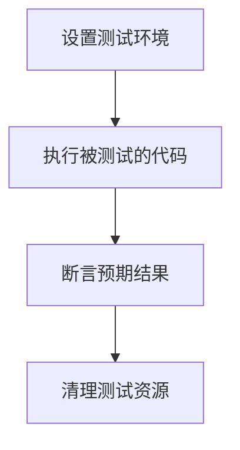

# Java 单元测试概述

## 什么是单元测试

单元测试是软件开发过程中的一种测试方法，它专注于验证代码的最小可测试单元（通常是类或方法）是否按照预期工作。在Java开发中，单元测试已成为确保代码质量的基本实践，它帮助开发者在早期发现并修复问题，降低软件开发的风险和成本。

:::tip 单元测试的定义
单元测试是针对程序模块（软件设计的最小单位）来进行正确性检验的测试工作。程序单元是应用的最小可测试部件。在Java中，一个单元通常是一个方法或一个类。
:::

## 单元测试的重要性

为什么我们需要编写单元测试呢？以下是几个关键原因：

1. **早期发现bug** - 在开发过程中尽早发现并修复问题，而不是在产品发布后才被用户发现
2. **简化调试过程** - 当测试失败时，你确切知道哪部分代码出现了问题
3. **促进良好设计** - 可测试的代码往往具有更好的设计和更低的耦合度
4. **充当文档** - 测试用例可以作为代码如何使用的实例
5. **支持重构** - 在修改代码时，测试可以验证功能是否依然正常
6. **提高开发信心** - 让你和你的团队对代码变更更有信心

## Java 单元测试框架

### JUnit

JUnit是Java生态系统中最流行的单元测试框架，目前最新版本是JUnit 5。

```java
import org.junit.jupiter.api.Test;
import static org.junit.jupiter.api.Assertions.assertEquals;

public class CalculatorTest {
    
    @Test
    public void testAdd() {
        Calculator calculator = new Calculator();
        int result = calculator.add(3, 5);
        assertEquals(8, result, "3 + 5 should equal 8");
    }
}
```

### TestNG

TestNG是另一个功能强大的测试框架，提供了JUnit没有的一些高级特性：

```java
import org.testng.annotations.Test;
import static org.testng.Assert.assertEquals;

public class CalculatorTest {
    
    @Test
    public void testAdd() {
        Calculator calculator = new Calculator();
        int result = calculator.add(3, 5);
        assertEquals(result, 8, "3 + 5 should equal 8");
    }
}
```

### Mockito

Mockito是一个流行的Java模拟框架，用于创建和配置模拟对象：

```java
import static org.mockito.Mockito.*;
import static org.junit.jupiter.api.Assertions.assertEquals;
import org.junit.jupiter.api.Test;

public class UserServiceTest {
    
    @Test
    public void testGetUserName() {
        // 创建模拟对象
        UserRepository mockRepository = mock(UserRepository.class);
        // 配置模拟行为
        when(mockRepository.findById(1L)).thenReturn(new User(1L, "John"));
        
        UserService userService = new UserService(mockRepository);
        String userName = userService.getUserNameById(1L);
        
        assertEquals("John", userName);
        // 验证模拟对象的方法是否被调用
        verify(mockRepository).findById(1L);
    }
}
```

## 单元测试的基本组成部分

一个完善的单元测试通常包括以下几个部分：



### 1. 设置阶段 (Setup)

在这个阶段，你需要准备测试所需的对象和资源：

```java
@BeforeEach
public void setup() {
    calculator = new Calculator();
    // 其他初始化工作
}
```

### 2. 执行阶段 (Exercise)

调用被测试的方法：

```java
int result = calculator.add(3, 5);
```

### 3. 断言阶段 (Verify)

验证结果是否符合预期：

```java
assertEquals(8, result, "3 + 5 should equal 8");
```

### 4. 清理阶段 (Teardown)

释放测试过程中使用的资源：

```java
@AfterEach
public void tearDown() {
    // 清理资源
}
```

## 测试的FIRST原则

编写高质量单元测试应遵循FIRST原则：

- **F**ast: 测试应该快速执行
- **I**ndependent: 测试之间应该相互独立，不依赖于其他测试
- **R**epeatable: 测试应该在任何环境中都能得到相同结果
- **S**elf-validating: 测试应该能够自动判断通过或失败
- **T**imely: 测试应该及时编写，最好在编写产品代码之前或同时编写

## 实际案例：银行账户系统

让我们通过一个银行账户系统的例子来展示单元测试的应用：

首先，我们有一个简单的`BankAccount`类：

```java
public class BankAccount {
    private double balance;
    private String accountNumber;
    
    public BankAccount(String accountNumber, double initialBalance) {
        this.accountNumber = accountNumber;
        this.balance = initialBalance;
    }
    
    public void deposit(double amount) {
        if (amount <= 0) {
            throw new IllegalArgumentException("Deposit amount must be positive");
        }
        balance += amount;
    }
    
    public void withdraw(double amount) {
        if (amount <= 0) {
            throw new IllegalArgumentException("Withdrawal amount must be positive");
        }
        if (amount > balance) {
            throw new InsufficientFundsException("Insufficient funds");
        }
        balance -= amount;
    }
    
    public double getBalance() {
        return balance;
    }
    
    public String getAccountNumber() {
        return accountNumber;
    }
}

class InsufficientFundsException extends RuntimeException {
    public InsufficientFundsException(String message) {
        super(message);
    }
}
```

然后，我们为这个类编写单元测试：

```java
import org.junit.jupiter.api.BeforeEach;
import org.junit.jupiter.api.Test;
import static org.junit.jupiter.api.Assertions.*;

public class BankAccountTest {
    
    private BankAccount account;
    
    @BeforeEach
    public void setup() {
        // 每个测试方法执行前运行
        account = new BankAccount("123456", 1000.0);
    }
    
    @Test
    public void testDeposit() {
        account.deposit(500.0);
        assertEquals(1500.0, account.getBalance(), "Balance should be updated after deposit");
    }
    
    @Test
    public void testDepositNegativeAmount() {
        // 测试异常情况
        assertThrows(IllegalArgumentException.class, () -> {
            account.deposit(-100.0);
        }, "Should throw exception when deposit amount is negative");
    }
    
    @Test
    public void testWithdraw() {
        account.withdraw(300.0);
        assertEquals(700.0, account.getBalance(), "Balance should be updated after withdrawal");
    }
    
    @Test
    public void testWithdrawInsufficientFunds() {
        assertThrows(InsufficientFundsException.class, () -> {
            account.withdraw(2000.0);
        }, "Should throw exception when withdrawal amount exceeds balance");
    }
    
    @Test
    public void testGetAccountNumber() {
        assertEquals("123456", account.getAccountNumber(), "Account number should match");
    }
}
```

这个例子展示了如何测试正常功能和边缘情况（如负数存款和余额不足）。

## 测试覆盖率

测试覆盖率是衡量代码被测试程度的指标，常见的覆盖率指标包括：

1. **行覆盖率**：执行的代码行数占总代码行数的百分比
2. **分支覆盖率**：执行的代码分支数占总分支数的百分比
3. **方法覆盖率**：被测试的方法数占总方法数的百分比
4. **类覆盖率**：被测试的类数占总类数的百分比

在Java中，我们可以使用工具如JaCoCo、Cobertura等来生成覆盖率报告。

:::caution 注意
高测试覆盖率不等于高质量测试。100%的覆盖率并不意味着没有bug，它只表示每行代码都执行过，但不代表所有逻辑组合都测试到了。
:::

## 单元测试的最佳实践

1. **测试应该独立且可重复**：每个测试都应该是独立的，不依赖于其他测试或外部状态
2. **一个测试只测一件事**：每个测试方法应该只验证一个概念
3. **使用有意义的测试名称**：测试名称应该描述被测试的行为
4. **测试边界条件**：确保测试覆盖最小值、最大值、空值等边界情况
5. **避免逻辑在测试中**：测试代码应该简单直接，避免复杂的条件判断
6. **保持测试快速执行**：单元测试应该快速运行，以便于频繁执行
7. **定期运行测试**：将测试集成到持续集成流程中

## 总结

Java单元测试是确保代码质量的基础实践。通过编写针对性的测试用例，开发者可以验证代码的正确性，及早发现并修复问题，提高代码可维护性。掌握JUnit、Mockito等测试框架的使用，遵循单元测试的最佳实践，将帮助你成为更优秀的Java开发者。

记住，编写单元测试并不只是为了提高测试覆盖率，而是为了构建更可靠、更健壮的软件。测试驱动开发(TDD)是一种值得尝试的方法，它鼓励先写测试再写实现代码，这有助于更好地思考设计和需求。

## 练习

1. 创建一个简单的`StringUtils`类，实现字符串反转和判断回文的方法，然后为这些方法编写单元测试。
2. 为计算器应用编写更多测试，包括处理溢出、除零等边缘情况。
3. 尝试使用Mockito模拟一个依赖外部API的服务类，编写相应的单元测试。

## 进一步学习资源

- JUnit 5官方文档: [https://junit.org/junit5/docs/current/user-guide/](https://junit.org/junit5/docs/current/user-guide/)
- TestNG官方文档: [https://testng.org/doc/](https://testng.org/doc/)
- Mockito官方文档: [https://site.mockito.org/](https://site.mockito.org/)
- 《Effective Unit Testing》 by Lasse Koskela
- 《Test-Driven Development: By Example》 by Kent Beck