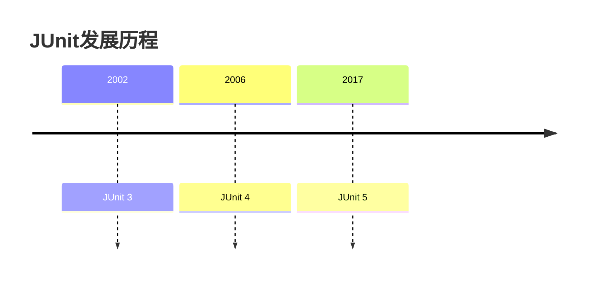
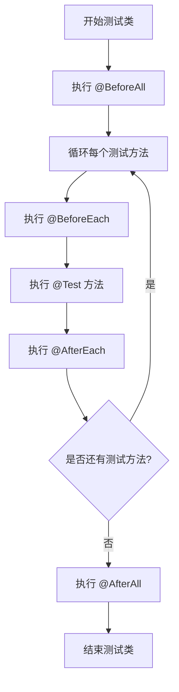

# Java JUnit框架

## 什么是JUnit？

JUnit是Java编程语言的单元测试框架，它在测试驱动开发（TDD）中扮演着关键角色。作为一个开源框架，JUnit帮助开发者编写和运行可重复的自动化测试，确保代码的正确性和稳定性。

:::note
单元测试是软件测试中的第一层，主要关注于验证代码中最小可测试部分（通常是方法/函数）是否按照预期工作。
:::

## JUnit的核心优势

- **简单易用**：提供简洁的API，降低测试代码的编写难度
- **自动化**：测试可以自动运行，无需人工干预
- **可视化结果**：清晰展示测试通过或失败情况
- **测试隔离**：每个测试方法独立运行，避免相互干扰
- **IDE集成**：与Eclipse、IntelliJ IDEA等主流IDE深度集成

## JUnit版本

目前主流的JUnit版本有JUnit 4和JUnit 5，本教程将主要介绍JUnit 5，同时适当提及JUnit 4的区别。



## 环境准备

在开始使用JUnit之前，我们需要先配置好环境。如果你使用Maven，可以在`pom.xml`文件中添加以下依赖：

```xml
<dependencies>
    <dependency>
        <groupId>org.junit.jupiter</groupId>
        <artifactId>junit-jupiter-api</artifactId>
        <version>5.9.2</version>
        <scope>test</scope>
    </dependency>
    <dependency>
        <groupId>org.junit.jupiter</groupId>
        <artifactId>junit-jupiter-engine</artifactId>
        <version>5.9.2</version>
        <scope>test</scope>
    </dependency>
</dependencies>
```

如果使用Gradle，可以添加：

```groovy
testImplementation 'org.junit.jupiter:junit-jupiter-api:5.9.2'
testRuntimeOnly 'org.junit.jupiter:junit-jupiter-engine:5.9.2'
```

## 编写第一个测试

让我们从一个简单的例子开始，假设我们有一个计算器类：

```java
public class Calculator {
    public int add(int a, int b) {
        return a + b;
    }
    
    public int subtract(int a, int b) {
        return a - b;
    }
    
    public int multiply(int a, int b) {
        return a * b;
    }
    
    public double divide(int a, int b) {
        if (b == 0) {
            throw new IllegalArgumentException("除数不能为零");
        }
        return (double) a / b;
    }
}
```

现在，我们要为这个计算器类编写单元测试：

```java
import org.junit.jupiter.api.Test;
import static org.junit.jupiter.api.Assertions.*;

public class CalculatorTest {
    
    private final Calculator calculator = new Calculator();
    
    @Test
    void testAddition() {
        assertEquals(5, calculator.add(2, 3), "2 + 3 应该等于 5");
    }
    
    @Test
    void testSubtraction() {
        assertEquals(2, calculator.subtract(5, 3), "5 - 3 应该等于 2");
    }
    
    @Test
    void testMultiplication() {
        assertEquals(15, calculator.multiply(3, 5), "3 * 5 应该等于 15");
    }
    
    @Test
    void testDivision() {
        assertEquals(2.0, calculator.divide(10, 5), "10 / 5 应该等于 2.0");
    }
    
    @Test
    void testDivisionByZero() {
        assertThrows(IllegalArgumentException.class, () -> {
            calculator.divide(10, 0);
        }, "除以零应该抛出IllegalArgumentException异常");
    }
}
```

## JUnit 5 核心注解

JUnit 5提供了多种注解来标记测试方法和控制测试执行流程：

| 注解 | 描述 |
| --- | --- |
| `@Test` | 标记一个方法为测试方法 |
| `@BeforeEach` | 在每个测试方法执行前执行 |
| `@AfterEach` | 在每个测试方法执行后执行 |
| `@BeforeAll` | 在所有测试方法执行前执行一次（必须是静态方法） |
| `@AfterAll` | 在所有测试方法执行后执行一次（必须是静态方法） |
| `@Disabled` | 禁用测试方法或类 |
| `@DisplayName` | 为测试类或测试方法设置自定义显示名称 |

让我们看一个使用这些注解的完整示例：

```java
import org.junit.jupiter.api.*;
import static org.junit.jupiter.api.Assertions.*;

@DisplayName("计算器测试类")
public class CompleteCalculatorTest {
    
    private Calculator calculator;
    
    @BeforeAll
    static void initAll() {
        System.out.println("开始执行所有测试");
    }
    
    @BeforeEach
    void init() {
        calculator = new Calculator();
        System.out.println("初始化单个测试");
    }
    
    @Test
    @DisplayName("测试加法运算")
    void testAddition() {
        assertEquals(5, calculator.add(2, 3), "2 + 3 应该等于 5");
    }
    
    @Test
    @DisplayName("测试除以零的异常")
    void testDivisionByZero() {
        Exception exception = assertThrows(IllegalArgumentException.class, () -> {
            calculator.divide(10, 0);
        });
        
        String expectedMessage = "除数不能为零";
        String actualMessage = exception.getMessage();
        assertTrue(actualMessage.contains(expectedMessage));
    }
    
    @Test
    @Disabled("暂时跳过此测试")
    void skippedTest() {
        // 此测试不会运行
    }
    
    @AfterEach
    void tearDown() {
        System.out.println("单个测试执行完毕");
    }
    
    @AfterAll
    static void tearDownAll() {
        System.out.println("所有测试执行完毕");
    }
}
```

## 断言（Assertions）

断言是测试中验证预期结果的关键组件。JUnit 5提供了丰富的断言方法：

### 基本断言

```java
// 验证预期值和实际值相等
assertEquals(expected, actual);

// 验证条件为真
assertTrue(condition);

// 验证条件为假
assertFalse(condition);

// 验证对象为null
assertNull(object);

// 验证对象不为null
assertNotNull(object);

// 验证两个引用指向同一对象
assertSame(expected, actual);

// 验证两个引用不指向同一对象
assertNotSame(expected, actual);
```

### 高级断言

```java
// 验证抛出指定异常
assertThrows(ExpectedException.class, () -> {
    // 可能抛出异常的代码
});

// 验证代码在指定时间内执行完毕
assertTimeout(Duration.ofMillis(100), () -> {
    // 需要在100毫秒内完成的代码
});

// 组合多个断言，全部成功才算通过
assertAll(
    () -> assertEquals(2, 1 + 1),
    () -> assertTrue(4 > 2)
);
```

## 参数化测试

参数化测试允许使用不同参数多次运行同一测试方法。要使用参数化测试，需要添加额外的依赖：

```xml
<dependency>
    <groupId>org.junit.jupiter</groupId>
    <artifactId>junit-jupiter-params</artifactId>
    <version>5.9.2</version>
    <scope>test</scope>
</dependency>
```

参数化测试示例：

```java
import org.junit.jupiter.params.ParameterizedTest;
import org.junit.jupiter.params.provider.CsvSource;
import org.junit.jupiter.params.provider.ValueSource;
import static org.junit.jupiter.api.Assertions.*;

public class ParameterizedCalculatorTest {
    
    private final Calculator calculator = new Calculator();
    
    @ParameterizedTest
    @ValueSource(ints = {1, 2, 3, 4, 5})
    void testAddWithZero(int number) {
        assertEquals(number, calculator.add(number, 0), 
                "任何数加零应该等于其本身");
    }
    
    @ParameterizedTest
    @CsvSource({
        "1, 1, 2",
        "5, 3, 8",
        "10, -5, 5",
        "-10, -5, -15"
    })
    void testAdd(int first, int second, int expectedResult) {
        assertEquals(expectedResult, calculator.add(first, second),
                first + " + " + second + " 应该等于 " + expectedResult);
    }
}
```

## 测试生命周期

理解测试的生命周期对于编写有效的测试至关重要：



## 实际案例：银行账户测试

下面是一个更现实的例子，我们将测试一个银行账户类：

**BankAccount.java**:
```java
public class BankAccount {
    private String owner;
    private double balance;
    
    public BankAccount(String owner, double initialBalance) {
        this.owner = owner;
        if (initialBalance < 0) {
            throw new IllegalArgumentException("初始余额不能为负数");
        }
        this.balance = initialBalance;
    }
    
    public double getBalance() {
        return balance;
    }
    
    public String getOwner() {
        return owner;
    }
    
    public void deposit(double amount) {
        if (amount <= 0) {
            throw new IllegalArgumentException("存款金额必须为正数");
        }
        balance += amount;
    }
    
    public void withdraw(double amount) {
        if (amount <= 0) {
            throw new IllegalArgumentException("取款金额必须为正数");
        }
        if (amount > balance) {
            throw new IllegalStateException("余额不足");
        }
        balance -= amount;
    }
    
    public void transfer(BankAccount destination, double amount) {
        this.withdraw(amount);
        destination.deposit(amount);
    }
}
```

**BankAccountTest.java**:
```java
import org.junit.jupiter.api.*;
import static org.junit.jupiter.api.Assertions.*;
import org.junit.jupiter.api.extension.ExtendWith;

@DisplayName("银行账户测试")
public class BankAccountTest {
    
    private BankAccount account;
    
    @BeforeEach
    void setUp() {
        account = new BankAccount("张三", 1000.0);
    }
    
    @Test
    @DisplayName("测试初始账户状态")
    void testInitialAccountState() {
        assertEquals("张三", account.getOwner());
        assertEquals(1000.0, account.getBalance());
    }
    
    @Test
    @DisplayName("测试存款功能")
    void testDeposit() {
        account.deposit(500.0);
        assertEquals(1500.0, account.getBalance());
    }
    
    @Test
    @DisplayName("测试存款负数金额")
    void testDepositNegativeAmount() {
        assertThrows(IllegalArgumentException.class, () -> {
            account.deposit(-500.0);
        });
    }
    
    @Test
    @DisplayName("测试取款功能")
    void testWithdraw() {
        account.withdraw(500.0);
        assertEquals(500.0, account.getBalance());
    }
    
    @Test
    @DisplayName("测试取款超过余额")
    void testWithdrawExceedingBalance() {
        assertThrows(IllegalStateException.class, () -> {
            account.withdraw(1500.0);
        });
    }
    
    @Test
    @DisplayName("测试账户转账")
    void testTransfer() {
        BankAccount destinationAccount = new BankAccount("李四", 500.0);
        account.transfer(destinationAccount, 300.0);
        
        assertEquals(700.0, account.getBalance());
        assertEquals(800.0, destinationAccount.getBalance());
    }
    
    @Nested
    @DisplayName("创建新账户时")
    class NewAccountTests {
        
        @Test
        @DisplayName("初始余额为负数时抛出异常")
        void testNegativeInitialBalance() {
            assertThrows(IllegalArgumentException.class, () -> {
                new BankAccount("无效账户", -100.0);
            });
        }
    }
}
```

## 测试套件

测试套件允许我们将多个测试类组合在一起运行：

```java
import org.junit.platform.suite.api.SelectClasses;
import org.junit.platform.suite.api.Suite;

@Suite
@SelectClasses({CalculatorTest.class, BankAccountTest.class})
public class AllTests {
    // 这个类本身不包含任何代码
    // 仅用于组合多个测试类
}
```

## 测试运行与报告

在IDE中，你可以直接右键点击测试类或测试方法来运行测试。使用Maven运行测试的命令是：

```bash
mvn test
```

测试完成后，可以查看测试报告。如果使用Maven，可以添加Surefire插件生成HTML报告：

```xml
<build>
    <plugins>
        <plugin>
            <groupId>org.apache.maven.plugins</groupId>
            <artifactId>maven-surefire-plugin</artifactId>
            <version>3.0.0</version>
        </plugin>
    </plugins>
</build>
```

## JUnit 5与JUnit 4的主要区别

如果你之前使用过JUnit 4，这里是一些主要区别：

1. **包结构**：JUnit 5使用`org.junit.jupiter`包，而JUnit 4使用`org.junit`
2. **注解变化**：
   - JUnit 4: `@Before`, `@After`, `@BeforeClass`, `@AfterClass`
   - JUnit 5: `@BeforeEach`, `@AfterEach`, `@BeforeAll`, `@AfterAll`
3. **异常测试**：
   - JUnit 4: `@Test(expected = Exception.class)`
   - JUnit 5: `assertThrows(Exception.class, () -> {...})`
4. **超时测试**：
   - JUnit 4: `@Test(timeout = 100)`
   - JUnit 5: `assertTimeout(Duration.ofMillis(100), () -> {...})`
5. **架构扩展**：JUnit 5提供了更强大的扩展机制

## 单元测试最佳实践

1. **测试命名应清晰明确**：例如`testWithdrawWithSufficientFunds()`
2. **一个测试方法只测试一个功能**：保持测试的原子性
3. **准备、执行、验证模式**：
   - 准备测试数据
   - 执行被测试功能
   - 验证结果
4. **使用断言消息**：当测试失败时，提供清晰的错误信息
5. **保持测试独立**：测试不应依赖于其他测试的执行顺序
6. **测试边界条件**：考虑极端情况和边界值
7. **使用mock对象**：隔离依赖项
8. **测试覆盖率**：尽可能提高测试覆盖率，但注重质量而非数量

:::tip
良好的单元测试不仅能保证代码质量，还能作为代码的文档，帮助其他开发者理解代码应该如何工作。
:::

## 总结

通过本教程，我们学习了：

- JUnit的基本概念和优势
- 如何配置JUnit环境
- 编写基本测试和使用断言
- JUnit核心注解和生命周期
- 参数化测试
- 实际项目中的应用案例
- 测试套件和报告
- JUnit最佳实践

单元测试是开发高质量软件的关键实践，掌握JUnit将帮助你编写可靠、可维护的代码。随着你的技能不断提升，你可以探索更高级的测试技术，如模拟(mocking)、集成测试和行为驱动测试。

## 练习

1. 编写一个`StringUtils`类，包含以下方法：
   - `String reverse(String input)`：反转字符串
   - `boolean isPalindrome(String input)`：判断是否是回文
   - `int countOccurrences(String text, char character)`：统计字符在文本中出现的次数

2. 为上述`StringUtils`类编写全面的单元测试，包括边界条件和异常情况。

## 进一步学习资源

- [JUnit 5官方文档](https://junit.org/junit5/docs/current/user-guide/)
- [测试驱动开发（TDD）](https://martinfowler.com/bliki/TestDrivenDevelopment.html)
- [Mockito框架](https://site.mockito.org/)：用于创建模拟对象
- [AssertJ](https://assertj.github.io/doc/)：提供更流畅的断言语法

随着你的学习深入，可以尝试将JUnit与其他测试工具如Mockito结合使用，探索更复杂的测试场景。