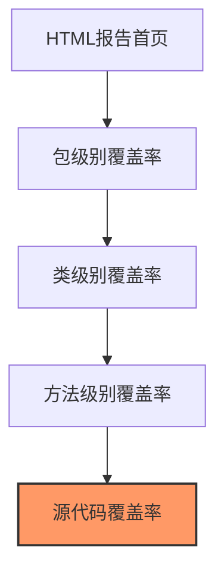
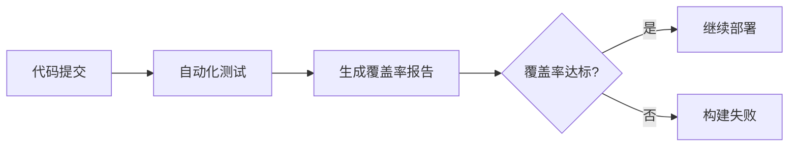

# Java 测试覆盖率

## 什么是测试覆盖率？

测试覆盖率是衡量软件测试完整性的一个重要指标，它表示代码被测试执行的比例。简单来说，测试覆盖率回答了这个问题："我们的测试用例执行了多少代码？"

高测试覆盖率意味着更多的代码被测试过，这通常能减少bug的数量，提高代码质量。然而，100%的测试覆盖率并不意味着代码完全没有缺陷，它只能确保每行代码至少被执行了一次。

:::note 小知识
覆盖率高不一定意味着测试质量高，但覆盖率低通常意味着测试质量不足！
:::

## 测试覆盖率的类型

在Java测试中，常见的测试覆盖率类型包括：

1. **行覆盖率（Line Coverage）**：测试执行的代码行数占总代码行数的百分比。
2. **分支覆盖率（Branch Coverage）**：测试执行的分支数（如if、case语句）占总分支数的百分比。
3. **方法覆盖率（Method Coverage）**：被测试调用的方法数量占总方法数的百分比。
4. **类覆盖率（Class Coverage）**：被测试覆盖的类占总类数的百分比。

## Java 测试覆盖率工具

### JaCoCo

JaCoCo（Java Code Coverage）是Java生态系统中最流行的代码覆盖率工具之一。它能够收集行、分支、方法和类级别的覆盖率信息。

#### 如何添加JaCoCo到Maven项目

在`pom.xml`文件中添加以下配置：

```xml
<build>
    <plugins>
        <plugin>
            <groupId>org.jacoco</groupId>
            <artifactId>jacoco-maven-plugin</artifactId>
            <version>0.8.8</version>
            <executions>
                <execution>
                    <goals>
                        <goal>prepare-agent</goal>
                    </goals>
                </execution>
                <execution>
                    <id>report</id>
                    <phase>test</phase>
                    <goals>
                        <goal>report</goal>
                    </goals>
                </execution>
            </executions>
        </plugin>
    </plugins>
</build>
```

#### 如何添加JaCoCo到Gradle项目

在`build.gradle`文件中添加以下配置：

```groovy
plugins {
    id 'jacoco'
}

test {
    finalizedBy jacocoTestReport
}

jacocoTestReport {
    dependsOn test
    reports {
        xml.required = true
        html.required = true
    }
}
```

### 运行覆盖率测试

在配置好JaCoCo后，只需要运行普通的测试命令即可：

对于Maven项目：
```bash
mvn clean test
```

对于Gradle项目：
```bash
./gradlew test
```

测试完成后，JaCoCo会生成覆盖率报告，通常位于`target/site/jacoco`（Maven）或`build/reports/jacoco`（Gradle）目录下。

## 实际案例：计算器类的测试覆盖率

假设我们有一个简单的计算器类：

```java
public class Calculator {
    
    public int add(int a, int b) {
        return a + b;
    }
    
    public int subtract(int a, int b) {
        return a - b;
    }
    
    public int multiply(int a, int b) {
        return a * b;
    }
    
    public int divide(int a, int b) {
        if (b == 0) {
            throw new ArithmeticException("Cannot divide by zero");
        }
        return a / b;
    }
}
```

编写测试类如下：

```java
import org.junit.jupiter.api.Test;
import static org.junit.jupiter.api.Assertions.*;

public class CalculatorTest {
    
    private final Calculator calculator = new Calculator();
    
    @Test
    public void testAdd() {
        assertEquals(5, calculator.add(2, 3));
    }
    
    @Test
    public void testSubtract() {
        assertEquals(1, calculator.subtract(3, 2));
    }
    
    @Test
    public void testMultiply() {
        assertEquals(6, calculator.multiply(2, 3));
    }
    
    @Test
    public void testDivide() {
        assertEquals(2, calculator.divide(6, 3));
    }
    
    @Test
    public void testDivideByZero() {
        assertThrows(ArithmeticException.class, () -> calculator.divide(5, 0));
    }
}
```

运行测试后，JaCoCo会生成类似下面的报告：

```
Coverage Summary:
- Line Coverage: 100% (10/10 lines covered)
- Branch Coverage: 100% (2/2 branches covered)
- Method Coverage: 100% (4/4 methods covered)
- Class Coverage: 100% (1/1 classes covered)
```

这个报告显示我们的测试达到了100%的覆盖率，这是理想的情况。

## 如何提高测试覆盖率

1. **边界条件测试**：测试边界值和特殊情况。
2. **异常路径测试**：不仅测试正常流程，还要测试异常情况。
3. **代码复审**：通过代码复审发现尚未测试的路径。
4. **使用参数化测试**：使用不同的输入值多次运行相同的测试。
5. **设置覆盖率目标**：设定一个合理的覆盖率目标（如80%）并努力达到它。

## 覆盖率的可视化

JaCoCo生成的HTML报告提供了直观的覆盖率视图：



在源代码覆盖率视图中，不同颜色表示不同的覆盖状态：
- 绿色：完全覆盖
- 黄色：部分覆盖（如分支语句只有一部分被执行）
- 红色：未覆盖

:::caution 注意
不要为了提高覆盖率而编写无意义的测试。测试的目标是验证功能正确性，而不仅仅是提高覆盖率数字。
:::

## 什么是一个好的覆盖率目标？

对于大多数项目来说，70%-80%的行覆盖率通常被认为是一个合理的目标。关键是要确保核心业务逻辑有较高的覆盖率，而不太关键的代码（如getter/setter）可以有较低的覆盖率。

## 覆盖率与持续集成

将覆盖率检查集成到CI/CD流程中是一个好习惯。例如，可以配置Jenkins或GitHub Actions在每次提交代码后自动运行测试并生成覆盖率报告。



## 总结

测试覆盖率是评估测试质量的重要指标，但它不是唯一指标。高覆盖率有助于发现潜在bug，但编写有意义的测试用例更为重要。JaCoCo是Java项目中测量覆盖率的优秀工具，可以轻松集成到Maven或Gradle构建中。

通过了解和应用测试覆盖率的概念，你可以编写更健壮的Java代码，减少生产环境中的问题。

## 练习建议

1. 为一个现有的Java项目添加JaCoCo并分析覆盖率报告。
2. 找出覆盖率低的区域，编写额外的测试来提高覆盖率。
3. 尝试设置覆盖率阈值，如果测试覆盖率低于该阈值则构建失败。
4. 比较不同类型的覆盖率（行、分支、方法）对同一个项目的影响。

## 扩展阅读

- JaCoCo官方文档
- JUnit 5与测试覆盖率
- 测试驱动开发（TDD）实践
- Mockito与测试覆盖率

通过掌握测试覆盖率的概念和实践，你将能够编写更可靠的Java代码，并提高项目的整体质量。