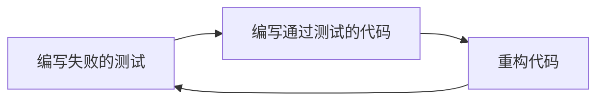

# Java 单元测试最佳实践

## 单元测试的基本理解

单元测试是软件开发过程中的重要一环，它专注于测试代码的最小可测试单元（通常是方法或函数）。通过单元测试，我们可以验证代码的行为是否符合预期，及早发现并修复问题，降低后期维护成本。

在Java开发中，JUnit是最常用的单元测试框架。它提供了简单而强大的API，帮助开发者编写和运行测试。

### 为什么单元测试很重要？

- **提早发现bug**：在集成测试前发现问题，节省开发时间
- **简化调试**：当测试失败时，你确切知道是哪部分代码出了问题
- **提高代码质量**：测试驱动的代码往往设计更合理
- **促进重构**：有了测试保障，重构代码变得更加安全
- **作为文档**：测试可以展示代码的预期行为

## 单元测试的基本结构

一个典型的JUnit 5测试类结构如下：

```java
import org.junit.jupiter.api.*;
import static org.junit.jupiter.api.Assertions.*;

public class CalculatorTest {

    private Calculator calculator;

    @BeforeEach
    void setUp() {
        calculator = new Calculator();
    }

    @Test
    void testAddition() {
        assertEquals(5, calculator.add(2, 3), "2 + 3 should equal 5");
    }

    @Test
    void testDivision() {
        assertEquals(2, calculator.divide(6, 3), "6 / 3 should equal 2");
    }

    @Test
    void testDivisionByZero() {
        assertThrows(ArithmeticException.class, () -> {
            calculator.divide(1, 0);
        });
    }

    @AfterEach
    void tearDown() {
        calculator = null;
    }
}
```

这个例子中我们测试了一个简单的计算器类，包含以下关键部分：

1. **@BeforeEach**：在每个测试方法之前执行，用于设置测试环境
2. **@Test**：标记测试方法
3. **断言**：验证结果是否符合预期
4. **@AfterEach**：在每个测试方法之后执行，用于清理资源

## Java 单元测试最佳实践

### 1. 遵循 FIRST 原则

好的单元测试应该遵循FIRST原则：

- **Fast**：测试应该快速运行，让开发者能频繁执行
- **Independent**：测试应该相互独立，不依赖其他测试的运行结果
- **Repeatable**：测试结果应该可重复，不受外部环境影响
- **Self-validating**：测试应该自动判断通过与否，无需人工解释
- **Timely**：测试应该及时编写，最好在编写功能代码之前

### 2. 每个测试只测一个概念

```java
// 不推荐：一个测试方法测试多个概念
@Test
void testMultipleFunctionalities() {
    assertEquals(5, calculator.add(2, 3));
    assertEquals(6, calculator.multiply(2, 3));
    assertEquals(1, calculator.subtract(3, 2));
}

// 推荐：每个测试方法只测一个概念
@Test
void testAddition() {
    assertEquals(5, calculator.add(2, 3));
}

@Test
void testMultiplication() {
    assertEquals(6, calculator.multiply(2, 3));
}

@Test
void testSubtraction() {
    assertEquals(1, calculator.subtract(3, 2));
}
```

这样当测试失败时，你可以立即知道哪个功能出了问题。

### 3. 使用有意义的测试命名

测试方法名应该清晰表达测试的内容和预期结果：

```java
// 不推荐
@Test
void test1() { ... }

// 推荐
@Test
void shouldThrowExceptionWhenDividingByZero() { ... }

// 或者使用这种格式: method_scenario_expectedResult
@Test
void divide_byZero_throwsArithmeticException() { ... }
```

### 4. 使用合适的断言

JUnit提供了多种断言方法，根据场景选择合适的断言可以提高测试的可读性：

```java
// 基本断言
assertEquals(expected, actual);          // 判断相等
assertNotEquals(unexpected, actual);     // 判断不相等
assertTrue(condition);                   // 判断条件为真
assertFalse(condition);                  // 判断条件为假
assertNull(object);                      // 判断对象为null
assertNotNull(object);                   // 判断对象不为null

// 数组断言
assertArrayEquals(expectedArray, actualArray);  // 判断数组相等

// 异常断言
assertThrows(ExpectedException.class, () -> { methodThatShouldThrowException(); });

// 超时断言
assertTimeout(Duration.ofMillis(100), () -> { methodThatShouldNotTakeMoreThan100ms(); });
```

### 5. 避免测试逻辑

测试代码应该简单直接，避免复杂的逻辑如条件语句、循环等：

```java
// 不推荐
@Test
void testComplexLogic() {
    int result = calculator.add(2, 3);
    if (result > 0) {
        assertTrue(result == 5);
    } else {
        fail("Result should be positive");
    }
}

// 推荐
@Test
void testAddition() {
    assertEquals(5, calculator.add(2, 3));
}
```

### 6. 使用参数化测试

当需要用不同参数测试同一个方法时，使用参数化测试：

```java
@ParameterizedTest
@CsvSource({
    "1, 1, 2",
    "5, 3, 8",
    "10, -5, 5"
})
void testAddition(int a, int b, int expected) {
    assertEquals(expected, calculator.add(a, b));
}
```

### 7. 处理异常测试

使用assertThrows测试异常：

```java
@Test
void testDivisionByZero() {
    Exception exception = assertThrows(ArithmeticException.class, () -> {
        calculator.divide(1, 0);
    });
    
    String expectedMessage = "/ by zero";
    String actualMessage = exception.getMessage();
    assertTrue(actualMessage.contains(expectedMessage));
}
```

### 8. 使用测试夹具

使用@BeforeEach和@AfterEach简化测试设置和清理：

```java
private Connection dbConnection;

@BeforeEach
void setUp() {
    dbConnection = DatabaseConnection.getConnection();
}

@Test
void testDatabaseQuery() {
    // 使用dbConnection执行测试
    List<User> users = UserDao.findAll(dbConnection);
    assertNotNull(users);
}

@AfterEach
void tearDown() {
    dbConnection.close();
}
```

### 9. 使用模拟框架

对于依赖外部系统的测试，使用Mockito等模拟框架：

```java
import static org.mockito.Mockito.*;

@Test
void testUserService() {
    // 创建模拟对象
    UserRepository userRepository = mock(UserRepository.class);
    
    // 设置模拟行为
    User mockUser = new User(1L, "John");
    when(userRepository.findById(1L)).thenReturn(mockUser);
    
    // 使用模拟对象
    UserService userService = new UserService(userRepository);
    User user = userService.getUserById(1L);
    
    // 验证结果
    assertEquals("John", user.getName());
    
    // 验证方法调用
    verify(userRepository).findById(1L);
}
```

### 10. 使用测试覆盖率工具

使用Jacoco等工具监控测试覆盖率，确保关键代码路径被测试：

```xml
<!-- Maven配置示例 -->
<plugin>
    <groupId>org.jacoco</groupId>
    <artifactId>jacoco-maven-plugin</artifactId>
    <version>0.8.7</version>
    <executions>
        <execution>
            <goals>
                <goal>prepare-agent</goal>
            </goals>
        </execution>
        <execution>
            <id>report</id>
            <phase>test</phase>
            <goals>
                <goal>report</goal>
            </goals>
        </execution>
    </executions>
</plugin>
```

## 实际案例：用户注册服务测试

让我们看一个更复杂的实际案例 - 用户注册服务的测试：

首先，这是我们要测试的服务：

```java
public class UserRegistrationService {
    private final UserRepository userRepository;
    private final EmailService emailService;
    
    public UserRegistrationService(UserRepository userRepository, EmailService emailService) {
        this.userRepository = userRepository;
        this.emailService = emailService;
    }
    
    public User registerUser(String username, String email, String password) {
        // 验证输入
        if (username == null || username.trim().isEmpty()) {
            throw new IllegalArgumentException("Username cannot be empty");
        }
        if (email == null || !email.contains("@")) {
            throw new IllegalArgumentException("Invalid email format");
        }
        if (password == null || password.length() < 8) {
            throw new IllegalArgumentException("Password must be at least 8 characters");
        }
        
        // 检查用户是否已存在
        if (userRepository.findByUsername(username) != null) {
            throw new UserAlreadyExistsException("Username already exists");
        }
        if (userRepository.findByEmail(email) != null) {
            throw new UserAlreadyExistsException("Email already in use");
        }
        
        // 创建用户
        User user = new User(username, email, password);
        userRepository.save(user);
        
        // 发送欢迎邮件
        emailService.sendWelcomeEmail(email, username);
        
        return user;
    }
}
```

现在，让我们编写单元测试：

```java
import static org.junit.jupiter.api.Assertions.*;
import static org.mockito.Mockito.*;
import org.junit.jupiter.api.*;
import org.junit.jupiter.params.ParameterizedTest;
import org.junit.jupiter.params.provider.NullAndEmptySource;
import org.junit.jupiter.params.provider.ValueSource;

class UserRegistrationServiceTest {
    
    private UserRegistrationService registrationService;
    private UserRepository mockUserRepository;
    private EmailService mockEmailService;
    
    @BeforeEach
    void setUp() {
        mockUserRepository = mock(UserRepository.class);
        mockEmailService = mock(EmailService.class);
        registrationService = new UserRegistrationService(mockUserRepository, mockEmailService);
    }
    
    @Test
    void registerUser_validInputs_returnsCreatedUser() {
        // Arrange
        String username = "testuser";
        String email = "test@example.com";
        String password = "password123";
        
        when(mockUserRepository.findByUsername(username)).thenReturn(null);
        when(mockUserRepository.findByEmail(email)).thenReturn(null);
        
        // Act
        User result = registrationService.registerUser(username, email, password);
        
        // Assert
        assertNotNull(result);
        assertEquals(username, result.getUsername());
        assertEquals(email, result.getEmail());
        
        // Verify interactions
        verify(mockUserRepository).save(any(User.class));
        verify(mockEmailService).sendWelcomeEmail(email, username);
    }
    
    @ParameterizedTest
    @NullAndEmptySource
    @ValueSource(strings = {" ", "   "})
    void registerUser_emptyUsername_throwsIllegalArgumentException(String username) {
        Exception exception = assertThrows(IllegalArgumentException.class, () -> {
            registrationService.registerUser(username, "test@example.com", "password123");
        });
        
        assertEquals("Username cannot be empty", exception.getMessage());
    }
    
    @Test
    void registerUser_existingUsername_throwsUserAlreadyExistsException() {
        // Arrange
        String username = "existinguser";
        when(mockUserRepository.findByUsername(username)).thenReturn(new User());
        
        // Act & Assert
        Exception exception = assertThrows(UserAlreadyExistsException.class, () -> {
            registrationService.registerUser(username, "test@example.com", "password123");
        });
        
        assertEquals("Username already exists", exception.getMessage());
        verify(mockUserRepository, never()).save(any(User.class));
        verify(mockEmailService, never()).sendWelcomeEmail(anyString(), anyString());
    }
    
    @Test
    void registerUser_invalidEmail_throwsIllegalArgumentException() {
        Exception exception = assertThrows(IllegalArgumentException.class, () -> {
            registrationService.registerUser("testuser", "invalidemail", "password123");
        });
        
        assertEquals("Invalid email format", exception.getMessage());
    }
    
    @Test
    void registerUser_shortPassword_throwsIllegalArgumentException() {
        Exception exception = assertThrows(IllegalArgumentException.class, () -> {
            registrationService.registerUser("testuser", "test@example.com", "short");
        });
        
        assertEquals("Password must be at least 8 characters", exception.getMessage());
    }
}
```

这个测试案例展示了以下最佳实践：

1. **使用模拟对象**：模拟了UserRepository和EmailService，让我们专注测试UserRegistrationService
2. **测试正常路径**：验证在有效输入下的行为
3. **测试边界条件**：验证在无效输入下的行为
4. **参数化测试**：对空用户名使用不同输入值
5. **验证异常**：确保异常按预期抛出
6. **验证交互**：确保方法调用了正确的依赖项

## 单元测试的注意事项

:::caution
单元测试不应该：
- 访问数据库
- 访问网络
- 使用文件系统
- 依赖于特定环境配置
- 执行需要复杂设置的操作
:::

:::tip
记住黄金法则：测试越快越好，测试越独立越好。如果需要测试涉及外部系统的代码，应该使用集成测试而非单元测试。
:::

## 常见测试模式

### 1. 准备-执行-断言模式 (AAA: Arrange-Act-Assert)

```java
@Test
void testAddition() {
    // Arrange - 准备测试数据
    Calculator calculator = new Calculator();
    int a = 2, b = 3;
    
    // Act - 执行被测试的操作
    int result = calculator.add(a, b);
    
    // Assert - 断言结果是否符合预期
    assertEquals(5, result);
}
```

### 2. 给定-当-那么模式 (GWT: Given-When-Then)

```java
@Test
void givenTwoPositiveNumbers_whenAdded_thenResultIsSumOfBothNumbers() {
    // Given - 给定测试前提条件
    Calculator calculator = new Calculator();
    int a = 2, b = 3;
    
    // When - 当执行某个操作时
    int result = calculator.add(a, b);
    
    // Then - 那么应该得到期望结果
    assertEquals(5, result);
}
```

## 测试驱动开发 (TDD)

测试驱动开发是一种开发方法，遵循以下流程：

1. **编写失败的测试**：首先编写一个表达你期望功能的测试
2. **实现最小代码**：实现刚好能通过测试的代码
3. **重构**：改进代码结构，确保测试仍然通过



## 总结

单元测试是Java开发中不可或缺的一部分。通过遵循这些最佳实践，你可以：

1. 提高代码质量和可维护性
2. 减少bug和技术债务
3. 使重构变得更加安全
4. 提供代码行为的文档

记住，好的单元测试是快速、独立、可重复、自验证和及时的。测试应该简单直观，每个测试只测试一个概念，并使用有意义的命名和恰当的断言。

## 练习

1. 为一个简单的字符串工具类编写单元测试，该类应包含以下方法：
   - `boolean isPalindrome(String s)`（判断字符串是否为回文）
   - `String reverse(String s)`（反转字符串）
   - `int countOccurrences(String text, String substring)`（计算子串出现次数）

2. 使用TDD方法，为一个银行账户类实现单元测试和功能代码，该类应包含：
   - 存款功能
   - 取款功能（考虑余额不足的情况）
   - 转账功能
   - 查询余额功能

## 附加资源

- [JUnit 5 官方文档](https://junit.org/junit5/docs/current/user-guide/)
- [Mockito 框架文档](https://site.mockito.org/)
- [《Effective Unit Testing》by Lasse Koskela](https://www.amazon.com/Effective-Unit-Testing-guide-developers/dp/1935182579)
- [《Test Driven Development: By Example》by Kent Beck](https://www.amazon.com/Test-Driven-Development-Kent-Beck/dp/0321146530)

通过系统地应用这些单元测试最佳实践，你将能够编写更可靠、更易于维护的Java代码。记住，单元测试不仅仅是为了测试你的代码，它也是设计的工具和文档的形式。