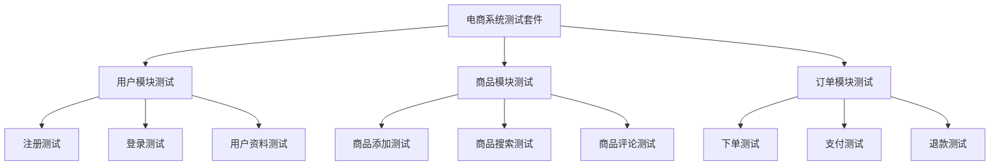

# Java 测试套件

## 什么是测试套件？

在软件测试中，**测试套件(Test Suite)**是一组相关的测试用例的集合，它们被组合在一起以便于执行。当我们的项目规模逐渐增大，测试用例的数量也会随之增加，这时候就需要一种有组织的方式来管理和执行这些测试。

测试套件提供了以下好处：

- **组织化测试**：将相关测试归为一组，提高测试的可管理性
- **批量执行**：一次性运行多个测试用例，提高效率
- **分类测试**：可以按功能、模块或其他标准对测试进行分类
- **统一报告**：生成整合的测试报告，便于分析

:::tip 小贴士
好的测试套件组织方式可以帮助团队更快地定位问题，提高开发效率。
:::

## JUnit中的测试套件

JUnit是Java中最常用的单元测试框架，它提供了多种方式来创建和运行测试套件。下面我们将介绍如何在JUnit 4和JUnit 5中创建测试套件。

### JUnit 4测试套件

在JUnit 4中，我们使用`@RunWith`和`@Suite.SuiteClasses`注解来创建测试套件。

首先，假设我们有两个测试类：

```java
// 测试计算器的加法功能
public class CalculatorAddTest {
    @Test
    public void testAddPositiveNumbers() {
        Calculator calc = new Calculator();
        assertEquals(5, calc.add(2, 3));
    }
    
    @Test
    public void testAddNegativeNumbers() {
        Calculator calc = new Calculator();
        assertEquals(-5, calc.add(-2, -3));
    }
}

// 测试计算器的减法功能
public class CalculatorSubtractTest {
    @Test
    public void testSubtractPositiveNumbers() {
        Calculator calc = new Calculator();
        assertEquals(2, calc.subtract(5, 3));
    }
    
    @Test
    public void testSubtractNegativeNumbers() {
        Calculator calc = new Calculator();
        assertEquals(1, calc.subtract(-2, -3));
    }
}
```

现在，我们可以创建一个测试套件，将这两个测试类组合在一起：

```java
import org.junit.runner.RunWith;
import org.junit.runners.Suite;

@RunWith(Suite.class)
@Suite.SuiteClasses({
    CalculatorAddTest.class,
    CalculatorSubtractTest.class
})
public class CalculatorTestSuite {
    // 套件不需要任何具体方法，注解已经指定要执行的测试类
}
```

运行此测试套件时，JUnit会依次执行`CalculatorAddTest`和`CalculatorSubtractTest`中的所有测试方法。

### JUnit 5测试套件

JUnit 5改变了测试套件的创建方式，使用了`@SelectClasses`或`@SelectPackages`注解与`@Suite`一起来指定要包含的测试类或包。

```java
import org.junit.platform.suite.api.SelectClasses;
import org.junit.platform.suite.api.Suite;

@Suite
@SelectClasses({
    CalculatorAddTest.class,
    CalculatorSubtractTest.class
})
public class CalculatorTestSuite {
    // JUnit 5中的套件同样不需要任何具体方法
}
```

如果要选择整个包中的测试，可以使用`@SelectPackages`：

```java
import org.junit.platform.suite.api.SelectPackages;
import org.junit.platform.suite.api.Suite;

@Suite
@SelectPackages("com.example.calculator.tests")
public class AllCalculatorTests {
    // 运行指定包中的所有测试
}
```

:::note 注意
JUnit 5的测试套件功能需要额外添加`junit-platform-suite`依赖。
:::

## 高级测试套件配置

### 筛选测试

JUnit 5提供了更灵活的测试筛选机制，可以使用各种条件来筛选要执行的测试：

```java
import org.junit.platform.suite.api.IncludeTags;
import org.junit.platform.suite.api.ExcludeTags;
import org.junit.platform.suite.api.Suite;
import org.junit.platform.suite.api.SelectPackages;

@Suite
@SelectPackages("com.example.tests")
@IncludeTags("fast")
@ExcludeTags("slow")
public class FastTestSuite {
    // 只运行标记为"fast"且不标记为"slow"的测试
}
```

要使用标签功能，需要在测试方法或类上添加`@Tag`注解：

```java
import org.junit.jupiter.api.Tag;
import org.junit.jupiter.api.Test;

public class PerformanceTest {
    
    @Test
    @Tag("fast")
    void testQuickOperation() {
        // 快速操作的测试
    }
    
    @Test
    @Tag("slow")
    void testTimeConsumingOperation() {
        // 耗时操作的测试
    }
}
```

### 嵌套测试套件

测试套件也可以包含其他测试套件，形成层次结构：

```java
@Suite
@SelectClasses({
    UnitTestSuite.class,
    IntegrationTestSuite.class
})
public class AllTestsSuite {
    // 包含其他测试套件的主测试套件
}
```

## TestNG中的测试套件

除了JUnit，TestNG也是Java中流行的测试框架，它使用XML配置文件来定义测试套件：

```xml
<!DOCTYPE suite SYSTEM "https://testng.org/testng-1.0.dtd">
<suite name="Calculator Test Suite">
  <test name="Addition and Subtraction Tests">
    <classes>
      <class name="com.example.CalculatorAddTest"/>
      <class name="com.example.CalculatorSubtractTest"/>
    </classes>
  </test>
  
  <test name="Multiplication Tests">
    <classes>
      <class name="com.example.CalculatorMultiplyTest"/>
    </classes>
  </test>
</suite>
```

这种方式允许更灵活的配置，包括设置参数、并行执行等高级功能。

## 实际案例：电商系统测试套件

让我们看一个更复杂的例子，假设我们正在开发一个电商系统，需要测试用户管理、商品管理和订单处理等模块。



我们可以为这个系统设计以下测试套件结构：

```java
// 用户模块测试套件
@Suite
@SelectClasses({
    UserRegistrationTest.class,
    UserLoginTest.class,
    UserProfileTest.class
})
public class UserModuleTestSuite {
}

// 商品模块测试套件
@Suite
@SelectClasses({
    ProductAddTest.class,
    ProductSearchTest.class,
    ProductReviewTest.class
})
public class ProductModuleTestSuite {
}

// 订单模块测试套件
@Suite
@SelectClasses({
    OrderCreationTest.class,
    PaymentProcessingTest.class,
    RefundTest.class
})
public class OrderModuleTestSuite {
}

// 整个系统的主测试套件
@Suite
@SelectClasses({
    UserModuleTestSuite.class,
    ProductModuleTestSuite.class,
    OrderModuleTestSuite.class
})
public class ECommerceSystemTestSuite {
}
```

对于持续集成环境，我们还可以创建专门的测试套件：

```java
@Suite
@SelectClasses({
    UserLoginTest.class,
    ProductSearchTest.class,
    OrderCreationTest.class
})
@IncludeTags("smoke")
public class CISmokeTestSuite {
    // 持续集成的冒烟测试，只包含关键功能
}
```

## 测试套件的最佳实践

1. **逻辑分组**：按功能、模块或测试类型（单元测试、集成测试等）组织测试套件

2. **命名约定**：采用清晰的命名约定，如`ModuleNameTestSuite`

3. **测试独立性**：确保测试套件中的测试用例相互独立，不依赖执行顺序

4. **测试覆盖率**：使用测试套件来确保关键功能都被测试覆盖

5. **快速反馈**：创建"快速测试套件"用于开发过程中的快速反馈

6. **分层测试**：创建不同级别的测试套件（单元、集成、系统等）

:::caution 警告
测试套件中包含的测试用例应该相互独立，不要设计依赖于其他测试执行结果的测试。
:::

## 总结

测试套件是组织和管理Java测试用例的强大工具，它们帮助我们以结构化的方式执行多个测试用例，提高测试效率和可维护性。

在JUnit和TestNG中，我们有多种方式来创建和配置测试套件，从简单的类列表到复杂的层次结构。良好组织的测试套件可以帮助团队更好地理解测试覆盖范围，并快速定位问题。

随着项目规模的增长，测试套件的价值会变得更加明显，它们是构建可靠软件的重要组成部分。

## 练习

1. 创建一个简单的计算器类，实现加、减、乘、除功能，然后为每个功能编写测试类，最后创建一个测试套件包含所有这些测试。

2. 为一个带有用户认证功能的应用创建分层测试套件，包括单元测试套件和集成测试套件。

3. 使用TestNG创建一个XML配置的测试套件，包含多个测试类并设置它们并行运行。

## 进一步阅读

- [JUnit 5用户指南](https://junit.org/junit5/docs/current/user-guide/)
- [TestNG文档](https://testng.org/doc/)
- 《Effective Unit Testing》by Lasse Koskela
- 《Java Testing with JUnit 5》by Catalin Tudose