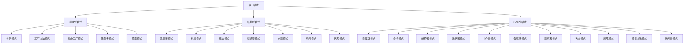

# Java 设计模式概述

## 什么是设计模式？

设计模式是软件开发过程中针对特定问题的通用解决方案。它们是经过时间考验的最佳实践，可以帮助开发者设计出更加灵活、可复用、易维护的软件系统。设计模式不是具体的代码，而是对问题解决方案的描述或模板。

:::tip
设计模式并不是万能药！它们只是工具，需要在合适的场景下使用才能发挥最大价值。
:::

## 为什么学习设计模式？

学习设计模式有以下几个重要原因：

1. **避免重复造轮子**：很多问题已经有了经过验证的解决方案
2. **提高代码质量**：使代码更具可维护性和可扩展性
3. **建立共同语言**：团队成员可以通过设计模式名称迅速理解代码结构
4. **应对变化**：设计模式通常考虑了系统的可变性，使系统更容易适应变化
5. **促进面向对象设计**：深入理解设计模式有助于更好地应用面向对象原则

## 设计模式的分类

根据《设计模式：可复用面向对象软件的基础》(Gang of Four, GoF)一书，设计模式可以分为三大类：



### 1. 创建型模式

创建型模式关注对象的创建过程，试图将对象的创建与使用分离。主要包括：

- **单例模式 (Singleton)**：确保一个类只有一个实例，并提供对该实例的全局访问点
- **工厂方法模式 (Factory Method)**：定义一个创建对象的接口，但让子类决定实例化哪一个类
- **抽象工厂模式 (Abstract Factory)**：提供一个接口以创建一系列相关或相互依赖的对象
- **建造者模式 (Builder)**：将一个复杂对象的构建与它的表示分离
- **原型模式 (Prototype)**：通过克隆现有对象来创建新对象

### 2. 结构型模式

结构型模式关注类和对象的组合，形成更大的结构。主要包括：

- **适配器模式 (Adapter)**：使接口不兼容的类能一起工作
- **桥接模式 (Bridge)**：将抽象部分与实现部分分离，使它们可以独立变化
- **组合模式 (Composite)**：将对象组合成树形结构以表示"部分-整体"的层次结构
- **装饰器模式 (Decorator)**：动态地给对象添加额外的职责
- **外观模式 (Facade)**：为子系统中的一组接口提供一个统一的高层接口
- **享元模式 (Flyweight)**：通过共享技术有效支持大量细粒度对象
- **代理模式 (Proxy)**：为其他对象提供一个代理以控制对这个对象的访问

### 3. 行为型模式

行为型模式关注对象之间的通信，以及算法和职责的分配。主要包括：

- **责任链模式 (Chain of Responsibility)**：允许多个对象处理同一请求
- **命令模式 (Command)**：将请求封装成对象，使不同的请求可以参数化
- **解释器模式 (Interpreter)**：为语言定义一个文法，并解释相应的语句
- **迭代器模式 (Iterator)**：提供一种方法顺序访问一个聚合对象中的各个元素
- **中介者模式 (Mediator)**：定义一个中介对象来封装一系列对象之间的交互
- **备忘录模式 (Memento)**：在不破坏封装性的前提下，捕获并外部化对象的内部状态
- **观察者模式 (Observer)**：定义对象间的一种一对多的依赖关系
- **状态模式 (State)**：允许一个对象在其内部状态改变时改变它的行为
- **策略模式 (Strategy)**：定义一系列算法，把它们封装起来，并且使它们可以互相替换
- **模板方法模式 (Template Method)**：定义算法的骨架，而将一些步骤延迟到子类中
- **访问者模式 (Visitor)**：在不改变数据结构的情况下，增加作用于这些数据结构上的新操作

## 设计模式的核心原则

设计模式遵循面向对象设计的以下核心原则：

### SOLID原则

1. **S - 单一职责原则 (Single Responsibility Principle)**  
   一个类只负责一个功能领域中的相应职责

2. **O - 开闭原则 (Open/Closed Principle)**  
   软件实体应对扩展开放，对修改关闭

3. **L - 里氏替换原则 (Liskov Substitution Principle)**  
   所有引用基类的地方必须能透明地使用其子类对象

4. **I - 接口隔离原则 (Interface Segregation Principle)**  
   客户端不应依赖它不需要的接口

5. **D - 依赖倒置原则 (Dependency Inversion Principle)**  
   高层模块不应依赖低层模块，二者都应依赖其抽象

### 其他重要原则

- **最少知道原则（迪米特法则）**：一个对象应当对其他对象有尽可能少的了解
- **合成复用原则**：优先使用对象组合，而不是继承来达到复用的目的

## 设计模式实例：单例模式

让我们通过一个简单的例子来理解单例模式。单例模式确保一个类只有一个实例，并提供一个全局访问点。

### 基本实现

```java
public class Singleton {
    // 私有静态变量，持有唯一实例
    private static Singleton instance;
    
    // 私有构造函数，防止外部实例化
    private Singleton() {}
    
    // 公共静态方法，提供全局访问点
    public static Singleton getInstance() {
        if (instance == null) {
            instance = new Singleton();
        }
        return instance;
    }
    
    public void showMessage() {
        System.out.println("Hello World!");
    }
}
```

### 线程安全的实现

上面的实现在多线程环境下可能创建多个实例，下面是线程安全的双检锁实现：

```java
public class ThreadSafeSingleton {
    private static volatile ThreadSafeSingleton instance;
    
    private ThreadSafeSingleton() {}
    
    public static ThreadSafeSingleton getInstance() {
        if (instance == null) {
            synchronized (ThreadSafeSingleton.class) {
                if (instance == null) {
                    instance = new ThreadSafeSingleton();
                }
            }
        }
        return instance;
    }
}
```

### 使用示例

```java
public class SingletonDemo {
    public static void main(String[] args) {
        // 获取唯一可用的实例
        Singleton singletonObject = Singleton.getInstance();
        
        // 显示消息
        singletonObject.showMessage();
    }
}
```

**输出:**
```
Hello World!
```

### 应用场景

单例模式适用于以下场景：
- 需要频繁实例化然后销毁的对象
- 创建对象时耗时过多或耗资源过多，但又经常用到的对象
- 有状态的工具类对象
- 频繁访问数据库或文件的对象

实际应用例子：
- 数据库连接池
- 配置管理器
- 日志记录器
- 线程池

## 设计模式的实际应用

在Java生态系统中，设计模式被广泛应用：

1. **Java API中的设计模式**
   - `java.lang.Runtime`：单例模式
   - `java.util.Collections#unmodifiableList`：装饰器模式
   - `java.util.Iterator`：迭代器模式
   - `javax.servlet.Filter`：责任链模式

2. **框架中的设计模式**
   - Spring框架：工厂模式、单例模式、代理模式等
   - Hibernate：代理模式、工厂模式等
   - Struts2：模板方法模式、命令模式等

## 如何学习设计模式

学习设计模式的最佳方法是：

1. **理解原理**：掌握每种模式的核心思想和适用场景
2. **分析代码**：研究现有代码库中的设计模式实现
3. **动手实践**：亲自编写包含设计模式的代码
4. **反思应用**：思考在实际项目中如何应用设计模式解决问题

:::caution
避免滥用设计模式！过度使用会导致不必要的复杂性，记住KISS原则（Keep It Simple, Stupid）。
:::

## 总结

设计模式是面向对象开发中不可或缺的工具，它们提供了解决常见设计问题的通用方法。通过学习设计模式，你不仅可以提高代码质量，还能更深入地理解面向对象设计原则。

本文概述了设计模式的分类、核心原则以及简单的实例。在后续文章中，我们将详细探讨每种设计模式的实现和应用。

## 练习

1. 尝试实现一个使用工厂模式的简单应用，如创建不同类型的图形对象。
2. 分析你正在使用的某个Java库，找出其中使用的设计模式。
3. 考虑在日常编程中，你可能遇到的适合使用观察者模式的场景。
4. 使用装饰器模式扩展一个简单的文本处理类的功能。

## 进一步学习资源

- 《Design Patterns: Elements of Reusable Object-Oriented Software》(GoF)
- 《Head First Design Patterns》
- [Refactoring Guru](https://refactoring.guru/design-patterns)
- [Java Design Patterns](https://java-design-patterns.com/)
- Spring Framework和其他开源项目的源代码

记住，设计模式是工具，不是目标。真正的目标是创建易于维护和扩展的软件系统。