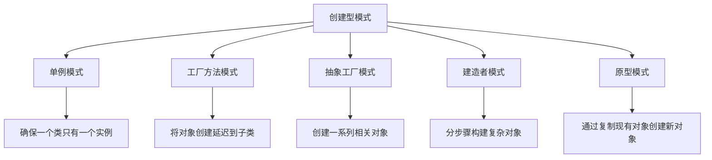

# Java 创建型模式

## 什么是创建型模式？

创建型模式是处理对象创建机制的设计模式，旨在以适合特定情况的方式创建对象。这些模式可以通过控制创建过程来解决创建对象时可能出现的问题，例如避免直接使用 `new` 关键字创建对象，使系统更加灵活和可维护。

在Java中，有五种主要的创建型模式：

1. 单例模式（Singleton Pattern）
2. 工厂方法模式（Factory Method Pattern）
3. 抽象工厂模式（Abstract Factory Pattern）
4. 建造者模式（Builder Pattern）
5. 原型模式（Prototype Pattern）

让我们详细了解每一种模式。

## 单例模式（Singleton Pattern）

### 概念

单例模式确保一个类只有一个实例，并提供一个全局访问点来访问该实例。这在需要协调系统中的行为时非常有用。

### 实现方式

#### 懒汉式（线程不安全）

```java
public class Singleton {
    private static Singleton instance;
    
    // 私有构造函数
    private Singleton() {}
    
    // 全局访问点
    public static Singleton getInstance() {
        if (instance == null) {
            instance = new Singleton();
        }
        return instance;
    }
}
```

#### 饿汉式（线程安全）

```java
public class Singleton {
    private static final Singleton instance = new Singleton();
    
    private Singleton() {}
    
    public static Singleton getInstance() {
        return instance;
    }
}
```

#### 双重检查锁（DCL，线程安全）

```java
public class Singleton {
    private volatile static Singleton instance;
    
    private Singleton() {}
    
    public static Singleton getInstance() {
        if (instance == null) {
            synchronized (Singleton.class) {
                if (instance == null) {
                    instance = new Singleton();
                }
            }
        }
        return instance;
    }
}
```

### 应用场景

- 数据库连接池
- 日志记录器
- 配置管理器
- 缓存管理
- 线程池

:::tip
单例模式虽然使用广泛，但过度使用可能导致代码耦合性增加，单元测试更加困难。
:::

## 工厂方法模式（Factory Method Pattern）

### 概念

工厂方法模式定义了一个创建对象的接口，但由子类决定要实例化的类是哪一个。工厂方法使一个类的实例化延迟到其子类。

### 实现示例

```java
// 产品接口
interface Product {
    void operation();
}

// 具体产品A
class ConcreteProductA implements Product {
    @Override
    public void operation() {
        System.out.println("ConcreteProductA operation");
    }
}

// 具体产品B
class ConcreteProductB implements Product {
    @Override
    public void operation() {
        System.out.println("ConcreteProductB operation");
    }
}

// 创建者抽象类
abstract class Creator {
    public abstract Product createProduct();
    
    // 可以包含一些使用产品的方法
    public void someOperation() {
        Product product = createProduct();
        product.operation();
    }
}

// 具体创建者A
class ConcreteCreatorA extends Creator {
    @Override
    public Product createProduct() {
        return new ConcreteProductA();
    }
}

// 具体创建者B
class ConcreteCreatorB extends Creator {
    @Override
    public Product createProduct() {
        return new ConcreteProductB();
    }
}
```

### 使用示例

```java
public class FactoryMethodDemo {
    public static void main(String[] args) {
        Creator creatorA = new ConcreteCreatorA();
        creatorA.someOperation(); // 输出: ConcreteProductA operation
        
        Creator creatorB = new ConcreteCreatorB();
        creatorB.someOperation(); // 输出: ConcreteProductB operation
    }
}
```

### 应用场景

- 日志记录器框架，可以创建不同类型的日志记录器
- JDBC连接不同数据库的驱动
- UI框架中的按钮等组件创建
- 不同操作系统下的文件系统操作实现

## 抽象工厂模式（Abstract Factory Pattern）

### 概念

抽象工厂模式提供一个接口，用于创建一系列相关或相互依赖的对象，而无需指定它们具体的类。

### 实现示例

```java
// 产品接口
interface Button {
    void paint();
}

interface Checkbox {
    void paint();
}

// 具体产品 - Windows风格
class WindowsButton implements Button {
    @Override
    public void paint() {
        System.out.println("Windows Button");
    }
}

class WindowsCheckbox implements Checkbox {
    @Override
    public void paint() {
        System.out.println("Windows Checkbox");
    }
}

// 具体产品 - Mac风格
class MacButton implements Button {
    @Override
    public void paint() {
        System.out.println("Mac Button");
    }
}

class MacCheckbox implements Checkbox {
    @Override
    public void paint() {
        System.out.println("Mac Checkbox");
    }
}

// 抽象工厂
interface GUIFactory {
    Button createButton();
    Checkbox createCheckbox();
}

// 具体工厂
class WindowsFactory implements GUIFactory {
    @Override
    public Button createButton() {
        return new WindowsButton();
    }

    @Override
    public Checkbox createCheckbox() {
        return new WindowsCheckbox();
    }
}

class MacFactory implements GUIFactory {
    @Override
    public Button createButton() {
        return new MacButton();
    }

    @Override
    public Checkbox createCheckbox() {
        return new MacCheckbox();
    }
}
```

### 使用示例

```java
public class AbstractFactoryDemo {
    public static void main(String[] args) {
        // 创建Windows风格的UI
        GUIFactory windowsFactory = new WindowsFactory();
        Button windowsButton = windowsFactory.createButton();
        Checkbox windowsCheckbox = windowsFactory.createCheckbox();
        
        windowsButton.paint();   // 输出: Windows Button
        windowsCheckbox.paint(); // 输出: Windows Checkbox
        
        // 创建Mac风格的UI
        GUIFactory macFactory = new MacFactory();
        Button macButton = macFactory.createButton();
        Checkbox macCheckbox = macFactory.createCheckbox();
        
        macButton.paint();   // 输出: Mac Button
        macCheckbox.paint(); // 输出: Mac Checkbox
    }
}
```

### 应用场景

- 跨平台UI工具包
- 不同风格的主题实现
- 不同数据库系统的连接工具
- 支持多种格式文件的文档处理系统

## 建造者模式（Builder Pattern）

### 概念

建造者模式将一个复杂对象的构建与其表示分离，使得同样的构建过程可以创建不同的表示。

### 实现示例

```java
// 产品类
class Computer {
    private String cpu;
    private String ram;
    private String storage;
    private String gpu;
    private String powerSupply;
    
    @Override
    public String toString() {
        return "Computer{" +
                "cpu='" + cpu + '\'' +
                ", ram='" + ram + '\'' +
                ", storage='" + storage + '\'' +
                ", gpu='" + gpu + '\'' +
                ", powerSupply='" + powerSupply + '\'' +
                '}';
    }
    
    // Getter and setter methods
    public void setCpu(String cpu) {
        this.cpu = cpu;
    }
    
    public void setRam(String ram) {
        this.ram = ram;
    }
    
    public void setStorage(String storage) {
        this.storage = storage;
    }
    
    public void setGpu(String gpu) {
        this.gpu = gpu;
    }
    
    public void setPowerSupply(String powerSupply) {
        this.powerSupply = powerSupply;
    }
}

// 抽象建造者
interface ComputerBuilder {
    void buildCpu();
    void buildRam();
    void buildStorage();
    void buildGpu();
    void buildPowerSupply();
    Computer getComputer();
}

// 具体建造者 - 游戏电脑
class GamingComputerBuilder implements ComputerBuilder {
    private Computer computer;
    
    public GamingComputerBuilder() {
        computer = new Computer();
    }
    
    @Override
    public void buildCpu() {
        computer.setCpu("High-end Gaming CPU");
    }
    
    @Override
    public void buildRam() {
        computer.setRam("32GB Gaming RAM");
    }
    
    @Override
    public void buildStorage() {
        computer.setStorage("2TB SSD");
    }
    
    @Override
    public void buildGpu() {
        computer.setGpu("High-end Gaming GPU");
    }
    
    @Override
    public void buildPowerSupply() {
        computer.setPowerSupply("850W Power Supply");
    }
    
    @Override
    public Computer getComputer() {
        return computer;
    }
}

// 具体建造者 - 办公电脑
class OfficeComputerBuilder implements ComputerBuilder {
    private Computer computer;
    
    public OfficeComputerBuilder() {
        computer = new Computer();
    }
    
    @Override
    public void buildCpu() {
        computer.setCpu("Standard CPU");
    }
    
    @Override
    public void buildRam() {
        computer.setRam("8GB RAM");
    }
    
    @Override
    public void buildStorage() {
        computer.setStorage("512GB SSD");
    }
    
    @Override
    public void buildGpu() {
        computer.setGpu("Integrated GPU");
    }
    
    @Override
    public void buildPowerSupply() {
        computer.setPowerSupply("400W Power Supply");
    }
    
    @Override
    public Computer getComputer() {
        return computer;
    }
}

// 指挥者
class ComputerDirector {
    public Computer buildComputer(ComputerBuilder builder) {
        builder.buildCpu();
        builder.buildRam();
        builder.buildStorage();
        builder.buildGpu();
        builder.buildPowerSupply();
        return builder.getComputer();
    }
}
```

### 使用示例

```java
public class BuilderPatternDemo {
    public static void main(String[] args) {
        ComputerDirector director = new ComputerDirector();
        
        // 构建游戏电脑
        ComputerBuilder gamingBuilder = new GamingComputerBuilder();
        Computer gamingComputer = director.buildComputer(gamingBuilder);
        System.out.println("Gaming Computer: " + gamingComputer);
        
        // 构建办公电脑
        ComputerBuilder officeBuilder = new OfficeComputerBuilder();
        Computer officeComputer = director.buildComputer(officeBuilder);
        System.out.println("Office Computer: " + officeComputer);
    }
}
```

### 输出结果

```
Gaming Computer: Computer{cpu='High-end Gaming CPU', ram='32GB Gaming RAM', storage='2TB SSD', gpu='High-end Gaming GPU', powerSupply='850W Power Supply'}
Office Computer: Computer{cpu='Standard CPU', ram='8GB RAM', storage='512GB SSD', gpu='Integrated GPU', powerSupply='400W Power Supply'}
```

### 应用场景

- 复杂对象的构建，如汽车、电脑等
- 配置文件的生成
- 数据库查询构建器（例如SQL查询）
- 文档转换工具

## 原型模式（Prototype Pattern）

### 概念

原型模式是通过复制现有对象来创建新对象，而不是通过实例化新对象。当创建对象的过程很昂贵或复杂时，这种模式特别有用。

### 实现示例

```java
// 原型接口
interface Prototype extends Cloneable {
    Prototype clone();
    void setId(String id);
    String getId();
}

// 具体原型
class ConcretePrototype implements Prototype {
    private String id;
    
    public ConcretePrototype(String id) {
        this.id = id;
    }
    
    @Override
    public Prototype clone() {
        ConcretePrototype clone = null;
        try {
            clone = (ConcretePrototype) super.clone();
        } catch (CloneNotSupportedException e) {
            e.printStackTrace();
        }
        return clone;
    }
    
    @Override
    public void setId(String id) {
        this.id = id;
    }
    
    @Override
    public String getId() {
        return id;
    }
    
    @Override
    public String toString() {
        return "ConcretePrototype{" + "id='" + id + '\'' + '}';
    }
}
```

### 使用示例

```java
public class PrototypePatternDemo {
    public static void main(String[] args) {
        // 创建一个原型
        Prototype prototype1 = new ConcretePrototype("prototype-1");
        System.out.println("Original: " + prototype1);
        
        // 克隆原型
        Prototype prototype2 = prototype1.clone();
        prototype2.setId("prototype-2");
        System.out.println("Cloned: " + prototype2);
    }
}
```

### 输出结果

```
Original: ConcretePrototype{id='prototype-1'}
Cloned: ConcretePrototype{id='prototype-2'}
```

:::caution
在Java中实现原型模式需要注意深拷贝和浅拷贝的区别。上面的例子实现的是浅拷贝，对于包含引用类型的对象，可能需要实现深拷贝。
:::

### 应用场景

- 数据对象的复制
- 配置信息的克隆
- 图形编辑器中的复制粘贴功能
- 游戏中的对象复制（如敌人、障碍物）

## 创建型模式的设计思想图

以下是创建型模式的关系和思想总结：



## 总结

创建型设计模式为对象的创建提供了灵活性，使代码更易于维护和扩展：

1. **单例模式**确保一个类只有一个实例，适用于需要协调行为的场景。
2. **工厂方法模式**将对象创建委托给子类，使系统与具体产品解耦。
3. **抽象工厂模式**创建一系列相关或相互依赖的对象，无需指定具体类。
4. **建造者模式**将复杂对象的构建与表示分离，使同样的构建过程可以创建不同表示。
5. **原型模式**通过复制现有对象来创建新对象，避免创建成本。

选择合适的创建型模式，能够提高代码的可维护性、可扩展性和可重用性。

## 练习与资源

### 练习题

1. 尝试实现一个线程安全的单例模式，使用枚举或静态内部类的方式。
2. 为一个简单的日志系统设计工厂方法模式，支持控制台日志和文件日志。
3. 设计一个游戏角色系统，使用建造者模式创建不同类型的游戏角色（如战士、法师、弓箭手）。
4. 使用原型模式实现一个简单的图形编辑器，支持复制不同形状（圆形、矩形、三角形）。

### 扩展资源

1. 《Head First 设计模式》
2. 《设计模式：可复用面向对象软件的基础》（Gang of Four）
3. [Refactoring.Guru 设计模式](https://refactoring.guru/design-patterns)
4. [Java Design Patterns](https://java-design-patterns.com/)

学习创建型模式不仅要理解它们的结构和实现，更要理解它们解决的问题和适用的场景。通过实践和思考，你将能够在适当的时候选择和应用合适的设计模式。