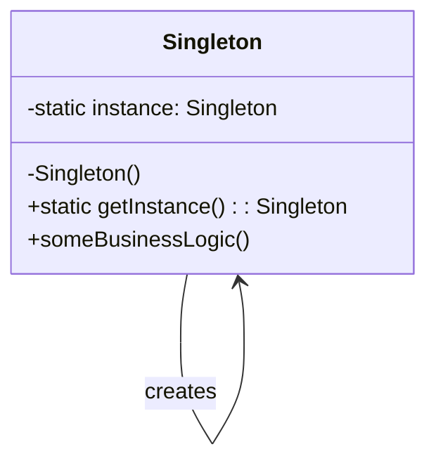

# Java 单例模式

## 什么是单例模式？

单例模式（Singleton Pattern）是Java中最简单的设计模式之一，也是最常用的设计模式之一。这种模式涉及到一个单一的类，该类负责创建自己的对象，同时确保只有单个对象被创建。这个类提供了一种访问其唯一对象的方式，可以直接访问，不需要实例化该类的对象。

:::note
单例模式属于创建型模式，它提供了一种创建对象的最佳方式。
:::

## 为什么需要单例模式？

单例模式的主要目的是：
- 确保一个类只有一个实例
- 提供对该实例的全局访问点
- 控制共享资源的并发访问

在实际应用中，单例模式常用于：
- 配置管理器
- 日志记录器
- 数据库连接池
- 线程池
- 缓存
- 对话框
- 注册表设置

## 单例模式的实现方式

Java中实现单例模式的方式有多种，以下是几种常见的实现方式：

### 1. 懒汉式（线程不安全）

这种方式是最基本的实现方式，但它是线程不安全的：

```java
public class Singleton {
    private static Singleton instance;
    
    // 私有构造函数，防止外部实例化
    private Singleton() {}
    
    // 提供一个全局访问点
    public static Singleton getInstance() {
        if (instance == null) {
            instance = new Singleton();
        }
        return instance;
    }
}
```

:::caution
这种实现方式在多线程环境下可能会创建多个实例，因此不推荐在生产环境中使用。
:::

### 2. 懒汉式（线程安全）

在方法上加入synchronized关键字，使得在同一时间只能有一个线程访问该方法：

```java
public class Singleton {
    private static Singleton instance;
    
    private Singleton() {}
    
    public static synchronized Singleton getInstance() {
        if (instance == null) {
            instance = new Singleton();
        }
        return instance;
    }
}
```

这种方式能够在多线程环境下工作，但效率较低，因为每次获取实例都需要进行同步。

### 3. 双重检查锁定（Double-Checked Locking）

这种方式综合了前两种方式的优点，既能保证线程安全，又能提高性能：

```java
public class Singleton {
    private volatile static Singleton instance;
    
    private Singleton() {}
    
    public static Singleton getInstance() {
        if (instance == null) {
            synchronized (Singleton.class) {
                if (instance == null) {
                    instance = new Singleton();
                }
            }
        }
        return instance;
    }
}
```

:::tip
使用`volatile`关键字可以防止指令重排序，确保在多线程环境下也能正确工作。
:::

### 4. 静态内部类

这种方式利用了类加载机制来保证实例的唯一性：

```java
public class Singleton {
    private Singleton() {}
    
    private static class SingletonHolder {
        private static final Singleton INSTANCE = new Singleton();
    }
    
    public static Singleton getInstance() {
        return SingletonHolder.INSTANCE;
    }
}
```

这种方式是线程安全的，并且实现了懒加载。只有当调用`getInstance()`方法时，内部类才会被加载并创建实例。

### 5. 枚举实现

枚举实现是实现单例模式的最佳方式之一，它不仅能防止多次实例化，还能防止反序列化重新创建新的对象：

```java
public enum Singleton {
    INSTANCE;
    
    public void doSomething() {
        // 业务方法
    }
}
```

使用枚举实现的单例模式不仅可以避免多线程同步问题，还能防止反序列化重新创建新的对象。

## 单例模式的实际应用场景

### 1. 配置管理器

在应用程序中，配置信息通常只需要加载一次，使用单例模式可以确保全局只有一个配置对象：

```java
public class ConfigManager {
    private static ConfigManager instance;
    private Properties properties;
    
    private ConfigManager() {
        properties = new Properties();
        try {
            properties.load(getClass().getClassLoader().getResourceAsStream("config.properties"));
        } catch (IOException e) {
            e.printStackTrace();
        }
    }
    
    public static ConfigManager getInstance() {
        if (instance == null) {
            synchronized (ConfigManager.class) {
                if (instance == null) {
                    instance = new ConfigManager();
                }
            }
        }
        return instance;
    }
    
    public String getProperty(String key) {
        return properties.getProperty(key);
    }
}
```

### 2. 数据库连接池

数据库连接池通常也是单例的，因为它需要管理一组数据库连接：

```java
public class ConnectionPool {
    private static ConnectionPool instance;
    private List<Connection> connections;
    
    private ConnectionPool() {
        connections = new ArrayList<>();
        // 初始化连接池
    }
    
    public static ConnectionPool getInstance() {
        if (instance == null) {
            synchronized (ConnectionPool.class) {
                if (instance == null) {
                    instance = new ConnectionPool();
                }
            }
        }
        return instance;
    }
    
    public synchronized Connection getConnection() {
        // 获取连接的逻辑
        return null; // 示例返回
    }
    
    public synchronized void releaseConnection(Connection connection) {
        // 释放连接的逻辑
    }
}
```

## 单例模式的注意事项

实现单例模式时需要注意以下几点：

1. **私有构造函数**：确保不能从外部创建实例。
2. **线程安全**：在多线程环境下，需要确保只创建一个实例。
3. **延迟加载**：考虑是否需要延迟加载（懒加载）。
4. **序列化问题**：如果单例类需要序列化，需要实现`readResolve()`方法防止反序列化时创建多个实例。

```java
public class Singleton implements Serializable {
    private static final long serialVersionUID = 1L;
    private static Singleton instance = new Singleton();
    
    private Singleton() {}
    
    public static Singleton getInstance() {
        return instance;
    }
    
    // 防止反序列化创建新的实例
    protected Object readResolve() {
        return getInstance();
    }
}
```

## 单例模式的优缺点

### 优点

1. 提供了对唯一实例的受控访问
2. 节省系统资源，避免频繁创建和销毁对象
3. 可以根据需要延迟加载

### 缺点

1. 单例类的职责过重，违反了单一职责原则
2. 单例模式会导致代码结构复杂化
3. 单例模式可能会对测试造成困难
4. 可能会引起并发问题

## 单例模式在框架中的应用

许多流行的Java框架和库中都使用了单例模式：

1. Spring框架中的Bean默认就是单例
2. Hibernate的SessionFactory通常是单例的
3. Java的Runtime类是单例的
4. Java AWT中的Desktop类是单例的

以下是Runtime类的示例：

```java
public class RuntimeExample {
    public static void main(String[] args) {
        // 获取Runtime的单例实例
        Runtime runtime = Runtime.getRuntime();
        
        // 使用Runtime实例
        System.out.println("可用处理器数量: " + runtime.availableProcessors());
        System.out.println("空闲内存: " + runtime.freeMemory() / 1024 / 1024 + "MB");
        System.out.println("最大内存: " + runtime.maxMemory() / 1024 / 1024 + "MB");
        System.out.println("总内存: " + runtime.totalMemory() / 1024 / 1024 + "MB");
    }
}
```

输出示例：
```
可用处理器数量: 8
空闲内存: 123MB
最大内存: 3641MB
总内存: 245MB
```

## 单例模式的代码演示

下面是一个更完整的单例模式示例，实现了一个简单的日志记录器：

```java
public class Logger {
    private static volatile Logger instance;
    private FileWriter writer;
    
    private Logger() {
        try {
            writer = new FileWriter("application.log", true);
        } catch (IOException e) {
            e.printStackTrace();
        }
    }
    
    public static Logger getInstance() {
        if (instance == null) {
            synchronized (Logger.class) {
                if (instance == null) {
                    instance = new Logger();
                }
            }
        }
        return instance;
    }
    
    public void log(String message) {
        try {
            writer.write(new Date() + ": " + message + "\n");
            writer.flush();
        } catch (IOException e) {
            e.printStackTrace();
        }
    }
    
    public void close() {
        try {
            if (writer != null) {
                writer.close();
            }
        } catch (IOException e) {
            e.printStackTrace();
        }
    }
}
```

使用示例：

```java
public class LoggerTest {
    public static void main(String[] args) {
        Logger logger = Logger.getInstance();
        logger.log("应用程序启动");
        
        // 在应用程序的其他部分
        Logger sameLogger = Logger.getInstance();
        sameLogger.log("执行某些操作");
        
        // 验证是否是同一个实例
        System.out.println("logger == sameLogger: " + (logger == sameLogger));
        
        logger.close();
    }
}
```

输出：
```
logger == sameLogger: true
```

并且在application.log文件中会记录：
```
Wed Sep 13 10:15:30 CST 2023: 应用程序启动
Wed Sep 13 10:15:30 CST 2023: 执行某些操作
```

## 单例模式的UML图

以下是单例模式的UML类图：



## 总结

单例模式是一种简单但功能强大的设计模式，它确保一个类只有一个实例，并提供了一个全局访问点。在Java中，根据需求可以采用不同的实现方式，包括懒汉式、饿汉式、双重检查锁定、静态内部类和枚举等。

单例模式在配置管理、资源池、缓存、日志系统等场景下都有广泛应用。正确实现单例模式需要注意线程安全、懒加载和序列化问题，并根据具体需求选择合适的实现方式。

虽然单例模式有诸多优点，但也会导致代码结构复杂化，并可能违反单一职责原则。因此，在使用单例模式时，需要根据实际情况进行权衡。

## 练习

1. 实现一个线程安全的单例模式，并在多线程环境下测试其正确性。
2. 为单例类添加序列化和反序列化支持，确保反序列化不会创建新的实例。
3. 使用单例模式实现一个简单的资源池（如线程池或连接池）。
4. 分析现有代码库中的单例模式使用情况，并评估其实现是否恰当。

## 扩展阅读

- 《Design Patterns: Elements of Reusable Object-Oriented Software》by Gang of Four
- 《Effective Java》by Joshua Bloch (特别是关于单例模式的章节)
- [Oracle Java Documentation](https://docs.oracle.com/javase/tutorial/)
- [Spring Framework Documentation](https://docs.spring.io/spring-framework/docs/current/reference/html/)

祝你学习愉快！