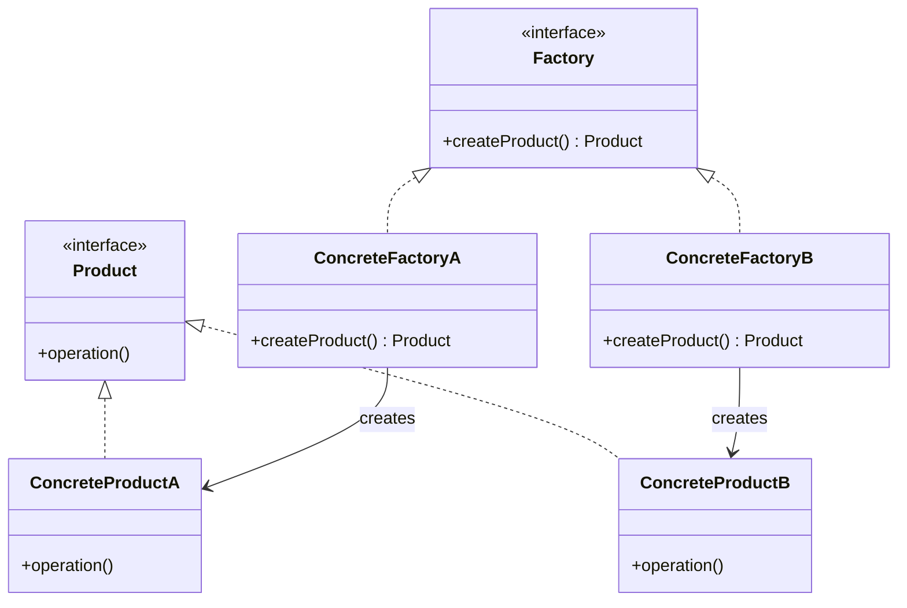
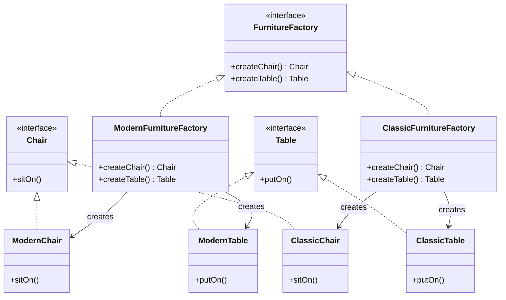

# Java 工厂模式

## 什么是工厂模式？

工厂模式是Java中最常用的设计模式之一，它属于创建型设计模式，提供了一种创建对象的最佳方式。在工厂模式中，我们不会直接使用new操作符来创建对象，而是使用一个工厂类来负责创建产品对象。这样做的好处是将对象的创建与使用分离，使系统更加灵活。

:::note 核心思想
工厂模式的核心思想是：**定义一个创建对象的接口，让子类决定实例化哪一个类**。
:::

## 工厂模式的分类

工厂模式主要分为三种类型：

1. 简单工厂模式(Simple Factory Pattern)
2. 工厂方法模式(Factory Method Pattern)
3. 抽象工厂模式(Abstract Factory Pattern)

下面我们将逐一介绍这三种工厂模式。

## 简单工厂模式

简单工厂模式，也被称为静态工厂方法模式，它是由一个工厂类根据传入的参数，决定创建出哪一种产品类的实例。

### 实现步骤

1. 创建一个接口或抽象类，定义产品的共同行为
2. 创建具体产品类，实现接口或继承抽象类
3. 创建工厂类，包含一个创建产品的方法

### 代码示例

```java
// 步骤1：创建产品接口
interface Shape {
    void draw();
}

// 步骤2：创建具体产品类
class Circle implements Shape {
    @Override
    public void draw() {
        System.out.println("画一个圆形");
    }
}

class Rectangle implements Shape {
    @Override
    public void draw() {
        System.out.println("画一个矩形");
    }
}

class Square implements Shape {
    @Override
    public void draw() {
        System.out.println("画一个正方形");
    }
}

// 步骤3：创建工厂类
class ShapeFactory {
    // 使用getShape方法获取形状类型的对象
    public static Shape getShape(String shapeType) {
        if (shapeType == null) {
            return null;
        }
        if (shapeType.equalsIgnoreCase("CIRCLE")) {
            return new Circle();
        } else if (shapeType.equalsIgnoreCase("RECTANGLE")) {
            return new Rectangle();
        } else if (shapeType.equalsIgnoreCase("SQUARE")) {
            return new Square();
        }
        return null;
    }
}

// 演示类
public class SimpleFactoryDemo {
    public static void main(String[] args) {
        // 获取Circle对象并调用draw方法
        Shape circle = ShapeFactory.getShape("CIRCLE");
        circle.draw();

        // 获取Rectangle对象并调用draw方法
        Shape rectangle = ShapeFactory.getShape("RECTANGLE");
        rectangle.draw();

        // 获取Square对象并调用draw方法
        Shape square = ShapeFactory.getShape("SQUARE");
        square.draw();
    }
}
```

**输出结果：**

```
画一个圆形
画一个矩形
画一个正方形
```

### 简单工厂模式的优缺点

**优点：**
- 将对象的创建与使用分离，客户端不需要知道具体产品类的类名，只需知道参数即可
- 通过参数来决定创建哪种产品实例，避免了复杂的条件判断

**缺点：**
- 工厂类集中了所有产品的创建逻辑，职责过重
- 增加新产品时需要修改工厂类的代码，违反了开闭原则
- 工厂类使用了静态工厂方法，无法形成继承等层次结构

## 工厂方法模式

工厂方法模式是对简单工厂模式的进一步抽象和推广。在工厂方法模式中，我们不再提供一个统一的工厂类来创建所有的对象，而是针对不同的对象提供不同的工厂。

### 实现步骤

1. 创建抽象产品类
2. 创建具体产品类
3. 创建抽象工厂类，包含创建产品的抽象方法
4. 创建具体工厂类，实现抽象方法创建具体产品

### 代码示例

```java
// 步骤1：创建抽象产品类
interface Product {
    void operation();
}

// 步骤2：创建具体产品类
class ConcreteProductA implements Product {
    @Override
    public void operation() {
        System.out.println("ConcreteProductA的操作");
    }
}

class ConcreteProductB implements Product {
    @Override
    public void operation() {
        System.out.println("ConcreteProductB的操作");
    }
}

// 步骤3：创建抽象工厂类
interface Factory {
    Product createProduct();
}

// 步骤4：创建具体工厂类
class ConcreteFactoryA implements Factory {
    @Override
    public Product createProduct() {
        return new ConcreteProductA();
    }
}

class ConcreteFactoryB implements Factory {
    @Override
    public Product createProduct() {
        return new ConcreteProductB();
    }
}

// 演示类
public class FactoryMethodDemo {
    public static void main(String[] args) {
        Factory factoryA = new ConcreteFactoryA();
        Product productA = factoryA.createProduct();
        productA.operation();

        Factory factoryB = new ConcreteFactoryB();
        Product productB = factoryB.createProduct();
        productB.operation();
    }
}
```

**输出结果：**

```
ConcreteProductA的操作
ConcreteProductB的操作
```

### 工厂方法模式的类图



### 工厂方法模式的优缺点

**优点：**
- 遵循了开闭原则，增加新产品时只需添加具体产品类和对应的工厂类
- 符合单一职责原则，每个工厂只负责创建对应的产品
- 更加符合面向对象的设计原则，每个具体工厂类只负责创建对应的产品

**缺点：**
- 类的个数成对增加，增加了系统的复杂度
- 增加了系统的抽象性和理解难度

## 抽象工厂模式

抽象工厂模式是工厂方法模式的升级版本，它提供一个创建一系列相关或相互依赖对象的接口，而无需指定它们具体的类。

### 实现步骤

1. 创建抽象产品族（多个抽象产品）
2. 创建具体产品
3. 创建抽象工厂
4. 创建具体工厂

### 代码示例

假设我们要创建不同风格（现代和古典）的家具（椅子和桌子）：

```java
// 步骤1：创建抽象产品族
// 抽象椅子
interface Chair {
    void sitOn();
}

// 抽象桌子
interface Table {
    void putOn();
}

// 步骤2：创建具体产品
// 现代风格椅子
class ModernChair implements Chair {
    @Override
    public void sitOn() {
        System.out.println("坐在现代风格的椅子上");
    }
}

// 古典风格椅子
class ClassicChair implements Chair {
    @Override
    public void sitOn() {
        System.out.println("坐在古典风格的椅子上");
    }
}

// 现代风格桌子
class ModernTable implements Table {
    @Override
    public void putOn() {
        System.out.println("在现代风格的桌子上放东西");
    }
}

// 古典风格桌子
class ClassicTable implements Table {
    @Override
    public void putOn() {
        System.out.println("在古典风格的桌子上放东西");
    }
}

// 步骤3：创建抽象工厂
interface FurnitureFactory {
    Chair createChair();
    Table createTable();
}

// 步骤4：创建具体工厂
// 现代家具工厂
class ModernFurnitureFactory implements FurnitureFactory {
    @Override
    public Chair createChair() {
        return new ModernChair();
    }

    @Override
    public Table createTable() {
        return new ModernTable();
    }
}

// 古典家具工厂
class ClassicFurnitureFactory implements FurnitureFactory {
    @Override
    public Chair createChair() {
        return new ClassicChair();
    }

    @Override
    public Table createTable() {
        return new ClassicTable();
    }
}

// 演示类
public class AbstractFactoryDemo {
    public static void main(String[] args) {
        // 创建现代风格家具
        FurnitureFactory modernFactory = new ModernFurnitureFactory();
        Chair modernChair = modernFactory.createChair();
        Table modernTable = modernFactory.createTable();
        
        modernChair.sitOn();
        modernTable.putOn();
        
        // 创建古典风格家具
        FurnitureFactory classicFactory = new ClassicFurnitureFactory();
        Chair classicChair = classicFactory.createChair();
        Table classicTable = classicFactory.createTable();
        
        classicChair.sitOn();
        classicTable.putOn();
    }
}
```

**输出结果：**

```
坐在现代风格的椅子上
在现代风格的桌子上放东西
坐在古典风格的椅子上
在古典风格的桌子上放东西
```

### 抽象工厂模式的类图



### 抽象工厂模式的优缺点

**优点：**
- 抽象工厂模式可以确保一系列相关产品的一致性（例如同一风格的不同家具）
- 符合开闭原则，当需要增加一个新的产品族时，只需增加相应的具体工厂类
- 有利于产品的一致性，防止混用不同系列的产品

**缺点：**
- 难以支持新种类的产品。如果需要添加新产品（如衣柜），需要修改抽象工厂接口及所有实现类
- 系统的复杂度增加，接口和类太多，增加学习成本

## 工厂模式的实际应用场景

工厂模式在Java开发中广泛应用，以下是一些常见的应用场景：

### 1. Java Collection Framework

Java集合框架中的`Collections`类就包含许多静态工厂方法：

```java
// 创建不可变集合的工厂方法
List<String> list = Collections.unmodifiableList(new ArrayList<>());
```

### 2. JDBC连接数据库

```java
// 通过工厂方法获取数据库连接
Connection conn = DriverManager.getConnection("jdbc:mysql://localhost:3306/db_name", "username", "password");
```

### 3. Spring框架中的BeanFactory

Spring框架中的BeanFactory使用了工厂模式，它根据配置创建不同的Bean实例。

```java
// 从Spring容器获取Bean实例的工厂方法
UserService userService = context.getBean(UserService.class);
```

### 4. GUI框架中的按钮创建

```java
// 基于不同操作系统创建不同外观的按钮
Button button = GUIFactory.createButton(osType);
```

### 5. 日志记录器的创建

```java
// 创建不同类型的日志记录器
Logger logger = LoggerFactory.getLogger(LoggerType.FILE);
```

## 工厂模式的选择建议

:::tip 如何选择适合的工厂模式？
- **简单工厂**：当创建的产品较少且不会频繁新增产品时，可以使用简单工厂模式。
- **工厂方法**：当需要新增产品，并且不希望修改已有代码时，使用工厂方法模式。
- **抽象工厂**：当需要创建一系列相互关联的产品族时，使用抽象工厂模式。
:::

## 总结

工厂模式是Java中非常重要的创建型设计模式，它将对象的创建与使用分离，使系统更加灵活。我们学习了三种工厂模式：

1. **简单工厂模式**：使用一个工厂类根据参数创建不同的产品实例。
2. **工厂方法模式**：定义一个创建对象的接口，但由子类决定要实例化的类是哪一个。
3. **抽象工厂模式**：提供一个创建一系列相关或相互依赖对象的接口，而无需指定它们具体的类。

工厂模式在我们日常的Java编程中有着广泛的应用。掌握这些模式有助于我们设计出更加灵活、可扩展的系统。

## 练习题

1. 使用简单工厂模式设计一个计算器程序，能够进行加、减、乘、除运算。
2. 使用工厂方法模式设计一个文件读取系统，可以读取不同格式的文件（如TXT、XML、JSON等）。
3. 使用抽象工厂模式设计一个跨平台UI系统，可以在不同操作系统上创建统一风格的按钮、文本框等UI组件。

## 附加资源

- 《Head First 设计模式》- Eric Freeman等著
- 《设计模式：可复用面向对象软件的基础》- GoF (Gang of Four)著
- [Java设计模式：工厂模式](https://refactoringguru.cn/design-patterns/factory-method) - Refactoring Guru网站

通过学习和应用这些工厂模式，你将能够更好地组织和设计你的Java应用程序，使其更加灵活和可维护。