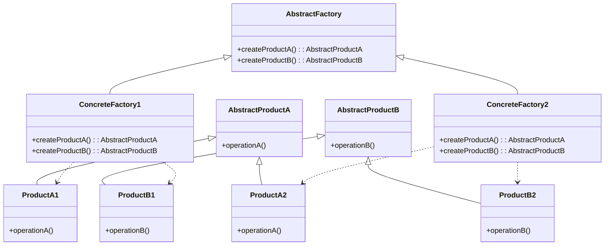

# Java 抽象工厂

## 什么是抽象工厂模式？

抽象工厂模式（Abstract Factory Pattern）是一种创建型设计模式，它提供了一种方式，可以将一组具有相同主题的单个工厂封装起来。简单来说，抽象工厂模式是工厂模式的升级版，它提供一个创建一系列相关或互相依赖对象的接口，而无需指定它们具体的类。

抽象工厂模式解决的核心问题是：**如何创建一系列相关联的产品，而不需要依赖它们的具体类**。

:::tip
抽象工厂模式与工厂方法模式的区别：工厂方法模式针对的是一个产品等级结构，而抽象工厂模式则是针对的多个产品等级结构。
:::

## 抽象工厂模式的结构



抽象工厂模式由以下几个关键部分组成：

1. **抽象产品（Abstract Product）**：定义产品的接口
2. **具体产品（Concrete Product）**：实现抽象产品接口的具体产品
3. **抽象工厂（Abstract Factory）**：声明了一组用于创建产品的方法
4. **具体工厂（Concrete Factory）**：实现了抽象工厂的接口，创建一系列具体产品

## 抽象工厂模式实现步骤

让我们通过一个电子设备制造的例子来演示抽象工厂模式：

### 第一步：创建抽象产品类

```java
// 抽象手机产品
public interface Phone {
    void call();
    void sendSMS();
}

// 抽象电脑产品
public interface Computer {
    void browse();
    void code();
}
```

### 第二步：创建具体产品类

```java
// 小米手机
public class MiPhone implements Phone {
    @Override
    public void call() {
        System.out.println("使用小米手机打电话");
    }

    @Override
    public void sendSMS() {
        System.out.println("使用小米手机发短信");
    }
}

// 苹果手机
public class ApplePhone implements Phone {
    @Override
    public void call() {
        System.out.println("使用苹果手机打电话");
    }

    @Override
    public void sendSMS() {
        System.out.println("使用苹果手机发短信");
    }
}

// 小米电脑
public class MiComputer implements Computer {
    @Override
    public void browse() {
        System.out.println("使用小米电脑浏览网页");
    }

    @Override
    public void code() {
        System.out.println("使用小米电脑编写代码");
    }
}

// 苹果电脑
public class AppleComputer implements Computer {
    @Override
    public void browse() {
        System.out.println("使用苹果电脑浏览网页");
    }

    @Override
    public void code() {
        System.out.println("使用苹果电脑编写代码");
    }
}
```

### 第三步：创建抽象工厂接口

```java
// 电子产品工厂接口
public interface ElectronicsFactory {
    Phone createPhone();
    Computer createComputer();
}
```

### 第四步：创建具体工厂类

```java
// 小米工厂
public class MiFactory implements ElectronicsFactory {
    @Override
    public Phone createPhone() {
        return new MiPhone();
    }

    @Override
    public Computer createComputer() {
        return new MiComputer();
    }
}

// 苹果工厂
public class AppleFactory implements ElectronicsFactory {
    @Override
    public Phone createPhone() {
        return new ApplePhone();
    }

    @Override
    public Computer createComputer() {
        return new AppleComputer();
    }
}
```

### 第五步：客户端使用抽象工厂

```java
public class Client {
    public static void main(String[] args) {
        // 使用小米工厂
        ElectronicsFactory miFactory = new MiFactory();
        Phone miPhone = miFactory.createPhone();
        Computer miComputer = miFactory.createComputer();
        
        miPhone.call();
        miPhone.sendSMS();
        miComputer.browse();
        miComputer.code();
        
        System.out.println("------------------------");
        
        // 使用苹果工厂
        ElectronicsFactory appleFactory = new AppleFactory();
        Phone applePhone = appleFactory.createPhone();
        Computer appleComputer = appleFactory.createComputer();
        
        applePhone.call();
        applePhone.sendSMS();
        appleComputer.browse();
        appleComputer.code();
    }
}
```

### 运行结果

```
使用小米手机打电话
使用小米手机发短信
使用小米电脑浏览网页
使用小米电脑编写代码
------------------------
使用苹果手机打电话
使用苹果手机发短信
使用苹果电脑浏览网页
使用苹果电脑编写代码
```

## 抽象工厂的适用场景

抽象工厂模式适用于以下场景：

1. 系统需要独立于它的产品的创建、组合和表示
2. 系统需要配置多个产品系列中的一个
3. 强调一系列相关产品的设计以便进行联合使用
4. 提供一个产品类库，而只想显示它们的接口而不是实现

## 抽象工厂的优缺点

### 优点

1. **提供一种创建一系列相关对象的方法**：客户端无需关心创建细节，只关心产品接口
2. **隔离了具体类的生成**：客户端与具体产品解耦
3. **保证了产品之间的一致性**：同一工厂生产的产品必然是配套的

### 缺点

1. **扩展新的产品类很困难**：如果要增加新的产品类型，需要修改抽象工厂接口及其所有实现类
2. **产品族难以扩展新的产品**：增加新产品等级结构需要对原有的系统进行较大的修改

## 实际应用案例：UI组件库

假设我们需要为不同的操作系统（如Windows和macOS）创建不同风格的UI组件。

```java
// 按钮接口
public interface Button {
    void render();
    void onClick();
}

// Windows风格按钮
public class WindowsButton implements Button {
    @Override
    public void render() {
        System.out.println("渲染Windows风格的按钮");
    }

    @Override
    public void onClick() {
        System.out.println("Windows按钮点击事件");
    }
}

// macOS风格按钮
public class MacOSButton implements Button {
    @Override
    public void render() {
        System.out.println("渲染macOS风格的按钮");
    }

    @Override
    public void onClick() {
        System.out.println("macOS按钮点击事件");
    }
}

// 复选框接口
public interface Checkbox {
    void render();
    void toggle();
}

// Windows风格复选框
public class WindowsCheckbox implements Checkbox {
    @Override
    public void render() {
        System.out.println("渲染Windows风格的复选框");
    }

    @Override
    public void toggle() {
        System.out.println("Windows复选框切换状态");
    }
}

// macOS风格复选框
public class MacOSCheckbox implements Checkbox {
    @Override
    public void render() {
        System.out.println("渲染macOS风格的复选框");
    }

    @Override
    public void toggle() {
        System.out.println("macOS复选框切换状态");
    }
}

// UI工厂接口
public interface GUIFactory {
    Button createButton();
    Checkbox createCheckbox();
}

// Windows UI工厂
public class WindowsFactory implements GUIFactory {
    @Override
    public Button createButton() {
        return new WindowsButton();
    }

    @Override
    public Checkbox createCheckbox() {
        return new WindowsCheckbox();
    }
}

// macOS UI工厂
public class MacOSFactory implements GUIFactory {
    @Override
    public Button createButton() {
        return new MacOSButton();
    }

    @Override
    public Checkbox createCheckbox() {
        return new MacOSCheckbox();
    }
}

// 应用程序类
public class Application {
    private Button button;
    private Checkbox checkbox;

    public Application(GUIFactory factory) {
        button = factory.createButton();
        checkbox = factory.createCheckbox();
    }

    public void render() {
        button.render();
        checkbox.render();
    }
}

// 客户端代码
public class Demo {
    private static Application configureApplication() {
        Application app;
        GUIFactory factory;
        String osName = System.getProperty("os.name").toLowerCase();

        if (osName.contains("windows")) {
            factory = new WindowsFactory();
        } else {
            factory = new MacOSFactory();
        }

        app = new Application(factory);
        return app;
    }

    public static void main(String[] args) {
        Application app = configureApplication();
        app.render();
    }
}
```

在这个例子中，我们根据当前操作系统自动选择适合的UI工厂，从而创建适合当前系统风格的UI组件。这种方式使得应用程序可以在不同的操作系统上保持一致的外观和行为，同时尊重每个操作系统的特定UI风格。

## JDK中的抽象工厂模式

JDK中也有抽象工厂模式的应用，比如`javax.xml.parsers.DocumentBuilderFactory`和`javax.xml.transform.TransformerFactory`类。

```java
// 使用DocumentBuilderFactory的例子
DocumentBuilderFactory factory = DocumentBuilderFactory.newInstance();
DocumentBuilder builder = factory.newDocumentBuilder();
Document document = builder.parse(new File("config.xml"));
```

在这个例子中，`DocumentBuilderFactory`是一个抽象工厂，它可以创建不同的XML解析器。不同的JDK实现可能会提供不同的具体工厂实现。

## 抽象工厂模式与其他设计模式的关系

1. **工厂方法模式**：抽象工厂模式通常基于一组工厂方法来实现，但也可以使用原型模式来实现
2. **单例模式**：抽象工厂类通常实现为单例
3. **建造者模式**：抽象工厂关注于产品的系列，而建造者关注于如何一步步构建一个复杂对象

## 总结

抽象工厂模式是一种强大的创建型设计模式，它提供了一种机制，使得客户端可以创建一系列相关的产品对象，而无需指定它们的具体类。这种设计模式在需要管理多个相关产品系列时特别有用。

抽象工厂模式的关键点：

1. 提供一个接口，用于创建相关或依赖对象的家族，而不需要明确指定具体类
2. 将客户端与特定的产品实现代码分离
3. 使得切换产品系列变得容易，只需要切换工厂
4. 促进产品的一致性，确保兼容性

:::caution
请记住，虽然抽象工厂模式有很多优点，但它也增加了代码的复杂性。如果你的系统只需要创建单一类型的产品，使用工厂方法模式会更简单。
:::

## 练习

1. 设计一个抽象工厂模式来创建不同风格的家具（如椅子、沙发、咖啡桌等）。
2. 使用抽象工厂模式设计一个游戏，可以创建不同种族的角色（如人类、精灵、兽人等），每个种族有不同类型的单位（如战士、法师、射手等）。
3. 扩展本文中的电子产品工厂，增加"耳机"作为新的产品类型。

## 进一步学习资源

- 《Head First 设计模式》 - Eric Freeman, Elisabeth Robson
- 《设计模式：可复用面向对象软件的基础》 - Erich Gamma, Richard Helm, Ralph Johnson, John Vlissides
- [Refactoring.Guru - 抽象工厂模式](https://refactoring.guru/design-patterns/abstract-factory)

通过深入理解和练习抽象工厂模式，你将能够更灵活地设计和实现需要创建多系列相关对象的软件系统。