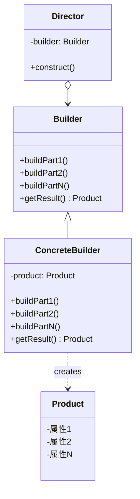

# Java 建造者模式

## 什么是建造者模式？

建造者模式（Builder Pattern）是一种创建型设计模式，它将一个复杂对象的构建过程与其表示分离，使同样的构建过程可以创建不同的表示。简单来说，建造者模式允许我们一步一步创建一个复杂的对象，而不必一次性指定所有参数。

这种模式特别适用于创建具有多个可选参数的复杂对象，能够避免"重叠构造函数"（telescoping constructor）的问题。

:::tip 核心思想
将对象的构建逻辑与表示逻辑分离，使构建过程更加灵活。
:::

## 为什么需要建造者模式？

假设我们有一个`User`类，它包含多个字段，其中一些是必需的，一些是可选的：

```java
public class User {
    // 必需参数
    private final String firstName;
    private final String lastName;
    
    // 可选参数
    private final int age;
    private final String phone;
    private final String address;
    
    // 构造函数
    public User(String firstName, String lastName, int age, String phone, String address) {
        this.firstName = firstName;
        this.lastName = lastName;
        this.age = age;
        this.phone = phone;
        this.address = address;
    }
    
    // Getters...
}
```

创建`User`对象时，我们面临以下问题：

1. **构造函数参数过多**：调用构造函数时需要记住参数顺序，容易出错
2. **可选参数处理困难**：如果只想设置部分可选参数，传统方式需要创建多个构造函数
3. **参数顺序固定**：构造函数参数顺序固定，不够灵活

## 建造者模式的结构

建造者模式通常由以下几个部分组成：



- **Product**：被构建的复杂对象
- **Builder**：抽象建造者，规定创建对象的步骤
- **ConcreteBuilder**：具体建造者，实现构建步骤
- **Director**：指挥者，控制构建过程（可选）

## 使用建造者模式改造User类

下面是使用建造者模式重构`User`类的例子：

```java
public class User {
    // 必需参数
    private final String firstName;
    private final String lastName;
    
    // 可选参数
    private final int age;
    private final String phone;
    private final String address;
    
    private User(UserBuilder builder) {
        this.firstName = builder.firstName;
        this.lastName = builder.lastName;
        this.age = builder.age;
        this.phone = builder.phone;
        this.address = builder.address;
    }
    
    // Getters...
    public String getFirstName() {
        return firstName;
    }
    
    public String getLastName() {
        return lastName;
    }
    
    public int getAge() {
        return age;
    }
    
    public String getPhone() {
        return phone;
    }
    
    public String getAddress() {
        return address;
    }
    
    @Override
    public String toString() {
        return "User: " + firstName + " " + lastName + ", " + age + " years old, " +
               "phone: " + phone + ", address: " + address;
    }
    
    // 静态内部类Builder
    public static class UserBuilder {
        // 必需参数
        private final String firstName;
        private final String lastName;
        
        // 可选参数 - 初始化为默认值
        private int age = 0;
        private String phone = "";
        private String address = "";
        
        // 构造函数仅包含必需参数
        public UserBuilder(String firstName, String lastName) {
            this.firstName = firstName;
            this.lastName = lastName;
        }
        
        // 设置可选参数的方法，返回this以便链式调用
        public UserBuilder age(int age) {
            this.age = age;
            return this;
        }
        
        public UserBuilder phone(String phone) {
            this.phone = phone;
            return this;
        }
        
        public UserBuilder address(String address) {
            this.address = address;
            return this;
        }
        
        // build方法构建最终的User对象
        public User build() {
            return new User(this);
        }
    }
}
```

### 如何使用

使用建造者模式创建`User`对象非常简洁明了：

```java
public class BuilderDemo {
    public static void main(String[] args) {
        User user1 = new User.UserBuilder("John", "Doe")
                .age(30)
                .phone("1234567890")
                .address("123 Main St")
                .build();
        
        User user2 = new User.UserBuilder("Jane", "Smith")
                .age(25)
                .build();  // 不设置phone和address
        
        System.out.println(user1);
        System.out.println(user2);
    }
}
```

**输出结果**：
```
User: John Doe, 30 years old, phone: 1234567890, address: 123 Main St
User: Jane Smith, 25 years old, phone: , address: 
```

## 建造者模式的优缺点

### 优点

1. **分步创建**：可以一步一步创建对象，更好控制创建过程
2. **链式调用**：支持方法链式调用，代码更易读
3. **参数明确**：每个setter方法名清楚表明其设置的参数
4. **不变性**：最终产品可以是不可变对象
5. **灵活性**：相同的构建过程可以创建不同表示的对象

### 缺点

1. **代码量增加**：需要创建额外的Builder类
2. **多一层封装**：引入额外的复杂性
3. **不适用于简单对象**：对于参数较少的简单对象，建造者模式可能显得过度设计

## 实际应用场景

建造者模式在Java开发中有许多实际应用场景：

### 1. Java标准库中的StringBuilder

`StringBuilder`是Java中典型的建造者模式应用：

```java
StringBuilder builder = new StringBuilder();
builder.append("Hello")
       .append(" ")
       .append("World")
       .append("!");
String result = builder.toString();
System.out.println(result); // 输出: Hello World!
```

### 2. Lombok库的@Builder注解

Lombok库提供了`@Builder`注解，可以自动生成建造者模式代码：

```java
import lombok.Builder;
import lombok.ToString;

@Builder
@ToString
public class Person {
    private String name;
    private int age;
    private String address;
}

// 使用方式
Person person = Person.builder()
                      .name("Alice")
                      .age(30)
                      .address("New York")
                      .build();
```

### 3. OkHttp客户端

流行的HTTP客户端OkHttp使用建造者模式创建请求：

```java
Request request = new Request.Builder()
    .url("https://api.example.com/data")
    .header("User-Agent", "OkHttp Example")
    .get()
    .build();
```

### 4. 复杂对象配置

任何需要大量配置的复杂对象都适合使用建造者模式，如数据库连接池配置：

```java
DatabaseConfig config = new DatabaseConfig.Builder()
    .url("jdbc:mysql://localhost:3306/mydb")
    .username("user")
    .password("pass")
    .poolSize(10)
    .timeout(30)
    .sslEnabled(true)
    .build();
```

## 建造者模式变种：链式Setter

除了标准的建造者模式外，还有一种常见的变体是使用链式setter方法：

```java
public class Product {
    private String part1;
    private String part2;
    private String part3;
    
    public Product setPart1(String part1) {
        this.part1 = part1;
        return this;
    }
    
    public Product setPart2(String part2) {
        this.part2 = part2;
        return this;
    }
    
    public Product setPart3(String part3) {
        this.part3 = part3;
        return this;
    }
    
    @Override
    public String toString() {
        return "Product{part1='" + part1 + "', part2='" + part2 + "', part3='" + part3 + "'}";
    }
}
```

使用方式：

```java
Product product = new Product()
    .setPart1("A")
    .setPart2("B")
    .setPart3("C");
System.out.println(product);
```

这种方式更简单，但缺点是不支持创建不可变对象。

:::caution 注意
链式Setter的方式虽然简单，但对象在创建后仍可修改，无法保证不变性。标准建造者模式更适合创建不可变对象。
:::

## 建造者模式与其他创建型模式的比较

### 建造者模式 vs 工厂模式

- **工厂模式**：关注于创建不同类型的对象
- **建造者模式**：关注于如何一步步构建复杂对象

### 建造者模式 vs 抽象工厂模式

- **抽象工厂模式**：创建相关对象家族
- **建造者模式**：通过多个步骤组装复杂对象

## 练习题

1. 创建一个`Pizza`类，使用建造者模式允许添加不同的配料（cheese, pepperoni, mushrooms等）。

2. 修改本文中的`User`类，添加对年龄的验证（例如，不能小于0），并在`build()`方法中实现验证逻辑。

3. 实现一个邮件发送器类`EmailBuilder`，使用建造者模式设置收件人、主题、内容、附件等。

## 总结

建造者模式是处理复杂对象创建的强大工具，特别适用于：

- 创建具有大量可选参数的对象
- 需要分步骤构建对象
- 希望确保对象创建后的不变性
- 提高代码可读性和可维护性

掌握建造者模式将帮助你写出更清晰、更灵活的代码，有效避免构造函数参数过多的问题。在实际开发中，合理运用建造者模式能够显著提高代码质量。

## 扩展资源

- 《设计模式：可复用面向对象软件的基础》- GoF经典书籍
- 《Effective Java》第2项：遇到多个构造器参数时要考虑用构建器
- [Java Design Patterns](https://java-design-patterns.com/patterns/builder/) - 建造者模式详解

继续练习和应用这一模式，你将能够在实际项目中更自信地创建复杂对象！