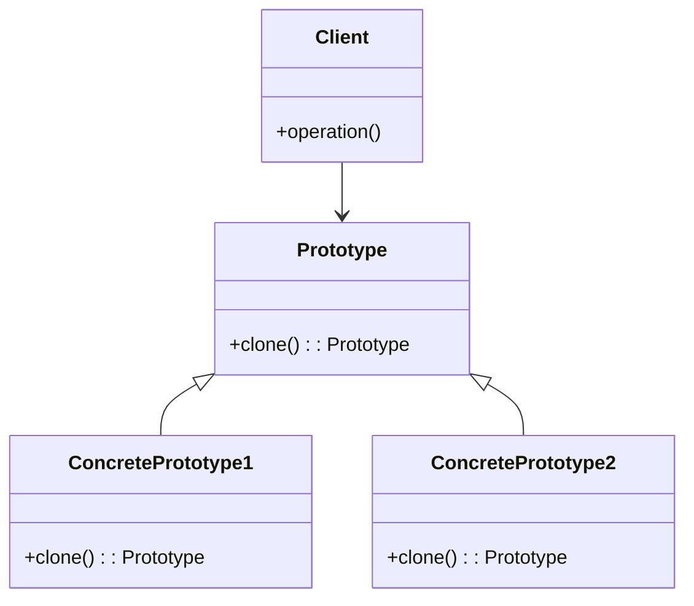

# Java 原型模式

## 什么是原型模式？

原型模式(Prototype Pattern)是一种创建型设计模式，它通过复制（克隆）一个已经存在的对象，而不是通过实例化新对象的方式来创建对象。这种模式在需要创建大量相似对象的情况下特别有用，可以显著提高系统性能并减少实例化的开销。

:::tip 核心思想
原型模式的核心思想是：**通过克隆现有对象来创建新对象**，而不是通过使用构造函数。
:::

## 为什么需要原型模式？

在以下情况下，原型模式特别有用：

1. **创建对象的成本较高**：如果对象的创建过程很复杂、耗时或资源密集，使用克隆会更高效。
2. **需要避免重复初始化**：当对象初始化需要大量数据加载，而这些数据在多个实例之间相似时。
3. **需要保持对象的状态**：当你需要创建一个与现有对象状态相同的新对象时。
4. **减少子类的数量**：当系统中有许多可能的对象配置，而这些配置可以通过克隆现有配置来实现时。

## 原型模式的UML类图



## 在Java中实现原型模式

在Java中，原型模式主要通过实现`Cloneable`接口并重写`Object`类的`clone()`方法来实现。

### 基本实现

下面我们来看一个基本的实现示例：

```java
// 原型接口
public interface Shape extends Cloneable {
    Shape clone();
    void draw();
}

// 具体原型类 - 圆形
public class Circle implements Shape {
    private String color;

    public Circle(String color) {
        this.color = color;
    }

    public void setColor(String color) {
        this.color = color;
    }

    @Override
    public Shape clone() {
        try {
            return (Circle) super.clone();
        } catch (CloneNotSupportedException e) {
            e.printStackTrace();
            return null;
        }
    }

    @Override
    public void draw() {
        System.out.println("绘制 " + color + " 的圆形");
    }
}

// 具体原型类 - 矩形
public class Rectangle implements Shape {
    private String color;

    public Rectangle(String color) {
        this.color = color;
    }

    public void setColor(String color) {
        this.color = color;
    }

    @Override
    public Shape clone() {
        try {
            return (Rectangle) super.clone();
        } catch (CloneNotSupportedException e) {
            e.printStackTrace();
            return null;
        }
    }

    @Override
    public void draw() {
        System.out.println("绘制 " + color + " 的矩形");
    }
}

// 客户端代码
public class PrototypePatternDemo {
    public static void main(String[] args) {
        Circle originalCircle = new Circle("红色");
        Circle clonedCircle = (Circle) originalCircle.clone();
        clonedCircle.setColor("蓝色");
        
        Rectangle originalRectangle = new Rectangle("绿色");
        Rectangle clonedRectangle = (Rectangle) originalRectangle.clone();
        clonedRectangle.setColor("黄色");
        
        originalCircle.draw();  // 输出: 绘制 红色 的圆形
        clonedCircle.draw();    // 输出: 绘制 蓝色 的圆形
        
        originalRectangle.draw(); // 输出: 绘制 绿色 的矩形
        clonedRectangle.draw();   // 输出: 绘制 黄色 的矩形
    }
}
```

:::caution 注意
Java的`clone()`方法默认执行的是浅拷贝，对于包含引用类型的对象，可能需要实现深拷贝。
:::

## 浅拷贝与深拷贝

### 浅拷贝(Shallow Copy)

浅拷贝只复制对象的基本类型字段值，而对于引用类型，仅复制引用而不复制引用指向的对象。这意味着原始对象和克隆对象会共享引用类型的成员变量。

### 深拷贝(Deep Copy)

深拷贝不仅复制对象的基本类型字段值，还递归地复制引用类型字段指向的对象。这样，原始对象和克隆对象就完全独立，互不影响。

### 深拷贝示例

```java
public class Employee implements Cloneable {
    private String name;
    private Department department;

    public Employee(String name, Department department) {
        this.name = name;
        this.department = department;
    }

    // 深拷贝实现
    @Override
    public Employee clone() {
        try {
            Employee cloned = (Employee) super.clone();
            // 对引用类型成员变量进行克隆
            cloned.department = this.department.clone();
            return cloned;
        } catch (CloneNotSupportedException e) {
            e.printStackTrace();
            return null;
        }
    }

    // getter和setter
    public String getName() { return name; }
    public void setName(String name) { this.name = name; }
    public Department getDepartment() { return department; }
    public void setDepartment(Department department) { this.department = department; }
}

public class Department implements Cloneable {
    private String name;

    public Department(String name) {
        this.name = name;
    }

    @Override
    public Department clone() {
        try {
            return (Department) super.clone();
        } catch (CloneNotSupportedException e) {
            e.printStackTrace();
            return null;
        }
    }

    // getter和setter
    public String getName() { return name; }
    public void setName(String name) { this.name = name; }
}
```

使用深拷贝示例：

```java
public class DeepCopyDemo {
    public static void main(String[] args) {
        Department hr = new Department("人力资源部");
        Employee original = new Employee("张三", hr);
        
        // 克隆员工
        Employee cloned = original.clone();
        
        // 修改克隆员工的部门名称
        cloned.getDepartment().setName("研发部");
        
        // 原始员工的部门名称不受影响
        System.out.println("原始员工: " + original.getName() + ", 部门: " + original.getDepartment().getName());
        System.out.println("克隆员工: " + cloned.getName() + ", 部门: " + cloned.getDepartment().getName());
    }
}
```

输出结果：
```
原始员工: 张三, 部门: 人力资源部
克隆员工: 张三, 部门: 研发部
```

## 原型模式的另一种实现方式：原型管理器

在一些场景下，我们可能需要管理多个原型对象，这时候可以使用原型管理器（Prototype Registry）来存储和检索原型对象。

```java
import java.util.HashMap;
import java.util.Map;

public class ShapeRegistry {
    private static Map<String, Shape> shapeMap = new HashMap<>();
    
    // 静态初始化块，初始化形状原型
    static {
        shapeMap.put("circle", new Circle("默认颜色"));
        shapeMap.put("rectangle", new Rectangle("默认颜色"));
    }
    
    // 通过形状类型获取克隆对象
    public static Shape getShape(String shapeType) {
        Shape cachedShape = shapeMap.get(shapeType);
        return cachedShape.clone();
    }
    
    // 添加新原型
    public static void addShape(String key, Shape shape) {
        shapeMap.put(key, shape);
    }
}

// 使用原型注册表
public class PrototypeRegistryDemo {
    public static void main(String[] args) {
        // 获取预定义原型的克隆
        Shape circle1 = ShapeRegistry.getShape("circle");
        circle1.draw();  // 输出: 绘制 默认颜色 的圆形
        
        // 修改后不影响原型
        ((Circle)circle1).setColor("红色");
        circle1.draw();  // 输出: 绘制 红色 的圆形
        
        // 再次获取，仍是原始颜色
        Shape circle2 = ShapeRegistry.getShape("circle");
        circle2.draw();  // 输出: 绘制 默认颜色 的圆形
        
        // 添加新原型
        Circle blueCircle = new Circle("蓝色");
        ShapeRegistry.addShape("blueCircle", blueCircle);
        
        // 获取新添加的原型克隆
        Shape circle3 = ShapeRegistry.getShape("blueCircle");
        circle3.draw();  // 输出: 绘制 蓝色 的圆形
    }
}
```

## 实际应用场景

原型模式在以下场景中特别有用：

1. **图形编辑器**：用户可以复制已有的图形对象来创建新图形。

2. **游戏开发**：快速创建大量相似的游戏对象，如敌人、障碍物等。

3. **配置对象**：当应用程序需要创建多个具有相似配置的对象时。

4. **数据库操作**：在ORM框架中，通过克隆现有对象来创建新的数据库记录。

5. **缓存系统**：从缓存中复制对象，避免重复创建相同的对象。

### 实例：文档对象模型

```java
public class DocumentItem implements Cloneable {
    private String content;
    private String style;
    private int position;

    public DocumentItem(String content, String style, int position) {
        this.content = content;
        this.style = style;
        this.position = position;
    }

    @Override
    public DocumentItem clone() {
        try {
            return (DocumentItem) super.clone();
        } catch (CloneNotSupportedException e) {
            e.printStackTrace();
            return null;
        }
    }

    // getter和setter
    public String getContent() { return content; }
    public void setContent(String content) { this.content = content; }
    public String getStyle() { return style; }
    public void setStyle(String style) { this.style = style; }
    public int getPosition() { return position; }
    public void setPosition(int position) { this.position = position; }

    @Override
    public String toString() {
        return "DocumentItem [content=" + content + ", style=" + style + ", position=" + position + "]";
    }
}

public class DocumentEditor {
    public static void main(String[] args) {
        // 创建原始文档项
        DocumentItem heading = new DocumentItem("标题", "heading-large", 0);
        System.out.println("原始标题: " + heading);
        
        // 复制标题并修改
        DocumentItem subHeading = heading.clone();
        subHeading.setContent("副标题");
        subHeading.setStyle("heading-medium");
        subHeading.setPosition(1);
        
        System.out.println("副标题: " + subHeading);
        System.out.println("原始标题(未变): " + heading);
    }
}
```

输出结果：
```
原始标题: DocumentItem [content=标题, style=heading-large, position=0]
副标题: DocumentItem [content=副标题, style=heading-medium, position=1]
原始标题(未变): DocumentItem [content=标题, style=heading-large, position=0]
```

## 原型模式的优缺点

### 优点
1. **减少子类的创建**：可以通过克隆现有对象来创建新对象，而不需要为每种对象配置创建一个专门的类。
2. **动态添加或删除产品**：可以在运行时动态地增加或减少产品类。
3. **降低系统的耦合度**：原型模式让客户端可以使用抽象原型类来声明所需对象，而无需关心具体类型。
4. **提高性能**：避免了使用构造函数创建对象带来的开销，特别是对象创建成本较高时。

### 缺点
1. **深拷贝的实现复杂**：如果对象结构复杂，包含多层引用，实现深拷贝可能比较困难。
2. **违反开闭原则**：如果需要为类增加克隆方法，可能需要修改现有的类。
3. **构造函数不会执行**：克隆操作不会调用对象的构造方法，这可能导致一些意外问题。

## 总结

原型模式是一种通过克隆现有对象来创建新对象的设计模式，它在需要创建大量相似对象或避免重复初始化对象时特别有用。在Java中，通过实现`Cloneable`接口并重写`clone()`方法可以轻松实现原型模式。根据需要，可以选择浅拷贝或深拷贝的实现方式。

原型模式在图形编辑器、游戏开发、缓存系统等多种场景中有广泛应用。通过合理使用原型模式，可以提高系统性能，简化对象创建过程，并实现对象状态的灵活配置。

## 练习与思考

1. 实现一个使用原型模式的简单画图应用，允许用户创建、克隆和修改多种图形。
2. 思考在以下情况下如何使用原型模式：
   - 电子商务系统中的商品对象
   - 游戏中的角色对象
   - 文字处理软件中的文档对象
3. 比较原型模式与工厂模式的异同点，思考何时应该使用原型模式而不是工厂模式。

## 扩展阅读

1. Java API中的克隆机制详解
2. 序列化与反序列化作为深拷贝的替代方案
3. 原型模式在框架设计中的应用

:::tip 学习建议
学习设计模式不仅要理解概念，更要在实际编程中尝试应用。尝试在自己的项目中找到适合使用原型模式的场景，并加以实践。
:::