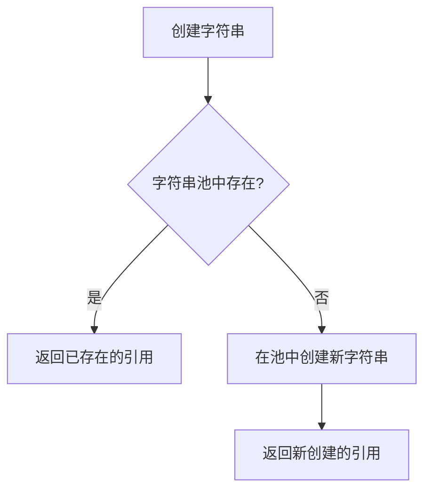

# Java 字符串池

在学习Java编程的过程中，理解字符串池(String Pool)的概念对于掌握Java的内存管理和性能优化至关重要。这篇教程将带你深入了解Java字符串池的工作原理、使用方式以及实际应用场景。

## 什么是字符串池？

字符串池(String Pool)是Java语言特有的一个内存区域，专门用来存储字符串字面量。当我们创建一个字符串对象时，JVM会先检查字符串池中是否已存在相同内容的字符串：
- 如果存在，则直接返回该字符串的引用
- 如果不存在，则在池中创建一个新的字符串，并返回引用



字符串池位于堆内存中的"方法区"里（在Java 7之前位于永久代，Java 7之后位于堆内存）。

## 字符串创建的两种方式

在Java中，创建字符串有两种主要方式，它们与字符串池的交互方式不同：

### 1. 使用字符串字面量

当使用双引号直接创建字符串时，该字符串会被添加到字符串池中。

```java
String s1 = "Hello";  // 创建一个字符串字面量，存入字符串池
String s2 = "Hello";  // 直接引用字符串池中已存在的字符串对象
```

在这个例子中，`s1`和`s2`指向的是字符串池中的同一个对象。我们可以通过以下代码验证：

```java
System.out.println(s1 == s2);  // 输出: true
```

输出结果为`true`，表示两个变量引用的是同一个对象。

### 2. 使用new关键字

使用`new`关键字创建的字符串会在堆内存中生成一个新对象，不论字符串池中是否已经存在相同内容的字符串。

```java
String s3 = new String("Hello");  // 在堆中创建一个新对象
```

此时，即使字符串池中已有"Hello"，`s3`仍然指向堆内存中的一个新对象，而非字符串池中的对象。

```java
System.out.println(s1 == s3);  // 输出: false
```

输出结果为`false`，因为`s1`和`s3`指向不同的对象。

## intern()方法的作用

Java提供了`intern()`方法，可以将字符串对象显式地添加到字符串池中：

```java
String s3 = new String("Hello");
String s4 = s3.intern();  // 返回字符串池中的对象引用

System.out.println(s1 == s4);  // 输出: true
System.out.println(s3 == s4);  // 输出: false
```

当调用`intern()`方法时：
1. 如果字符串池中已经存在该字符串，则返回池中的字符串引用
2. 如果字符串池中不存在该字符串，则将该字符串添加到池中，并返回其引用

:::tip 提示
从Java 7开始，`intern()`方法的实现有所变化。在Java 7之前，`intern()`会将字符串的副本放入池中；而在Java 7之后，如果池中不存在该字符串，`intern()`会将字符串的引用放入池中，而不再创建副本。这提高了性能并减少了内存使用。
:::

## 字符串池的性能优势

字符串池的主要优势在于节省内存和提高性能。由于字符串在Java程序中被广泛使用，通过池化技术，可以避免创建大量内容相同的字符串对象，从而：

1. 减少内存使用量
2. 提高字符串比较效率（可以直接比较引用）
3. 加快程序执行速度

## 实际应用案例

### 案例1：配置信息处理

在处理配置信息时，经常会出现相同的字符串：

```java
public class ConfigManager {
    public static void main(String[] args) {
        // 模拟从不同配置文件读取的相同键值
        String key1 = "database.url";  // 从配置文件1读取
        String key2 = "database.url";  // 从配置文件2读取
        
        // 由于使用了字符串字面量，key1和key2指向字符串池中的同一对象
        System.out.println("键值引用相同? " + (key1 == key2));  // 输出: true
        
        // 这样可以高效地使用Map进行查找
        Map<String, String> configMap = new HashMap<>();
        configMap.put(key1, "jdbc:mysql://localhost:3306/mydb");
        
        // 查找时使用的是同一个字符串对象作为键
        System.out.println(configMap.get(key2));  // 输出: jdbc:mysql://localhost:3306/mydb
    }
}
```

### 案例2：大量重复字符串处理

假设我们有一个系统需要处理用户的操作日志，很多操作类型是重复的：

```java
public class LogProcessor {
    public static void main(String[] args) {
        List<String> operations = new ArrayList<>();
        
        // 模拟添加1000条日志，只有4种操作类型
        for (int i = 0; i < 1000; i++) {
            int type = i % 4;
            switch(type) {
                case 0:
                    operations.add("VIEW");
                    break;
                case 1:
                    operations.add("EDIT");
                    break;
                case 2:
                    operations.add("DELETE");
                    break;
                case 3:
                    operations.add("CREATE");
                    break;
            }
        }
        
        // 计算不同操作类型的数量
        Set<String> uniqueOperations = new HashSet<>();
        for (String op : operations) {
            uniqueOperations.add(op.intern());  // 使用intern确保使用字符串池中的对象
        }
        
        System.out.println("总操作数: " + operations.size());  // 输出: 1000
        System.out.println("不同操作类型数: " + uniqueOperations.size());  // 输出: 4
    }
}
```

通过使用`intern()`方法，我们可以确保相同内容的字符串只存储一份，大大节省内存使用。

## 字符串池的注意事项

使用字符串池时，有一些需要注意的事项：

### 1. 池容量有限

字符串池的容量是有限的，在Java 8之前默认大小为1009，之后版本有所增加。可以通过JVM参数调整：
```
-XX:StringTableSize=N
```

:::caution 警告
如果项目中有大量唯一字符串，过小的字符串池可能导致性能下降，因为会有更多的字符串池碰撞。
:::

### 2. 大量使用intern()可能适得其反

当处理大量不同的字符串时，频繁调用`intern()`可能会导致字符串池膨胀，反而降低性能。应该在确实有大量重复字符串的场景下使用。

### 3. 字符串拼接的影响

使用"+"运算符拼接字符串时，编译器的优化行为可能会影响字符串池的使用：

```java
String s1 = "Hello";
String s2 = "Hello" + "";  // 编译器优化，等同于 "Hello"
String s3 = "Hel" + "lo";  // 编译时常量表达式，等同于 "Hello"
String s4 = "Hel";
String s5 = s4 + "lo";     // 运行时计算，不使用字符串池中对象

System.out.println(s1 == s2);  // true
System.out.println(s1 == s3);  // true
System.out.println(s1 == s5);  // false
```

## 总结

Java字符串池是一种重要的优化机制，通过重用字符串字面量来节省内存并提高性能。理解字符串池的工作原理，可以帮助你编写更高效的Java代码：

- 字符串字面量会被自动添加到字符串池中
- 使用`new`创建的字符串对象不会自动进入字符串池
- `intern()`方法可以显式地将字符串添加到字符串池
- 字符串池主要用于提高内存利用率和字符串比较的效率

在实际开发中，需要根据应用场景合理使用字符串池，避免滥用`intern()`导致字符串池膨胀，同时也要注意字符串拼接方式对字符串池使用的影响。

## 练习题

1. 编写代码验证以下三种方式创建的字符串是否使用了字符串池中的对象：
   - 字符串字面量
   - 通过`new`创建的字符串
   - 通过`+`拼接的字符串

2. 设计一个简单的单词计数程序，使用字符串池优化内存使用，处理包含大量重复单词的文本。

3. 研究并说明在循环中大量使用`intern()`方法和不使用的性能差异。

## 扩展阅读

- Java官方文档中关于[String类](https://docs.oracle.com/javase/8/docs/api/java/lang/String.html)的说明
- JVM规范中关于字符串池实现的细节
- 不同JDK版本中字符串池的变化和优化

通过深入理解字符串池的工作原理和应用场景，你可以更好地掌握Java内存管理的精髓，编写更高效的代码。