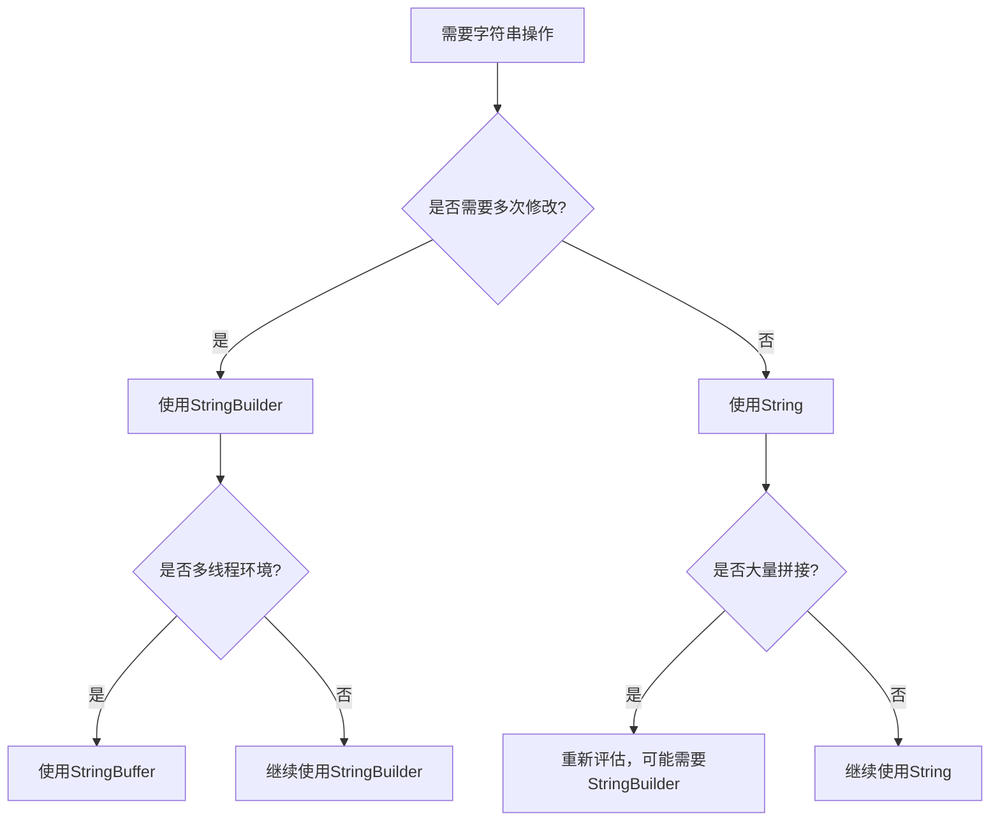

# Java 字符串性能

## 引言

在Java编程中，字符串是最常用的数据类型之一。随着应用程序规模的扩大，字符串操作的性能可能会成为影响程序整体效率的关键因素。本文将深入探讨Java字符串性能优化的关键点，帮助初学者了解如何编写高效的字符串处理代码。

## 字符串的不可变性与性能

Java中的`String`类是不可变的，这意味着一旦创建，字符串的内容就不能被修改。

```java
String str = "Hello";
str = str + " World"; // 创建了新的字符串对象
```

在上面的代码中，`str + " World"`操作并不是修改原来的字符串，而是创建了一个新的字符串对象。这种不可变性对性能有以下影响：

1. **优点**：字符串可以被安全地共享，有利于字符串常量池的优化。
2. **缺点**：频繁的字符串拼接会创建大量临时对象，增加垃圾回收压力。

## 字符串常量池

字符串常量池是Java堆内存中的一个特殊区域，用于存储字符串字面量。

```java
String s1 = "hello"; // 在常量池中创建字符串
String s2 = "hello"; // 直接引用常量池中的字符串
String s3 = new String("hello"); // 在堆中创建新对象

System.out.println(s1 == s2); // 输出: true
System.out.println(s1 == s3); // 输出: false
```

:::tip
使用字符串字面量（如`"hello"`）可以利用字符串常量池提高内存使用效率。而使用`new String()`会在堆中创建新的对象，即使内容相同。
:::

## 字符串拼接性能优化

### 1. `+`运算符的问题

使用`+`运算符拼接字符串在循环中效率很低：

```java
String result = "";
for (int i = 0; i < 10000; i++) {
    result += "some text"; // 每次循环都创建新的字符串对象
}
```

### 2. 使用`StringBuilder`

`StringBuilder`提供了可变的字符串缓冲区，大大提高了字符串拼接的效率：

```java
StringBuilder sb = new StringBuilder();
for (int i = 0; i < 10000; i++) {
    sb.append("some text");
}
String result = sb.toString();
```

### 性能对比

以下代码比较了两种方法的性能差异：

```java
// 使用+运算符
long startTime = System.currentTimeMillis();
String str1 = "";
for (int i = 0; i < 100000; i++) {
    str1 += "a";
}
long endTime = System.currentTimeMillis();
System.out.println("使用+运算符: " + (endTime - startTime) + "ms");

// 使用StringBuilder
startTime = System.currentTimeMillis();
StringBuilder sb = new StringBuilder();
for (int i = 0; i < 100000; i++) {
    sb.append("a");
}
String str2 = sb.toString();
endTime = System.currentTimeMillis();
System.out.println("使用StringBuilder: " + (endTime - startTime) + "ms");

// 输出示例:
// 使用+运算符: 8731ms
// 使用StringBuilder: 5ms
```

从结果可以看出，`StringBuilder`的性能远优于`+`运算符，特别是在大量字符串拼接的场景中。

:::caution
`StringBuilder`是非线程安全的，如果需要在多线程环境中使用，应考虑使用`StringBuffer`，不过`StringBuffer`的性能略低于`StringBuilder`。
:::

## 字符串比较性能

### 1. `==`与`equals()`

```java
String s1 = "hello";
String s2 = "hello";
String s3 = new String("hello");

// 使用==比较引用
System.out.println(s1 == s2); // 输出: true
System.out.println(s1 == s3); // 输出: false

// 使用equals()比较内容
System.out.println(s1.equals(s2)); // 输出: true
System.out.println(s1.equals(s3)); // 输出: true
```

### 2. `startsWith()`和`endsWith()`的性能考虑

当检查字符串前缀或后缀时，使用`startsWith()`和`endsWith()`方法比手动截取子字符串然后比较更高效：

```java
String str = "Hello, World!";

// 推荐方式
boolean starts = str.startsWith("Hello");

// 不推荐方式
boolean starts2 = str.substring(0, 5).equals("Hello");
```

## 字符串拆分与合并

### 1. `split()`方法

`split()`方法使用正则表达式拆分字符串，在处理大文本时可能较慢：

```java
String text = "apple,banana,orange,grape";
String[] fruits = text.split(",");
```

对于简单的分隔符，考虑使用`StringTokenizer`或手动实现可能更高效。

### 2. `join()`方法（Java 8+）

从Java 8开始，可以使用`String.join()`方法高效地合并字符串：

```java
String[] fruits = {"apple", "banana", "orange", "grape"};
String joined = String.join(",", fruits);
System.out.println(joined); // 输出: apple,banana,orange,grape
```

## 字符串格式化

`String.format()`和`Printf`风格的格式化虽然方便，但有一定的性能开销：

```java
String formatted = String.format("Name: %s, Age: %d", "John", 30);
```

在对性能要求较高的场景中，可以考虑直接使用字符串拼接或`StringBuilder`。

## 实际应用案例

### 案例1：日志记录优化

```java
// 不推荐方式 - 即使日志级别不满足也会执行字符串拼接
logger.debug("User " + user.getName() + " logged in from " + user.getIpAddress());

// 推荐方式 - 延迟字符串拼接
logger.debug("User {} logged in from {}", user.getName(), user.getIpAddress());
```

### 案例2：大文件处理

处理大型CSV文件时的字段拼接：

```java
public void processCsvFile(String filename) throws IOException {
    try (BufferedReader reader = new BufferedReader(new FileReader(filename))) {
        String line;
        while ((line = reader.readLine()) != null) {
            // 使用split处理每一行
            String[] fields = line.split(",");
            
            // 使用StringBuilder构建输出
            StringBuilder resultBuilder = new StringBuilder();
            for (String field : fields) {
                if (field.trim().length() > 0) {
                    resultBuilder.append(field.trim()).append("|");
                }
            }
            
            // 处理构建好的字符串
            String result = resultBuilder.toString();
            if (result.endsWith("|")) {
                result = result.substring(0, result.length() - 1);
            }
            
            processRecord(result);
        }
    }
}
```

## 字符串性能调优图解

以下流程图展示了如何选择合适的字符串操作方式：



## 总结

Java字符串性能优化的关键点：

1. **了解字符串的不可变性**：理解它的优缺点，在适当场景选择合适的解决方案。
2. **善用字符串常量池**：尽可能使用字符串字面量而非`new String()`。
3. **高效拼接**：在循环或大量拼接场景中使用`StringBuilder`而非`+`运算符。
4. **适当比较**：使用`equals()`比较内容，只在需要比较引用时使用`==`。
5. **明智选择工具**：针对特定场景选择合适的字符串处理方法。

通过遵循这些最佳实践，你可以显著提高Java应用程序中字符串操作的性能。

## 练习与思考

1. 编写一个程序，比较使用`+`运算符和`StringBuilder`拼接1万个字符串的性能差异。
2. 设计一个简单的日志系统，实现延迟字符串评估以提高性能。
3. 思考：为什么Java的设计者选择将`String`设计为不可变类？这对性能有何影响？

## 进一步阅读

- Java虚拟机中的字符串优化
- Java 9中的字符串紧凑表示
- 正则表达式性能优化

:::note
记住，过早的优化是编程中的大忌。首先确保你的代码正确且可读，然后再考虑性能优化。在实际应用中，请使用性能分析工具确定真正的瓶颈所在，再有针对性地进行优化。
:::