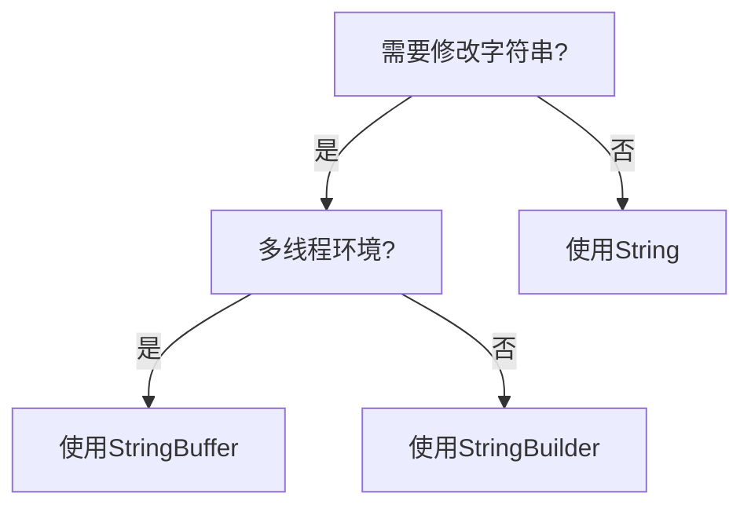

# Java StringBuilder

## 什么是StringBuilder？

在Java中，`StringBuilder`是一个用于处理字符串的工具类，它提供了一种比String更高效的方式来操作字符串。与String不同，`StringBuilder`是可变的（mutable），这意味着我们可以在不创建新对象的情况下修改它的内容。

:::note 背景知识
在Java中，String对象是不可变的（immutable）。每次对String进行修改操作（如拼接、替换等），实际上都会创建一个新的String对象。这在频繁操作字符串的场景下会导致性能问题。
:::

## String与StringBuilder的区别

让我们通过一个简单的例子来理解String和StringBuilder的区别：

```java
// 使用String拼接
String str = "Hello";
str = str + " World"; // 创建了一个新的String对象

// 使用StringBuilder
StringBuilder sb = new StringBuilder("Hello");
sb.append(" World"); // 修改当前StringBuilder对象，不创建新对象
```

这个区别在大量字符串操作时特别明显：

```java
// 使用String - 低效
String result = "";
for (int i = 0; i < 10000; i++) {
    result += i; // 每次循环都创建新的String对象
}

// 使用StringBuilder - 高效
StringBuilder builder = new StringBuilder();
for (int i = 0; i < 10000; i++) {
    builder.append(i); // 只使用一个StringBuilder对象
}
String result = builder.toString();
```

## StringBuilder的基本用法

### 创建StringBuilder对象

```java
// 创建空的StringBuilder
StringBuilder sb1 = new StringBuilder();

// 创建带有初始内容的StringBuilder
StringBuilder sb2 = new StringBuilder("Hello");

// 创建指定容量的StringBuilder
StringBuilder sb3 = new StringBuilder(50);
```

### 常用方法

1. **append()** - 添加内容到StringBuilder末尾

```java
StringBuilder sb = new StringBuilder("Hello");
sb.append(" World");
sb.append("!").append(" Java is fun.");
System.out.println(sb.toString());
// 输出: Hello World! Java is fun.
```

2. **insert()** - 在指定位置插入内容

```java
StringBuilder sb = new StringBuilder("Hello World");
sb.insert(5, " Beautiful");
System.out.println(sb.toString());
// 输出: Hello Beautiful World
```

3. **delete() / deleteCharAt()** - 删除内容

```java
StringBuilder sb = new StringBuilder("Hello World");
sb.delete(5, 11); // 删除从索引5到10的字符
System.out.println(sb.toString());
// 输出: Hello

sb = new StringBuilder("Hello World");
sb.deleteCharAt(5); // 删除索引5处的字符（空格）
System.out.println(sb.toString());
// 输出: HelloWorld
```

4. **replace()** - 替换内容

```java
StringBuilder sb = new StringBuilder("Hello World");
sb.replace(6, 11, "Java");
System.out.println(sb.toString());
// 输出: Hello Java
```

5. **reverse()** - 反转字符串

```java
StringBuilder sb = new StringBuilder("Hello");
sb.reverse();
System.out.println(sb.toString());
// 输出: olleH
```

6. **length() / capacity()** - 获取长度和容量

```java
StringBuilder sb = new StringBuilder("Hello");
System.out.println("Length: " + sb.length());
System.out.println("Capacity: " + sb.capacity());
// 输出:
// Length: 5
// Capacity: 21 (或者更大，取决于JDK版本)
```

## StringBuilder vs StringBuffer

Java还提供了另一个类似的类`StringBuffer`。它们之间的主要区别是：

1. **同步性**：`StringBuffer`是线程安全的（synchronized），而`StringBuilder`不是线程安全的。
2. **性能**：由于`StringBuilder`不需要处理同步，因此在单线程环境下性能更好。



:::tip 选择指南
- 如果字符串不会改变：使用`String`
- 如果字符串会改变，且在多线程环境：使用`StringBuffer`
- 如果字符串会改变，且在单线程环境：使用`StringBuilder`
:::

## 实际案例：构建复杂字符串

假设我们需要生成一个HTML表格。使用`StringBuilder`可以使代码更清晰高效：

```java
public static String generateHtmlTable(String[] headers, String[][] data) {
    StringBuilder html = new StringBuilder();
    html.append("<table border='1'>\n");
    
    // 添加表头
    html.append("  <tr>\n");
    for (String header : headers) {
        html.append("    <th>").append(header).append("</th>\n");
    }
    html.append("  </tr>\n");
    
    // 添加数据行
    for (String[] row : data) {
        html.append("  <tr>\n");
        for (String cell : row) {
            html.append("    <td>").append(cell).append("</td>\n");
        }
        html.append("  </tr>\n");
    }
    
    html.append("</table>");
    return html.toString();
}

// 使用示例
public static void main(String[] args) {
    String[] headers = {"姓名", "年龄", "职业"};
    String[][] data = {
        {"张三", "25", "工程师"},
        {"李四", "30", "教师"},
        {"王五", "28", "医生"}
    };
    
    String htmlTable = generateHtmlTable(headers, data);
    System.out.println(htmlTable);
}
```

输出结果是一个完整的HTML表格：

```html
<table border='1'>
  <tr>
    <th>姓名</th>
    <th>年龄</th>
    <th>职业</th>
  </tr>
  <tr>
    <td>张三</td>
    <td>25</td>
    <td>工程师</td>
  </tr>
  <tr>
    <td>李四</td>
    <td>30</td>
    <td>教师</td>
  </tr>
  <tr>
    <td>王五</td>
    <td>28</td>
    <td>医生</td>
  </tr>
</table>
```

## 性能比较

下面是一个简单的性能测试，对比String和StringBuilder在大量字符串拼接时的效率：

```java
public static void main(String[] args) {
    int iterations = 100000;
    
    // 使用String
    long startTime = System.currentTimeMillis();
    String result = "";
    for (int i = 0; i < iterations; i++) {
        result += "a";
    }
    long endTime = System.currentTimeMillis();
    System.out.println("String concatenation time: " + (endTime - startTime) + "ms");
    
    // 使用StringBuilder
    startTime = System.currentTimeMillis();
    StringBuilder sb = new StringBuilder();
    for (int i = 0; i < iterations; i++) {
        sb.append("a");
    }
    result = sb.toString();
    endTime = System.currentTimeMillis();
    System.out.println("StringBuilder append time: " + (endTime - startTime) + "ms");
}
```

运行上面的代码，你会发现StringBuilder的速度远快于直接使用String拼接。对于大量的字符串操作，性能差异会更加明显。

:::caution 注意
虽然StringBuilder性能优越，但对于少量的字符串拼接操作，简单使用String的`+`操作符也是可以的。Java编译器在某些情况下会自动优化简单的字符串拼接。但是在循环中进行字符串拼接时，一定要使用StringBuilder。
:::

## 总结

- `StringBuilder`是Java中用于高效处理可变字符串的类
- 与不可变的`String`相比，`StringBuilder`在频繁修改字符串时能提供更好的性能
- 主要方法包括`append()`、`insert()`、`delete()`、`replace()`和`reverse()`等
- 与`StringBuffer`的主要区别是`StringBuilder`不是线程安全的，但性能更好
- 在需要频繁修改字符串的场景中，尤其是在循环内部，应当优先考虑使用`StringBuilder`

## 练习题

1. 编写一个方法，使用StringBuilder将一个整数数组转换为逗号分隔的字符串。
2. 使用StringBuilder创建一个回文检测器，判断一个给定的字符串是否为回文。
3. 编写一个方法，它接收一个字符串并使用StringBuilder移除其中所有的空格。
4. 对比使用String和StringBuilder实现将一个含有1000个元素的字符串数组连接成一个字符串的性能差异。

## 扩展资源

- [Java官方文档 - StringBuilder](https://docs.oracle.com/en/java/javase/11/docs/api/java.base/java/lang/StringBuilder.html)
- 《Effective Java》（第三版）- 第63条：注意字符串连接的性能

通过掌握`StringBuilder`，你将能够编写更高效的Java代码，特别是在处理大量字符串操作时。