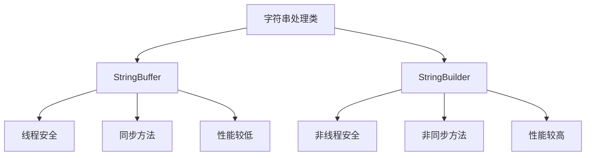

# Java StringBuffer

## 什么是 StringBuffer？

在 Java 编程中，处理字符串是一项常见任务。Java 提供了 `String` 类来表示字符串，但 `String` 对象是不可变的，这意味着一旦创建就不能修改其内容。而在需要频繁修改字符串的场景下，使用 `String` 会导致性能问题，因为每次修改都会创建新的 `String` 对象。

为了解决这个问题，Java 提供了 `StringBuffer` 类。**`StringBuffer` 表示可变的字符序列**，可以在不创建新对象的情况下修改字符串内容，从而提高字符串操作的效率。

:::tip
`StringBuffer` 是线程安全的，这意味着多个线程可以同时操作同一个 `StringBuffer` 对象而不会导致数据不一致。
:::

## StringBuffer 的基本用法

### 创建 StringBuffer 对象

创建 `StringBuffer` 对象有多种方式：

```java
// 创建一个空的 StringBuffer，初始容量为16个字符
StringBuffer sb1 = new StringBuffer();

// 创建一个空的 StringBuffer，但指定初始容量
StringBuffer sb2 = new StringBuffer(50);

// 创建一个包含特定内容的 StringBuffer
StringBuffer sb3 = new StringBuffer("Hello");
```

### 常用方法

`StringBuffer` 类提供了许多方法用于修改字符串内容：

#### 1. append() - 追加内容

`append()` 方法可以将各种类型的数据添加到 `StringBuffer` 的末尾。

```java
StringBuffer sb = new StringBuffer("Hello");
sb.append(" World");
sb.append(123);
System.out.println(sb); // 输出: Hello World123
```

#### 2. insert() - 插入内容

`insert()` 方法可以在指定位置插入内容。

```java
StringBuffer sb = new StringBuffer("Hello World");
sb.insert(6, "Java ");
System.out.println(sb); // 输出: Hello Java World
```

#### 3. delete() 和 deleteCharAt() - 删除内容

`delete()` 方法删除指定范围的字符，而 `deleteCharAt()` 删除指定位置的单个字符。

```java
StringBuffer sb = new StringBuffer("Hello Java World");
sb.delete(6, 11); // 删除从索引6到10的字符 ("Java ")
System.out.println(sb); // 输出: Hello World

sb.deleteCharAt(5); // 删除索引5处的字符 (空格)
System.out.println(sb); // 输出: HelloWorld
```

#### 4. replace() - 替换内容

`replace()` 方法用于替换指定范围的字符。

```java
StringBuffer sb = new StringBuffer("Hello World");
sb.replace(6, 11, "Java");
System.out.println(sb); // 输出: Hello Java
```

#### 5. reverse() - 反转字符串

`reverse()` 方法将字符序列反转。

```java
StringBuffer sb = new StringBuffer("Hello");
sb.reverse();
System.out.println(sb); // 输出: olleH
```

#### 6. 其他常用方法

```java
StringBuffer sb = new StringBuffer("Hello World");

// 获取长度
System.out.println(sb.length()); // 输出: 11

// 获取容量
System.out.println(sb.capacity()); // 输出: 27 (16 + "Hello World".length())

// 设置长度
sb.setLength(5);
System.out.println(sb); // 输出: Hello

// 获取特定位置的字符
char ch = sb.charAt(1);
System.out.println(ch); // 输出: e

// 设置特定位置的字符
sb.setCharAt(0, 'h');
System.out.println(sb); // 输出: hello
```

## StringBuffer vs StringBuilder

Java 还提供了另一个可变字符串类 `StringBuilder`。两者的主要区别在于：



- **线程安全**：`StringBuffer` 是线程安全的，而 `StringBuilder` 不是。
- **性能**：由于 `StringBuffer` 的方法是同步的，所以在单线程环境下，`StringBuilder` 的性能更好。

:::note
如果你的程序是单线程的，或者不需要线程安全，建议使用 `StringBuilder` 来获得更好的性能。
:::

## StringBuffer 的实际应用场景

### 1. 字符串的频繁修改

当需要频繁修改字符串时，使用 `StringBuffer` 可以避免创建大量的中间 `String` 对象。

```java
// 使用 String（不推荐）
String result = "";
for (int i = 0; i < 1000; i++) {
    result += i; // 每次循环都创建新的 String 对象
}

// 使用 StringBuffer（推荐）
StringBuffer sb = new StringBuffer();
for (int i = 0; i < 1000; i++) {
    sb.append(i); // 不创建新对象，只修改现有内容
}
String result = sb.toString();
```

### 2. 构建复杂字符串

当需要根据条件构建复杂字符串时，`StringBuffer` 很有用。

```java
public String generateReport(String name, int age, String[] hobbies) {
    StringBuffer report = new StringBuffer();
    report.append("姓名: ").append(name).append("\n");
    report.append("年龄: ").append(age).append("\n");
    report.append("爱好: ");
    
    for (int i = 0; i < hobbies.length; i++) {
        report.append(hobbies[i]);
        if (i < hobbies.length - 1) {
            report.append(", ");
        }
    }
    
    return report.toString();
}
```

### 3. 多线程环境下的字符串处理

在多线程环境中，当多个线程需要访问和修改同一个字符串时，`StringBuffer` 是安全的选择。

```java
// 多线程环境下的共享资源
class SharedResource {
    private StringBuffer buffer = new StringBuffer();
    
    public void appendData(String data) {
        buffer.append(data);
    }
    
    public String getResult() {
        return buffer.toString();
    }
}
```

## 性能注意事项

虽然 `StringBuffer` 比直接使用 `String` 进行频繁修改效率更高，但它仍有一些性能考虑点：

1. **初始容量设置**：如果你大致知道最终字符串的长度，最好在创建 `StringBuffer` 时指定足够的初始容量，以减少扩容操作。

2. **避免过度使用**：对于简单的字符串连接，直接使用 `+` 操作符可能更清晰。Java 编译器在某些情况下会自动优化简单的字符串连接。

3. **线程安全开销**：如果不需要线程安全，考虑使用 `StringBuilder` 来获得更好的性能。

## 代码示例：文件路径生成器

下面是一个使用 `StringBuffer` 生成文件路径的实际例子：

```java
public class FilePathGenerator {
    public static void main(String[] args) {
        String[] directories = {"users", "admin", "documents"};
        String filename = "report.pdf";
        
        StringBuffer pathBuilder = new StringBuffer();
        
        // 添加根目录
        pathBuilder.append("/");
        
        // 添加目录路径
        for (String dir : directories) {
            pathBuilder.append(dir).append("/");
        }
        
        // 添加文件名
        pathBuilder.append(filename);
        
        String fullPath = pathBuilder.toString();
        System.out.println("生成的文件路径: " + fullPath);
        // 输出: 生成的文件路径: /users/admin/documents/report.pdf
    }
}
```

## 总结

`StringBuffer` 是 Java 中处理可变字符串的重要工具，特别适用于需要频繁修改字符串内容或在多线程环境下操作字符串的场景。它提供了丰富的方法来修改、追加、插入和删除字符串内容，而不需要创建新的对象。

关键点回顾：
- `StringBuffer` 表示可变的字符序列
- 它是线程安全的，适用于多线程环境
- 主要方法包括 `append()`、`insert()`、`delete()`、`replace()`、`reverse()` 等
- 与 `StringBuilder` 相比，`StringBuffer` 线程安全但性能略低
- 在需要频繁修改字符串内容的场景下，使用 `StringBuffer` 比使用 `String` 更高效

## 练习

1. 编写一个程序，使用 `StringBuffer` 将一个整数数组的所有元素连接成一个以逗号分隔的字符串。

2. 创建一个方法，使用 `StringBuffer` 反转一个字符串中的单词顺序，但保持每个单词内字符的顺序不变。例如："Hello World" 变为 "World Hello"。

3. 比较使用 `String`、`StringBuffer` 和 `StringBuilder` 执行 10000 次字符串追加操作的性能差异。

:::caution
记住，虽然 `StringBuffer` 在多线程环境中是安全的，但过度同步可能导致性能瓶颈。在不需要线程安全时，考虑使用 `StringBuilder`。
:::

通过掌握 `StringBuffer`，你将能够更高效地处理 Java 中的字符串操作，特别是在需要频繁修改字符串内容的场景下。