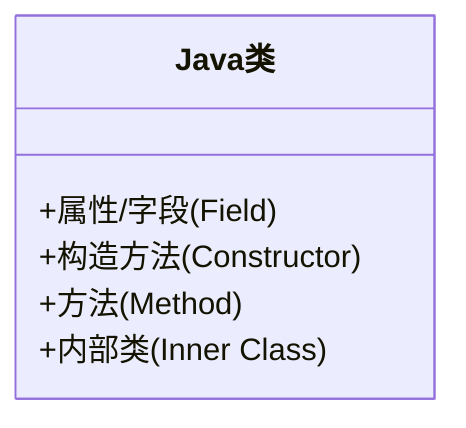

# Java 类基础

## 什么是Java类？

在Java中，类（Class）是面向对象编程的基本单元，它是一种用于创建对象的模板或蓝图。类定义了对象的属性（数据）和行为（方法），是实现Java面向对象编程的核心概念。

:::tip 理解类和对象的关系
可以把类比作是制作蛋糕的模具，而对象则是用这个模具制作出来的具体蛋糕。同一个模具可以制作出多个相似但各有特色的蛋糕。
:::

## 类的基本结构

一个标准的Java类通常包含以下几个部分：



### 类的声明

类的声明使用`class`关键字，后跟类名和一对花括号`{}`，花括号内是类的主体：

```java
public class Student {
    // 类的主体
}
```

类的命名规范：
- 类名通常使用驼峰命名法（首字母大写）
- 类名应该是名词
- 类名应该简明扼要地描述该类的功能或者特性

## 类的组成部分

### 1. 成员变量（字段）

成员变量是类中定义的变量，用于存储对象的状态或属性。

```java
public class Student {
    // 成员变量
    String name;        // 学生姓名
    int age;            // 学生年龄
    String studentId;   // 学号
    double gpa;         // 平均成绩
}
```

成员变量可以有不同的访问修饰符：
- `public`：可以被任何类访问
- `private`：只能在当前类中访问
- `protected`：可以被同一包中的类和所有子类访问
- 默认（不写）：可以被同一包中的类访问

:::caution 注意
为了保持良好的封装性，成员变量通常声明为`private`，通过公共的getter和setter方法访问。
:::

### 2. 构造方法

构造方法用于初始化对象，当创建对象（使用`new`关键字）时自动调用。构造方法的名称必须与类名相同，且没有返回类型。

```java
public class Student {
    private String name;
    private int age;
    
    // 无参构造方法
    public Student() {
        name = "Unknown";
        age = 0;
    }
    
    // 有参构造方法
    public Student(String name, int age) {
        this.name = name;
        this.age = age;
    }
}
```

构造方法的特点：
- 与类同名
- 没有返回类型
- 可以重载（多个构造方法具有不同参数）
- 如果没有定义任何构造方法，Java会提供一个默认的无参构造方法

### 3. 方法

方法是对象可以执行的操作，定义了对象的行为。

```java
public class Student {
    private String name;
    private double[] scores;
    
    // Getter方法
    public String getName() {
        return name;
    }
    
    // Setter方法
    public void setName(String name) {
        this.name = name;
    }
    
    // 计算平均分的方法
    public double calculateAverage() {
        if (scores == null || scores.length == 0) {
            return 0.0;
        }
        
        double sum = 0;
        for (double score : scores) {
            sum += score;
        }
        
        return sum / scores.length;
    }
    
    // 显示学生信息的方法
    public void displayInfo() {
        System.out.println("学生姓名: " + name);
        System.out.println("平均分: " + calculateAverage());
    }
}
```

方法的组成部分：
- 访问修饰符（例如`public`、`private`等）
- 返回类型（返回值的数据类型，如果不返回则为`void`）
- 方法名（通常以动词开头，使用驼峰命名法，首字母小写）
- 参数列表（方法的输入，可以有零个或多个参数）
- 方法体（包含在花括号中的代码）

## 创建和使用对象

一旦定义了类，就可以使用它来创建对象：

```java
public class StudentDemo {
    public static void main(String[] args) {
        // 使用无参构造方法创建对象
        Student student1 = new Student();
        student1.setName("张三");
        
        // 使用有参构造方法创建对象
        Student student2 = new Student("李四", 20);
        
        // 调用对象的方法
        student1.displayInfo();
        student2.displayInfo();
    }
}
```

输出：
```
学生姓名: 张三
平均分: 0.0
学生姓名: 李四
平均分: 0.0
```

## 类的实际应用案例

让我们通过一个银行账户管理系统的例子，来展示类的实际应用：

```java
public class BankAccount {
    // 成员变量
    private String accountNumber;
    private String accountHolder;
    private double balance;
    
    // 构造方法
    public BankAccount(String accountNumber, String accountHolder, double initialBalance) {
        this.accountNumber = accountNumber;
        this.accountHolder = accountHolder;
        this.balance = initialBalance;
    }
    
    // 存款方法
    public void deposit(double amount) {
        if (amount > 0) {
            balance += amount;
            System.out.println("存款成功：" + amount);
        } else {
            System.out.println("存款金额必须大于0");
        }
    }
    
    // 取款方法
    public void withdraw(double amount) {
        if (amount > 0 && amount <= balance) {
            balance -= amount;
            System.out.println("取款成功：" + amount);
        } else if (amount <= 0) {
            System.out.println("取款金额必须大于0");
        } else {
            System.out.println("余额不足");
        }
    }
    
    // 查询余额
    public double getBalance() {
        return balance;
    }
    
    // 显示账户信息
    public void displayInfo() {
        System.out.println("账号: " + accountNumber);
        System.out.println("账户持有人: " + accountHolder);
        System.out.println("当前余额: " + balance);
    }
}
```

使用这个银行账户类：

```java
public class BankDemo {
    public static void main(String[] args) {
        // 创建银行账户对象
        BankAccount account = new BankAccount("123456", "王五", 1000.0);
        
        // 显示初始账户信息
        System.out.println("初始账户信息：");
        account.displayInfo();
        
        // 进行一些操作
        account.deposit(500.0);
        account.withdraw(200.0);
        account.withdraw(2000.0); // 尝试取超过余额的金额
        
        // 显示最终账户信息
        System.out.println("\n最终账户信息：");
        account.displayInfo();
    }
}
```

输出：
```
初始账户信息：
账号: 123456
账户持有人: 王五
当前余额: 1000.0
存款成功：500.0
取款成功：200.0
余额不足

最终账户信息：
账号: 123456
账户持有人: 王五
当前余额: 1300.0
```

在这个例子中，`BankAccount`类模拟了一个银行账户，包含账号、账户持有人和余额等属性，以及存款、取款等操作。这个例子展示了如何使用类来封装相关的数据和功能，形成一个独立的、可复用的单元。

## this关键字的使用

在Java类中，`this`关键字指向当前对象的引用，常用于以下几种情况：

1. 区分局部变量和成员变量
2. 在构造方法中调用另一个构造方法
3. 将当前对象作为参数传递给方法

```java
public class Person {
    private String name;
    private int age;
    
    // 使用this区分局部变量和成员变量
    public Person(String name, int age) {
        this.name = name;  // this.name指向成员变量，name指向参数
        this.age = age;    // 同上
    }
    
    // 使用this调用其他构造方法
    public Person() {
        this("Unknown", 0);  // 调用有参构造方法
    }
    
    // 使用this返回当前对象
    public Person setName(String name) {
        this.name = name;
        return this;  // 返回当前对象，支持链式调用
    }
    
    public Person setAge(int age) {
        this.age = age;
        return this;  // 返回当前对象，支持链式调用
    }
    
    public void displayInfo() {
        System.out.println("姓名: " + name + ", 年龄: " + age);
    }
}
```

使用链式调用示例：

```java
public class ThisDemo {
    public static void main(String[] args) {
        Person person = new Person();
        
        // 链式调用方法
        person.setName("赵六").setAge(25).displayInfo();
    }
}
```

输出：
```
姓名: 赵六, 年龄: 25
```

## 静态成员（Static Members）

静态成员（静态变量和静态方法）属于类本身，而不是类的实例。使用`static`关键字声明静态成员。

### 静态变量

静态变量在所有对象之间共享，不管创建多少个对象，静态变量只有一个副本。

```java
public class Counter {
    private static int count = 0;  // 静态变量
    private int instanceCount = 0;  // 实例变量
    
    public Counter() {
        count++;          // 增加静态计数
        instanceCount++;  // 增加实例计数
    }
    
    public static int getCount() {
        return count;
    }
    
    public int getInstanceCount() {
        return instanceCount;
    }
}
```

使用静态变量：

```java
public class StaticDemo {
    public static void main(String[] args) {
        Counter c1 = new Counter();
        Counter c2 = new Counter();
        Counter c3 = new Counter();
        
        System.out.println("创建的对象数量: " + Counter.getCount());  // 使用类名访问静态方法
        System.out.println("c1的实例计数: " + c1.getInstanceCount());
        System.out.println("c2的实例计数: " + c2.getInstanceCount());
        System.out.println("c3的实例计数: " + c3.getInstanceCount());
    }
}
```

输出：
```
创建的对象数量: 3
c1的实例计数: 1
c2的实例计数: 1
c3的实例计数: 1
```

### 静态方法

静态方法属于类而不是对象，可以直接通过类名调用，无需创建对象。静态方法不能访问非静态成员。

```java
public class MathUtils {
    // 静态方法
    public static int add(int a, int b) {
        return a + b;
    }
    
    public static int multiply(int a, int b) {
        return a * b;
    }
}
```

使用静态方法：

```java
public class StaticMethodDemo {
    public static void main(String[] args) {
        // 直接通过类名调用静态方法，无需创建对象
        int sum = MathUtils.add(5, 3);
        int product = MathUtils.multiply(5, 3);
        
        System.out.println("5 + 3 = " + sum);
        System.out.println("5 * 3 = " + product);
    }
}
```

输出：
```
5 + 3 = 8
5 * 3 = 15
```

:::note 静态成员的特点
1. 静态变量在类加载时创建，在程序结束时销毁
2. 静态变量只有一个副本，被所有对象共享
3. 静态方法不能访问非静态成员
4. 静态方法中不能使用this或super关键字
5. 静态成员可以通过类名直接访问，也可以通过对象访问（但推荐使用类名）
:::

## 总结

在本文中，我们学习了Java类的基本概念和组成部分：

1. **类的定义**：类是Java面向对象编程的基础，是创建对象的模板
2. **成员变量**：用于存储对象的状态和属性
3. **构造方法**：用于初始化对象的特殊方法
4. **方法**：定义对象的行为和操作
5. **this关键字**：指向当前对象的引用
6. **静态成员**：属于类而不是对象的变量和方法

掌握类的概念和使用方法是学习Java面向对象编程的第一步。通过类，我们可以创建有组织的、可重用的代码，这也是Java语言强大的原因之一。

## 练习

1. 创建一个`Rectangle`（矩形）类，包含长度和宽度两个属性，以及计算面积和周长的方法。
2. 创建一个`Employee`（员工）类，包含员工编号、姓名、职位和薪资等属性，以及加薪和显示员工信息的方法。
3. 创建一个`Student`（学生）类，包含学号、姓名和多个科目的成绩，实现计算平均分、最高分和最低分的方法。

## 进一步学习资源

- [Oracle Java官方文档 - 类和对象](https://docs.oracle.com/javase/tutorial/java/javaOO/index.html)
- 《Java核心技术》第一卷：基础知识
- 《Head First Java》（适合初学者的图解教程）
- [W3Schools Java教程](https://www.w3schools.com/java/)

下一步，你可以继续学习Java的继承、多态、接口和抽象类等更高级的面向对象概念。