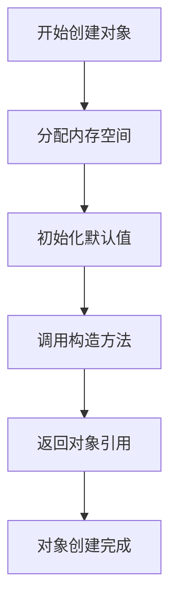

# Java 对象创建

## 引言

在面向对象编程中，"对象"是核心概念。Java作为一种纯面向对象语言，几乎所有操作都围绕着对象进行。理解如何创建和使用对象是掌握Java编程的关键第一步。本文将详细介绍Java中对象的创建过程、创建方式以及相关的最佳实践。

## 什么是对象？

在深入了解对象创建之前，我们需要明确什么是对象：

- **对象**是类的实例，是类定义的数据结构的具体实现
- 对象包含**状态**(属性)和**行为**(方法)
- 对象占用内存空间，具有唯一的标识

:::tip
可以将类比作蓝图，而对象则是根据这个蓝图建造的实际房屋。不同的房屋可以基于相同的蓝图，但每个都有其独特的特征。
:::

## Java 对象创建的基本语法

在Java中，创建对象最常见的方式是使用`new`关键字：

```java
类名 对象引用变量 = new 类名();
```

例如，创建一个`Student`类的对象：

```java
Student student1 = new Student();
```

## 对象创建的步骤

当执行`new`操作时，Java虚拟机会执行以下步骤：



1. **分配内存**：JVM为对象分配内存空间
2. **初始化默认值**：为对象的所有实例变量分配默认值
3. **调用构造方法**：执行构造方法中的初始化代码
4. **返回对象引用**：将对象的引用返回给变量

## 通过构造方法创建对象

构造方法是创建对象时自动调用的特殊方法，用于初始化对象。

### 默认构造方法

如果没有显式定义构造方法，Java会提供一个默认的无参构造方法：

```java
public class Person {
    String name;
    int age;
    
    // 默认构造方法（由编译器自动提供）
    // public Person() { }
}

// 创建对象
Person person = new Person();
```

### 自定义构造方法

我们可以定义自己的构造方法，以便在创建对象时进行特定的初始化：

```java
public class Person {
    String name;
    int age;
    
    // 无参构造方法
    public Person() {
        System.out.println("创建了一个Person对象");
    }
    
    // 带参构造方法
    public Person(String name, int age) {
        this.name = name;
        this.age = age;
    }
}

// 创建对象
Person person1 = new Person();  // 输出：创建了一个Person对象
Person person2 = new Person("张三", 25);
```

:::caution
当你定义了自己的构造方法后，Java不会再提供默认构造方法。如果你需要无参构造方法，必须自己显式定义。
:::

## 对象创建的其他方式

除了使用`new`关键字，Java还提供了其他创建对象的方式：

### 使用反射创建对象

```java
try {
    // 通过类名获取Class对象
    Class<?> personClass = Class.forName("Person");
    
    // 通过Class对象创建实例
    Person person = (Person) personClass.newInstance();
} catch (Exception e) {
    e.printStackTrace();
}
```

### 使用克隆创建对象

```java
public class Person implements Cloneable {
    String name;
    int age;
    
    public Person(String name, int age) {
        this.name = name;
        this.age = age;
    }
    
    @Override
    protected Object clone() throws CloneNotSupportedException {
        return super.clone();
    }
}

// 使用克隆创建对象
Person original = new Person("张三", 25);
try {
    Person copy = (Person) original.clone();
    System.out.println(copy.name);  // 输出：张三
} catch (CloneNotSupportedException e) {
    e.printStackTrace();
}
```

### 使用反序列化创建对象

```java
public class Person implements Serializable {
    String name;
    int age;
    
    public Person(String name, int age) {
        this.name = name;
        this.age = age;
    }
}

// 序列化
Person person = new Person("张三", 25);
try (ObjectOutputStream out = new ObjectOutputStream(new FileOutputStream("person.ser"))) {
    out.writeObject(person);
}

// 反序列化创建对象
try (ObjectInputStream in = new ObjectInputStream(new FileInputStream("person.ser"))) {
    Person deserializedPerson = (Person) in.readObject();
    System.out.println(deserializedPerson.name);  // 输出：张三
} catch (Exception e) {
    e.printStackTrace();
}
```

## 实际案例：学生管理系统

下面是一个简单的学生管理系统案例，展示了对象创建在实际应用中的使用：

```java
public class Student {
    private int id;
    private String name;
    private int age;
    private String grade;
    
    // 构造方法
    public Student() {
        System.out.println("创建了一个新学生");
    }
    
    public Student(int id, String name, int age, String grade) {
        this.id = id;
        this.name = name;
        this.age = age;
        this.grade = grade;
    }
    
    // Getter和Setter方法
    public int getId() { return id; }
    public void setId(int id) { this.id = id; }
    
    public String getName() { return name; }
    public void setName(String name) { this.name = name; }
    
    public int getAge() { return age; }
    public void setAge(int age) { this.age = age; }
    
    public String getGrade() { return grade; }
    public void setGrade(String grade) { this.grade = grade; }
    
    // 显示学生信息的方法
    public void displayInfo() {
        System.out.println("学号: " + id);
        System.out.println("姓名: " + name);
        System.out.println("年龄: " + age);
        System.out.println("年级: " + grade);
    }
}

public class StudentManagementDemo {
    public static void main(String[] args) {
        // 使用无参构造方法创建对象，然后设置属性
        Student student1 = new Student();
        student1.setId(1001);
        student1.setName("李明");
        student1.setAge(18);
        student1.setGrade("高三");
        
        // 使用有参构造方法一次性设置所有属性
        Student student2 = new Student(1002, "王红", 17, "高二");
        
        System.out.println("第一个学生信息：");
        student1.displayInfo();
        
        System.out.println("\n第二个学生信息：");
        student2.displayInfo();
    }
}
```

**输出结果：**

```
创建了一个新学生
第一个学生信息：
学号: 1001
姓名: 李明
年龄: 18
年级: 高三

第二个学生信息：
学号: 1002
姓名: 王红
年龄: 17
年级: 高二
```

## 理解对象引用与实际对象的区别

在Java中，变量不直接包含对象，而是存储对象的引用（指向对象的地址）：

```java
Student s1 = new Student(1001, "张三", 20, "大二");
Student s2 = s1;  // s2和s1引用同一个对象

s2.setName("李四");
System.out.println(s1.getName());  // 输出：李四
```

:::warning
当多个引用指向同一个对象时，通过任何一个引用修改对象状态，都会影响到其他引用所看到的对象状态。
:::

## 对象的内存管理

Java的垃圾回收机制会自动管理对象的内存：

1. 当对象不再被任何引用变量引用时，成为垃圾回收的候选者
2. 垃圾回收器会在适当的时候回收这些对象的内存
3. `finalize()`方法会在对象被回收前调用，但不应依赖它进行资源清理

```java
public class MemoryDemo {
    public static void main(String[] args) {
        Student student = new Student(1003, "张明", 19, "大一");
        System.out.println("创建了学生对象");
        
        // 将引用设置为null，使对象成为垃圾回收的候选者
        student = null;
        
        // 建议垃圾回收器运行（不保证立即执行）
        System.gc();
        
        System.out.println("程序结束");
    }
}
```

## 最佳实践

1. **初始化对象属性**：创建对象时尽量初始化所有必要的属性
2. **构造方法重载**：提供多个构造方法满足不同的初始化需求
3. **不可变对象**：适当情况下设计不可变对象，提高安全性
4. **避免在构造方法中调用重写方法**：防止访问未完全初始化的对象状态
5. **使用工厂方法**：对于复杂对象考虑使用工厂方法模式创建对象

## 总结

Java对象创建是Java编程的基础知识点，通过本文我们了解了：

- 对象创建的基本语法和步骤
- 构造方法的作用和使用
- 多种对象创建方式
- 对象引用与实际对象的区别
- 对象创建的最佳实践

掌握对象创建是深入理解Java面向对象编程的第一步，为学习更复杂的概念（如继承、多态等）打下基础。

## 练习题

1. 创建一个`Book`类，包含书名、作者、价格属性，提供无参和全参构造方法，并编写一个方法显示图书信息。
2. 创建一个`Car`类，尝试使用不同的构造方法创建多个对象。
3. 编写代码演示对象引用的概念，观察当多个引用指向同一对象时的行为。
4. 尝试使用反射方式创建对象，并设置对象属性。
5. 设计一个简单的银行账户管理系统，使用对象创建的知识实现账户的创建和管理。

:::tip
学习Java对象创建是一个循序渐进的过程，建议结合实际编码练习加深理解。不要只停留在理论层面，动手实践是掌握这一概念的最佳方式。
:::