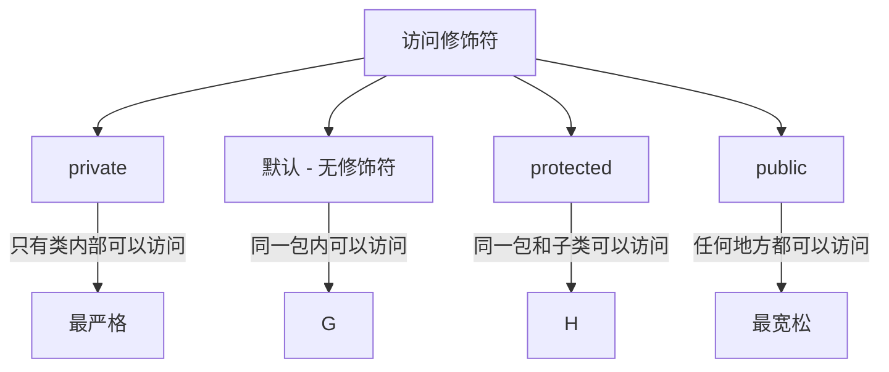

# Java 封装

## 什么是封装

封装(Encapsulation)是面向对象编程(OOP)的四大基本特性之一，其他三个是**继承**、**多态**和**抽象**。封装是指将数据(属性)和操作数据的方法(行为)捆绑在一起，对外部世界隐藏对象的内部细节，只暴露必要的接口。

简单来说，封装就是：
- 将类的某些信息隐藏在类内部，不允许外部程序直接访问
- 通过该类提供的方法来实现对隐藏信息的操作和访问

:::tip 生活中的封装
想象一下你在使用电视遥控器时，你只需要按按钮就能操作电视，而不需要了解按下按钮后电路板内部如何工作。这就是封装的一个生活例子！
:::

## 为什么需要封装

封装的主要目的是：

1. **数据保护**：防止外部直接访问和修改对象的属性
2. **隐藏实现细节**：用户只需关心对象提供的功能，而不是实现方式
3. **提高代码灵活性和可维护性**：内部实现可以改变，而不影响外部调用
4. **控制数据访问**：通过提供getter和setter方法来控制数据的读写

## 封装的实现方式

Java中实现封装主要通过以下方式：

### 1. 访问修饰符

Java提供了四种访问修饰符来控制类、变量、方法和构造方法的访问级别：



### 2. 私有成员变量

通常我们会将类的成员变量声明为`private`，这样外部就不能直接访问它们：

```java
public class Person {
    private String name;
    private int age;
    private double salary;
    
    // 构造方法、getter和setter方法
}
```

### 3. 公共的getter和setter方法

为了让外部能够安全地访问私有成员变量，我们提供公共的getter和setter方法：

```java
public class Person {
    private String name;
    private int age;
    private double salary;
    
    // 获取姓名
    public String getName() {
        return name;
    }
    
    // 设置姓名
    public void setName(String name) {
        this.name = name;
    }
    
    // 获取年龄
    public int getAge() {
        return age;
    }
    
    // 设置年龄（增加了数据验证）
    public void setAge(int age) {
        if (age >= 0 && age <= 120) {  // 添加了数据验证
            this.age = age;
        } else {
            System.out.println("年龄必须在0-120之间");
        }
    }
    
    // 获取薪资
    public double getSalary() {
        return salary;
    }
    
    // 设置薪资
    public void setSalary(double salary) {
        if (salary >= 0) {  // 添加了数据验证
            this.salary = salary;
        } else {
            System.out.println("薪资不能为负数");
        }
    }
}
```

## 封装的完整示例

下面是一个封装的完整示例，包含了类的定义和使用：

```java
// 定义Student类
public class Student {
    // 私有成员变量
    private String id;
    private String name;
    private int age;
    private double score;
    
    // 构造方法
    public Student(String id, String name, int age, double score) {
        this.id = id;
        this.name = name;
        this.setAge(age);  // 使用setter方法确保数据有效性
        this.setScore(score);
    }
    
    // getter和setter方法
    public String getId() {
        return id;
    }
    
    public void setId(String id) {
        this.id = id;
    }
    
    public String getName() {
        return name;
    }
    
    public void setName(String name) {
        this.name = name;
    }
    
    public int getAge() {
        return age;
    }
    
    public void setAge(int age) {
        if (age > 0 && age < 120) {
            this.age = age;
        } else {
            System.out.println("年龄无效，设置为18");
            this.age = 18;
        }
    }
    
    public double getScore() {
        return score;
    }
    
    public void setScore(double score) {
        if (score >= 0 && score <= 100) {
            this.score = score;
        } else {
            System.out.println("分数无效，设置为0");
            this.score = 0;
        }
    }
    
    // 展示学生信息的方法
    public void displayInfo() {
        System.out.println("学号: " + id);
        System.out.println("姓名: " + name);
        System.out.println("年龄: " + age);
        System.out.println("分数: " + score);
    }
}
```

现在我们来使用这个Student类：

```java
public class EncapsulationDemo {
    public static void main(String[] args) {
        // 创建学生对象
        Student student1 = new Student("S001", "张三", 20, 85.5);
        student1.displayInfo();
        
        System.out.println("\n修改学生信息:");
        // 通过setter方法修改属性
        student1.setAge(21);
        student1.setScore(90.5);
        student1.displayInfo();
        
        System.out.println("\n尝试设置无效年龄:");
        // 尝试设置无效的年龄
        student1.setAge(200);  // 这里会触发数据验证
        student1.displayInfo();
        
        System.out.println("\n尝试设置无效分数:");
        // 尝试设置无效的分数
        student1.setScore(150);  // 这里会触发数据验证
        student1.displayInfo();
        
        // student1.age = -10;  // 编译错误，因为age是私有的
        // student1.score = 200;  // 编译错误，因为score是私有的
    }
}
```

**输出结果：**

```
学号: S001
姓名: 张三
年龄: 20
分数: 85.5

修改学生信息:
学号: S001
姓名: 张三
年龄: 21
分数: 90.5

尝试设置无效年龄:
年龄无效，设置为18
学号: S001
姓名: 张三
年龄: 18
分数: 90.5

尝试设置无效分数:
分数无效，设置为0
学号: S001
姓名: 张三
年龄: 18
分数: 0
```

:::note 观察
注意在上面的示例中，当我们尝试设置无效的年龄和分数时，setter方法中的验证逻辑阻止了无效数据的设置，并提供了合理的默认值。这正是封装的一个重要优势！
:::

## 封装的实际应用案例

### 案例一：银行账户系统

在银行账户系统中，账户余额是一个敏感信息，不应该被直接修改：

```java
public class BankAccount {
    private String accountNumber;
    private String accountHolder;
    private double balance;
    
    public BankAccount(String accountNumber, String accountHolder) {
        this.accountNumber = accountNumber;
        this.accountHolder = accountHolder;
        this.balance = 0.0;
    }
    
    // 只提供getter，不提供setter，防止直接修改余额
    public double getBalance() {
        return balance;
    }
    
    public String getAccountNumber() {
        return accountNumber;
    }
    
    public String getAccountHolder() {
        return accountHolder;
    }
    
    // 提供专门的方法来操作余额
    public void deposit(double amount) {
        if (amount > 0) {
            balance += amount;
            System.out.println("存款成功。当前余额: " + balance);
        } else {
            System.out.println("存款金额必须大于0");
        }
    }
    
    public void withdraw(double amount) {
        if (amount > 0) {
            if (balance >= amount) {
                balance -= amount;
                System.out.println("取款成功。当前余额: " + balance);
            } else {
                System.out.println("余额不足");
            }
        } else {
            System.out.println("取款金额必须大于0");
        }
    }
}
```

使用银行账户类：

```java
public class BankDemo {
    public static void main(String[] args) {
        BankAccount account = new BankAccount("1234567890", "李四");
        
        System.out.println("账户持有人: " + account.getAccountHolder());
        System.out.println("账号: " + account.getAccountNumber());
        System.out.println("初始余额: " + account.getBalance());
        
        account.deposit(1000);
        account.withdraw(500);
        account.withdraw(700);  // 尝试取出超过余额的金额
        
        // account.balance = 1000000;  // 编译错误，因为balance是私有的
    }
}
```

**输出结果：**

```
账户持有人: 李四
账号: 1234567890
初始余额: 0.0
存款成功。当前余额: 1000.0
取款成功。当前余额: 500.0
余额不足
```

### 案例二：电子商务中的商品类

在电子商务系统中，商品价格等信息需要受到保护：

```java
public class Product {
    private String id;
    private String name;
    private double price;
    private int stock;
    
    public Product(String id, String name, double price, int stock) {
        this.id = id;
        this.name = name;
        setPrice(price);
        setStock(stock);
    }
    
    public String getId() {
        return id;
    }
    
    public String getName() {
        return name;
    }
    
    public double getPrice() {
        return price;
    }
    
    // 只有授权人员才能修改价格
    public void setPrice(double price) {
        if (price >= 0) {
            this.price = price;
        } else {
            System.out.println("价格不能为负数，设为0");
            this.price = 0;
        }
    }
    
    public int getStock() {
        return stock;
    }
    
    // 库存管理需要验证
    public void setStock(int stock) {
        if (stock >= 0) {
            this.stock = stock;
        } else {
            System.out.println("库存不能为负数，设为0");
            this.stock = 0;
        }
    }
    
    // 购买商品的方法
    public boolean purchase(int quantity) {
        if (quantity <= 0) {
            System.out.println("购买数量必须为正数");
            return false;
        }
        
        if (quantity > stock) {
            System.out.println("库存不足，当前库存: " + stock);
            return false;
        }
        
        // 减少库存
        stock -= quantity;
        System.out.println("购买成功，购买了 " + quantity + " 件商品");
        System.out.println("剩余库存: " + stock);
        return true;
    }
}
```

使用Product类：

```java
public class ShopDemo {
    public static void main(String[] args) {
        Product laptop = new Product("P001", "笔记本电脑", 5999.99, 10);
        
        System.out.println("商品信息:");
        System.out.println("ID: " + laptop.getId());
        System.out.println("名称: " + laptop.getName());
        System.out.println("价格: " + laptop.getPrice());
        System.out.println("库存: " + laptop.getStock());
        
        // 尝试购买
        laptop.purchase(2);
        laptop.purchase(15);  // 库存不足
        
        // 修改价格(促销)
        laptop.setPrice(5499.99);
        System.out.println("促销后价格: " + laptop.getPrice());
    }
}
```

**输出结果：**

```
商品信息:
ID: P001
名称: 笔记本电脑
价格: 5999.99
库存: 10
购买成功，购买了 2 件商品
剩余库存: 8
库存不足，当前库存: 8
促销后价格: 5499.99
```

## 封装的优点总结

1. **安全性提高**：通过隐藏对象的属性和实现细节，可以减少系统的潜在错误

2. **提高模块化**：封装使得代码更具有模块化，一个对象的行为可以被其他对象调用而无需知道其实现细节

3. **可维护性增强**：
   - 可以在不影响已有代码的情况下修改类的内部实现
   - 可以更容易地修改类的内部结构，而不会对使用该类的代码造成影响

4. **代码重用性**：封装后的代码组件可以更容易地在其他地方重用

5. **数据隐藏**：防止外部代码直接操作对象内部数据，增强数据安全性

6. **可控性**：通过getter和setter方法，可以对类的属性进行更严格的控制和验证

## 封装的最佳实践

1. **尽量使用私有变量**：将所有实例变量标记为私有

2. **提供公共的getter和setter方法**：根据需要控制对私有变量的访问

3. **在setter方法中进行数据验证**：确保对象状态的有效性和一致性

4. **不要过度暴露内部信息**：只提供必要的方法，不必为每个私有变量都提供getter和setter

5. **考虑只读属性**：有些属性可能只需要getter而不需要setter

6. **使用包访问权限**：对于同一个包中的类，可以考虑使用默认访问修饰符

## 总结

封装是面向对象编程的基础概念之一，它通过将数据和行为封装在一个单元中，并隐藏对象的内部细节，为程序提供了更好的可维护性、安全性和灵活性。Java中主要通过访问修饰符和提供公共方法来实现封装。

良好的封装设计使得代码更易于理解和维护，也使得软件组件更容易重用。在实际编程中，我们应当尽量遵循封装的原则，保护对象的内部状态，只通过精心设计的接口与外界进行交互。

## 练习

1. 创建一个`Circle`类，封装半径属性，提供计算面积和周长的方法。确保半径不能为负数。

2. 设计一个`Employee`类，封装员工的姓名、年龄、薪水等信息，提供适当的getter和setter方法。在setter方法中添加数据验证。

3. 创建一个`CreditCard`类，封装卡号、持卡人、信用额度、已用额度等信息。提供消费和还款的方法，确保消费后的已用额度不超过信用额度。

:::tip 思考问题
在实际系统开发中，你会如何决定哪些属性需要提供setter方法，哪些属性只需要提供getter方法？封装与系统安全有什么关系？
:::