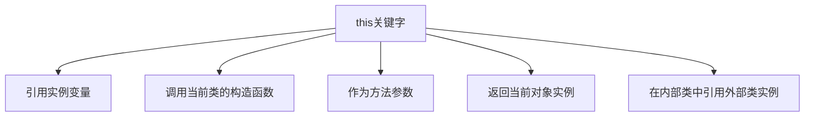

# Java this关键字

## 什么是this关键字

在Java面向对象编程中，`this`是一个引用变量，它指向当前对象。简单来说，`this`关键字可以被用来引用当前类的实例变量、方法和构造函数。它帮助我们在方法或构造函数内部引用调用该方法的对象。

:::note
`this`是Java中的保留关键字，不能被用作标识符（如变量名、方法名或类名）。
:::

## this关键字的基本用途

### 1. 引用当前类的实例变量

当方法或构造函数的参数名与实例变量名相同时，`this`关键字可以消除歧义。

```java
public class Student {
    // 实例变量
    private String name;
    private int age;
    
    // 构造函数
    public Student(String name, int age) {
        // 使用this引用实例变量
        this.name = name;  // this.name是实例变量，name是参数
        this.age = age;    // this.age是实例变量，age是参数
    }
    
    // 获取姓名的方法
    public String getName() {
        return this.name; // 可以写成 return name;
    }
}
```

### 2. 调用当前类的其他构造函数

在一个构造函数中调用同一类的另一个构造函数，可以使用`this()`语法。

```java
public class Rectangle {
    private int width;
    private int height;
    
    // 默认构造函数
    public Rectangle() {
        this(1, 1); // 调用带参数的构造函数
    }
    
    // 带参数的构造函数
    public Rectangle(int width, int height) {
        this.width = width;
        this.height = height;
    }
    
    public int getArea() {
        return width * height;
    }
}
```

当我们创建一个矩形对象时:

```java
Rectangle defaultRect = new Rectangle(); // 使用默认构造函数
System.out.println(defaultRect.getArea()); // 输出: 1

Rectangle customRect = new Rectangle(5, 3); // 使用带参数的构造函数
System.out.println(customRect.getArea()); // 输出: 15
```

:::caution
使用`this()`调用构造函数时，必须作为构造函数中的第一条语句。
:::

### 3. 作为方法参数传递

当需要将当前对象作为参数传递给另一个方法时，可以使用`this`关键字。

```java
public class Counter {
    private int count = 0;
    
    public void increment() {
        count++;
        // 如果count超过10，则重置
        if (count > 10) {
            reset(this); // 将当前对象作为参数传递
        }
    }
    
    private void reset(Counter counter) {
        counter.count = 0;
    }
    
    public int getCount() {
        return count;
    }
}
```

### 4. 返回当前类的实例

在方法中返回当前对象的引用，通常用于方法链（method chaining）。

```java
public class StringBuilder {
    private String string = "";
    
    public StringBuilder append(String str) {
        this.string = this.string + str;
        return this; // 返回当前对象，实现方法链
    }
    
    public String toString() {
        return string;
    }
}
```

使用方法链的方式调用:

```java
StringBuilder builder = new StringBuilder();
String result = builder.append("Hello ")
                      .append("World!")
                      .toString();
System.out.println(result); // 输出: Hello World!
```

## this关键字的高级用法

### 1. 在匿名内部类中使用this

在匿名内部类中，`this`关键字指的是内部类对象本身，而非外部类对象。如果需要引用外部类对象，可以使用`外部类名.this`语法。

```java
public class Outer {
    private String message = "Outer Class";
    
    public void display() {
        Button button = new Button();
        button.setOnClickListener(new OnClickListener() {
            @Override
            public void onClick() {
                System.out.println(this.toString()); // 输出内部类对象的toString
                System.out.println(Outer.this.message); // 访问外部类的变量
            }
        });
    }
    
    // 模拟Button和OnClickListener
    class Button {
        private OnClickListener listener;
        
        public void setOnClickListener(OnClickListener listener) {
            this.listener = listener;
        }
    }
    
    interface OnClickListener {
        void onClick();
    }
}
```

### 2. 构造函数中的this位置限制

在构造函数中，如果使用`this()`调用另一个构造函数，该调用必须是构造函数的第一条语句。

```java
public class MyClass {
    private int number;
    private String text;
    
    public MyClass() {
        // 正确：this()调用作为第一条语句
        this(0, "Default");
    }
    
    public MyClass(int number) {
        // 正确：this()调用作为第一条语句
        this(number, "Default");
    }
    
    public MyClass(int number, String text) {
        this.number = number;
        this.text = text;
    }
}
```

## 实际应用案例

### 案例1: 创建流式接口（Fluent Interface）

使用`this`关键字返回当前对象引用，可以实现流式接口设计模式，提高代码的可读性。

```java
public class Person {
    private String firstName;
    private String lastName;
    private int age;
    private String address;
    
    public Person withFirstName(String firstName) {
        this.firstName = firstName;
        return this;
    }
    
    public Person withLastName(String lastName) {
        this.lastName = lastName;
        return this;
    }
    
    public Person withAge(int age) {
        this.age = age;
        return this;
    }
    
    public Person withAddress(String address) {
        this.address = address;
        return this;
    }
    
    @Override
    public String toString() {
        return firstName + " " + lastName + ", " + age + " years old, lives at " + address;
    }
}
```

使用流式接口:

```java
Person person = new Person()
    .withFirstName("John")
    .withLastName("Doe")
    .withAge(30)
    .withAddress("123 Main St");
    
System.out.println(person);
// 输出: John Doe, 30 years old, lives at 123 Main St
```

### 案例2: 单例模式实现

使用`this`关键字在单例模式中返回唯一实例。

```java
public class Singleton {
    // 静态变量保存唯一实例
    private static Singleton instance;
    
    // 私有构造函数防止外部实例化
    private Singleton() { }
    
    // 提供全局访问点
    public static Singleton getInstance() {
        if (instance == null) {
            instance = new Singleton();
        }
        return instance;
    }
    
    public void showMessage() {
        System.out.println("Hello from Singleton!");
    }
}
```

使用单例:

```java
Singleton singleton = Singleton.getInstance();
singleton.showMessage(); // 输出: Hello from Singleton!
```

## this关键字的使用场景总结

下面是一个图表，展示了`this`关键字的主要使用场景:



## 最佳实践和注意事项

1. **明确使用**: 当局部变量与实例变量同名时，必须使用`this`关键字区分。
2. **方法链**: 在需要实现方法链的场景中，记得返回`this`。
3. **构造函数调用**: 使用`this()`调用其他构造函数时，必须作为构造函数的第一条语句。
4. **内部类**: 在内部类中访问外部类的成员时，使用`外部类名.this`。
5. **避免过度使用**: 当不存在命名冲突时，可以省略`this`，保持代码简洁。

## 总结

`this`关键字是Java面向对象编程中的重要概念，它提供了引用当前对象的能力。通过正确使用`this`关键字，我们可以:

1. 解决局部变量与实例变量名称冲突的问题
2. 在构造函数之间实现代码重用
3. 将当前对象作为参数传递给其他方法
4. 实现方法链以提高代码的可读性
5. 在内部类中访问外部类的成员

掌握`this`关键字的使用不仅能让你的代码更加清晰，还能帮助你实现更复杂的设计模式和编程技巧。

## 练习

1. 创建一个`Calculator`类，使用方法链实现加法、减法、乘法和除法操作。
2. 实现一个`User`类，包含用户的基本信息，并使用`this`关键字解决构造函数中的命名冲突。
3. 编写一个类，演示如何在一个构造函数中调用另一个构造函数。
4. 创建一个外部类和内部类的示例，演示如何在内部类中使用`this`和`外部类.this`。

:::tip
学习编程的最好方式是实践！尝试自己编写代码，并测试每一个你不确定的概念。
:::