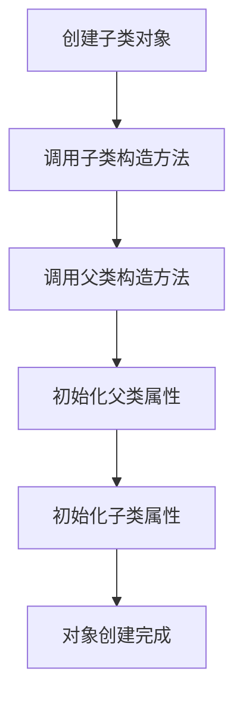

# Java 构造方法

## 什么是构造方法

构造方法（Constructor）是一种特殊的方法，主要用于对象的初始化工作。当我们使用 `new` 关键字创建一个对象时，构造方法会被自动调用，用于初始化对象的状态。

:::tip
构造方法的名称必须与类名完全相同，并且没有返回值类型（包括void）。
:::

## 构造方法的特点

1. **与类同名**：构造方法的名称必须与类名完全一致（包括大小写）
2. **无返回值**：构造方法没有返回值类型，甚至不能声明为`void`
3. **自动调用**：在创建对象时自动执行，无需手动调用
4. **可重载**：一个类可以有多个构造方法，通过参数列表的不同进行区分
5. **默认构造方法**：如果没有定义任何构造方法，Java会自动提供一个无参默认构造方法

## 默认构造方法

当一个类中没有定义任何构造方法时，Java编译器会自动为这个类添加一个默认的无参构造方法：

```java
public class Student {
    // 没有显式定义构造方法
}

// 等同于
public class Student {
    // 编译器会自动添加如下默认构造方法
    public Student() {
        // 空方法体
    }
}
```

:::caution
当你显式定义了任何一个构造方法后，编译器不再提供默认构造方法！
:::

## 构造方法的语法

```java
[访问修饰符] 类名([参数列表]) {
    // 构造方法体
}
```

例如：

```java
public class Student {
    private String name;
    private int age;
    
    // 无参构造方法
    public Student() {
        name = "未命名";
        age = 0;
    }
    
    // 带参构造方法
    public Student(String name, int age) {
        this.name = name;
        this.age = age;
    }
}
```

## 构造方法的重载

与普通方法一样，构造方法也可以重载。重载的构造方法必须具有不同的参数列表（参数类型、参数个数或参数顺序不同）。

```java
public class Person {
    private String name;
    private int age;
    private String gender;
    
    // 无参构造方法
    public Person() {
        this.name = "未知";
        this.age = 0;
        this.gender = "未知";
    }
    
    // 单参构造方法
    public Person(String name) {
        this.name = name;
        this.age = 0;
        this.gender = "未知";
    }
    
    // 双参构造方法
    public Person(String name, int age) {
        this.name = name;
        this.age = age;
        this.gender = "未知";
    }
    
    // 三参构造方法
    public Person(String name, int age, String gender) {
        this.name = name;
        this.age = age;
        this.gender = gender;
    }
}
```

## this关键字在构造方法中的应用

`this`关键字在构造方法中常有两种用途：

### 1. 区分局部变量和成员变量

当参数名称与成员变量名称相同时，使用`this`关键字来引用成员变量：

```java
public class Rectangle {
    private int width;
    private int height;
    
    public Rectangle(int width, int height) {
        // 使用this区分成员变量和参数
        this.width = width;
        this.height = height;
    }
}
```

### 2. 调用其他构造方法

使用`this()`可以调用同一个类中的其他构造方法，减少代码重复：

```java
public class Book {
    private String title;
    private String author;
    private double price;
    
    public Book() {
        this("未知", "佚名", 0.0);
    }
    
    public Book(String title) {
        this(title, "佚名", 0.0);
    }
    
    public Book(String title, String author) {
        this(title, author, 0.0);
    }
    
    public Book(String title, String author, double price) {
        this.title = title;
        this.author = author;
        this.price = price;
    }
}
```

:::note
使用`this()`调用其他构造方法时，必须放在构造方法的第一行。
:::

## 构造方法vs普通方法

| 特点 | 构造方法 | 普通方法 |
|------|---------|---------|
| 命名 | 必须与类名相同 | 可以任意命名 |
| 返回值类型 | 没有返回值类型 | 必须声明返回值类型（可以是void） |
| 调用方式 | 使用new关键字创建对象时自动调用 | 通过对象引用显式调用 |
| 作用 | 初始化对象 | 实现特定功能 |

## 构造方法的应用场景

### 场景一：初始化对象属性

最基本的应用场景是初始化对象的属性值：

```java
public class Car {
    private String brand;
    private String model;
    private int year;
    
    public Car(String brand, String model, int year) {
        this.brand = brand;
        this.model = model;
        this.year = year;
    }
    
    public void displayInfo() {
        System.out.println("品牌：" + brand);
        System.out.println("型号：" + model);
        System.out.println("年份：" + year);
    }
    
    public static void main(String[] args) {
        Car myCar = new Car("丰田", "卡罗拉", 2020);
        myCar.displayInfo();
    }
}
```

输出：
```
品牌：丰田
型号：卡罗拉
年份：2020
```

### 场景二：提供默认值与自定义值选择

通过构造方法重载，可以为用户提供多种初始化对象的方式：

```java
public class BankAccount {
    private String accountNumber;
    private String accountHolder;
    private double balance;
    private double interestRate;
    
    // 提供所有必要信息的构造方法
    public BankAccount(String accountNumber, String accountHolder, 
                       double initialDeposit, double interestRate) {
        this.accountNumber = accountNumber;
        this.accountHolder = accountHolder;
        this.balance = initialDeposit;
        this.interestRate = interestRate;
    }
    
    // 使用默认利率的简化构造方法
    public BankAccount(String accountNumber, String accountHolder, double initialDeposit) {
        this(accountNumber, accountHolder, initialDeposit, 0.05); // 默认5%利率
    }
    
    // 仅创建账户，后续存款的构造方法
    public BankAccount(String accountNumber, String accountHolder) {
        this(accountNumber, accountHolder, 0, 0.05);
    }
    
    public void displayAccountInfo() {
        System.out.println("账号: " + accountNumber);
        System.out.println("账户持有人: " + accountHolder);
        System.out.println("余额: " + balance);
        System.out.println("利率: " + (interestRate * 100) + "%");
    }
    
    public static void main(String[] args) {
        BankAccount account1 = new BankAccount("1001", "张三", 1000, 0.06);
        BankAccount account2 = new BankAccount("1002", "李四", 500);
        BankAccount account3 = new BankAccount("1003", "王五");
        
        System.out.println("账户1信息：");
        account1.displayAccountInfo();
        
        System.out.println("\n账户2信息：");
        account2.displayAccountInfo();
        
        System.out.println("\n账户3信息：");
        account3.displayAccountInfo();
    }
}
```

输出：
```
账户1信息：
账号: 1001
账户持有人: 张三
余额: 1000.0
利率: 6.0%

账户2信息：
账号: 1002
账户持有人: 李四
余额: 500.0
利率: 5.0%

账户3信息：
账号: 1003
账户持有人: 王五
余额: 0.0
利率: 5.0%
```

### 场景三：确保对象创建时的数据有效性

构造方法可以包含参数验证逻辑，确保创建的对象符合业务规则：

```java
public class Employee {
    private String id;
    private String name;
    private double salary;
    
    public Employee(String id, String name, double salary) {
        // 验证员工ID格式
        if (id == null || !id.matches("EMP\\d{4}")) {
            throw new IllegalArgumentException("员工ID必须符合格式：EMP后跟4位数字");
        }
        
        // 验证姓名不能为空
        if (name == null || name.trim().isEmpty()) {
            throw new IllegalArgumentException("员工姓名不能为空");
        }
        
        // 验证工资必须为正数
        if (salary <= 0) {
            throw new IllegalArgumentException("工资必须为正数");
        }
        
        this.id = id;
        this.name = name;
        this.salary = salary;
    }
    
    public void displayInfo() {
        System.out.println("员工ID: " + id);
        System.out.println("姓名: " + name);
        System.out.println("工资: " + salary);
    }
    
    public static void main(String[] args) {
        try {
            // 创建有效员工
            Employee validEmployee = new Employee("EMP1234", "张三", 5000);
            validEmployee.displayInfo();
            
            System.out.println("\n尝试创建无效员工：");
            // 尝试创建无效员工
            Employee invalidEmployee = new Employee("E123", "李四", 3000);
        } catch (IllegalArgumentException e) {
            System.out.println("错误: " + e.getMessage());
        }
    }
}
```

输出：
```
员工ID: EMP1234
姓名: 张三
工资: 5000.0

尝试创建无效员工：
错误: 员工ID必须符合格式：EMP后跟4位数字
```

## 构造方法与继承

构造方法不能被继承，但在创建子类对象时，会首先调用父类的构造方法。这是通过`super()`关键字实现的，我们将在继承相关章节深入讨论这个概念。



## 总结

构造方法是Java面向对象编程中非常重要的概念，它主要用于对象的初始化工作。通过构造方法，我们可以：

1. 在创建对象时初始化对象的状态
2. 通过构造方法重载提供多种初始化对象的方式
3. 确保对象创建时数据的有效性
4. 使用`this`关键字区分成员变量和局部变量
5. 使用`this()`调用其他构造方法以避免代码重复

掌握构造方法的使用可以帮助我们更好地设计和实现类，使代码更加健壮和易于维护。

## 练习题

1. 创建一个`Circle`类，包含半径属性，并提供多个构造方法：
   - 无参构造方法，将半径设为1.0
   - 带参构造方法，接收一个自定义半径值
   - 添加计算面积和周长的方法

2. 创建一个`Student`类，包含学号、姓名、年龄和专业属性，提供多个构造方法，并实现学生信息的打印功能。

3. 创建一个`Product`类，包含产品ID、名称、价格和库存属性，通过构造方法确保产品创建时提供的数据有效（如ID格式正确、价格为正数等）。

## 深入学习资源

- Java官方文档：[Classes and Objects](https://docs.oracle.com/javase/tutorial/java/javaOO/index.html)
- 《Java核心技术 卷I》第4章：对象与类
- 《Effective Java》第1条：考虑用静态工厂方法代替构造器

祝你在Java面向对象编程的学习中取得进步！