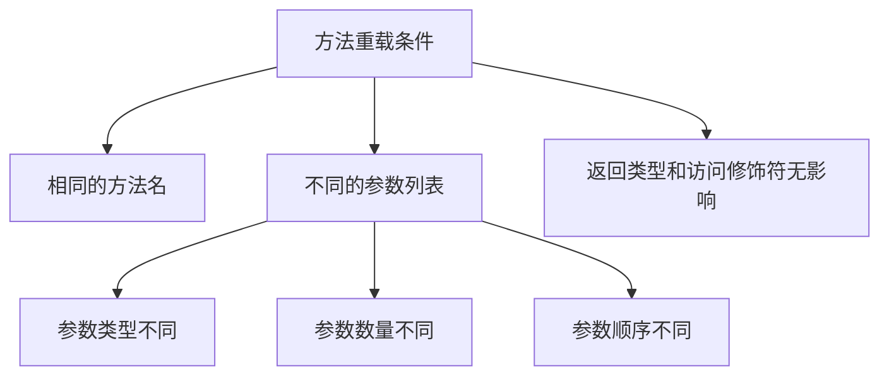

# Java 方法重载

## 什么是方法重载？

方法重载（Method Overloading）是Java面向对象编程中的一个重要特性，它允许在同一个类中创建多个方法，它们具有**相同的名称**但**参数列表不同**。这使得我们可以根据传入的参数类型和数量来执行不同的操作，提高代码的灵活性和可读性。

:::note 方法重载的关键点
方法重载是基于编译时多态（静态多态）的概念，编译器在编译阶段就能确定调用哪个方法。
:::

## 方法重载的规则

要正确实现方法重载，需要遵循以下规则：

1. **方法名称必须相同**
2. **参数列表必须不同**（参数的类型、数量或顺序至少有一个不同）
3. **返回类型可以相同也可以不同**，但仅有返回类型不同不足以构成重载
4. **访问修饰符可以相同也可以不同**，不影响重载



## 方法重载的例子

### 基本示例

让我们通过一个简单的例子来理解方法重载：

```java
public class CalculatorExample {
    // 两个整数相加
    public int add(int a, int b) {
        return a + b;
    }
    
    // 三个整数相加
    public int add(int a, int b, int c) {
        return a + b + c;
    }
    
    // 两个浮点数相加
    public double add(double a, double b) {
        return a + b;
    }
    
    // 整数和浮点数相加
    public double add(int a, double b) {
        return a + b;
    }
    
    // 浮点数和整数相加（参数顺序不同）
    public double add(double a, int b) {
        return a + b;
    }
}
```

使用这个类：

```java
public class Main {
    public static void main(String[] args) {
        CalculatorExample calc = new CalculatorExample();
        
        // 调用 add(int a, int b)
        System.out.println("2 + 3 = " + calc.add(2, 3));
        
        // 调用 add(int a, int b, int c)
        System.out.println("2 + 3 + 4 = " + calc.add(2, 3, 4));
        
        // 调用 add(double a, double b)
        System.out.println("2.5 + 3.5 = " + calc.add(2.5, 3.5));
        
        // 调用 add(int a, double b)
        System.out.println("2 + 3.5 = " + calc.add(2, 3.5));
        
        // 调用 add(double a, int b)
        System.out.println("2.5 + 3 = " + calc.add(2.5, 3));
    }
}
```

输出结果：
```
2 + 3 = 5
2 + 3 + 4 = 9
2.5 + 3.5 = 6.0
2 + 3.5 = 5.5
2.5 + 3 = 5.5
```

### 构造函数重载

构造函数也可以被重载，这是Java中非常常见的做法：

```java
public class Student {
    private String name;
    private int age;
    private String id;
    
    // 无参构造函数
    public Student() {
        this.name = "未命名";
        this.age = 0;
        this.id = "未分配";
    }
    
    // 带有姓名参数的构造函数
    public Student(String name) {
        this.name = name;
        this.age = 0;
        this.id = "未分配";
    }
    
    // 带有姓名和年龄参数的构造函数
    public Student(String name, int age) {
        this.name = name;
        this.age = age;
        this.id = "未分配";
    }
    
    // 带有所有参数的构造函数
    public Student(String name, int age, String id) {
        this.name = name;
        this.age = age;
        this.id = id;
    }
    
    public void displayInfo() {
        System.out.println("学生信息：");
        System.out.println("姓名: " + name);
        System.out.println("年龄: " + age);
        System.out.println("学号: " + id);
    }
}
```

使用这个类：

```java
public class Main {
    public static void main(String[] args) {
        // 使用不同的构造函数创建对象
        Student s1 = new Student();
        Student s2 = new Student("张三");
        Student s3 = new Student("李四", 20);
        Student s4 = new Student("王五", 22, "CS001");
        
        s1.displayInfo();
        System.out.println("-----------");
        s2.displayInfo();
        System.out.println("-----------");
        s3.displayInfo();
        System.out.println("-----------");
        s4.displayInfo();
    }
}
```

输出结果：
```
学生信息：
姓名: 未命名
年龄: 0
学号: 未分配
-----------
学生信息：
姓名: 张三
年龄: 0
学号: 未分配
-----------
学生信息：
姓名: 李四
年龄: 20
学号: 未分配
-----------
学生信息：
姓名: 王五
年龄: 22
学号: CS001
```

## 方法重载如何工作

当我们调用一个方法时，Java编译器如何确定应该调用哪个重载方法呢？编译器会按照以下步骤进行匹配：

1. **精确匹配**：寻找与参数类型完全匹配的方法
2. **类型提升**：如果没有精确匹配，查找可通过基本类型提升匹配的方法（例如 `int` 可以提升为 `long`）
3. **自动装箱/拆箱**：考虑基本类型与其包装类之间的转换（如 `int` 和 `Integer`）
4. **可变参数**：最后考虑可变参数方法

:::caution 重载方法的匹配顺序
Java编译器总是选择"最具体"的匹配方法。如果有多个方法都能匹配，但没有一个是最具体的，编译器会报错，因为调用存在歧义。
:::

## 方法重载的实际应用场景

方法重载在实际开发中有许多应用场景：

### 1. 提供便利的方法变体

```java
public class StringUtils {
    // 默认用空格分割
    public static String[] split(String text) {
        return text.split(" ");
    }
    
    // 自定义分隔符
    public static String[] split(String text, String delimiter) {
        return text.split(delimiter);
    }
    
    // 限制结果数量
    public static String[] split(String text, String delimiter, int limit) {
        return text.split(delimiter, limit);
    }
}
```

### 2. 标准库中的应用

Java标准库中有大量重载方法的例子，例如`println()`方法：

```java
System.out.println(int i);
System.out.println(double d);
System.out.println(char c);
System.out.println(String s);
System.out.println(boolean b);
// 等等...
```

### 3. 构建者模式中的链式调用

```java
public class EmailBuilder {
    private String recipient;
    private String subject;
    private String body;
    private String sender;
    private List<String> cc = new ArrayList<>();
    
    public EmailBuilder from(String sender) {
        this.sender = sender;
        return this;
    }
    
    public EmailBuilder to(String recipient) {
        this.recipient = recipient;
        return this;
    }
    
    public EmailBuilder withSubject(String subject) {
        this.subject = subject;
        return this;
    }
    
    public EmailBuilder withBody(String body) {
        this.body = body;
        return this;
    }
    
    // 重载添加抄送人的方法
    public EmailBuilder cc(String person) {
        this.cc.add(person);
        return this;
    }
    
    public EmailBuilder cc(List<String> people) {
        this.cc.addAll(people);
        return this;
    }
    
    public Email build() {
        // 创建并返回Email对象
        return new Email(sender, recipient, subject, body, cc);
    }
}
```

使用这个构建器：

```java
Email email = new EmailBuilder()
    .from("sender@example.com")
    .to("recipient@example.com")
    .withSubject("方法重载学习")
    .withBody("这是一个关于方法重载的示例")
    .cc("manager@example.com")
    .cc(Arrays.asList("colleague1@example.com", "colleague2@example.com"))
    .build();
```

## 方法重载的最佳实践

在使用方法重载时，应遵循以下最佳实践：

1. **保持一致的行为**：重载方法应该执行相似的操作，只是处理不同类型或数量的参数。

2. **使用有意义的默认值**：当创建参数更少的重载方法时，为省略的参数使用合理的默认值。

3. **避免歧义**：确保重载方法之间的区别明显，避免类型过于相似导致的混淆。

4. **考虑使用可选参数替代**：在某些情况下，使用可变参数（varargs）或Builder模式可能比创建多个重载方法更清晰。

5. **文档注释**：为每个重载方法提供清晰的文档，说明它们之间的区别。

## 方法重载与方法重写的区别

初学者经常混淆方法重载（Overloading）和方法重写（Overriding），下面是它们的主要区别：

| 特征 | 方法重载 | 方法重写 |
|------|---------|---------|
| 发生位置 | 同一个类中 | 子类中 |
| 参数列表 | 必须不同 | 必须相同 |
| 返回类型 | 可以不同 | 必须相同或为子类型 |
| 访问修饰符 | 可以不同 | 不能更严格 |
| 异常抛出 | 可以不同 | 不能抛出更广泛的异常 |
| 绑定 | 静态绑定（编译时） | 动态绑定（运行时） |

## 总结

方法重载是Java面向对象编程中的一个重要特性，它允许我们使用相同的方法名创建多个功能相似但参数不同的方法。通过方法重载，我们可以：

- 提高代码的可读性和直观性
- 减少记忆不同方法名的负担
- 提供更灵活的API
- 实现多种处理相似任务的方式

在实际应用中，方法重载广泛应用于构造函数、工具类方法和API设计中，是Java编程中不可或缺的一部分。

## 练习

为了巩固所学知识，尝试完成以下练习：

1. 创建一个`MessageFormatter`类，实现不同重载版本的`format`方法，能够处理不同类型的消息格式化。

2. 设计一个`Shape`类，提供多种重载的`calculateArea`方法，可以计算不同形状（圆形、矩形、三角形等）的面积。

3. 创建一个`Logger`类，实现重载的`log`方法，可以记录不同级别和格式的日志信息。

## 进一步学习资源

- Oracle Java教程: [方法定义](https://docs.oracle.com/javase/tutorial/java/javaOO/methods.html)
- Java核心技术卷I：基础知识
- Effective Java (Joshua Bloch) - 探讨了方法设计的最佳实践