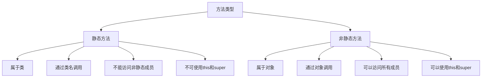

# Java 静态方法

## 什么是静态方法？

在Java中，静态方法（Static Method）是一种特殊的方法，它属于类本身而不是类的实例（对象）。这意味着你可以直接通过类名来调用静态方法，而不需要创建该类的对象。静态方法在程序启动时就已经存在于内存中，不依赖于任何对象。

静态方法的主要特点：

1. 使用`static`关键字声明
2. 可以直接通过类名调用，无需创建对象
3. 不能访问类的非静态成员（变量和方法）
4. 不能使用`this`和`super`关键字

## 静态方法的声明和调用

### 声明语法

```java
public class MyClass {
    // 静态方法声明
    public static void myStaticMethod() {
        // 方法体
        System.out.println("这是一个静态方法");
    }
    
    // 非静态方法声明
    public void myNonStaticMethod() {
        System.out.println("这是一个非静态方法");
    }
}
```

### 调用方式

静态方法可以通过两种方式调用：

1. 通过类名直接调用（推荐方式）：
```java
MyClass.myStaticMethod();  // 输出：这是一个静态方法
```

2. 通过对象引用调用（不推荐，但语法允许）：
```java
MyClass obj = new MyClass();
obj.myStaticMethod();  // 输出：这是一个静态方法
```

而非静态方法只能通过对象调用：
```java
MyClass obj = new MyClass();
obj.myNonStaticMethod();  // 输出：这是一个非静态方法

// 下面这行代码会导致编译错误
// MyClass.myNonStaticMethod();
```

## 静态方法的特性和限制

### 1. 不能访问非静态成员

静态方法不能直接访问类的非静态变量和方法，因为它们属于对象而非类：

```java
public class StaticExample {
    private int nonStaticVar = 10;  // 非静态变量
    private static int staticVar = 20;  // 静态变量
    
    public static void staticMethod() {
        System.out.println("静态变量值: " + staticVar);  // 正确
        // System.out.println("非静态变量值: " + nonStaticVar);  // 错误！编译失败
        // nonStaticMethod();  // 错误！不能调用非静态方法
    }
    
    public void nonStaticMethod() {
        System.out.println("非静态变量值: " + nonStaticVar);  // 正确
        System.out.println("静态变量值: " + staticVar);  // 也可以访问静态变量
        staticMethod();  // 非静态方法可以调用静态方法
    }
}
```

### 2. 不能使用`this`和`super`关键字

由于静态方法不依赖于任何对象，因此在静态方法中不能使用`this`和`super`关键字：

```java
public class ThisExample {
    private static int count = 0;
    
    public static void incrementCount() {
        count++;
        // 以下语句会导致编译错误
        // this.count++;  // 错误：静态方法中不能使用this
    }
}
```

## 静态方法的应用场景

### 1. 工具类方法

静态方法非常适合实现工具类的功能，如Java标准库中的`Math`、`Arrays`和`Collections`类：

```java
public class MathUtil {
    // 私有构造函数防止实例化
    private MathUtil() {}
    
    public static int add(int a, int b) {
        return a + b;
    }
    
    public static int multiply(int a, int b) {
        return a * b;
    }
}

// 使用方式
int sum = MathUtil.add(5, 3);  // 输出：8
int product = MathUtil.multiply(5, 3);  // 输出：15
```

### 2. 工厂方法

静态方法常用于实现工厂设计模式，用于创建对象：

```java
public class ShapeFactory {
    public static Shape createCircle(double radius) {
        return new Circle(radius);
    }
    
    public static Shape createRectangle(double width, double height) {
        return new Rectangle(width, height);
    }
}

// 使用方式
Shape circle = ShapeFactory.createCircle(5.0);
Shape rectangle = ShapeFactory.createRectangle(4.0, 6.0);
```

### 3. 单例模式

静态方法在实现单例设计模式中也扮演着重要角色：

```java
public class Singleton {
    private static Singleton instance;
    
    // 私有构造函数
    private Singleton() {}
    
    // 静态工厂方法
    public static Singleton getInstance() {
        if (instance == null) {
            instance = new Singleton();
        }
        return instance;
    }
}

// 使用方式
Singleton singleton = Singleton.getInstance();
```

### 4. 主方法（main方法）

Java程序的入口点`main`方法必须是静态的：

```java
public class HelloWorld {
    public static void main(String[] args) {
        System.out.println("Hello, World!");
    }
}
```

:::note
为什么`main`方法必须是静态的？因为当Java程序启动时，还没有任何对象被创建，所以JVM需要一个不依赖于对象的方法作为程序入口点。
:::

## 静态方法与非静态方法的对比

以下是静态方法与非静态方法的主要区别：



## 静态方法的内存分配

静态方法在类加载时就会分配内存，存储在方法区（Method Area）中，不会随着对象的创建而创建，也不会随着对象的销毁而销毁。

:::caution
过度使用静态方法可能导致代码难以测试和维护，因为静态方法通常会产生全局状态和依赖。
:::

## 实际案例：计数器类

下面是一个使用静态方法和静态变量实现的简单计数器类：

```java
public class Counter {
    // 静态变量，被所有实例共享
    private static int count = 0;
    
    // 实例变量，每个实例独立
    private int instanceCount = 0;
    
    // 静态方法增加静态计数
    public static void incrementCount() {
        count++;
    }
    
    // 静态方法获取当前计数值
    public static int getCount() {
        return count;
    }
    
    // 非静态方法增加实例计数
    public void incrementInstanceCount() {
        instanceCount++;
    }
    
    // 非静态方法获取实例计数值
    public int getInstanceCount() {
        return instanceCount;
    }
}
```

使用示例：

```java
public class CounterDemo {
    public static void main(String[] args) {
        // 通过类直接调用静态方法
        Counter.incrementCount();
        Counter.incrementCount();
        System.out.println("静态计数: " + Counter.getCount());  // 输出：静态计数: 2
        
        // 创建实例并调用非静态方法
        Counter counter1 = new Counter();
        counter1.incrementInstanceCount();
        System.out.println("实例1计数: " + counter1.getInstanceCount());  // 输出：实例1计数: 1
        
        // 创建另一个实例
        Counter counter2 = new Counter();
        counter2.incrementInstanceCount();
        counter2.incrementInstanceCount();
        System.out.println("实例2计数: " + counter2.getInstanceCount());  // 输出：实例2计数: 2
        
        // 静态计数被所有实例共享
        System.out.println("静态计数仍然是: " + Counter.getCount());  // 输出：静态计数仍然是: 2
    }
}
```

## 静态方法的最佳实践

1. **适当使用静态方法**：仅当方法不需要访问对象状态且功能与类相关时才使用静态方法。
2. **工具类应全部使用静态方法**：如数学工具、字符串处理等功能。
3. **添加私有构造函数**：对于只包含静态方法的类，应添加私有构造函数防止实例化。
4. **避免在静态方法中修改静态变量**：这可能导致不可预测的行为和线程安全问题。
5. **静态导入要谨慎**：虽然可以通过静态导入简化代码，但过度使用会降低代码可读性。

## 总结

Java静态方法是与类关联而不是与对象关联的方法。它们主要用于实现不依赖于对象状态的功能，如工具方法、工厂方法和单例访问器等。静态方法具有不能访问非静态成员和不能使用`this`、`super`关键字等限制，但它们可以提高代码组织性，并简化那些不需要对象状态的方法的使用。

理解静态方法的工作原理和适用场景，对于编写高效、易维护的Java代码至关重要。

## 练习

1. 创建一个名为`StringUtils`的工具类，包含以下静态方法：
   - `boolean isPalindrome(String s)`：检查字符串是否为回文
   - `String reverse(String s)`：反转字符串
   - `int countVowels(String s)`：计算字符串中的元音字母数量

2. 编写一个简单的计算器类`Calculator`，使用静态方法实现加、减、乘、除功能。

3. 实现一个`LoggerUtil`类，使用静态方法记录不同级别的日志信息（INFO、WARNING、ERROR）。

## 进一步学习资源

- Java官方文档中关于[静态方法](https://docs.oracle.com/javase/tutorial/java/javaOO/classvars.html)的章节
- 了解更多关于[设计模式](https://www.javatpoint.com/design-patterns-in-java)中静态方法的应用
- 深入探讨[Java内存模型](https://www.baeldung.com/java-memory-model)，了解静态成员的内存分配