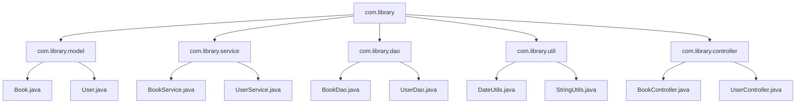

# Java 包

## 什么是Java包？

Java包(package)是Java语言中用于组织类和接口的一种机制，类似于文件系统中的文件夹，它可以将功能相似或相关的类组织在一起，提供命名空间以避免命名冲突，并控制访问权限。

包的主要作用包括：

- **代码组织**：将相关的类组织在一起，提高代码的可读性和可维护性
- **访问控制**：可以设置包级别的访问权限
- **命名空间管理**：避免不同类之间的命名冲突
- **封装实现细节**：隐藏实现细节，只暴露必要的接口

:::tip
良好的包结构设计是Java项目可维护性和可扩展性的基础。
:::

## 包的声明和使用

### 声明包

要将一个类放入特定的包中，需要在Java源文件的最开始使用`package`语句：

```java
package com.mycompany.project.utils;

public class StringUtils {
    // 类的定义
}
```

:::caution
package语句必须是Java源文件中的第一条语句（除注释外）。
:::

### 包的命名约定

Java包的命名采用域名反转的方式，以确保全球范围内的唯一性：

```
组织域名反转.项目名.模块名.子模块名
```

例如：
- `com.google.android.gms` - Google公司的Android GMS服务
- `org.apache.commons.lang` - Apache组织的Commons Lang库

常见的命名规范：
- 包名全部小写
- 使用有意义的名称
- 避免以`java`和`javax`开头（这些是JDK保留的）

### 导入包中的类

要使用其他包中的类，需要使用`import`语句：

```java
// 导入单个类
import java.util.ArrayList;

// 导入包中的所有类
import java.util.*;

public class MyClass {
    public void method() {
        ArrayList<String> list = new ArrayList<>();
        // ...
    }
}
```

## 包的类型

Java中的包主要分为两类：

### 1. 内置包（Java API）

这些是Java平台提供的标准包，例如：

- `java.lang` - 包含Java语言的基础类，如`String`、`Object`等（此包无需显式导入）
- `java.util` - 包含集合框架、日期时间工具等实用类
- `java.io` - 包含输入输出相关类
- `java.net` - 包含网络编程相关类
- `java.sql` - 包含数据库连接相关类

### 2. 用户自定义包

开发者根据项目需求创建的自定义包。通常基于功能或层次进行组织，例如：

- `com.mycompany.project.model` - 数据模型类
- `com.mycompany.project.service` - 业务逻辑类
- `com.mycompany.project.controller` - 控制器类
- `com.mycompany.project.util` - 工具类

## 包的物理结构

Java包在文件系统中表现为目录层次结构，包名中的每个部分对应一个子目录：

```
src/
└── com/
    └── mycompany/
        └── project/
            ├── model/
            │   └── User.java
            ├── service/
            │   └── UserService.java
            └── util/
                └── StringUtils.java
```

在上面的例子中：
- `User.java`文件中会声明`package com.mycompany.project.model;`
- `UserService.java`文件中会声明`package com.mycompany.project.service;`
- `StringUtils.java`文件中会声明`package com.mycompany.project.util;`

## 编译和运行包中的代码

### 编译包中的代码

使用`javac`命令编译包中的代码时，需要指定包的路径：

```bash
javac -d output_directory src/com/mycompany/project/model/User.java
```

- `-d output_directory`选项指定编译后的`.class`文件存放位置

### 运行包中的代码

使用`java`命令运行包中的类时，需要使用完全限定名：

```bash
java -cp output_directory com.mycompany.project.MainClass
```

- `-cp output_directory`选项指定类路径

## 包访问权限

Java中有四种访问级别修饰符：

| 修饰符 | 同一类 | 同一包 | 子类 | 任何地方 |
|--------|-------|-------|------|---------|
| private | ✓ | ✗ | ✗ | ✗ |
| (默认/包级) | ✓ | ✓ | ✗ | ✗ |
| protected | ✓ | ✓ | ✓ | ✗ |
| public | ✓ | ✓ | ✓ | ✓ |

如果不指定访问修饰符（即默认访问级别，也称为包级访问权限），该类或成员只能被同一包中的其他类访问。这是包在Java访问控制中的重要作用。

## 静态导入

Java 5引入了静态导入功能，允许直接导入类的静态成员：

```java
import static java.lang.Math.PI;
import static java.lang.Math.sqrt;

public class CircleCalculator {
    public double calculateArea(double radius) {
        return PI * radius * radius;
    }
    
    public double calculateHypotenuse(double a, double b) {
        return sqrt(a*a + b*b);
    }
}
```

这样可以直接使用`PI`和`sqrt()`，而不需要`Math.PI`和`Math.sqrt()`。

:::warning
过度使用静态导入可能会降低代码可读性，因为不容易看出成员来自哪个类。
:::

## 实际应用案例：项目包结构设计

让我们看一个简单的图书管理系统的包结构设计：



这种分层的包结构清晰地组织了不同职责的代码：

1. `model`包：包含数据模型类
2. `service`包：包含业务逻辑类
3. `dao`包：包含数据访问类
4. `util`包：包含通用工具类
5. `controller`包：包含控制器类

### 示例代码

```java
// com/library/model/Book.java
package com.library.model;

public class Book {
    private String isbn;
    private String title;
    private String author;
    
    // 构造函数、getter和setter方法
}

// com/library/dao/BookDao.java
package com.library.dao;

import com.library.model.Book;
import java.util.List;
import java.util.ArrayList;

public class BookDao {
    private List<Book> books = new ArrayList<>();
    
    public void save(Book book) {
        // 保存图书
        books.add(book);
    }
    
    public List<Book> findAll() {
        // 返回所有图书
        return new ArrayList<>(books);
    }
}

// com/library/service/BookService.java
package com.library.service;

import com.library.model.Book;
import com.library.dao.BookDao;
import java.util.List;

public class BookService {
    private BookDao bookDao = new BookDao();
    
    public void addBook(Book book) {
        // 业务逻辑处理
        bookDao.save(book);
    }
    
    public List<Book> getAllBooks() {
        return bookDao.findAll();
    }
}
```

## 包的好处和最佳实践

### 包的好处

1. **代码组织**：将相关功能组织在一起
2. **访问控制**：限制类的可见性
3. **避免命名冲突**：不同包中的类可以有相同的名称
4. **提高可维护性**：模块化设计使代码更容易维护
5. **促进代码重用**：封装良好的包可以在不同项目中重用

### 最佳实践

1. **根据功能或层次组织包**：将相关功能放在同一个包中
2. **避免循环依赖**：包之间的依赖应形成有向无环图
3. **包的粒度适中**：既不过大也不过小
4. **遵循命名约定**：使用域名反转的命名方式
5. **文档化包的用途**：在包中添加`package-info.java`文件，描述包的用途
6. **限制包的公开API**：只将必要的类和方法声明为`public`

## 总结

Java包是组织和管理代码的强大机制，它们提供了：

- 代码组织和模块化的能力
- 访问控制和封装
- 命名空间管理
- 促进代码重用

掌握包的使用是成为Java专业开发人员的基础技能，良好的包结构设计有助于提高代码的可维护性、可扩展性和可读性。

## 练习

1. 创建一个名为`com.mybank.account`的包，并在其中定义一个`BankAccount`类，包含`deposit()`和`withdraw()`方法。
2. 创建另一个名为`com.mybank.customer`的包，并在其中定义一个`Customer`类，该类使用`BankAccount`类。
3. 尝试在`Customer`类中访问`BankAccount`类的不同访问级别的成员，体验不同访问修饰符的效果。
4. 设计一个简单的电子商务系统的包结构，包括产品、订单、用户和支付等模块。

## 进一步学习资源

- Java官方文档: [Creating and Using Packages](https://docs.oracle.com/javase/tutorial/java/package/index.html)
- 《Effective Java》第4章：类和接口
- 《Clean Code》关于包设计的章节

通过深入理解和合理使用Java包，你将能够更有效地组织和管理你的Java项目，提高代码质量和开发效率。