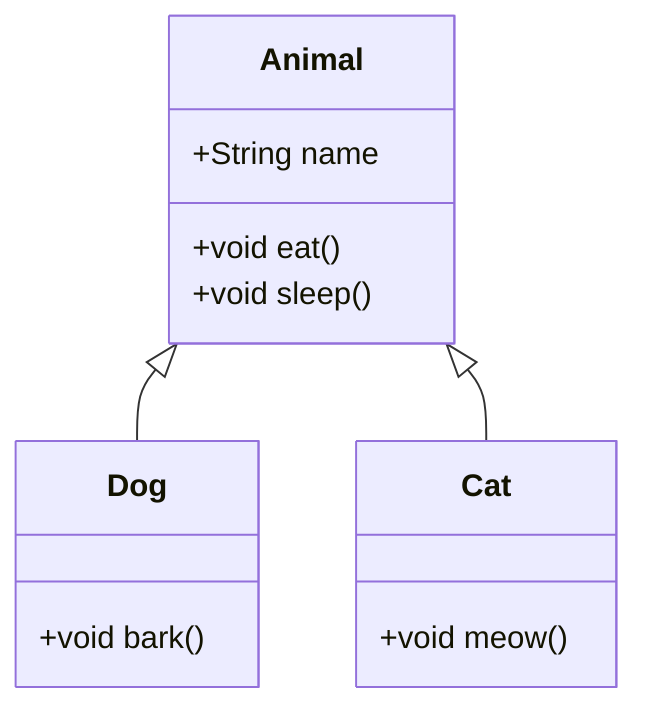

# Java 继承

## 什么是继承？

继承是Java面向对象编程中最重要的特性之一，它允许一个类（子类）获取另一个类（父类）的属性和方法。通过继承，我们可以实现代码的重用，建立类之间的层次关系，让代码结构更加清晰。

继承的关键概念：
- **父类**（超类/基类）：被继承的类
- **子类**（派生类）：继承自父类的类



在上图中，`Dog`和`Cat`都继承自`Animal`类，获取了`Animal`类的属性和方法，同时也可以有自己特有的行为。

## 继承的语法

在Java中，使用关键字`extends`来表示继承关系：

```java
// 父类
public class Parent {
    // 父类的属性和方法
}

// 子类
public class Child extends Parent {
    // 子类特有的属性和方法
    // 也继承了父类的所有可访问的属性和方法
}
```

:::note
Java只支持单继承，即一个类只能直接继承一个父类。但可以通过多层继承形成继承链。
:::

## 继承的示例

让我们通过一个简单的例子来理解继承：

```java
// 父类
public class Animal {
    protected String name;
    
    public Animal(String name) {
        this.name = name;
    }
    
    public void eat() {
        System.out.println(name + " is eating");
    }
    
    public void sleep() {
        System.out.println(name + " is sleeping");
    }
}

// 子类
public class Dog extends Animal {
    private String breed;
    
    public Dog(String name, String breed) {
        super(name);  // 调用父类构造器
        this.breed = breed;
    }
    
    public void bark() {
        System.out.println(name + " is barking");
    }
    
    // 测试代码
    public static void main(String[] args) {
        Dog dog = new Dog("Bobby", "Bulldog");
        dog.eat();    // 继承自Animal类的方法
        dog.sleep();  // 继承自Animal类的方法
        dog.bark();   // Dog类特有的方法
    }
}
```

输出结果：
```
Bobby is eating
Bobby is sleeping
Bobby is barking
```

在这个例子中：
1. `Animal`类定义了通用的属性`name`和方法`eat()`、`sleep()`
2. `Dog`类通过`extends Animal`继承了`Animal`类
3. `Dog`类可以使用`Animal`类中的方法，同时也定义了自己特有的属性`breed`和方法`bark()`
4. 在`Dog`的构造方法中，使用`super(name)`调用了父类的构造方法

## 方法重写（Override）

子类可以重写（覆盖）父类中的方法，提供自己的实现：

```java
public class Bird extends Animal {
    public Bird(String name) {
        super(name);
    }
    
    // 重写父类的eat方法
    @Override
    public void eat() {
        System.out.println(name + " is pecking at seeds");
    }
    
    public void fly() {
        System.out.println(name + " is flying");
    }
    
    // 测试代码
    public static void main(String[] args) {
        Bird bird = new Bird("Polly");
        bird.eat();   // 调用重写后的方法
        bird.sleep(); // 调用继承的方法
        bird.fly();   // 调用Bird类特有的方法
    }
}
```

输出结果：
```
Polly is pecking at seeds
Polly is sleeping
Polly is flying
```

:::tip
使用`@Override`注解可以帮助编译器检查你是否正确地重写了父类方法。虽然这不是必须的，但这是一种好的实践。
:::

## 继承的特点

### 1. 访问修饰符的影响

继承会受到访问修饰符的影响：
- `public`成员可以被任何类访问
- `protected`成员可以被同包类和子类访问
- 默认（无修饰符）成员可以被同包类访问
- `private`成员只能被当前类访问，**不能被子类直接访问**

```java
public class Parent {
    public String publicField = "Public Field";
    protected String protectedField = "Protected Field";
    String defaultField = "Default Field";
    private String privateField = "Private Field";
    
    public void showAll() {
        System.out.println(publicField);
        System.out.println(protectedField);
        System.out.println(defaultField);
        System.out.println(privateField);
    }
}

public class Child extends Parent {
    public void accessFields() {
        System.out.println(publicField);      // 可以访问
        System.out.println(protectedField);   // 可以访问
        System.out.println(defaultField);     // 同包可以访问，不同包不可以
        // System.out.println(privateField);  // 错误，不能访问父类的私有成员
    }
}
```

### 2. super关键字

`super`关键字用来引用父类的变量和方法：

```java
public class Child extends Parent {
    private String name = "Child";
    
    public void printNames() {
        System.out.println(name);          // 输出"Child"
        System.out.println(super.name);    // 输出父类的name值
    }
    
    @Override
    public void someMethod() {
        super.someMethod();  // 调用父类的someMethod方法
        // 添加子类特有的实现
        System.out.println("Child's additional implementation");
    }
}
```

### 3. 构造方法的继承

子类**不会继承**父类的构造方法，但子类构造方法会隐式地调用父类的无参构造方法。如果父类没有无参构造方法，子类必须通过`super`关键字显式调用父类的有参构造方法。

```java
public class Parent {
    private String name;
    
    public Parent(String name) {
        this.name = name;
    }
    
    // 没有提供无参构造方法
}

public class Child extends Parent {
    private int age;
    
    // 错误：没有显式调用父类的构造方法
    // public Child(String name, int age) {
    //     this.age = age;
    // }
    
    // 正确：显式调用父类构造方法
    public Child(String name, int age) {
        super(name);  // 必须是构造方法的第一行
        this.age = age;
    }
}
```

## 继承的实际应用

### 案例：形状类层次结构

让我们创建一个形状类的层次结构，展示继承在实际中的应用：

```java
// 基类
public abstract class Shape {
    private String color;
    
    public Shape(String color) {
        this.color = color;
    }
    
    public String getColor() {
        return color;
    }
    
    // 抽象方法，由子类实现
    public abstract double calculateArea();
    
    public abstract double calculatePerimeter();
}

// 圆形
public class Circle extends Shape {
    private double radius;
    
    public Circle(String color, double radius) {
        super(color);
        this.radius = radius;
    }
    
    @Override
    public double calculateArea() {
        return Math.PI * radius * radius;
    }
    
    @Override
    public double calculatePerimeter() {
        return 2 * Math.PI * radius;
    }
}

// 矩形
public class Rectangle extends Shape {
    private double length;
    private double width;
    
    public Rectangle(String color, double length, double width) {
        super(color);
        this.length = length;
        this.width = width;
    }
    
    @Override
    public double calculateArea() {
        return length * width;
    }
    
    @Override
    public double calculatePerimeter() {
        return 2 * (length + width);
    }
}

// 应用程序
public class ShapeApplication {
    public static void main(String[] args) {
        Shape circle = new Circle("Red", 5);
        Shape rectangle = new Rectangle("Blue", 4, 6);
        
        System.out.println("Circle area: " + circle.calculateArea());
        System.out.println("Circle perimeter: " + circle.calculatePerimeter());
        System.out.println("Circle color: " + circle.getColor());
        
        System.out.println("\nRectangle area: " + rectangle.calculateArea());
        System.out.println("Rectangle perimeter: " + rectangle.calculatePerimeter());
        System.out.println("Rectangle color: " + rectangle.getColor());
    }
}
```

输出结果：
```
Circle area: 78.53981633974483
Circle perimeter: 31.41592653589793
Circle color: Red

Rectangle area: 24.0
Rectangle perimeter: 20.0
Rectangle color: Blue
```

在这个例子中：
1. `Shape`类定义了所有形状共有的属性和行为
2. `Circle`和`Rectangle`类继承自`Shape`类，实现了各自的面积和周长计算方式
3. 子类重用了父类的`color`属性和`getColor()`方法
4. 通过继承使代码结构清晰且易于扩展（可以继续添加其他形状类）

### 案例：电子商务系统中的产品继承体系

```java
// 基本产品类
public abstract class Product {
    private String id;
    private String name;
    private double price;
    private String description;
    
    public Product(String id, String name, double price, String description) {
        this.id = id;
        this.name = name;
        this.price = price;
        this.description = description;
    }
    
    // Getters and setters...
    
    public abstract double calculateDiscount();
    
    public double getFinalPrice() {
        return price - calculateDiscount();
    }
    
    @Override
    public String toString() {
        return "Product: " + name + ", Price: $" + price + ", Final Price: $" + getFinalPrice();
    }
}

// 电子产品类
public class ElectronicProduct extends Product {
    private int warrantyPeriod; // 保修期（月）
    
    public ElectronicProduct(String id, String name, double price, String description, int warrantyPeriod) {
        super(id, name, price, description);
        this.warrantyPeriod = warrantyPeriod;
    }
    
    public int getWarrantyPeriod() {
        return warrantyPeriod;
    }
    
    @Override
    public double calculateDiscount() {
        // 电子产品折扣计算逻辑
        return getPrice() * 0.05; // 5%折扣
    }
}

// 服装产品类
public class ClothingProduct extends Product {
    private String size;
    private String material;
    
    public ClothingProduct(String id, String name, double price, String description, String size, String material) {
        super(id, name, price, description);
        this.size = size;
        this.material = material;
    }
    
    // Getters for size and material...
    
    @Override
    public double calculateDiscount() {
        // 服装产品折扣计算逻辑
        return getPrice() * 0.10; // 10%折扣
    }
}

// 测试代码
public class ShoppingTest {
    public static void main(String[] args) {
        Product laptop = new ElectronicProduct("E001", "Gaming Laptop", 1200.00, 
                "High performance gaming laptop", 24);
                
        Product tshirt = new ClothingProduct("C001", "Cotton T-Shirt", 25.00,
                "Comfortable cotton t-shirt", "L", "100% Cotton");
                
        System.out.println(laptop);
        System.out.println(tshirt);
    }
}
```

输出结果：
```
Product: Gaming Laptop, Price: $1200.0, Final Price: $1140.0
Product: Cotton T-Shirt, Price: $25.0, Final Price: $22.5
```

这个例子展示了电子商务系统中如何利用继承来构建产品体系：

1. `Product`类定义了所有产品的共同属性和行为
2. 不同类型的产品（如电子产品、服装）继承自`Product`类
3. 每种产品类型可以添加特定的属性（如电子产品的保修期、服装的尺寸和材质）
4. 每种产品可以有自己的折扣计算逻辑
5. 通过继承，所有产品共享相同的基本结构，但可以有各自的特点

## 继承的优缺点

### 优点
- **代码重用**：避免重复编写相同的代码
- **建立层次结构**：使程序结构更加清晰
- **多态性**：使同一个方法对不同对象有不同的行为
- **灵活性**：便于扩展和维护代码

### 缺点
- **紧耦合**：父类的修改可能影响所有子类
- **限制**：Java只支持单继承，有时会限制设计
- **过深的继承层次**：可能导致代码难以理解和维护

## 继承的最佳实践

1. **遵循"是一个"原则**：子类应该是父类的一个特例（比如，狗"是一个"动物）
2. **避免过深的继承层次**：一般不超过3层
3. **优先使用组合而非继承**：当不确定是否应该使用继承时，考虑使用组合
4. **不要为了代码重用而继承**：继承是为了表示"是一个"关系，不是为了代码重用
5. **保护性编程**：父类设计时应考虑子类可能的行为

## 总结

继承是Java面向对象编程的基础之一，它允许我们：
- 建立类之间的层次关系
- 重用代码
- 实现多态
- 提高代码的组织性和可维护性

理解并正确使用继承可以让你的代码结构更加合理，更容易维护和扩展。但也要注意避免过度使用继承，在适当的时候选择组合或接口实现。

## 练习

1. 创建一个`Vehicle`类，包含`brand`、`model`和`year`属性，以及`start()`和`stop()`方法。
2. 创建`Car`和`Motorcycle`类继承自`Vehicle`类，并添加各自特有的方法和属性。
3. 重写子类中的`start()`方法，使其有不同的实现。
4. 编写测试程序，创建各类对象并调用其方法，观察继承和多态的效果。

## 进一步阅读

- Oracle官方Java教程：[Inheritance](https://docs.oracle.com/javase/tutorial/java/IandI/subclasses.html)
- Head First Java（书籍）
- Effective Java（书籍）：Item 16 - Favor composition over inheritance

通过学习继承，你已经迈向了面向对象编程的深层次理解。接下来，可以学习多态、接口和抽象类等相关概念，这些都与继承密切相关，共同构成了Java面向对象编程的核心体系。