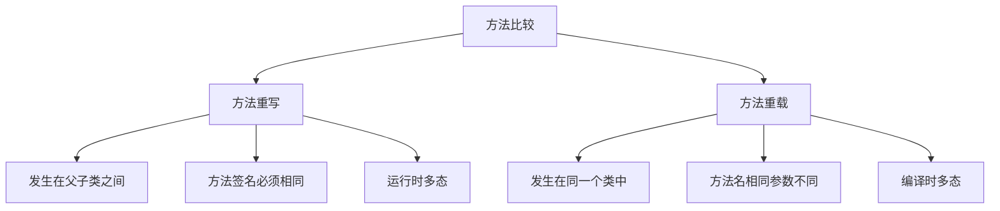

# Java 方法重写

## 什么是方法重写

方法重写(Method Overriding)是Java面向对象编程中的一个核心概念，它允许子类提供一个与父类中相同名称、参数列表和返回类型的方法的特定实现。简单来说，当子类继承父类并对父类的方法进行重新定义时，就发生了方法重写。

:::note 定义
方法重写是指子类中定义了一个与父类中完全相同的方法，以覆盖父类中的原有方法实现。
:::

## 方法重写的规则

要正确实现方法重写，必须遵循以下规则：

1. **方法名相同**：子类方法必须与父类方法具有相同的名称。
2. **参数列表相同**：子类方法必须与父类方法具有相同的参数类型、顺序和数量。
3. **返回类型相同或兼容**：子类方法的返回类型必须与父类方法的返回类型相同，或者是其子类型(Java 5及更高版本)。
4. **访问修饰符**：子类方法的访问权限不能比父类方法的访问权限更严格。
5. **异常**：子类方法抛出的异常必须是父类方法抛出异常的子类或不抛出异常。

## 方法重写的示例

让我们通过一个简单的例子来理解方法重写：

```java
// 父类
class Animal {
    public void makeSound() {
        System.out.println("动物发出声音");
    }
}

// 子类重写父类方法
class Dog extends Animal {
    @Override
    public void makeSound() {
        System.out.println("狗叫：汪汪汪");
    }
}

// 子类重写父类方法
class Cat extends Animal {
    @Override
    public void makeSound() {
        System.out.println("猫叫：喵喵喵");
    }
}

public class MethodOverridingExample {
    public static void main(String[] args) {
        Animal animal = new Animal();
        animal.makeSound(); // 输出：动物发出声音
        
        Animal dog = new Dog();
        dog.makeSound();    // 输出：狗叫：汪汪汪
        
        Animal cat = new Cat();
        cat.makeSound();    // 输出：猫叫：喵喵喵
    }
}
```

输出结果：
```
动物发出声音
狗叫：汪汪汪
猫叫：喵喵喵
```

在上面的例子中：
- `Animal`类定义了一个`makeSound()`方法
- `Dog`和`Cat`类继承了`Animal`类，并重写了`makeSound()`方法
- 尽管我们使用`Animal`类型的引用指向`Dog`和`Cat`对象，但在运行时会调用各自类的`makeSound()`方法实现

## @Override注解的作用

在Java中，`@Override`是一个注解，用于指示当前方法是重写父类的方法。虽然它不是必需的，但使用它有以下好处：

1. 编译器会检查标记的方法是否真的重写了父类方法
2. 如果父类方法被更改（如方法名或参数），编译器会报错
3. 增强代码的可读性，明确表示这是一个重写的方法

```java
class Child extends Parent {
    @Override  // 表明这个方法是重写父类的方法
    public void display() {
        System.out.println("这是子类的方法实现");
    }
}
```

## 方法重写与方法重载的区别

初学者经常会混淆方法重写(Overriding)与方法重载(Overloading)，它们有以下关键区别：



| 特点 | 方法重写 | 方法重载 |
|------|---------|---------|
| 关系 | 父子类之间 | 同一个类中 |
| 方法名 | 相同 | 相同 |
| 参数列表 | 相同 | 不同（类型、数量或顺序） |
| 返回类型 | 相同或兼容的子类型 | 可以不同 |
| 发生阶段 | 运行时 | 编译时 |

## super关键字与重写方法

在子类中重写父类方法后，如果你想在重写的方法中调用父类的原始方法，可以使用`super`关键字：

```java
class Parent {
    public void display() {
        System.out.println("父类的display方法");
    }
}

class Child extends Parent {
    @Override
    public void display() {
        super.display();  // 调用父类的display方法
        System.out.println("子类的display方法");
    }
}

public class SuperKeywordExample {
    public static void main(String[] args) {
        Child child = new Child();
        child.display();
    }
}
```

输出结果：
```
父类的display方法
子类的display方法
```

## 实际应用场景

方法重写在Java编程中有广泛的应用，以下是几个常见场景：

### 1. 定制UI组件行为

在图形用户界面(GUI)编程中，经常需要重写组件的默认行为：

```java
import javax.swing.JButton;

public class CustomButton extends JButton {
    public CustomButton(String text) {
        super(text);
    }
    
    @Override
    protected void paintComponent(Graphics g) {
        // 自定义按钮的绘制逻辑
        super.paintComponent(g);
        g.setColor(Color.RED);
        g.drawRect(0, 0, getWidth() - 1, getHeight() - 1);
    }
}
```

### 2. 数据结构的特殊实现

当我们需要创建自定义的集合类时，经常需要重写标准方法：

```java
import java.util.ArrayList;

public class UniqueList extends ArrayList<String> {
    @Override
    public boolean add(String element) {
        // 只有当元素不存在时才添加
        if (!this.contains(element)) {
            return super.add(element);
        }
        return false;
    }
}
```

### 3. 框架扩展

在使用框架如Spring、Hibernate等时，重写框架提供的方法来自定义行为：

```java
public class CustomUserDetailsService implements UserDetailsService {
    @Override
    public UserDetails loadUserByUsername(String username) throws UsernameNotFoundException {
        // 实现自定义的用户加载逻辑
        User user = userRepository.findByUsername(username);
        if (user == null) {
            throw new UsernameNotFoundException("用户不存在");
        }
        return new CustomUserDetails(user);
    }
}
```

## 动态绑定与方法重写

方法重写是Java实现多态的基础，这与动态绑定密切相关。动态绑定是指在运行时而非编译时确定调用哪个方法的过程。

```java
public class DynamicBindingExample {
    public static void main(String[] args) {
        Shape shape;
        
        // 在运行时决定shape变量指向哪个对象
        if (Math.random() > 0.5) {
            shape = new Circle();
        } else {
            shape = new Rectangle();
        }
        
        // 动态绑定 - 在运行时确定调用哪个draw方法
        shape.draw();  // 可能调用Circle的draw()或Rectangle的draw()
    }
}

class Shape {
    public void draw() {
        System.out.println("绘制形状");
    }
}

class Circle extends Shape {
    @Override
    public void draw() {
        System.out.println("绘制圆形");
    }
}

class Rectangle extends Shape {
    @Override
    public void draw() {
        System.out.println("绘制矩形");
    }
}
```

## 方法重写常见错误与注意事项

1. **访问修饰符问题**：子类方法的访问权限不能比父类更严格
   ```java
   class Parent {
       protected void show() { }
   }
   
   class Child extends Parent {
       // 错误：不能将protected方法重写为private
       private void show() { }  // 编译错误
   }
   ```

2. **静态方法不能被重写**：静态方法属于类，不属于对象，因此不能被重写
   ```java
   class Parent {
       public static void staticMethod() { }
   }
   
   class Child extends Parent {
       // 这不是重写，而是方法隐藏(method hiding)
       public static void staticMethod() { }
   }
   ```

3. **最终方法不能被重写**：使用`final`关键字修饰的方法不能被子类重写
   ```java
   class Parent {
       public final void finalMethod() { }
   }
   
   class Child extends Parent {
       // 错误：不能重写final方法
       public void finalMethod() { }  // 编译错误
   }
   ```

4. **构造方法不能被重写**：构造方法不能被继承，因此也不能被重写

:::caution 注意
重写方法时，返回类型必须与父类方法的返回类型相同或是其子类型（协变返回类型）。这一规则从Java 5开始生效。
:::

## 总结

方法重写是Java面向对象编程中实现多态性的一个关键机制。通过方法重写，子类可以根据自己的需求提供父类方法的特定实现，从而让同一方法根据不同对象表现出不同的行为。

重要概念回顾：
- 方法重写是子类重新定义从父类继承的方法
- 重写方法必须有相同的方法名、参数列表和兼容的返回类型
- 使用`@Override`注解可以帮助编译器检查方法重写是否正确
- `super`关键字可以在子类中调用父类的被重写方法
- 方法重写是实现运行时多态的基础

## 练习题

1. 创建一个`Vehicle`类，包含一个`speedUp()`方法。然后创建`Car`和`Bicycle`子类，各自重写`speedUp()`方法以反映不同交通工具的加速特点。

2. 什么情况下子类可以抛出比父类方法更少的异常？这与重写规则有什么关系？

3. 编写一个程序，展示如何在`ArrayList`的子类中重写`add()`方法，使其只接受非空字符串。

## 进一步学习资源

- Java官方文档：[方法重写](https://docs.oracle.com/javase/tutorial/java/IandI/override.html)
- 《Effective Java》第四章：类和接口
- 《Java核心技术》卷I：基础知识

通过不断练习和应用，你将更加熟练地使用方法重写这一重要的面向对象编程技术。