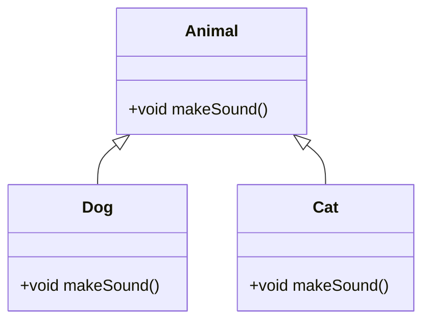

# Java 多态

## 什么是多态？

**多态(Polymorphism)**是面向对象编程的三大核心特性之一（另外两个是封装和继承）。多态字面意思是"多种形态"，在Java中，多态允许不同的对象对同一消息作出不同的响应。简单来说，多态就是同一个行为在不同的对象上有不同的表现形式。

:::tip 理解多态
想象一个"按钮"类，不同的按钮（如"保存"按钮、"取消"按钮）点击后会执行不同的操作，这就是多态的一个实际体现。
:::

## 多态的基本形式

Java中的多态主要通过以下方式体现：

1. **编译时多态（静态多态）**：通过方法重载实现
2. **运行时多态（动态多态）**：通过方法重写实现

### 编译时多态 - 方法重载

方法重载(Overloading)是指在同一个类中定义多个同名但参数不同的方法。编译器会根据调用方法的参数类型和数量来确定调用哪个方法。

```java
public class Calculator {
    // 两个整数相加
    public int add(int a, int b) {
        return a + b;
    }
    
    // 三个整数相加
    public int add(int a, int b, int c) {
        return a + b + c;
    }
    
    // 两个浮点数相加
    public double add(double a, double b) {
        return a + b;
    }
}
```

使用示例：

```java
public class OverloadingExample {
    public static void main(String[] args) {
        Calculator calc = new Calculator();
        
        System.out.println("2 + 3 = " + calc.add(2, 3));                // 输出：2 + 3 = 5
        System.out.println("2 + 3 + 4 = " + calc.add(2, 3, 4));         // 输出：2 + 3 + 4 = 9
        System.out.println("2.5 + 3.5 = " + calc.add(2.5, 3.5));        // 输出：2.5 + 3.5 = 6.0
    }
}
```

### 运行时多态 - 方法重写

方法重写(Overriding)是指子类重新定义了父类中已有的方法。当通过父类引用调用方法时，实际执行的是子类重写后的方法。



代码实现：

```java
// 父类
public class Animal {
    public void makeSound() {
        System.out.println("动物发出声音");
    }
}

// 子类Dog
public class Dog extends Animal {
    @Override
    public void makeSound() {
        System.out.println("狗：汪汪汪！");
    }
}

// 子类Cat
public class Cat extends Animal {
    @Override
    public void makeSound() {
        System.out.println("猫：喵喵喵~");
    }
}
```

使用示例：

```java
public class PolymorphismExample {
    public static void main(String[] args) {
        // 父类引用指向子类对象
        Animal animal1 = new Dog();
        Animal animal2 = new Cat();
        
        // 调用相同的方法，但执行结果不同
        animal1.makeSound();  // 输出：狗：汪汪汪！
        animal2.makeSound();  // 输出：猫：喵喵喵~
    }
}
```

## 多态的实现原理

Java多态的实现原理基于以下三个条件：

1. **继承**：子类继承父类
2. **重写**：子类重写父类的方法
3. **向上转型**：父类引用指向子类对象

多态通过**动态绑定**来实现，即在运行时而非编译时确定所要调用的方法。这使得程序具有更高的灵活性和可扩展性。

## 多态的优势

1. **提高代码的可扩展性和可维护性**：添加新的子类不需要修改调用父类方法的代码
2. **降低耦合度**：代码可以基于抽象父类或接口编写，无需关注具体实现
3. **简化代码**：避免使用大量的条件判断语句
4. **提高代码复用性**：共享父类的代码

## 多态的实际应用案例

### 案例1：图形绘制系统

```java
// 抽象图形类
public abstract class Shape {
    public abstract void draw();  // 抽象方法
    
    public void display() {
        System.out.println("显示图形");
        draw();  // 调用子类实现的方法
    }
}

// 圆形类
public class Circle extends Shape {
    @Override
    public void draw() {
        System.out.println("绘制圆形");
    }
}

// 矩形类
public class Rectangle extends Shape {
    @Override
    public void draw() {
        System.out.println("绘制矩形");
    }
}

// 三角形类
public class Triangle extends Shape {
    @Override
    public void draw() {
        System.out.println("绘制三角形");
    }
}

// 使用示例
public class DrawingApp {
    public static void main(String[] args) {
        // 创建图形数组
        Shape[] shapes = new Shape[3];
        shapes[0] = new Circle();
        shapes[1] = new Rectangle();
        shapes[2] = new Triangle();
        
        // 绘制所有图形
        for (Shape shape : shapes) {
            shape.display();
        }
    }
}
```

输出结果：
```
显示图形
绘制圆形
显示图形
绘制矩形
显示图形
绘制三角形
```

这个案例展示了如何使用多态来构建一个灵活的图形绘制系统。不同的图形类继承自同一个抽象父类，并重写了`draw`方法。通过父类引用数组管理不同类型的图形对象，可以统一处理它们，同时保持各自的特性。

### 案例2：插件系统

多态在插件系统中也非常有用：

```java
// 插件接口
public interface Plugin {
    void execute();
    String getName();
}

// 图像处理插件
public class ImagePlugin implements Plugin {
    @Override
    public void execute() {
        System.out.println("处理图像...");
    }
    
    @Override
    public String getName() {
        return "图像处理插件";
    }
}

// 音频处理插件
public class AudioPlugin implements Plugin {
    @Override
    public void execute() {
        System.out.println("处理音频...");
    }
    
    @Override
    public String getName() {
        return "音频处理插件";
    }
}

// 插件管理器
public class PluginManager {
    private List<Plugin> plugins = new ArrayList<>();
    
    public void addPlugin(Plugin plugin) {
        plugins.add(plugin);
        System.out.println("添加插件：" + plugin.getName());
    }
    
    public void executePlugins() {
        System.out.println("执行所有插件：");
        for (Plugin plugin : plugins) {
            System.out.print(plugin.getName() + " - ");
            plugin.execute();
        }
    }
}

// 使用示例
public class PluginSystem {
    public static void main(String[] args) {
        PluginManager manager = new PluginManager();
        
        // 添加不同类型的插件
        manager.addPlugin(new ImagePlugin());
        manager.addPlugin(new AudioPlugin());
        
        // 执行所有插件
        manager.executePlugins();
    }
}
```

输出结果：
```
添加插件：图像处理插件
添加插件：音频处理插件
执行所有插件：
图像处理插件 - 处理图像...
音频处理插件 - 处理音频...
```

这个案例展示了如何利用多态和接口来设计一个可扩展的插件系统。每个插件都实现相同的接口，但提供不同的功能实现。插件管理器可以统一管理和调用这些插件，而不需要知道它们的具体类型。

## 多态的注意事项

1. **只能调用父类中存在的方法**：通过父类引用只能调用在父类中定义的方法，不能调用子类特有的方法
2. **静态方法不能被重写**：静态方法属于类而非对象，不参与多态
3. **构造方法不能被继承**：因此也不能被重写
4. **私有方法不能被重写**：子类无法访问父类的私有方法
5. **final方法不能被重写**：用final修饰的方法不允许子类重写

## 向下转型

有时我们需要将父类引用转回子类类型，这称为向下转型。必须使用强制类型转换，并且在转换前应使用`instanceof`操作符检查类型兼容性。

```java
public class DowncastingExample {
    public static void main(String[] args) {
        Animal animal = new Dog();
        animal.makeSound();  // 输出：狗：汪汪汪！
        
        // 向下转型，访问子类特有的方法
        if (animal instanceof Dog) {
            Dog dog = (Dog) animal;
            dog.fetch();  // 调用Dog类特有的方法
        }
        
        // 错误的向下转型会导致ClassCastException
        // Cat cat = (Cat) animal;  // 运行时错误
    }
}

class Dog extends Animal {
    @Override
    public void makeSound() {
        System.out.println("狗：汪汪汪！");
    }
    
    // Dog类特有的方法
    public void fetch() {
        System.out.println("狗：捡回来了！");
    }
}
```

## 总结

Java的多态是面向对象编程中的核心特性，通过方法重载（编译时多态）和方法重写（运行时多态）实现。多态使得代码更加灵活、可扩展，同时提高代码的复用性和可维护性。

运行时多态的实现基于继承、方法重写和向上转型。它允许我们通过父类引用调用子类重写的方法，从而实现"一个接口，多种实现"的效果。

多态在实际开发中有广泛的应用，如图形用户界面、插件系统、框架设计等。理解和熟练运用多态，是掌握Java面向对象编程的关键一步。

## 练习题

1. 创建一个名为`Vehicle`的抽象类，包含抽象方法`start()`和`stop()`。然后创建两个子类`Car`和`Motorcycle`，重写这些方法。最后，编写一个`VehicleTest`类，创建不同类型的交通工具并调用它们的方法。

2. 设计一个简单的动物园系统，包含不同种类的动物，如狮子、猴子、企鹅等。每种动物都应该有`eat()`和`makeSound()`方法，但实现不同。使用多态管理这些动物。

3. 扩展案例1中的图形系统，添加计算面积的功能。设计一个`calculateArea()`方法，并在各个子类中实现。然后计算所有图形的总面积。

## 进一步学习资源

- 《Thinking in Java》 - Bruce Eckel
- 《Effective Java》 - Joshua Bloch
- 《Head First设计模式》- Eric Freeman & Elisabeth Robson
- Oracle Java官方教程：https://docs.oracle.com/javase/tutorial/java/IandI/polymorphism.html

通过深入理解多态，你将能够编写更加灵活、可扩展的Java程序，并为学习设计模式等高级主题打下坚实的基础。