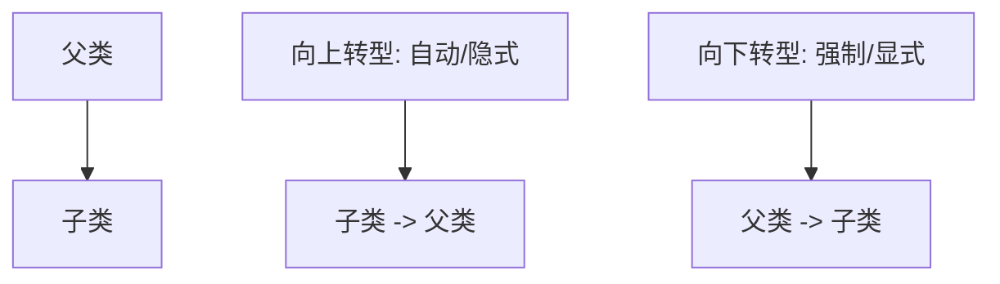

# Java 向下转型

## 什么是向下转型

在面向对象编程中，向下转型（Downcasting）是指将父类类型的引用转换为子类类型的过程。这与我们常见的向上转型（子类转为父类）相反，因此被称为"向下"转型。

向下转型允许我们访问子类特有的方法和属性，这在父类引用指向子类对象时非常有用。



:::warning
向下转型必须确保父类引用实际上指向的是子类对象，否则会抛出`ClassCastException`异常。
:::

## 向下转型的语法

向下转型需要使用显式的类型转换操作符：

```java
// 假设 Parent 是父类，Child 是子类
Parent parent = new Child(); // 首先是向上转型
Child child = (Child) parent; // 向下转型
```

## 向下转型的使用场景

### 1. 获取子类特有的功能

当我们通过父类引用调用方法时，只能调用父类中定义的方法。如果想调用子类特有的方法，就需要向下转型。

```java
class Animal {
    public void eat() {
        System.out.println("动物正在进食");
    }
}

class Dog extends Animal {
    public void eat() {
        System.out.println("狗在吃骨头");
    }
    
    public void bark() {
        System.out.println("汪汪汪！");
    }
}

public class DowncastingExample {
    public static void main(String[] args) {
        Animal animal = new Dog(); // 向上转型
        animal.eat(); // 输出：狗在吃骨头（多态）
        
        // animal.bark(); // 编译错误，Animal类型没有bark方法
        
        // 向下转型
        Dog dog = (Dog) animal;
        dog.bark(); // 输出：汪汪汪！
    }
}
```

**输出结果：**
```
狗在吃骨头
汪汪汪！
```

### 2. 集合中存储不同类型的对象

当我们使用集合存储不同类型的对象时，取出时通常需要向下转型。

```java
import java.util.ArrayList;
import java.util.List;

public class CollectionExample {
    public static void main(String[] args) {
        List<Animal> animals = new ArrayList<>();
        animals.add(new Dog());
        animals.add(new Cat());
        
        for (Animal animal : animals) {
            animal.eat(); // 多态调用
            
            // 根据实际类型向下转型
            if (animal instanceof Dog) {
                Dog dog = (Dog) animal;
                dog.bark();
            } else if (animal instanceof Cat) {
                Cat cat = (Cat) animal;
                cat.meow();
            }
        }
    }
}

class Cat extends Animal {
    public void eat() {
        System.out.println("猫在吃鱼");
    }
    
    public void meow() {
        System.out.println("喵喵喵！");
    }
}
```

**输出结果：**
```
狗在吃骨头
汪汪汪！
猫在吃鱼
喵喵喵！
```

## 向下转型的安全性检查

向下转型可能会导致运行时异常，因此我们需要进行类型检查。Java提供了`instanceof`运算符来进行类型检查。

```java
public class SafeDowncasting {
    public static void main(String[] args) {
        Animal animal1 = new Dog();
        Animal animal2 = new Cat();
        
        // 安全的向下转型方式
        if (animal1 instanceof Dog) {
            Dog dog = (Dog) animal1;
            dog.bark();
        }
        
        // 不安全的向下转型
        try {
            Dog dog = (Dog) animal2; // 运行时会抛出 ClassCastException
            dog.bark();
        } catch (ClassCastException e) {
            System.out.println("转换失败：" + e.getMessage());
        }
    }
}
```

**输出结果：**
```
汪汪汪！
转换失败：class Cat cannot be cast to class Dog
```

## Java 14+ 的模式匹配（instanceof的增强）

从Java 14开始，可以使用增强版的`instanceof`操作符，它结合了类型检查和类型转换：

```java
// Java 14+ 代码
if (animal instanceof Dog dog) {
    // 如果类型匹配，dog变量已经可用
    dog.bark();
} else if (animal instanceof Cat cat) {
    cat.meow();
}
```

这种写法更简洁，避免了重复的类型转换代码。

:::note
模式匹配是Java较新的特性，在较旧的Java版本中不可用。
:::

## 实际应用案例

### 案例一：图形编辑器

假设我们正在开发一个简单的图形编辑器，可以处理不同类型的形状：

```java
abstract class Shape {
    abstract void draw();
    // 所有形状共有的方法
    public void moveBy(int x, int y) {
        System.out.println("移动形状到新位置");
    }
}

class Circle extends Shape {
    private double radius;
    
    public Circle(double radius) {
        this.radius = radius;
    }
    
    @Override
    void draw() {
        System.out.println("绘制圆形，半径：" + radius);
    }
    
    // 圆形特有的方法
    public void resize(double factor) {
        this.radius *= factor;
        System.out.println("圆形大小调整为：" + radius);
    }
}

class Rectangle extends Shape {
    private double width;
    private double height;
    
    public Rectangle(double width, double height) {
        this.width = width;
        this.height = height;
    }
    
    @Override
    void draw() {
        System.out.println("绘制矩形，宽：" + width + "，高：" + height);
    }
    
    // 矩形特有的方法
    public void setDimensions(double width, double height) {
        this.width = width;
        this.height = height;
        System.out.println("矩形尺寸调整为：宽" + width + "，高" + height);
    }
}

public class GraphicEditor {
    public static void main(String[] args) {
        List<Shape> shapes = new ArrayList<>();
        shapes.add(new Circle(5.0));
        shapes.add(new Rectangle(10.0, 20.0));
        
        // 用户选择了第一个形状并想调整大小
        Shape selectedShape = shapes.get(0);
        selectedShape.draw(); // 基本操作，无需转型
        
        // 特定形状的操作需要向下转型
        if (selectedShape instanceof Circle) {
            Circle circle = (Circle) selectedShape;
            circle.resize(2.0); // 调用Circle特有的方法
        } else if (selectedShape instanceof Rectangle) {
            Rectangle rectangle = (Rectangle) selectedShape;
            rectangle.setDimensions(15.0, 25.0); // 调用Rectangle特有的方法
        }
    }
}
```

**输出结果：**
```
绘制圆形，半径：5.0
圆形大小调整为：10.0
```

### 案例二：插件系统

假设我们正在构建一个具有插件系统的应用程序：

```java
interface Plugin {
    void initialize();
    void shutdown();
}

class TextEditorPlugin implements Plugin {
    @Override
    public void initialize() {
        System.out.println("文本编辑器插件初始化");
    }

    @Override
    public void shutdown() {
        System.out.println("文本编辑器插件关闭");
    }
    
    // 特有方法
    public void formatText(String text) {
        System.out.println("格式化文本：" + text);
    }
}

class ImageProcessorPlugin implements Plugin {
    @Override
    public void initialize() {
        System.out.println("图像处理插件初始化");
    }

    @Override
    public void shutdown() {
        System.out.println("图像处理插件关闭");
    }
    
    // 特有方法
    public void applyFilter(String filterName) {
        System.out.println("应用滤镜：" + filterName);
    }
}

public class PluginSystem {
    public static void main(String[] args) {
        List<Plugin> plugins = new ArrayList<>();
        plugins.add(new TextEditorPlugin());
        plugins.add(new ImageProcessorPlugin());
        
        // 初始化所有插件
        for (Plugin plugin : plugins) {
            plugin.initialize();
        }
        
        // 执行特定功能
        Plugin plugin = plugins.get(0); // 获取第一个插件
        
        if (plugin instanceof TextEditorPlugin) {
            TextEditorPlugin textPlugin = (TextEditorPlugin) plugin;
            textPlugin.formatText("Hello, World!");
        } else if (plugin instanceof ImageProcessorPlugin) {
            ImageProcessorPlugin imagePlugin = (ImageProcessorPlugin) plugin;
            imagePlugin.applyFilter("黑白效果");
        }
        
        // 关闭所有插件
        for (Plugin p : plugins) {
            p.shutdown();
        }
    }
}
```

**输出结果：**
```
文本编辑器插件初始化
图像处理插件初始化
格式化文本：Hello, World!
文本编辑器插件关闭
图像处理插件关闭
```

## 向下转型的注意事项

1. **运行时安全性**：向下转型是在运行时进行检查的，如果类型不匹配，会抛出`ClassCastException`。

2. **始终使用instanceof检查**：在向下转型前使用`instanceof`运算符进行类型检查，可以避免异常。

3. **避免过度使用**：频繁的向下转型可能表明设计存在问题，考虑重新评估你的类层次结构。

4. **考虑多态代替向下转型**：在许多情况下，可以通过在父类中定义适当的方法并使用多态来避免向下转型。

## 小结

向下转型是Java面向对象编程中一个重要的概念，它允许我们通过父类引用访问子类特有的功能。关键要点包括：

- 向下转型必须通过显式类型转换`(SubClass)`来完成
- 转型前应使用`instanceof`检查类型兼容性
- 使用向下转型可以访问子类特有的方法和属性
- Java 14+提供了更简洁的`instanceof`模式匹配语法

理解和掌握向下转型可以让你更灵活地处理复杂的对象关系，但同时也需要谨慎使用，确保类型安全。

## 练习题

1. 编写一个程序，创建一个`Employee`类和它的子类`Manager`和`Developer`。定义一个方法，接受`Employee`类型的参数，并根据实际类型执行不同的操作。

2. 创建一个简单的动物层次结构系统，让用户输入动物类型，然后程序创建相应的动物对象并调用特有的方法。

3. 分析以下代码，并指出其中的问题和改进方法：
```java
Object obj = new String("Hello");
Integer num = (Integer) obj;
System.out.println(num);
```

:::tip
向下转型是一种强大的工具，但要记住："能力越大，责任越大"。确保在使用向下转型时进行必要的类型检查，避免运行时异常。
:::