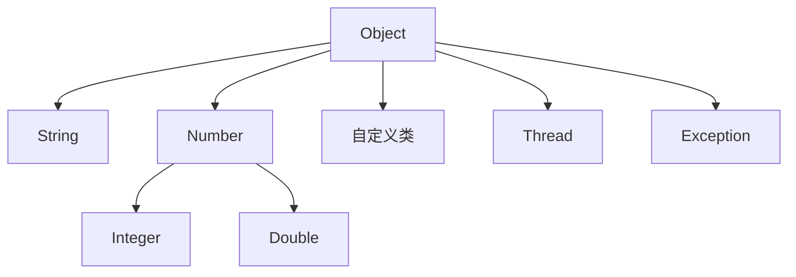

# Java Object类

## 什么是Object类？

在Java编程语言中，`Object`类是所有类的根父类。也就是说，Java中的每一个类都直接或间接地继承自`Object`类。如果一个类没有明确声明它的父类，那么它默认继承`Object`类。

:::note
即使是基本数据类型也有对应的包装类（如`Integer`、`Double`等），这些包装类同样继承自`Object`类。
:::

`Object`类位于`java.lang`包中，因此使用时不需要显式导入。它为所有子类提供了一些通用的方法，这些方法可以被子类重写以提供更具体的实现。



## Object类的常用方法

`Object`类定义了一些所有对象都共有的基本行为。以下是最常用的一些方法：

### 1. toString()

`toString()`方法返回对象的字符串表示。默认实现返回类名和对象的哈希码。

**语法：**
```java
public String toString()
```

**示例：**
```java
public class ObjectDemo {
    public static void main(String[] args) {
        Object obj = new Object();
        System.out.println(obj.toString());
        
        // 创建自定义类实例
        Student student = new Student("张三", 20);
        System.out.println(student.toString());
    }
}

class Student {
    private String name;
    private int age;
    
    public Student(String name, int age) {
        this.name = name;
        this.age = age;
    }
    
    // 重写toString方法
    @Override
    public String toString() {
        return "Student[name=" + name + ", age=" + age + "]";
    }
}
```

**输出：**
```
java.lang.Object@15db9742
Student[name=张三, age=20]
```

### 2. equals()

`equals()`方法用于比较两个对象是否相等。默认实现是比较对象的引用（内存地址）是否相同。

**语法：**
```java
public boolean equals(Object obj)
```

**示例：**
```java
public class EqualsDemo {
    public static void main(String[] args) {
        String str1 = new String("Hello");
        String str2 = new String("Hello");
        
        // 使用默认的equals方法
        Object obj1 = new Object();
        Object obj2 = new Object();
        
        System.out.println("str1 == str2: " + (str1 == str2));
        System.out.println("str1.equals(str2): " + str1.equals(str2));
        System.out.println("obj1 == obj2: " + (obj1 == obj2));
        System.out.println("obj1.equals(obj2): " + obj1.equals(obj2));
    }
}
```

**输出：**
```
str1 == str2: false
str1.equals(str2): true
obj1 == obj2: false
obj1.equals(obj2): false
```

:::tip
重写`equals()`方法时，通常也需要重写`hashCode()`方法，以保持一致性。
:::

### 3. hashCode()

`hashCode()`方法返回对象的哈希码值，这个值是由对象的内存地址计算得出的整数。

**语法：**
```java
public int hashCode()
```

**示例：**
```java
public class HashCodeDemo {
    public static void main(String[] args) {
        Object obj = new Object();
        System.out.println("obj的哈希码: " + obj.hashCode());
        
        Person p1 = new Person("李四", 30);
        Person p2 = new Person("李四", 30);
        
        System.out.println("p1的哈希码: " + p1.hashCode());
        System.out.println("p2的哈希码: " + p2.hashCode());
    }
}

class Person {
    private String name;
    private int age;
    
    public Person(String name, int age) {
        this.name = name;
        this.age = age;
    }
    
    @Override
    public boolean equals(Object obj) {
        if (this == obj) return true;
        if (obj == null || getClass() != obj.getClass()) return false;
        Person person = (Person) obj;
        return age == person.age && 
               (name == person.name || (name != null && name.equals(person.name)));
    }
    
    @Override
    public int hashCode() {
        int result = name != null ? name.hashCode() : 0;
        result = 31 * result + age;
        return result;
    }
}
```

**输出：**
```
obj的哈希码: 366712642
p1的哈希码: 70287
p2的哈希码: 70287
```

### 4. getClass()

`getClass()`方法返回对象的运行时类。

**语法：**
```java
public final Class<?> getClass()
```

**示例：**
```java
public class GetClassDemo {
    public static void main(String[] args) {
        String str = "Hello";
        Class<?> strClass = str.getClass();
        
        System.out.println("类名: " + strClass.getName());
        System.out.println("简单类名: " + strClass.getSimpleName());
        System.out.println("包名: " + strClass.getPackage().getName());
    }
}
```

**输出：**
```
类名: java.lang.String
简单类名: String
包名: java.lang
```

### 5. clone()

`clone()`方法创建并返回对象的副本。

**语法：**
```java
protected Object clone() throws CloneNotSupportedException
```

**示例：**
```java
public class CloneDemo {
    public static void main(String[] args) {
        try {
            Employee original = new Employee("王五", 25);
            Employee copy = (Employee) original.clone();
            
            System.out.println("原始对象: " + original);
            System.out.println("克隆对象: " + copy);
            
            // 修改副本不会影响原始对象
            copy.setAge(30);
            System.out.println("修改后的原始对象: " + original);
            System.out.println("修改后的克隆对象: " + copy);
            
        } catch (CloneNotSupportedException e) {
            e.printStackTrace();
        }
    }
}

class Employee implements Cloneable {
    private String name;
    private int age;
    
    public Employee(String name, int age) {
        this.name = name;
        this.age = age;
    }
    
    public void setAge(int age) {
        this.age = age;
    }
    
    @Override
    public Object clone() throws CloneNotSupportedException {
        return super.clone();
    }
    
    @Override
    public String toString() {
        return "Employee[name=" + name + ", age=" + age + "]";
    }
}
```

**输出：**
```
原始对象: Employee[name=王五, age=25]
克隆对象: Employee[name=王五, age=25]
修改后的原始对象: Employee[name=王五, age=25]
修改后的克隆对象: Employee[name=王五, age=30]
```

:::caution
要使用`clone()`方法，类必须实现`Cloneable`接口，否则会抛出`CloneNotSupportedException`异常。
:::

### 6. finalize()

`finalize()`方法在对象被垃圾回收之前由垃圾回收器调用。

**语法：**
```java
protected void finalize() throws Throwable
```

:::warning
自Java 9起，`finalize()`方法已被标记为过时（deprecated），不推荐使用。推荐使用`try-with-resources`或`Cleaner`机制来替代。
:::

## 实际应用案例

### 案例一：重写equals和hashCode方法实现对象比较

在数据库应用中，我们经常需要比较两个对象是否代表同一实体。例如，两个`Customer`对象，如果它们的ID相同，我们就认为它们是同一个客户。

```java
public class Customer {
    private int id;
    private String name;
    private String email;

    public Customer(int id, String name, String email) {
        this.id = id;
        this.name = name;
        this.email = email;
    }

    @Override
    public boolean equals(Object o) {
        if (this == o) return true;
        if (o == null || getClass() != o.getClass()) return false;
        Customer customer = (Customer) o;
        return id == customer.id;
    }

    @Override
    public int hashCode() {
        return Objects.hash(id);
    }

    public static void main(String[] args) {
        Customer c1 = new Customer(1, "张三", "zhangsan@example.com");
        Customer c2 = new Customer(1, "张小三", "xiaozhang@example.com");
        Customer c3 = new Customer(2, "李四", "lisi@example.com");

        System.out.println("c1.equals(c2): " + c1.equals(c2)); // true，因为ID相同
        System.out.println("c1.equals(c3): " + c1.equals(c3)); // false，因为ID不同

        // 使用哈希表测试
        Map<Customer, String> customerMap = new HashMap<>();
        customerMap.put(c1, "VIP客户");
        System.out.println("包含c2的键: " + customerMap.containsKey(c2)); // true
    }
}
```

### 案例二：使用toString方法改善日志和调试

当我们需要记录日志或调试程序时，对象的字符串表示非常重要。

```java
public class Product {
    private String code;
    private String name;
    private double price;
    private int quantity;

    public Product(String code, String name, double price, int quantity) {
        this.code = code;
        this.name = name;
        this.price = price;
        this.quantity = quantity;
    }

    @Override
    public String toString() {
        return "Product{" +
                "code='" + code + '\'' +
                ", name='" + name + '\'' +
                ", price=" + price +
                ", quantity=" + quantity +
                ", totalValue=" + (price * quantity) +
                '}';
    }

    public static void main(String[] args) {
        Product laptop = new Product("LP001", "高性能笔记本", 5999.99, 10);
        System.out.println("产品信息: " + laptop);
        
        // 在实际应用中的日志记录
        // logger.info("新增产品: {}", laptop);
    }
}
```

### 案例三：使用getClass方法进行运行时类型检查

有时我们需要在运行时检查对象的类型，以便进行不同的处理。

```java
public class ShapeProcessor {
    
    public void process(Object shape) {
        Class<?> shapeClass = shape.getClass();
        System.out.println("处理形状: " + shapeClass.getSimpleName());
        
        if (shapeClass == Circle.class) {
            Circle circle = (Circle) shape;
            System.out.println("圆的半径: " + circle.getRadius());
        } else if (shapeClass == Rectangle.class) {
            Rectangle rect = (Rectangle) shape;
            System.out.println("矩形的宽度和高度: " + rect.getWidth() + " x " + rect.getHeight());
        } else {
            System.out.println("未知形状类型");
        }
    }
    
    public static void main(String[] args) {
        ShapeProcessor processor = new ShapeProcessor();
        processor.process(new Circle(5.0));
        processor.process(new Rectangle(4.0, 6.0));
        processor.process("这不是形状"); // 会输出未知形状类型
    }
}

class Circle {
    private double radius;
    
    public Circle(double radius) {
        this.radius = radius;
    }
    
    public double getRadius() {
        return radius;
    }
}

class Rectangle {
    private double width;
    private double height;
    
    public Rectangle(double width, double height) {
        this.width = width;
        this.height = height;
    }
    
    public double getWidth() {
        return width;
    }
    
    public double getHeight() {
        return height;
    }
}
```

## 总结

`Object`类是Java类层次结构的根类，它提供了所有Java对象都具有的基本功能：

1. **toString()**：返回对象的字符串表示，便于调试和日志记录
2. **equals()**：比较两个对象是否相等
3. **hashCode()**：返回对象的哈希码，用于哈希数据结构
4. **getClass()**：获取对象的运行时类信息
5. **clone()**：创建对象的副本
6. **finalize()**：对象垃圾回收前的清理工作（不推荐使用）

理解和正确使用`Object`类的方法是Java面向对象编程的基础。在设计自己的类时，应该根据需要适当地重写这些方法，特别是`equals()`、`hashCode()`和`toString()`方法。

## 练习

1. 创建一个`Book`类，包含`isbn`、`title`和`author`字段。重写`toString()`、`equals()`和`hashCode()`方法。使用`isbn`作为比较两本书是否相等的依据。

2. 实现一个深克隆的例子，其中对象包含另一个对象的引用，确保在克隆时内部对象也被克隆。

3. 创建一个程序，展示当两个对象的`equals()`方法返回`true`而`hashCode()`方法返回不同值时，在`HashMap`中会发生什么。

4. 编写一个通用的对象比较器，使用反射来比较两个对象的所有字段，而不需要为每个类重写`equals()`方法。

## 额外资源

- [Oracle Java文档 - Object类](https://docs.oracle.com/en/java/javase/11/docs/api/java.base/java/lang/Object.html)
- [深入理解Java中的equals和hashCode](https://www.baeldung.com/java-equals-hashcode-contracts)
- [Java对象克隆的完整指南](https://www.baeldung.com/java-cloning)