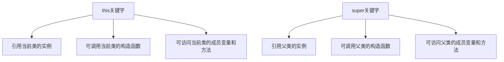

# Java super关键字

## 什么是super关键字？

在Java面向对象编程中，`super`关键字是一个引用变量，用来引用父类（超类）对象。它主要用于访问父类的成员变量、方法和构造函数。当子类与父类存在同名成员或需要明确调用父类构造器时，`super`关键字的作用尤为重要。

:::note
`super`关键字与`this`关键字类似，但`this`引用的是当前类的实例，而`super`引用的是父类的实例。
:::

## super关键字的三大用途

### 1. 访问父类的成员变量

当子类与父类拥有同名的成员变量时，可以使用`super`关键字来引用父类的成员变量。

```java
public class Animal {
    String name = "动物";
}

public class Dog extends Animal {
    String name = "狗";
    
    public void printName() {
        System.out.println("子类中的name: " + this.name);
        System.out.println("父类中的name: " + super.name);
    }
}

public class TestSuper {
    public static void main(String[] args) {
        Dog dog = new Dog();
        dog.printName();
    }
}
```

输出结果：
```
子类中的name: 狗
父类中的name: 动物
```

### 2. 调用父类的方法

当子类重写（覆盖）了父类的方法时，可以通过`super`关键字调用父类中被覆盖的方法。

```java
public class Animal {
    public void eat() {
        System.out.println("动物正在进食");
    }
}

public class Dog extends Animal {
    @Override
    public void eat() {
        super.eat(); // 调用父类的eat方法
        System.out.println("狗在吃骨头");
    }
}

public class TestSuper {
    public static void main(String[] args) {
        Dog dog = new Dog();
        dog.eat();
    }
}
```

输出结果：
```
动物正在进食
狗在吃骨头
```

### 3. 调用父类的构造函数

使用`super()`或`super(参数)`来调用父类的构造函数。这必须是子类构造函数中的第一条语句。

```java
public class Animal {
    private String name;
    
    public Animal(String name) {
        this.name = name;
        System.out.println("父类构造函数被调用");
    }
    
    public String getName() {
        return name;
    }
}

public class Dog extends Animal {
    private int age;
    
    public Dog(String name, int age) {
        super(name); // 调用父类的构造函数
        this.age = age;
        System.out.println("子类构造函数被调用");
    }
    
    public void display() {
        System.out.println("名字: " + getName() + ", 年龄: " + age);
    }
}

public class TestSuper {
    public static void main(String[] args) {
        Dog dog = new Dog("旺财", 3);
        dog.display();
    }
}
```

输出结果：
```
父类构造函数被调用
子类构造函数被调用
名字: 旺财, 年龄: 3
```

## super关键字的使用规则

1. **调用父类构造函数时**：使用`super()`或`super(参数)`，且必须是子类构造函数中的第一条语句。
2. **访问父类成员**：使用`super.成员变量`或`super.方法名()`语法。
3. **不能单独使用**：`super`必须在实例方法或构造函数中使用，不能在静态方法中使用。

:::caution
如果子类构造函数没有显式调用父类的构造函数，Java会自动调用父类的无参构造函数`super()`。如果父类没有无参构造函数，则编译错误。
:::

## super与this的区别

理解`super`和`this`的区别对于掌握Java面向对象编程至关重要：



## 实际应用场景

### 场景一：银行账户管理系统

在银行账户管理系统中，可能有不同类型的账户（储蓄账户、信用账户等），它们都继承自一个基本的账户类。

```java
// 基础账户类
public class Account {
    private String accountNumber;
    protected double balance;
    
    public Account(String accountNumber, double initialBalance) {
        this.accountNumber = accountNumber;
        this.balance = initialBalance;
    }
    
    public void deposit(double amount) {
        balance += amount;
        System.out.println("存款: " + amount);
        System.out.println("当前余额: " + balance);
    }
    
    public void withdraw(double amount) {
        if (amount <= balance) {
            balance -= amount;
            System.out.println("取款: " + amount);
        } else {
            System.out.println("余额不足");
        }
        System.out.println("当前余额: " + balance);
    }
}

// 储蓄账户类
public class SavingsAccount extends Account {
    private double interestRate; // 利率
    
    public SavingsAccount(String accountNumber, double initialBalance, double interestRate) {
        super(accountNumber, initialBalance); // 调用父类构造函数
        this.interestRate = interestRate;
    }
    
    public void addInterest() {
        double interest = balance * interestRate / 100;
        deposit(interest); // 计算利息并存入账户
        System.out.println("已添加利息: " + interest);
    }
    
    @Override
    public void withdraw(double amount) {
        System.out.println("储蓄账户取款");
        super.withdraw(amount); // 调用父类的取款方法
    }
}

// 测试类
public class BankApplication {
    public static void main(String[] args) {
        SavingsAccount sa = new SavingsAccount("SA001", 1000.0, 2.5);
        sa.deposit(500.0);
        sa.withdraw(200.0);
        sa.addInterest();
    }
}
```

输出结果：
```
存款: 500.0
当前余额: 1500.0
储蓄账户取款
取款: 200.0
当前余额: 1300.0
存款: 32.5
当前余额: 1332.5
已添加利息: 32.5
```

### 场景二：图形绘制系统

在图形绘制系统中，可能有各种形状（圆形、矩形等），它们都继承自一个基本的形状类。

```java
// 基础形状类
public class Shape {
    private String color;
    
    public Shape(String color) {
        this.color = color;
    }
    
    public void draw() {
        System.out.println("绘制一个" + color + "的形状");
    }
    
    public String getColor() {
        return color;
    }
}

// 圆形类
public class Circle extends Shape {
    private double radius;
    
    public Circle(String color, double radius) {
        super(color); // 调用父类构造函数
        this.radius = radius;
    }
    
    @Override
    public void draw() {
        super.draw(); // 调用父类的draw方法
        System.out.println("绘制一个半径为" + radius + "的圆");
    }
    
    public double calculateArea() {
        return Math.PI * radius * radius;
    }
}

// 测试类
public class DrawingApplication {
    public static void main(String[] args) {
        Circle circle = new Circle("红色", 5.0);
        circle.draw();
        System.out.println("面积: " + circle.calculateArea());
    }
}
```

输出结果：
```
绘制一个红色的形状
绘制一个半径为5.0的圆
面积: 78.53981633974483
```

## 总结

1. `super`关键字是Java中用来引用父类对象的关键字。
2. 它有三个主要用途：
   - 访问父类的成员变量
   - 调用父类的方法
   - 调用父类的构造函数
3. `super()`必须是子类构造函数的第一条语句。
4. `super`关键字在处理子类与父类的同名成员时特别有用。

掌握`super`关键字的使用，对于理解和运用Java继承特性非常重要，它让子类能够在保留父类功能的同时进行适当的扩展和修改。

## 练习题

1. 编写一个`Person`类和一个继承自`Person`的`Student`类。`Person`有名称和年龄属性，`Student`有额外的学号属性。使用`super`关键字在`Student`类中正确调用`Person`的构造函数。

2. 创建一个`Vehicle`类和一个`Car`类，两个类都有`move()`方法。在`Car`类中覆盖`move()`方法，但需要调用父类的`move()`方法来展示基本移动功能。

3. 设计一个有父类`Animal`和子类`Bird`的继承关系，其中两个类都有`name`属性。实现一个方法在子类中同时打印子类和父类的`name`属性。

:::tip
完成这些练习后，尝试思考以下问题：
1. 为什么需要调用父类的构造函数？
2. 如果不使用`super`关键字，如何访问被子类覆盖的父类方法？
3. `super`和`this`关键字能在同一个构造函数中同时使用吗？
:::