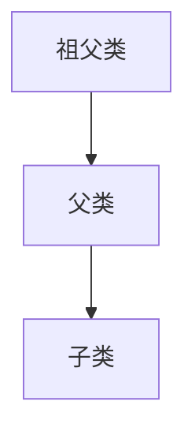

# Java 多层继承

在面向对象编程的世界中，继承是一个核心概念，它允许我们基于已有的类创建新类，从而实现代码的重用和层次化设计。Java支持多层继承（也称为"多级继承"），这是一种继承关系的延伸形式，本文将详细介绍这一概念。

## 什么是多层继承？

多层继承是指一个类继承自另一个类，然后这个子类又被其他类继承，形成一个继承链或继承树。在这种结构中，每个子类都会继承其所有父类的特性。



在上图中，类C继承自类B，类B又继承自类A，这就形成了一个多层继承结构。类C不仅可以访问类B的非私有成员，还能间接访问类A的非私有成员。

## 多层继承的语法

Java中实现多层继承的语法非常简单，只需要使用关键字`extends`：

```java
// 祖父类
class Animal {
    void eat() {
        System.out.println("动物需要吃东西");
    }
}

// 父类继承祖父类
class Mammal extends Animal {
    void breathe() {
        System.out.println("哺乳动物需要呼吸氧气");
    }
}

// 子类继承父类
class Dog extends Mammal {
    void bark() {
        System.out.println("狗会汪汪叫");
    }
}

// 测试多层继承
public class MultilevelInheritanceDemo {
    public static void main(String[] args) {
        Dog dog = new Dog();
        dog.eat();    // 调用祖父类方法
        dog.breathe();  // 调用父类方法
        dog.bark();   // 调用自身方法
    }
}
```

**输出结果：**
```
动物需要吃东西
哺乳动物需要呼吸氧气
狗会汪汪叫
```

在这个例子中，`Dog`类继承了`Mammal`类，而`Mammal`类又继承了`Animal`类。因此，`Dog`类的实例可以调用所有三个类中的方法。

## 多层继承中的构造方法调用顺序

在多层继承结构中，构造方法的调用遵循一个特定的顺序：从最顶层的父类构造方法开始，依次向下调用，直到当前子类的构造方法。

```java
class Grandparent {
    Grandparent() {
        System.out.println("祖父类构造方法被调用");
    }
}

class Parent extends Grandparent {
    Parent() {
        System.out.println("父类构造方法被调用");
    }
}

class Child extends Parent {
    Child() {
        System.out.println("子类构造方法被调用");
    }
}

public class ConstructorCallOrder {
    public static void main(String[] args) {
        new Child(); // 创建Child对象
    }
}
```

**输出结果：**
```
祖父类构造方法被调用
父类构造方法被调用
子类构造方法被调用
```

:::note
在Java中，如果构造方法的第一行没有显式调用`super()`或`this()`，编译器会自动添加一个无参数的`super()`调用，确保父类的构造方法被执行。
:::

## 多层继承中的方法重写

当子类定义了与父类相同签名的方法时，子类的方法会覆盖（重写）父类的方法。在多层继承中，这种重写可以发生在继承链的任何位置。

```java
class Animal {
    void makeSound() {
        System.out.println("动物发出声音");
    }
}

class Mammal extends Animal {
    @Override
    void makeSound() {
        System.out.println("哺乳动物发出声音");
    }
}

class Dog extends Mammal {
    @Override
    void makeSound() {
        System.out.println("狗汪汪叫");
    }
}

public class MethodOverridingDemo {
    public static void main(String[] args) {
        Animal animal = new Animal();
        Animal mammal = new Mammal();
        Animal dog = new Dog();
        
        animal.makeSound(); // 调用Animal类的makeSound方法
        mammal.makeSound(); // 调用Mammal类的makeSound方法
        dog.makeSound();    // 调用Dog类的makeSound方法
    }
}
```

**输出结果：**
```
动物发出声音
哺乳动物发出声音
狗汪汪叫
```

这个例子展示了多态性在多层继承中的应用。虽然引用变量的类型都是`Animal`，但实际执行的方法取决于对象的实际类型。

## 通过super访问父类成员

在多层继承中，子类可以使用`super`关键字访问直接父类的成员：

```java
class Animal {
    void makeSound() {
        System.out.println("动物发出声音");
    }
}

class Mammal extends Animal {
    void makeSound() {
        super.makeSound(); // 调用Animal类的makeSound方法
        System.out.println("哺乳动物发出声音");
    }
}

class Dog extends Mammal {
    void makeSound() {
        super.makeSound(); // 调用Mammal类的makeSound方法
        System.out.println("狗汪汪叫");
    }
}

public class SuperKeywordDemo {
    public static void main(String[] args) {
        Dog dog = new Dog();
        dog.makeSound();
    }
}
```

**输出结果：**
```
动物发出声音
哺乳动物发出声音
狗汪汪叫
```

在这个例子中，`Dog`类的`makeSound`方法调用了`Mammal`类的`makeSound`方法，而后者又调用了`Animal`类的`makeSound`方法。

:::caution
`super`关键字只能访问直接父类的成员，无法直接访问祖父类或更上层的成员。如果需要访问更上层的成员，必须通过直接父类提供的方法间接访问。
:::

## 多层继承的优缺点

### 优点

1. **代码重用**：子类可以重用父类的代码，减少重复编写。
2. **逻辑层次清晰**：多层继承可以构建出更符合现实世界层次关系的类结构。
3. **方便扩展**：可以通过添加新的子类来扩展现有的类层次结构。

### 缺点

1. **复杂性增加**：继承层次过深会增加代码的复杂性，使理解和维护变得困难。
2. **紧耦合**：子类与父类紧密耦合，父类的修改可能会影响所有子类。
3. **可能引起菱形继承问题**：虽然Java不支持多重继承（一个类继承多个父类），但使用接口可能会导致类似问题。

:::tip
一般建议继承层次不要超过3层，以保持代码的可读性和可维护性。如果发现继承层次过深，可以考虑使用组合设计模式代替继承。
:::

## 实际应用场景

### 电子商务系统中的产品分类

```java
// 基础产品类
class Product {
    private String id;
    private String name;
    private double price;
    
    // 构造方法、getter和setter略
    
    public void displayInfo() {
        System.out.println("产品ID: " + id);
        System.out.println("产品名称: " + name);
        System.out.println("产品价格: " + price);
    }
}

// 电子产品类
class ElectronicProduct extends Product {
    private String brand;
    private String warranty;
    
    // 构造方法、getter和setter略
    
    @Override
    public void displayInfo() {
        super.displayInfo();
        System.out.println("品牌: " + brand);
        System.out.println("保修期: " + warranty);
    }
}

// 手机类
class MobilePhone extends ElectronicProduct {
    private String operatingSystem;
    private String screenSize;
    private String cameraSpec;
    
    // 构造方法、getter和setter略
    
    @Override
    public void displayInfo() {
        super.displayInfo();
        System.out.println("操作系统: " + operatingSystem);
        System.out.println("屏幕尺寸: " + screenSize);
        System.out.println("相机规格: " + cameraSpec);
    }
}

public class ECommerceDemo {
    public static void main(String[] args) {
        MobilePhone phone = new MobilePhone();
        // 设置属性值（省略）
        phone.displayInfo(); // 显示手机的所有信息
    }
}
```

这个例子展示了电子商务系统中的产品分类结构。`Product`是基础产品类，`ElectronicProduct`是电子产品类，继承自`Product`，`MobilePhone`是手机类，继承自`ElectronicProduct`。这种多层继承结构使得每个子类都能扩展父类的功能，并且可以重用父类的代码。

### 图形用户界面（GUI）组件继承体系

Java的Swing库大量使用了多层继承来设计GUI组件：

```java
import javax.swing.*;
import java.awt.*;
import java.awt.event.ActionEvent;
import java.awt.event.ActionListener;

public class CustomButtonDemo {
    public static void main(String[] args) {
        JFrame frame = new JFrame("自定义按钮示例");
        frame.setDefaultCloseOperation(JFrame.EXIT_ON_CLOSE);
        frame.setSize(300, 200);
        
        // 创建自定义按钮
        RoundedButton button = new RoundedButton("点击我");
        button.addActionListener(new ActionListener() {
            @Override
            public void actionPerformed(ActionEvent e) {
                JOptionPane.showMessageDialog(frame, "按钮被点击了！");
            }
        });
        
        frame.setLayout(new FlowLayout());
        frame.add(button);
        frame.setVisible(true);
    }
}

// 自定义圆角按钮，继承自JButton
class RoundedButton extends JButton {
    public RoundedButton(String text) {
        super(text);
        setContentAreaFilled(false);
        setFocusPainted(false);
        setBorderPainted(false);
    }
    
    @Override
    protected void paintComponent(Graphics g) {
        Graphics2D g2 = (Graphics2D)g;
        g2.setRenderingHint(RenderingHints.KEY_ANTIALIASING, RenderingHints.VALUE_ANTIALIAS_ON);
        
        g2.setColor(getBackground());
        g2.fillRoundRect(0, 0, getWidth(), getHeight(), 20, 20);
        
        super.paintComponent(g);
    }
}
```

在这个例子中，`RoundedButton`类继承自`JButton`类，而`JButton`类又继承自`AbstractButton`类，`AbstractButton`类又继承自`JComponent`类......这种多层继承结构使得每个子类都能专注于自己需要实现的功能，同时继承父类的基本行为。

## 总结

Java的多层继承是一个强大的面向对象编程特性，它允许类形成层次化的结构，促进代码重用和逻辑清晰的设计。通过多层继承，子类可以继承多个层次的父类的属性和方法，从而构建出更复杂和更有层次的类结构。

然而，使用多层继承时应当谨慎，避免继承层次过深导致的代码复杂性和维护困难。在许多情况下，组合模式可能是比继承更好的选择。

### 关键点回顾

- 多层继承是指类A继承类B，类B继承类C，形成继承链的结构
- 构造方法的调用顺序是从上到下，即从祖父类到子类
- 子类可以通过super关键字访问直接父类的成员
- 方法重写在多层继承中可以发生在任何层级
- 多层继承的优点包括代码重用和逻辑层次清晰；缺点包括增加复杂性和紧耦合

## 练习

1. 创建一个多层继承的示例，包含至少三个类：`Vehicle`（交通工具）、`Car`（汽车）和`SportsCar`（跑车）。每个类都应该有自己的属性和方法。
2. 在上面的例子基础上，演示构造方法的调用顺序。
3. 实现方法重写，并使用super关键字调用父类的方法。
4. 思考：在什么情况下多层继承是合适的设计选择？什么情况下应该避免使用多层继承？

## 延伸阅读

- Java中的组合与继承对比
- 接口与抽象类在Java继承体系中的应用
- 设计模式中如何合理使用继承

通过掌握多层继承的概念和应用，你将能够设计出更加灵活、可扩展的Java程序。记住，虽然继承是一个强大的工具，但它并不总是解决问题的最佳方式。在实际开发中，应当根据具体情况选择合适的设计方式。