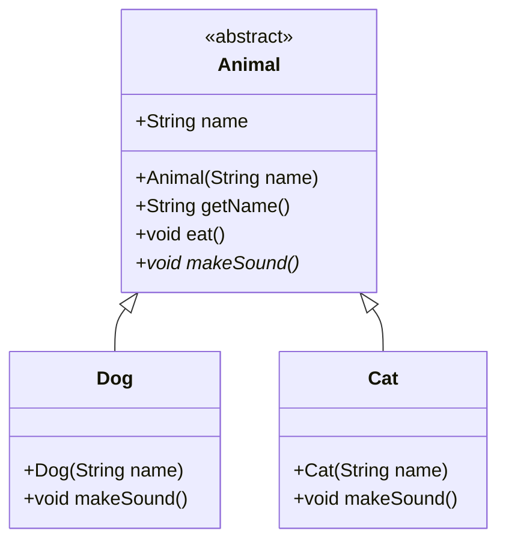

# Java 抽象类

## 什么是抽象类？

在Java面向对象编程中，**抽象类**是一种特殊的类，它不能被实例化（即不能直接创建对象），主要用于被其他类继承。抽象类代表了一种"不完整"的设计，它定义了子类应该遵循的基本结构，但将具体实现的责任留给了子类。

抽象类通常包含一个或多个**抽象方法**——这些方法只有声明没有具体实现（没有方法体），由子类来提供具体实现。同时，抽象类也可以包含普通方法（有具体实现的方法）。

:::note
抽象类的关键特点是它不能被实例化，只能被继承。
:::

## 抽象类的语法

在Java中，使用`abstract`关键字来声明抽象类和抽象方法：

```java
// 抽象类的声明
public abstract class 类名 {
    // 抽象方法 - 没有方法体
    public abstract 返回类型 方法名(参数列表);
    
    // 普通方法 - 有方法体
    public 返回类型 普通方法名(参数列表) {
        // 方法实现代码
    }
}
```

## 抽象类的特点

1. **不能实例化**：不能使用`new`关键字创建抽象类的对象
2. **可以包含抽象方法**：这些方法没有实现，必须由子类实现
3. **可以包含普通方法**：有完整实现的方法
4. **可以包含成员变量**：与普通类一样
5. **可以包含构造方法**：虽然不能直接实例化，但子类实例化时会调用父类构造器
6. **可以包含静态方法和静态变量**：这些可以直接通过类名访问

## 抽象类的基本示例

下面是一个抽象类的简单示例：

```java
// 定义抽象类
abstract class Animal {
    // 普通成员变量
    private String name;
    
    // 构造方法
    public Animal(String name) {
        this.name = name;
    }
    
    // getter方法
    public String getName() {
        return name;
    }
    
    // 抽象方法 - 没有实现
    public abstract void makeSound();
    
    // 普通方法 - 有实现
    public void eat() {
        System.out.println(name + " is eating...");
    }
}

// 子类必须实现所有抽象方法，否则子类也必须声明为抽象类
class Dog extends Animal {
    public Dog(String name) {
        super(name);
    }
    
    // 实现父类的抽象方法
    @Override
    public void makeSound() {
        System.out.println(getName() + " says: Woof!");
    }
}

// 测试代码
public class AbstractClassDemo {
    public static void main(String[] args) {
        // 不能实例化抽象类
        // Animal animal = new Animal("Generic Animal"); // 编译错误
        
        // 可以创建子类对象
        Dog dog = new Dog("Buddy");
        dog.makeSound();  // 输出: Buddy says: Woof!
        dog.eat();        // 输出: Buddy is eating...
    }
}
```

**运行结果：**
```
Buddy says: Woof!
Buddy is eating...
```

## 抽象类与具体子类的关系

当一个类继承了抽象类，它有两种选择：
1. 实现所有的抽象方法，成为一个具体类
2. 不实现（或部分实现）抽象方法，自己也必须声明为抽象类



## 抽象类 vs 接口

抽象类和接口是Java中两种不同的抽象机制，它们有一些关键区别：

| 特性 | 抽象类 | 接口 |
|------|---------|-------|
| 实例变量 | 可以有 | 只能是静态常量 |
| 构造方法 | 可以有 | 不能有 |
| 方法实现 | 可以包含抽象方法和具体方法 | 在Java 8之前只能有抽象方法；Java 8后可以有默认方法和静态方法 |
| 继承关系 | 单继承（一个类只能继承一个抽象类） | 多实现（一个类可以实现多个接口） |
| 访问修饰符 | 可以使用各种访问修饰符 | 方法默认为public |

:::tip
当你需要在多个不相关的类之间共享方法签名时，使用接口；当你想在相关的类之间共享代码实现时，使用抽象类。
:::

## 实际应用场景

### 场景1：绘图应用

假设我们正在开发一个绘图应用，需要支持绘制各种形状：

```java
// 抽象形状类
public abstract class Shape {
    protected String color;
    
    public Shape(String color) {
        this.color = color;
    }
    
    // 所有形状都需要实现的方法
    public abstract double area();
    public abstract double perimeter();
    
    // 所有形状共享的行为
    public void display() {
        System.out.println("This is a " + color + " shape.");
        System.out.println("Area: " + area());
        System.out.println("Perimeter: " + perimeter());
    }
}

// 具体形状：圆形
public class Circle extends Shape {
    private double radius;
    
    public Circle(String color, double radius) {
        super(color);
        this.radius = radius;
    }
    
    @Override
    public double area() {
        return Math.PI * radius * radius;
    }
    
    @Override
    public double perimeter() {
        return 2 * Math.PI * radius;
    }
}

// 具体形状：矩形
public class Rectangle extends Shape {
    private double width;
    private double height;
    
    public Rectangle(String color, double width, double height) {
        super(color);
        this.width = width;
        this.height = height;
    }
    
    @Override
    public double area() {
        return width * height;
    }
    
    @Override
    public double perimeter() {
        return 2 * (width + height);
    }
}

// 测试代码
public class ShapeTest {
    public static void main(String[] args) {
        Circle circle = new Circle("red", 5);
        Rectangle rectangle = new Rectangle("blue", 4, 6);
        
        circle.display();
        System.out.println();
        rectangle.display();
    }
}
```

**运行结果：**
```
This is a red shape.
Area: 78.53981633974483
Perimeter: 31.41592653589793

This is a blue shape.
Area: 24.0
Perimeter: 20.0
```

### 场景2：数据库操作

抽象类也常用于定义通用的数据库操作模板：

```java
// 抽象数据访问类
public abstract class AbstractDAO {
    // 连接数据库的通用方法
    protected final void connect() {
        System.out.println("Connecting to database...");
        // 实际连接代码
    }
    
    // 关闭数据库连接的通用方法
    protected final void disconnect() {
        System.out.println("Disconnecting from database...");
        // 实际关闭连接代码
    }
    
    // 执行查询的模板方法
    public final void executeQuery(String query) {
        connect();
        processQuery(query);
        disconnect();
    }
    
    // 抽象方法，由不同的数据库实现类来实现
    protected abstract void processQuery(String query);
}

// MySQL数据库操作实现
public class MySQLDAO extends AbstractDAO {
    @Override
    protected void processQuery(String query) {
        System.out.println("Executing MySQL query: " + query);
        // MySQL特定的查询处理
    }
}

// Oracle数据库操作实现
public class OracleDAO extends AbstractDAO {
    @Override
    protected void processQuery(String query) {
        System.out.println("Executing Oracle query: " + query);
        // Oracle特定的查询处理
    }
}

// 测试代码
public class DAOTest {
    public static void main(String[] args) {
        AbstractDAO mysqlDAO = new MySQLDAO();
        AbstractDAO oracleDAO = new OracleDAO();
        
        mysqlDAO.executeQuery("SELECT * FROM users");
        System.out.println();
        oracleDAO.executeQuery("SELECT * FROM employees");
    }
}
```

**运行结果：**
```
Connecting to database...
Executing MySQL query: SELECT * FROM users
Disconnecting from database...

Connecting to database...
Executing Oracle query: SELECT * FROM employees
Disconnecting from database...
```

## 抽象类的设计原则

设计抽象类时，应遵循以下原则：

1. **依赖抽象而非具体实现**：面向抽象编程有助于降低耦合度
2. **单一职责原则**：一个抽象类应该只有一个变化的原因
3. **开放封闭原则**：对扩展开放，对修改关闭
4. **里氏替换原则**：子类对象应该能够替换父类对象使用

:::caution
过度使用抽象可能导致设计过于复杂。在实际编程中，应当根据需求合理使用抽象类。
:::

## 总结

抽象类是Java面向对象编程中的重要概念，它提供了一种在继承层次结构中共享代码的方式，同时强制子类实现特定的行为。抽象类的主要特点包括：

- 不能被实例化，只能被继承
- 可以包含抽象方法和具体方法
- 子类必须实现所有抽象方法，或者自己也声明为抽象类
- 适用于需要在相关类之间共享代码实现的场景

通过本文的学习，你应该对Java抽象类有了基本的了解，并能够在适当的场景中应用它来提高代码的复用性和可维护性。

## 练习题

1. 创建一个名为`Vehicle`的抽象类，包含抽象方法`start()`和`stop()`，以及具体方法`honk()`。然后创建两个子类`Car`和`Motorcycle`，实现这些抽象方法。

2. 设计一个简单的游戏角色系统，使用抽象类`Character`定义角色的基本属性（如生命值、攻击力）和行为（如攻击、防御），然后创建不同类型的角色（如战士、法师、弓箭手）作为子类。

3. 思考：在什么情况下应该使用抽象类而不是接口？反之亦然？

## 进一步学习资源

- Java官方文档中关于抽象类的部分
- 《Effective Java》第3版，特别是关于类与接口设计的章节
- 《Head First设计模式》，了解如何在设计模式中应用抽象类