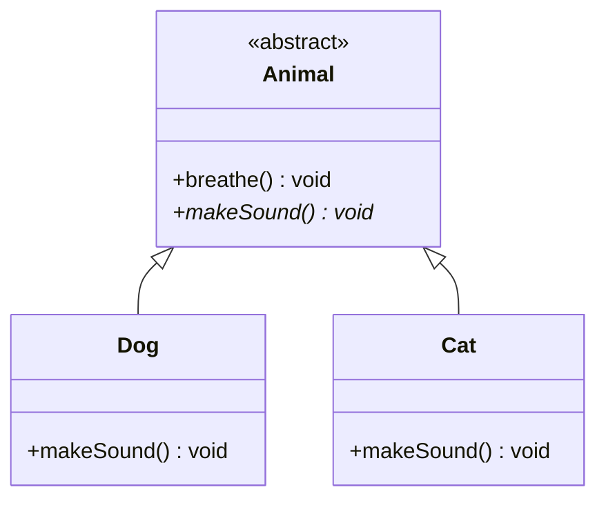

# Java 抽象方法

抽象方法是Java面向对象编程中一个重要的概念，它允许我们定义一个没有具体实现的方法，为子类提供一个必须实现的方法模板。通过抽象方法，我们可以实现多态性和代码重用，促进更灵活、更可扩展的程序设计。

## 什么是抽象方法？

抽象方法是一种特殊的方法，它**只有声明，没有具体的实现**。抽象方法的声明以分号结束，而不是一个方法体。

抽象方法的基本语法：

```java
abstract 返回类型 方法名(参数列表);
```

:::note
抽象方法必须在抽象类或接口中声明。含有抽象方法的类必须被声明为抽象类。
:::

## 抽象方法与抽象类

抽象方法和抽象类是紧密关联的概念：

1. 抽象方法必须在抽象类中定义
2. 抽象类可以包含抽象方法和普通方法
3. 抽象类不能被实例化，必须被子类继承
4. 子类必须实现父类中的所有抽象方法，除非子类也是抽象类

让我们通过一个简单的例子来理解这些概念：

```java
// 抽象类
abstract class Animal {
    // 普通方法
    public void breathe() {
        System.out.println("呼吸中...");
    }
    
    // 抽象方法 - 没有方法体
    abstract void makeSound();
}

// 具体子类
class Dog extends Animal {
    // 实现抽象方法
    @Override
    void makeSound() {
        System.out.println("汪汪汪!");
    }
}

class Cat extends Animal {
    // 实现抽象方法
    @Override
    void makeSound() {
        System.out.println("喵喵喵~");
    }
}

public class AbstractMethodDemo {
    public static void main(String[] args) {
        // Animal animal = new Animal(); // 错误：抽象类不能被实例化
        
        Animal dog = new Dog();
        Animal cat = new Cat();
        
        dog.breathe();  // 输出：呼吸中...
        dog.makeSound(); // 输出：汪汪汪!
        
        cat.breathe();  // 输出：呼吸中...
        cat.makeSound(); // 输出：喵喵喵~
    }
}
```

在上面的例子中：
- `Animal` 是一个抽象类，包含一个抽象方法 `makeSound()`
- `Dog` 和 `Cat` 是具体子类，它们继承自 `Animal` 并实现了 `makeSound()` 方法
- 我们不能直接实例化 `Animal`，但可以创建其子类的实例

## 抽象方法的特点

抽象方法具有以下特点：

1. **没有方法体**：抽象方法只有声明，没有实现，以分号结束
2. **必须被子类重写**：除非子类也是抽象类
3. **不能是私有的**：因为私有方法无法被子类继承和重写
4. **不能是静态的**：静态方法与类绑定，而不是实例，无法通过继承实现多态
5. **不能是final的**：final方法无法被重写

:::warning
以下代码会导致编译错误：

```java
abstract class WrongExample {
    // 编译错误：抽象方法不能是私有的
    private abstract void method1();
    
    // 编译错误：抽象方法不能是静态的
    static abstract void method2();
    
    // 编译错误：抽象方法不能是final的
    final abstract void method3();
}
```
:::

## 抽象方法与接口方法

Java 8之前，接口中的所有方法都是隐式抽象的。虽然接口中的方法和抽象类中的抽象方法有相似之处，但它们有一些关键区别：

```java
// 接口
interface Drawable {
    void draw(); // 隐式抽象方法，等同于 abstract void draw();
}

// 抽象类
abstract class Shape {
    // 可以有构造方法
    public Shape() {
        System.out.println("创建了一个形状");
    }
    
    // 可以有普通方法
    public void info() {
        System.out.println("这是一个形状");
    }
    
    // 抽象方法
    abstract void draw();
}
```

主要区别：
1. 接口只能包含（Java 8前）抽象方法，而抽象类可以同时包含抽象方法和具体方法
2. 一个类可以实现多个接口，但只能继承一个抽象类
3. 接口不能有构造方法，而抽象类可以有

## 什么时候使用抽象方法？

抽象方法适用于以下场景：

1. **定义通用API**：当你想定义所有子类都必须遵循的通用API
2. **部分实现**：当父类只能提供部分实现，其余需要子类根据自己的特性来实现
3. **模板方法模式**：定义算法的骨架，将某些步骤延迟到子类中实现

## 抽象方法的实际应用案例

让我们看一个实际的例子，展示抽象方法在游戏开发中的应用：

```java
// 抽象游戏角色类
abstract class GameCharacter {
    private String name;
    private int health;
    private int level;
    
    public GameCharacter(String name) {
        this.name = name;
        this.health = 100;
        this.level = 1;
    }
    
    // 普通方法
    public void levelUp() {
        level++;
        System.out.println(name + " 升级到 " + level + " 级!");
        increaseStats(); // 调用抽象方法
    }
    
    public void takeDamage(int damage) {
        health -= damage;
        if (health <= 0) {
            health = 0;
            System.out.println(name + " 已阵亡!");
        } else {
            System.out.println(name + " 受到 " + damage + " 点伤害，剩余血量: " + health);
        }
    }
    
    // 抽象方法 - 不同角色有不同的技能和属性提升方式
    abstract void attack(GameCharacter target);
    abstract void useSpecialAbility();
    abstract void increaseStats();
    
    // Getter方法
    public String getName() {
        return name;
    }
    
    public int getHealth() {
        return health;
    }
    
    public int getLevel() {
        return level;
    }
}

// 具体的战士类
class Warrior extends GameCharacter {
    public Warrior(String name) {
        super(name);
    }
    
    @Override
    void attack(GameCharacter target) {
        System.out.println(getName() + " 使用剑攻击 " + target.getName());
        target.takeDamage(10);
    }
    
    @Override
    void useSpecialAbility() {
        System.out.println(getName() + " 使用了战吼技能，提高了攻击力!");
    }
    
    @Override
    void increaseStats() {
        System.out.println(getName() + " 的力量和防御增加了!");
    }
}

// 具体的法师类
class Mage extends GameCharacter {
    private int mana;
    
    public Mage(String name) {
        super(name);
        this.mana = 100;
    }
    
    @Override
    void attack(GameCharacter target) {
        System.out.println(getName() + " 对 " + target.getName() + " 施放了火球术");
        target.takeDamage(15);
        mana -= 5;
        System.out.println(getName() + " 剩余法力值: " + mana);
    }
    
    @Override
    void useSpecialAbility() {
        System.out.println(getName() + " 施放了暴风雪法术，对周围敌人造成伤害!");
        mana -= 30;
        System.out.println(getName() + " 剩余法力值: " + mana);
    }
    
    @Override
    void increaseStats() {
        System.out.println(getName() + " 的智力和法力值上限增加了!");
        mana += 20;
    }
}

public class GameDemo {
    public static void main(String[] args) {
        Warrior warrior = new Warrior("亚瑟");
        Mage mage = new Mage("甘道夫");
        
        warrior.attack(mage);
        mage.attack(warrior);
        
        warrior.useSpecialAbility();
        mage.useSpecialAbility();
        
        warrior.levelUp();
        mage.levelUp();
    }
}
```

输出：
```
亚瑟 使用剑攻击 甘道夫
甘道夫 受到 10 点伤害，剩余血量: 90
甘道夫 对 亚瑟 施放了火球术
亚瑟 受到 15 点伤害，剩余血量: 85
甘道夫 剩余法力值: 95
亚瑟 使用了战吼技能，提高了攻击力!
甘道夫 施放了暴风雪法术，对周围敌人造成伤害!
甘道夫 剩余法力值: 65
亚瑟 升级到 2 级!
亚瑟 的力量和防御增加了!
甘道夫 升级到 2 级!
甘道夫 的智力和法力值上限增加了!
```

在这个例子中，`GameCharacter` 是一个抽象类，包含了三个抽象方法：`attack()`、`useSpecialAbility()` 和 `increaseStats()`。不同类型的角色（如战士和法师）继承自这个抽象类，并根据自己的特性实现这些抽象方法。

这种设计允许我们：
1. 定义所有游戏角色共有的属性和行为
2. 要求所有角色都实现特定的功能
3. 允许不同角色以不同方式实现这些功能
4. 使用多态来处理不同类型的角色

## 抽象方法的UML表示

在UML类图中，抽象类和抽象方法通常用斜体表示：



## 总结

抽象方法是Java面向对象设计中的重要工具，它允许我们：

1. 定义必须由子类实现的方法
2. 创建统一的API接口
3. 实现多态性
4. 应用模板方法等设计模式
5. 增强代码的可扩展性和灵活性

使用抽象方法的关键点：
- 抽象方法必须在抽象类中声明
- 子类必须实现所有抽象方法，除非子类也是抽象类
- 抽象方法不能是私有的、静态的或final的
- 抽象类不能被实例化，但可以作为引用类型
- 抽象方法为子类提供了一个必须遵循的契约

## 练习

1. 创建一个名为 `Shape` 的抽象类，包含抽象方法 `calculateArea()` 和 `calculatePerimeter()`，然后创建具体子类 `Circle`、`Rectangle` 和 `Triangle` 来实现这些方法。

2. 设计一个抽象类 `Employee`，包含属性如 `name`、`id` 和抽象方法 `calculateSalary()`。创建子类 `FullTimeEmployee` 和 `PartTimeEmployee`，分别实现工资计算方法。

3. 创建一个抽象类 `Vehicle` 包含抽象方法 `startEngine()`、`stopEngine()` 和 `fuelUp()`。实现子类 `Car`、`Motorcycle` 和 `ElectricCar`，注意电动车的 `fuelUp()` 方法应该表示充电而不是加油。

:::tip
在解决这些练习时，思考：为什么某些方法应该是抽象的？什么时候应该使用普通方法而不是抽象方法？这些设计决策如何影响代码的灵活性和可维护性？
:::

## 进一步学习资源

- Java官方文档中关于抽象类和方法的章节
- 设计模式中的模板方法模式，它大量使用了抽象方法
- 开源项目中的实际应用，如Spring框架中的抽象类和方法

掌握抽象方法将帮助你设计更灵活、更可扩展的Java程序，这是成为高级Java开发者的重要一步。