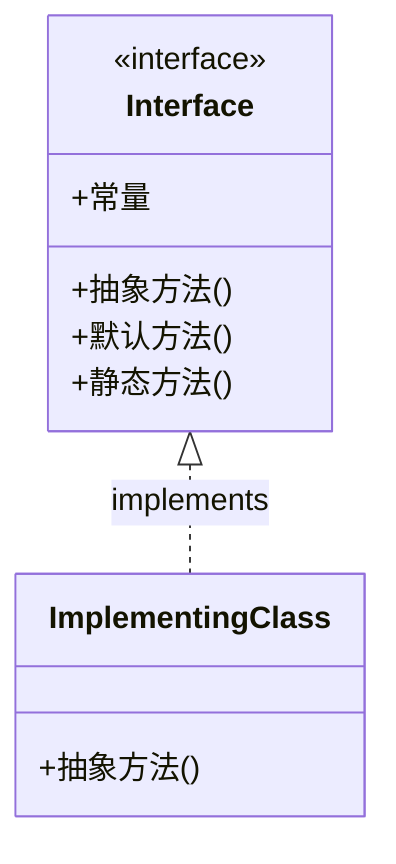

# Java 接口

接口是Java面向对象编程中一个强大而基础的概念，它定义了一组抽象方法和常量，为类提供了一种实现多继承的机制。通过接口，我们可以定义类"能做什么"，而不关心"如何做"的具体实现细节。

## 什么是接口？

接口(Interface)可以理解为一种特殊的抽象类，它只包含常量和抽象方法的定义，不包含任何方法的实现。接口作为一种规范或契约，定义了类应该遵守的行为准则。



## 接口的特点

- 接口中的方法默认是`public abstract`的，即使不显式声明
- 接口中的变量默认是`public static final`的常量
- 一个类可以实现多个接口，解决了Java单继承的限制
- 接口不能被实例化，但可以被实现(implements)
- 从Java 8开始，接口可以包含默认方法和静态方法
- 从Java 9开始，接口可以包含私有方法

## 接口的定义与实现

### 定义接口

接口使用`interface`关键字定义：

```java
public interface Animal {
    // 常量定义
    int LEGS = 4;  // 隐式地 public static final
    
    // 抽象方法
    void eat();    // 隐式地 public abstract
    void sleep();
    
    // 默认方法（Java 8+）
    default void breathe() {
        System.out.println("吸入氧气，呼出二氧化碳");
    }
    
    // 静态方法（Java 8+）
    static void info() {
        System.out.println("这是动物接口");
    }
}
```

### 实现接口

类通过`implements`关键字实现接口：

```java
public class Dog implements Animal {
    @Override
    public void eat() {
        System.out.println("狗吃骨头");
    }
    
    @Override
    public void sleep() {
        System.out.println("狗趴着睡");
    }
    
    // 可以选择性地重写默认方法
    @Override
    public void breathe() {
        System.out.println("狗喘气");
    }
}
```

### 使用接口

```java
public class InterfaceDemo {
    public static void main(String[] args) {
        // 使用接口引用指向实现类对象
        Animal dog = new Dog();
        dog.eat();      // 输出: 狗吃骨头
        dog.sleep();    // 输出: 狗趴着睡
        dog.breathe();  // 输出: 狗喘气 或 如果未重写则输出默认实现
        
        // 访问接口常量
        System.out.println("动物腿的数量: " + Animal.LEGS);  // 输出: 动物腿的数量: 4
        
        // 调用接口静态方法
        Animal.info();  // 输出: 这是动物接口
    }
}
```

## 接口的多实现

与类只能单继承不同，一个类可以实现多个接口：

```java
interface Swimmer {
    void swim();
}

interface Runner {
    void run();
}

public class Duck implements Animal, Swimmer, Runner {
    @Override
    public void eat() {
        System.out.println("鸭子吃虫子");
    }
    
    @Override
    public void sleep() {
        System.out.println("鸭子站着睡");
    }
    
    @Override
    public void swim() {
        System.out.println("鸭子在水中游");
    }
    
    @Override
    public void run() {
        System.out.println("鸭子在岸上跑");
    }
}
```

## 接口的继承

接口可以继承其他接口，并且可以多继承：

```java
interface Flying {
    void fly();
}

// 接口多继承
interface SuperBird extends Animal, Flying {
    void buildNest();
}

class Eagle implements SuperBird {
    @Override
    public void eat() {
        System.out.println("鹰吃肉");
    }
    
    @Override
    public void sleep() {
        System.out.println("鹰在巢中睡");
    }
    
    @Override
    public void fly() {
        System.out.println("鹰在高空翱翔");
    }
    
    @Override
    public void buildNest() {
        System.out.println("鹰在悬崖上筑巢");
    }
}
```

## 接口的默认方法与静态方法

从Java 8开始，接口可以包含带有实现的默认方法和静态方法。

### 默认方法

默认方法使用`default`关键字声明，它们为接口提供了一种向后兼容的方式来添加新功能：

```java
interface Vehicle {
    void start();
    void stop();
    
    default void honk() {
        System.out.println("嘟嘟!");
    }
}

class Car implements Vehicle {
    @Override
    public void start() {
        System.out.println("汽车启动");
    }
    
    @Override
    public void stop() {
        System.out.println("汽车停止");
    }
    
    // 不需要实现honk()，可以直接使用默认实现
}
```

### 静态方法

静态方法属于接口本身，不能被实现类重写：

```java
interface Calculator {
    static int add(int a, int b) {
        return a + b;
    }
    
    int subtract(int a, int b);
}

class BasicCalculator implements Calculator {
    @Override
    public int subtract(int a, int b) {
        return a - b;
    }
    
    // 不能重写静态方法add
}

// 使用接口静态方法
int result = Calculator.add(5, 3);  // result = 8
```

### 多继承的冲突解决

当一个类实现多个具有相同默认方法的接口时，会产生冲突：

```java
interface A {
    default void show() {
        System.out.println("接口A的show方法");
    }
}

interface B {
    default void show() {
        System.out.println("接口B的show方法");
    }
}

class C implements A, B {
    // 必须重写冲突的默认方法
    @Override
    public void show() {
        // 选择调用A的默认实现
        A.super.show();
        
        // 或选择调用B的默认实现
        // B.super.show();
        
        // 或提供完全不同的实现
        // System.out.println("C类的show方法");
    }
}
```

## 函数式接口

Java 8引入了函数式接口的概念，它是只包含一个抽象方法的接口。这种接口可以与Lambda表达式一起使用。

```java
@FunctionalInterface  // 这个注解用于标记函数式接口
interface Greeting {
    void sayHello(String name);
}

public class FunctionalInterfaceDemo {
    public static void main(String[] args) {
        // 使用Lambda表达式实现接口
        Greeting greeting = name -> System.out.println("Hello, " + name);
        greeting.sayHello("Java");  // 输出: Hello, Java
    }
}
```

:::note
注意`@FunctionalInterface`注解是可选的，但它可以帮助编译器检查接口是否符合函数式接口的要求。
:::

## 接口与抽象类的区别

虽然接口和抽象类都用于实现抽象，但它们有很多区别：

| 特性 | 接口 | 抽象类 |
|------|------|--------|
| 方法 | 只能有抽象方法、默认方法、静态方法和私有方法 | 可以有抽象方法和普通方法 |
| 变量 | 只能有常量(public static final) | 可以有各种类型的变量 |
| 继承 | 一个类可以实现多个接口 | 一个类只能继承一个抽象类 |
| 构造器 | 不能有构造器 | 可以有构造器 |
| 访问修饰符 | 方法默认为public | 方法可以有各种访问修饰符 |
| 设计目的 | 定义类的行为规范，"能做什么" | 复用代码，被继承的类之间有"is-a"关系 |

## 实际应用场景

### 1. 系统设计与解耦

接口在软件设计中起着重要作用，特别是在实现松耦合架构时：

```java
// 定义数据访问接口
interface UserDAO {
    User findById(long id);
    void save(User user);
    void delete(User user);
}

// 实现类可以是MySQL数据库访问
class MySQLUserDAO implements UserDAO {
    // MySQL实现...
}

// 或MongoDB数据库访问
class MongoUserDAO implements UserDAO {
    // MongoDB实现...
}

// 业务服务使用接口，不依赖具体实现
class UserService {
    private UserDAO userDAO;
    
    public UserService(UserDAO userDAO) {
        this.userDAO = userDAO;
    }
    
    public void processUser(long id) {
        User user = userDAO.findById(id);
        // 处理用户...
    }
}
```

这种设计使得`UserService`不依赖于具体的数据库实现，我们可以轻松地切换数据库而不需要修改业务逻辑。

### 2. 回调与事件处理

接口常用于实现回调机制和事件处理：

```java
interface ButtonClickListener {
    void onClick(int x, int y);
}

class Button {
    private ButtonClickListener clickListener;
    
    public void setClickListener(ButtonClickListener listener) {
        this.clickListener = listener;
    }
    
    public void click(int x, int y) {
        if (clickListener != null) {
            clickListener.onClick(x, y);
        }
    }
}

// 使用
class MyApp {
    public void start() {
        Button button = new Button();
        
        // 使用匿名内部类
        button.setClickListener(new ButtonClickListener() {
            @Override
            public void onClick(int x, int y) {
                System.out.println("按钮被点击: 位置(" + x + ", " + y + ")");
            }
        });
        
        // 或使用Lambda表达式
        button.setClickListener((x, y) -> 
            System.out.println("按钮被点击: 位置(" + x + ", " + y + ")")
        );
        
        button.click(10, 20);
    }
}
```

### 3. 策略模式

接口在实现设计模式时非常有用，比如策略模式：

```java
interface PaymentStrategy {
    void pay(double amount);
}

class CreditCardPayment implements PaymentStrategy {
    private String cardNumber;
    
    public CreditCardPayment(String cardNumber) {
        this.cardNumber = cardNumber;
    }
    
    @Override
    public void pay(double amount) {
        System.out.println("支付 " + amount + " 元，使用信用卡: " + cardNumber);
    }
}

class AlipayPayment implements PaymentStrategy {
    private String email;
    
    public AlipayPayment(String email) {
        this.email = email;
    }
    
    @Override
    public void pay(double amount) {
        System.out.println("支付 " + amount + " 元，使用支付宝账户: " + email);
    }
}

class ShoppingCart {
    private PaymentStrategy paymentStrategy;
    
    public void setPaymentStrategy(PaymentStrategy paymentStrategy) {
        this.paymentStrategy = paymentStrategy;
    }
    
    public void checkout(double amount) {
        paymentStrategy.pay(amount);
    }
}

// 客户端代码
ShoppingCart cart = new ShoppingCart();
cart.setPaymentStrategy(new CreditCardPayment("1234-5678-9012-3456"));
cart.checkout(100.50);  // 输出: 支付 100.5 元，使用信用卡: 1234-5678-9012-3456

cart.setPaymentStrategy(new AlipayPayment("example@email.com"));
cart.checkout(58.99);   // 输出: 支付 58.99 元，使用支付宝账户: example@email.com
```

## Java 标准库中的接口

Java标准库中有很多重要的接口，了解它们有助于我们更好地使用Java：

1. `Comparable<T>` - 用于对象的自然排序
2. `Comparator<T>` - 提供比较器进行排序
3. `List`, `Set`, `Map` - 集合框架的核心接口
4. `Runnable`, `Callable<V>` - 用于线程操作
5. `AutoCloseable` - 用于资源的自动关闭

示例 - 实现`Comparable`接口：

```java
public class Student implements Comparable<Student> {
    private String name;
    private int age;
    
    public Student(String name, int age) {
        this.name = name;
        this.age = age;
    }
    
    @Override
    public int compareTo(Student other) {
        // 按照年龄排序
        return this.age - other.age;
    }
    
    @Override
    public String toString() {
        return name + " (" + age + "岁)";
    }
    
    public static void main(String[] args) {
        List<Student> students = new ArrayList<>();
        students.add(new Student("张三", 20));
        students.add(new Student("李四", 18));
        students.add(new Student("王五", 22));
        
        Collections.sort(students);  // 使用自然排序
        
        for (Student student : students) {
            System.out.println(student);
        }
        
        // 输出:
        // 李四 (18岁)
        // 张三 (20岁)
        // 王五 (22岁)
    }
}
```

## 总结

接口是Java面向对象编程中一个极其重要的概念，它提供了一种定义类行为规范的方式，同时支持了多继承的特性。通过接口，我们可以：

- 实现不相关类的类型统一
- 指定对象的行为规范，而不关心具体实现
- 解耦系统组件，提高程序扩展性
- 实现多继承的机制，解决单继承的限制
- 便于进行模块化开发和测试

从Java 8开始，接口变得更加强大，通过默认方法和静态方法的引入，接口不仅仅是抽象方法的集合，还可以提供具体行为的实现。

掌握接口的概念和使用，对于编写灵活、可扩展的Java程序至关重要。

## 练习题

1. 创建一个`Shape`接口，包含计算面积和周长的方法，然后实现几个具体的形状类。
2. 设计一个简单的插件系统，使用接口定义插件的行为。
3. 实现一个支持多种排序算法的排序器，使用接口实现策略模式。
4. 给定一个`Playable`接口，定义音乐和视频播放器的共同行为，然后实现具体的播放器类。
5. 设计一个简单的日志系统，支持将日志输出到不同的目标（控制台、文件、数据库等）。

:::tip
学习接口时，不要只关注语法，更要理解其在软件设计中的作用。尝试在自己的项目中识别和应用接口，特别是在需要提高代码灵活性和可维护性的地方。
:::