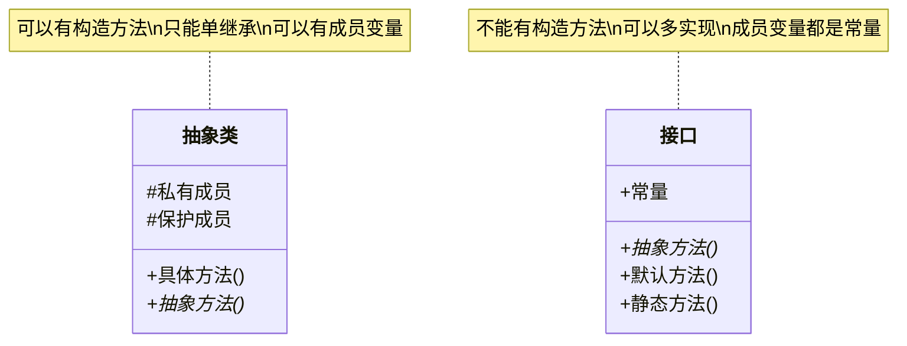

# Java 接口实现

在Java面向对象编程中，接口是一种特殊的抽象类型，它定义了一组方法但不提供具体实现。接口为类与类之间的交互提供了标准化的契约，是多态性和抽象设计的重要工具。本文将深入讲解Java接口的定义、实现及其在实际编程中的应用。

## 什么是Java接口？

接口是Java中一种完全抽象的类型，只包含抽象方法和常量定义。它描述了一个类"能做什么"，而不关心"如何做"。通过接口，我们可以实现不相关类的相似行为，这是多重继承的一种替代方案。

:::note
从Java 8开始，接口允许包含默认方法(default methods)和静态方法(static methods)的实现，从Java 9开始，还可以包含私有方法。
:::

## 接口的定义

Java接口使用`interface`关键字定义，基本语法如下：

```java
public interface 接口名称 {
    // 常量定义（默认public static final）
    数据类型 常量名称 = 值;
    
    // 抽象方法（默认public abstract）
    返回类型 方法名称(参数列表);
    
    // Java 8添加的默认方法
    default 返回类型 方法名称(参数列表) {
        // 方法实现
    }
    
    // Java 8添加的静态方法
    static 返回类型 方法名称(参数列表) {
        // 方法实现
    }
    
    // Java 9添加的私有方法
    private 返回类型 方法名称(参数列表) {
        // 方法实现
    }
}
```

## 接口的特性

1. **接口中的所有方法默认都是`public abstract`**（Java 8之前）
2. **接口中的所有变量默认都是`public static final`**（常量）
3. **接口不能被实例化**
4. **一个类可以实现多个接口**（而只能继承一个类）
5. **接口可以继承其他接口**

## 接口的实现

类通过`implements`关键字来实现接口：

```java
public class 类名 implements 接口名 {
    // 必须实现接口中的所有抽象方法
    @Override
    public 返回类型 方法名(参数列表) {
        // 具体实现
    }
    
    // 类自己的其他方法和属性
}
```

### 实现单个接口的示例

让我们通过一个简单的例子来理解接口的实现：

```java
// 定义一个接口
public interface Drawable {
    void draw(); // 抽象方法
    
    default void displayInfo() {
        System.out.println("这是一个可绘制的对象");
    }
}

// 实现接口的类
public class Circle implements Drawable {
    private double radius;
    
    public Circle(double radius) {
        this.radius = radius;
    }
    
    // 实现接口的抽象方法
    @Override
    public void draw() {
        System.out.println("绘制一个半径为 " + radius + " 的圆");
    }
    
    public double getArea() {
        return Math.PI * radius * radius;
    }
}

// 测试类
public class InterfaceDemo {
    public static void main(String[] args) {
        Drawable d = new Circle(5);
        d.draw();          // 输出: 绘制一个半径为 5.0 的圆
        d.displayInfo();   // 输出: 这是一个可绘制的对象
        
        // 注意: 不能直接通过 Drawable 引用调用 getArea() 方法
        // 因为该方法不是接口的一部分
        Circle c = (Circle) d;
        System.out.println("圆的面积: " + c.getArea());  // 输出: 圆的面积: 78.53981633974483
    }
}
```

### 实现多个接口的示例

Java允许一个类实现多个接口，这是Java解决多继承问题的方式：

```java
// 另一个接口
public interface Calculable {
    double calculate();
}

// 同时实现两个接口
public class Rectangle implements Drawable, Calculable {
    private double width;
    private double height;
    
    public Rectangle(double width, double height) {
        this.width = width;
        this.height = height;
    }
    
    @Override
    public void draw() {
        System.out.println("绘制一个宽为 " + width + "，高为 " + height + " 的矩形");
    }
    
    @Override
    public double calculate() {
        return width * height;
    }
}

// 测试代码
public static void main(String[] args) {
    Rectangle rect = new Rectangle(4, 5);
    rect.draw();  // 输出: 绘制一个宽为 4.0，高为 5.0 的矩形
    System.out.println("矩形面积: " + rect.calculate());  // 输出: 矩形面积: 20.0
}
```

## 接口的层次结构

接口也可以形成继承层次结构，一个接口可以继承另一个接口：

```java
public interface Animal {
    void eat();
    void sleep();
}

public interface Pet extends Animal {
    void play();
    void getName();
}

// 实现 Pet 接口的类必须实现 Animal 和 Pet 中的所有方法
public class Cat implements Pet {
    private String name;
    
    public Cat(String name) {
        this.name = name;
    }
    
    @Override
    public void eat() {
        System.out.println(name + " 正在吃猫粮");
    }
    
    @Override
    public void sleep() {
        System.out.println(name + " 正在睡觉");
    }
    
    @Override
    public void play() {
        System.out.println(name + " 正在玩毛线球");
    }
    
    @Override
    public void getName() {
        System.out.println("宠物的名字是: " + name);
    }
}
```

## Java 8 接口的新特性

### 默认方法（Default Methods）

Java 8开始，接口可以包含带有实现的默认方法：

```java
public interface Vehicle {
    void accelerate();
    
    default void brake() {
        System.out.println("标准刹车系统");
    }
}

public class Car implements Vehicle {
    @Override
    public void accelerate() {
        System.out.println("汽车加速");
    }
    
    // 可以选择不重写 brake() 方法，使用默认实现
}

public class SportsCar implements Vehicle {
    @Override
    public void accelerate() {
        System.out.println("跑车快速加速");
    }
    
    // 也可以选择重写默认方法
    @Override
    public void brake() {
        System.out.println("高性能刹车系统");
    }
}
```

### 静态方法（Static Methods）

Java 8还允许在接口中定义静态方法：

```java
public interface MathOperation {
    int operate(int a, int b);
    
    static int add(int a, int b) {
        return a + b;
    }
    
    static int subtract(int a, int b) {
        return a - b;
    }
}

// 可以直接通过接口名调用静态方法
public static void main(String[] args) {
    System.out.println("10 + 5 = " + MathOperation.add(10, 5));  // 输出: 10 + 5 = 15
    System.out.println("10 - 5 = " + MathOperation.subtract(10, 5));  // 输出: 10 - 5 = 5
}
```

## 接口与抽象类的比较

接口和抽象类都是Java中的抽象类型，但它们有一些重要区别：



| 特性 | 接口 | 抽象类 |
|------|------|--------|
| 方法实现 | 只能有抽象方法、默认方法、静态方法和私有方法 | 可以同时包含抽象方法和具体方法 |
| 变量 | 只能有常量 (public static final) | 可以有各种类型的成员变量 |
| 构造器 | 不能有构造器 | 可以有构造器 |
| 继承 | 一个类可以实现多个接口 | 一个类只能继承一个抽象类 |
| 访问修饰符 | 方法默认是public | 方法可以是任何访问修饰符 |

## 接口的实际应用场景

### 案例1：策略模式

接口经常用于实现设计模式，如策略模式：

```java
// 定义支付策略接口
public interface PaymentStrategy {
    void pay(double amount);
}

// 具体实现：信用卡支付
public class CreditCardPayment implements PaymentStrategy {
    private String cardNumber;
    private String name;
    
    public CreditCardPayment(String cardNumber, String name) {
        this.cardNumber = cardNumber;
        this.name = name;
    }
    
    @Override
    public void pay(double amount) {
        System.out.println(amount + " 已通过信用卡 " + cardNumber + " 支付");
    }
}

// 具体实现：支付宝支付
public class AlipayPayment implements PaymentStrategy {
    private String email;
    
    public AlipayPayment(String email) {
        this.email = email;
    }
    
    @Override
    public void pay(double amount) {
        System.out.println(amount + " 已通过支付宝账户 " + email + " 支付");
    }
}

// 购物车类使用支付策略
public class ShoppingCart {
    private PaymentStrategy paymentStrategy;
    
    public void setPaymentStrategy(PaymentStrategy paymentStrategy) {
        this.paymentStrategy = paymentStrategy;
    }
    
    public void checkout(double amount) {
        paymentStrategy.pay(amount);
    }
}

// 使用示例
public static void main(String[] args) {
    ShoppingCart cart = new ShoppingCart();
    
    // 使用信用卡支付
    cart.setPaymentStrategy(new CreditCardPayment("1234-5678-9012-3456", "张三"));
    cart.checkout(100.0);  // 输出: 100.0 已通过信用卡 1234-5678-9012-3456 支付
    
    // 使用支付宝支付
    cart.setPaymentStrategy(new AlipayPayment("zhangsan@example.com"));
    cart.checkout(200.0);  // 输出: 200.0 已通过支付宝账户 zhangsan@example.com 支付
}
```

### 案例2：回调功能

接口常用于实现回调功能：

```java
// 定义回调接口
public interface DataLoadListener {
    void onDataLoaded(String data);
    void onError(String error);
}

// 数据加载器
public class DataLoader {
    private DataLoadListener listener;
    
    public void setListener(DataLoadListener listener) {
        this.listener = listener;
    }
    
    public void loadData() {
        // 模拟耗时操作
        new Thread(() -> {
            try {
                Thread.sleep(2000);  // 模拟网络请求
                // 假设数据加载成功
                if (listener != null) {
                    listener.onDataLoaded("这是加载的数据");
                }
            } catch (Exception e) {
                if (listener != null) {
                    listener.onError("加载数据出错: " + e.getMessage());
                }
            }
        }).start();
    }
}

// 使用回调接口
public class DataManager implements DataLoadListener {
    public void startLoading() {
        DataLoader loader = new DataLoader();
        loader.setListener(this);
        System.out.println("开始加载数据...");
        loader.loadData();
    }
    
    @Override
    public void onDataLoaded(String data) {
        System.out.println("数据加载成功: " + data);
        // 处理数据...
    }
    
    @Override
    public void onError(String error) {
        System.out.println("错误: " + error);
        // 处理错误...
    }
}

// 测试代码
public static void main(String[] args) {
    DataManager manager = new DataManager();
    manager.startLoading();
    // 输出:
    // 开始加载数据...
    // (2秒后)
    // 数据加载成功: 这是加载的数据
}
```

## 接口的最佳实践

1. **接口隔离原则**：接口应该小而精，不要在一个接口中定义过多的方法。
2. **面向接口编程**：代码应依赖于抽象接口，而不是具体实现。
3. **命名规范**：接口名通常以形容词结尾，如Runnable、Serializable。
4. **谨慎使用默认方法**：默认方法可能导致"菱形继承"问题，使用时需谨慎。
5. **接口与抽象类结合使用**：根据需求选择合适的抽象机制。

## 总结

Java接口是实现多态性和抽象设计的强大工具，它提供了类与类之间的契约，使代码更加灵活、可扩展和可维护。通过本教程，我们学习了：

- 接口的定义和特性
- 如何实现单个或多个接口
- 接口的继承关系
- Java 8 引入的默认方法和静态方法
- 接口与抽象类的区别
- 接口在实际应用中的使用场景

掌握接口的使用，是成为优秀Java开发者的关键步骤之一。通过合理使用接口，我们可以编写出更加灵活、可扩展的代码。

## 练习题

1. 创建一个`Sortable`接口，定义一个`sort()`方法，然后实现两个类`BubbleSort`和`QuickSort`。
2. 设计一个`Logger`接口，包含`log(String message)`方法，实现`ConsoleLogger`和`FileLogger`两个类。
3. 创建一个`Shape`接口，定义`getArea()`和`getPerimeter()`方法，然后实现`Rectangle`和`Triangle`类。
4. 尝试使用接口实现一个简单的插件系统，定义一个`Plugin`接口，然后创建几个实现该接口的插件类。

## 更多学习资源

- Java官方文档中关于接口的章节
- 《Effective Java》第4章：类和接口
- 《Head First设计模式》中与接口相关的设计模式
- 探索Java标准库中的接口实现，如`Comparable`、`Comparator`、`Runnable`等