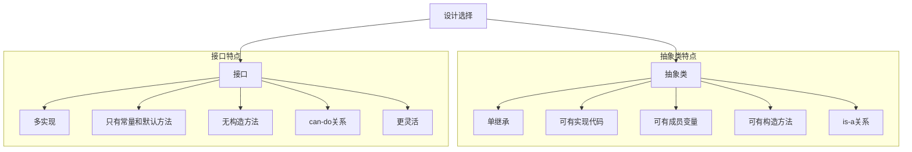

# Java 多接口

在Java面向对象编程中，多接口是一个非常重要的概念，它使类能够实现多个接口，从而获得更大的灵活性和功能扩展性。本文将全面介绍Java多接口的概念、语法、特点以及实际应用场景。

## 什么是Java多接口？

Java接口定义了一组抽象方法，这些方法必须由实现该接口的类来具体实现。与Java类的单继承不同（一个类只能继承一个父类），**Java允许一个类同时实现多个接口**，这就是所谓的"多接口"特性。

:::tip 接口vs类继承
- Java类：**单继承**（一个子类只能有一个直接父类）
- Java接口：**多实现**（一个类可以实现多个接口）
:::

## 接口的基本语法

在深入多接口之前，让我们先回顾一下接口的基本语法：

```java
// 定义接口
public interface 接口名 {
    // 常量定义（默认public static final）
    数据类型 常量名 = 值;
    
    // 抽象方法（默认public abstract）
    返回类型 方法名(参数列表);
    
    // Java 8新增：默认方法（default method）
    default 返回类型 方法名(参数列表) {
        // 方法体
    }
    
    // Java 8新增：静态方法
    static 返回类型 方法名(参数列表) {
        // 方法体
    }
    
    // Java 9新增：私有方法
    private 返回类型 方法名(参数列表) {
        // 方法体
    }
}
```

## 多接口实现的语法

Java类可以通过`implements`关键字同时实现多个接口，多个接口之间用逗号分隔：

```java
public class MyClass extends 父类 implements 接口1, 接口2, 接口3 {
    // 必须实现所有接口中定义的抽象方法
    // 类的其他成员...
}
```

## 多接口实现示例

下面通过一个简单的例子来说明多接口的基本使用：

```java
// 定义第一个接口
interface Printable {
    void print();
}

// 定义第二个接口
interface Drawable {
    void draw();
}

// 实现多个接口的类
class Document implements Printable, Drawable {
    @Override
    public void print() {
        System.out.println("打印文档");
    }
    
    @Override
    public void draw() {
        System.out.println("绘制文档");
    }
    
    public void edit() {
        System.out.println("编辑文档");
    }
}

// 测试类
public class MultiInterfaceDemo {
    public static void main(String[] args) {
        Document doc = new Document();
        doc.print();  // 输出: 打印文档
        doc.draw();   // 输出: 绘制文档
        doc.edit();   // 输出: 编辑文档
        
        // 接口引用只能调用该接口定义的方法
        Printable p = doc;
        p.print();    // 输出: 打印文档
        // p.draw();  // 编译错误
        
        Drawable d = doc;
        d.draw();     // 输出: 绘制文档
        // d.print(); // 编译错误
    }
}
```

## 多接口的特点

### 1. 必须实现所有方法

实现接口的类必须实现接口中定义的所有抽象方法，否则该类必须声明为抽象类。

```java
interface A {
    void methodA();
}

interface B {
    void methodB();
}

// 必须实现所有接口方法
class MyImplementation implements A, B {
    @Override
    public void methodA() {
        System.out.println("实现接口A的方法");
    }
    
    @Override
    public void methodB() {
        System.out.println("实现接口B的方法");
    }
}
```

### 2. 接口方法冲突的解决

当实现的多个接口中存在同名方法时，需要确保方法签名（参数类型、返回类型）完全一致，并且只需实现一次。

```java
interface Flyable {
    void move();
}

interface Swimmable {
    void move();
}

class Duck implements Flyable, Swimmable {
    @Override
    public void move() {
        System.out.println("鸭子可以游泳和飞行");
    }
}
```

### 3. 默认方法冲突解决

如果实现的多个接口中有相同签名的默认方法，必须在实现类中重写该方法来解决冲突：

```java
interface Vehicle {
    default void start() {
        System.out.println("Vehicle starting");
    }
}

interface Engine {
    default void start() {
        System.out.println("Engine starting");
    }
}

class Car implements Vehicle, Engine {
    // 必须重写start方法解决冲突
    @Override
    public void start() {
        // 可以选择调用某个接口的默认实现
        Vehicle.super.start(); // 调用Vehicle接口的默认方法
        // 或者
        // Engine.super.start(); // 调用Engine接口的默认方法
        // 或者提供完全不同的实现
        System.out.println("Car starting both vehicle and engine");
    }
}
```

:::caution 注意冲突处理
当实现多个接口时，如果这些接口包含相同名称和参数的默认方法，必须在实现类中解决这种冲突，否则编译器会报错。
:::

## 多接口与类型转换

实现多接口的类的对象可以被当作任何一个接口类型使用，这为多态提供了更丰富的表现形式。

```java
class MultiInterfaceExample {
    public static void main(String[] args) {
        Document doc = new Document();
        
        // 可以作为Document类使用
        doc.print();
        doc.draw();
        doc.edit();
        
        // 可以作为Printable接口使用
        Printable p = doc;
        p.print();
        
        // 可以作为Drawable接口使用
        Drawable d = doc;
        d.draw();
        
        // 可以在方法参数中使用接口类型
        printDocument(doc);
        drawDocument(doc);
    }
    
    static void printDocument(Printable p) {
        p.print();
    }
    
    static void drawDocument(Drawable d) {
        d.draw();
    }
}
```

## 多接口的实际应用场景

### 1. 实现多种功能

当一个类需要具备多种不同的能力或行为时，多接口是一个理想的解决方案。

```java
interface EmailSender {
    void sendEmail(String recipient, String content);
}

interface SMSSender {
    void sendSMS(String phoneNumber, String message);
}

class NotificationService implements EmailSender, SMSSender {
    @Override
    public void sendEmail(String recipient, String content) {
        System.out.println("发送邮件到：" + recipient);
        System.out.println("内容：" + content);
    }

    @Override
    public void sendSMS(String phoneNumber, String message) {
        System.out.println("发送短信到：" + phoneNumber);
        System.out.println("消息：" + message);
    }
}
```

### 2. 标记接口与行为组合

接口可以用来标记类的特定能力，多接口可以组合这些能力。

```java
// 定义一些"能力"接口
interface Serializable { 
    // 标记接口，无方法 
}

interface Cloneable { 
    // 标记接口，无方法 
}

interface Comparable<T> {
    int compareTo(T other);
}

// 同时具备多种能力的类
class User implements Serializable, Cloneable, Comparable<User> {
    private String name;
    private int age;
    
    // 构造方法和其他成员...
    
    @Override
    public int compareTo(User other) {
        return this.age - other.age;
    }
}
```

### 3. 实际案例：音乐播放器应用

下面是一个更复杂的实际应用案例，展示了多接口在音乐播放器应用中的使用：

```java
// 媒体播放功能
interface MediaPlayer {
    void play();
    void pause();
    void stop();
}

// 音量控制功能
interface VolumeControl {
    void setVolume(int level);
    int getVolume();
}

// 播放列表功能
interface PlaylistControl {
    void next();
    void previous();
    void shuffle();
}

// 基础音乐播放器实现播放功能和音量控制
class BasicMusicPlayer implements MediaPlayer, VolumeControl {
    private int volume = 50;
    private boolean isPlaying = false;
    
    @Override
    public void play() {
        isPlaying = true;
        System.out.println("音乐开始播放");
    }
    
    @Override
    public void pause() {
        isPlaying = false;
        System.out.println("音乐暂停播放");
    }
    
    @Override
    public void stop() {
        isPlaying = false;
        System.out.println("音乐停止播放");
    }
    
    @Override
    public void setVolume(int level) {
        if (level >= 0 && level <= 100) {
            this.volume = level;
            System.out.println("音量设置为: " + level);
        } else {
            System.out.println("音量范围应在0-100之间");
        }
    }
    
    @Override
    public int getVolume() {
        return volume;
    }
}

// 高级音乐播放器增加了播放列表功能
class AdvancedMusicPlayer extends BasicMusicPlayer implements PlaylistControl {
    @Override
    public void next() {
        System.out.println("播放下一首歌曲");
    }
    
    @Override
    public void previous() {
        System.out.println("播放上一首歌曲");
    }
    
    @Override
    public void shuffle() {
        System.out.println("随机播放歌曲");
    }
}

// 应用演示
public class MusicPlayerDemo {
    public static void main(String[] args) {
        System.out.println("========= 基础播放器 =========");
        BasicMusicPlayer basic = new BasicMusicPlayer();
        basic.play();
        basic.setVolume(75);
        System.out.println("当前音量: " + basic.getVolume());
        basic.pause();
        basic.stop();
        
        System.out.println("\n========= 高级播放器 =========");
        AdvancedMusicPlayer advanced = new AdvancedMusicPlayer();
        advanced.play();
        advanced.setVolume(60);
        advanced.next();
        advanced.shuffle();
        advanced.previous();
        advanced.stop();
        
        // 接口类型的使用
        System.out.println("\n========= 接口引用 =========");
        MediaPlayer player = advanced;
        player.play();
        // player.next(); // 编译错误
        
        PlaylistControl playlist = advanced;
        playlist.next();
        // playlist.play(); // 编译错误
    }
}
```

输出结果：

```
========= 基础播放器 =========
音乐开始播放
音量设置为: 75
当前音量: 75
音乐暂停播放
音乐停止播放

========= 高级播放器 =========
音乐开始播放
音量设置为: 60
播放下一首歌曲
随机播放歌曲
播放上一首歌曲
音乐停止播放

========= 接口引用 =========
音乐开始播放
播放下一首歌曲
```

## 接口继承与多接口的结合

接口也可以继承其他接口，这增加了多接口设计的灵活性：

```java
interface Streamable {
    void open();
    void close();
}

// AudioStream接口继承了Streamable接口
interface AudioStream extends Streamable {
    void play();
    void record();
}

// VideoStream接口也继承了Streamable接口
interface VideoStream extends Streamable {
    void display();
    void capture();
}

// 既实现了AudioStream又实现了VideoStream
class MediaStreamer implements AudioStream, VideoStream {
    @Override
    public void open() {
        System.out.println("打开媒体流");
    }
    
    @Override
    public void close() {
        System.out.println("关闭媒体流");
    }
    
    @Override
    public void play() {
        System.out.println("播放音频");
    }
    
    @Override
    public void record() {
        System.out.println("录制音频");
    }
    
    @Override
    public void display() {
        System.out.println("显示视频");
    }
    
    @Override
    public void capture() {
        System.out.println("捕获视频帧");
    }
}
```

## 多接口实现的设计原则

在使用多接口设计时，应遵循以下原则：

1. **接口隔离原则**：接口应该细粒度化，每个接口只负责一个特定的功能领域

2. **单一职责原则**：每个接口应该只有一个职责

3. **组合优于继承**：通过实现多个接口，可以组合出多种行为，比单纯使用继承更灵活

4. **避免接口污染**：不要在接口中定义过多方法，以免实现类被迫实现不需要的方法

5. **接口命名清晰**：接口名称应体现其功能，如以able、ible结尾（如Comparable、Serializable）

## 接口与抽象类的对比

在使用多接口时，常常需要考虑使用接口还是抽象类：



## 总结

Java多接口是一种强大的面向对象编程机制，通过它可以：

1. 突破单继承的限制，使一个类同时获得多种能力
2. 提高代码的灵活性和可扩展性
3. 实现更好的模块化和解耦
4. 支持更复杂的多态应用场景
5. 使设计更符合"组合优于继承"的原则

在实际开发中，多接口的运用非常广泛，特别是在框架设计、API开发和面向对象的复杂系统中。通过合理使用多接口，我们可以创建更加模块化、灵活和可维护的代码。

## 练习

为了巩固所学知识，尝试完成以下练习：

1. 设计一个智能家电控制系统，定义不同的接口如`PowerControl`（开关电源）、`TemperatureControl`（温度控制）、`TimerControl`（定时功能），然后实现具有不同组合功能的设备类，如空调、电视、智能灯泡等。

2. 创建一个文件处理系统，定义接口如`Readable`、`Writable`、`Executable`，并实现不同类型的文件类，展示它们的特性和功能差异。

3. 实现一个简单的游戏角色系统，定义接口如`Attackable`、`Healable`、`Movable`，然后创建不同职业的角色类，如战士、法师、牧师等，每种职业实现不同的接口组合。

## 延伸阅读

- [Java 8 接口默认方法和静态方法](https://docs.oracle.com/javase/tutorial/java/IandI/defaultmethods.html)
- [Oracle官方文档：接口](https://docs.oracle.com/javase/tutorial/java/IandI/createinterface.html)
- 《Effective Java》（第3版）第20条：优先使用接口而非抽象类
- 《Head First设计模式》接口与设计模式相关章节