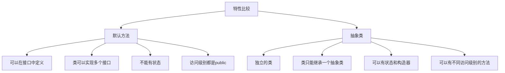

# Java 默认方法

## 什么是默认方法？

Java 8 引入了一个重要的新特性：**接口默认方法**（Default Methods）。在此之前，Java 接口只能包含抽象方法（没有实现体的方法）和常量。而默认方法允许我们在接口中定义具有实现体的方法，实现该接口的类可以直接使用这些方法，而无需提供实现。

默认方法的引入主要是为了解决接口演化问题。假设你发布了一个接口，并且已经有许多类实现了该接口。如果你想要在接口中添加新方法，那么所有实现该接口的类都必须实现这个新方法，这可能会导致大量的代码兼容性问题。默认方法解决了这一挑战。

## 默认方法的语法

默认方法的声明使用 `default` 关键字，并且必须包含一个方法体：

```java
public interface MyInterface {
    // 普通的抽象方法（没有实现体）
    void abstractMethod();
    
    // 默认方法（有实现体）
    default void defaultMethod() {
        System.out.println("这是默认方法的实现");
    }
}
```

## 为什么需要默认方法？

Java 8 引入默认方法主要有以下几个原因：

1. **接口演化**：允许向现有接口添加新功能，而不破坏实现该接口的类
2. **API 增强**：使 Java 集合框架能够利用 lambda 表达式
3. **多重继承的行为**：提供了一种类似多重继承的机制，但避免了传统多重继承的复杂性

## 默认方法的基本使用

让我们通过一个简单的例子来看看默认方法的使用：

```java
public interface Vehicle {
    // 抽象方法
    void start();
    
    // 默认方法
    default void honk() {
        System.out.println("嘟嘟!");
    }
}

public class Car implements Vehicle {
    @Override
    public void start() {
        System.out.println("汽车启动");
    }
    
    // 不需要实现honk()方法
}

public class Main {
    public static void main(String[] args) {
        Car car = new Car();
        car.start();  // 输出: 汽车启动
        car.honk();   // 输出: 嘟嘟!
    }
}
```

在上面的例子中，`Car` 类实现了 `Vehicle` 接口，但只需要实现抽象方法 `start()`。默认方法 `honk()` 可以直接被 `Car` 类的实例调用，而无需在 `Car` 类中提供实现。

## 默认方法的覆盖

实现接口的类可以选择覆盖默认方法：

```java
public class Truck implements Vehicle {
    @Override
    public void start() {
        System.out.println("卡车启动");
    }
    
    @Override
    public void honk() {
        System.out.println("喇叭声很大!");
    }
}

public class Main {
    public static void main(String[] args) {
        Truck truck = new Truck();
        truck.start();  // 输出: 卡车启动
        truck.honk();   // 输出: 喇叭声很大!
    }
}
```

## 默认方法和多重继承

当一个类实现多个接口，而这些接口包含具有相同签名的默认方法时，会出现一个有趣的情况：

```java
public interface Alarm {
    default void sound() {
        System.out.println("警报声!");
    }
}

public interface Vehicle {
    default void sound() {
        System.out.println("喇叭声!");
    }
}

public class Car implements Vehicle, Alarm {
    // 冲突! Car 类必须覆盖 sound() 方法
    @Override
    public void sound() {
        // 可以选择实现自己的逻辑
        System.out.println("汽车喇叭声!");
        
        // 或者调用特定接口的默认方法
        Vehicle.super.sound();
        Alarm.super.sound();
    }
}
```

:::tip
当实现的多个接口有相同签名的默认方法时，实现类必须覆盖该方法以解决冲突。可以使用 `InterfaceName.super.methodName()` 语法来调用特定接口的默认方法。
:::

## 静态方法和默认方法的区别

Java 8 还允许在接口中定义静态方法。以下是静态方法和默认方法的区别：

```java
public interface Utility {
    // 默认方法 - 可以被实现类的实例调用
    default void instanceMethod() {
        System.out.println("这是一个默认实例方法");
    }
    
    // 静态方法 - 只能通过接口名调用
    static void staticMethod() {
        System.out.println("这是一个静态方法");
    }
}

public class UtilityImpl implements Utility {
    public static void main(String[] args) {
        UtilityImpl obj = new UtilityImpl();
        obj.instanceMethod();        // 有效 - 输出: 这是一个默认实例方法
        // obj.staticMethod();       // 错误! 不能通过实现类实例调用
        
        Utility.staticMethod();      // 有效 - 输出: 这是一个静态方法
        // Utility.instanceMethod(); // 错误! 不能通过接口名调用实例方法
    }
}
```

## 实际应用场景

### 1. Java 集合框架增强

Java 8 使用默认方法增强了集合框架，例如 `Collection` 接口中的 `forEach` 方法：

```java
public class CollectionExample {
    public static void main(String[] args) {
        List<String> names = Arrays.asList("Alice", "Bob", "Charlie");
        
        // 使用默认方法 forEach
        names.forEach(name -> System.out.println("Hello, " + name));
        
        // 输出:
        // Hello, Alice
        // Hello, Bob
        // Hello, Charlie
    }
}
```

### 2. 优雅地实现可选功能

默认方法可以用于提供接口的可选功能实现：

```java
public interface Auditable {
    default void audit() {
        System.out.println("执行默认的审计逻辑");
    }
}

public class Transaction implements Auditable {
    private String id;
    private double amount;
    
    // 使用默认的审计功能
}

public class SecureTransaction implements Auditable {
    private String id;
    private double amount;
    
    // 提供自定义审计逻辑
    @Override
    public void audit() {
        System.out.println("执行加强的安全审计");
        // 记录详细的审计日志
    }
}
```

### 3. 工具方法

默认方法可用于提供通用的工具方法：

```java
public interface StringProcessor {
    String process(String input);
    
    default String processAndPrint(String input) {
        String result = process(input);
        System.out.println("处理结果: " + result);
        return result;
    }
}

public class UpperCaseProcessor implements StringProcessor {
    @Override
    public String process(String input) {
        return input.toUpperCase();
    }
}

public class Main {
    public static void main(String[] args) {
        StringProcessor processor = new UpperCaseProcessor();
        processor.processAndPrint("hello");  // 输出: 处理结果: HELLO
    }
}
```

## 默认方法与抽象类的比较

默认方法看起来似乎与抽象类提供的功能类似，但它们有几个关键区别：



:::caution
虽然默认方法和抽象类都可以提供方法实现，但它们的设计目标不同。默认方法主要用于接口演化，而抽象类用于提供一个通用的基础实现。
:::

## 默认方法的最佳实践

1. **避免过度使用**：默认方法的主要目的是接口演化，而不是取代抽象类
2. **保持简单**：默认方法应该简单，不应包含复杂的状态逻辑
3. **文档化**：清晰地记录默认方法的行为和用途
4. **一致性**：保持接口的一致性，不要因为有了默认方法就随意添加不相关的功能

## 总结

Java 8 中引入的默认方法为接口增加了新的维度，使接口能够：
- 提供方法实现，而不仅仅是方法声明
- 在不破坏现有实现的情况下扩展接口
- 在某种程度上实现类似多重继承的特性

默认方法主要解决了库设计者在发展API时面临的困境，同时为Java程序员提供了更灵活的设计选择。作为Java开发者，了解默认方法的工作原理和最佳实践对于设计出更好的Java程序至关重要。

## 练习

1. 创建一个名为 `Playable` 的接口，其中包含一个抽象方法 `play()` 和一个默认方法 `stop()`。
2. 创建两个实现 `Playable` 接口的类：`MusicPlayer` 和 `VideoPlayer`。
3. 创建另一个接口 `Recordable`，其中也有一个默认方法 `stop()`。
4. 创建一个同时实现 `Playable` 和 `Recordable` 的类 `MediaRecorder`，并解决方法冲突。
5. 编写一个测试程序，展示所有类和接口的功能。

## 其他资源

- [Java 官方文档 - 默认方法](https://docs.oracle.com/javase/tutorial/java/IandI/defaultmethods.html)
- [Java 8 Lambda 表达式](https://docs.oracle.com/javase/tutorial/java/javaOO/lambdaexpressions.html)
- [Java 8 中的接口变化](https://docs.oracle.com/javase/8/docs/technotes/guides/language/enhancements.html#interfacemethods)

通过掌握默认方法，你将能够更灵活地设计和使用Java接口，为你的面向对象编程技能增添强大的工具。