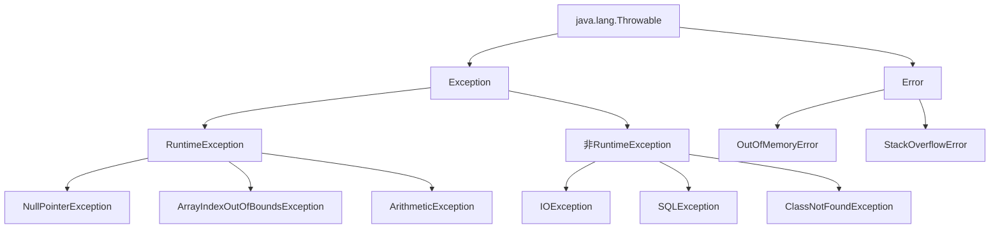

# Java 异常概述

## 什么是异常？

在Java编程过程中，程序可能会遇到各种预期或非预期的问题情况，这些问题情况被称为"异常"。异常是程序执行过程中出现的一种特殊事件，它会中断程序的正常流程。

Java提供了一套完善的异常处理机制，帮助开发者管理和处理这些异常情况，以提高程序的健壮性和容错性。

:::tip 为什么需要异常处理？
- 分离错误处理代码与常规代码
- 集中管理错误处理逻辑
- 向上传播错误信息
- 区分不同类型的错误
:::

## Java 异常类层次结构

Java异常类都继承自`java.lang.Throwable`类，并分为两个主要分支：



### 异常分类

1. **Error（错误）**：
   - 表示严重的问题，通常是不可恢复的系统级错误
   - 例如：`OutOfMemoryError`、`StackOverflowError`
   - 一般不需要在代码中捕获和处理

2. **Exception（异常）**：
   - **检查型异常（Checked Exception）**：
     - 编译期必须处理（通过try-catch或throws声明）
     - 例如：`IOException`、`SQLException`、`ClassNotFoundException`
   
   - **非检查型异常（Unchecked Exception）**：
     - 也称为运行时异常（RuntimeException）
     - 编译器不强制处理
     - 例如：`NullPointerException`、`ArrayIndexOutOfBoundsException`、`ArithmeticException`

## 常见的Java异常

让我们看看一些最常见的Java异常及其产生原因：

| 异常类名 | 类型 | 常见原因 |
|---------|-----|---------|
| NullPointerException | 运行时异常 | 尝试访问null对象的方法或属性 |
| ArrayIndexOutOfBoundsException | 运行时异常 | 数组索引超出范围 |
| ArithmeticException | 运行时异常 | 数学运算错误（如除以零） |
| IOException | 检查型异常 | 输入/输出操作失败 |
| SQLException | 检查型异常 | 数据库访问错误 |
| ClassNotFoundException | 检查型异常 | 找不到类 |
| IllegalArgumentException | 运行时异常 | 方法接收到不合法的参数 |

## 异常处理的基本方法

Java提供了几种处理异常的方式：

### 1. try-catch 语句

最基本的异常处理方式是使用try-catch块：

```java
try {
    // 可能抛出异常的代码
    int result = 10 / 0;  // 会抛出ArithmeticException
} catch (ArithmeticException e) {
    // 处理特定类型的异常
    System.out.println("发生算术异常: " + e.getMessage());
} catch (Exception e) {
    // 处理其他类型的异常
    System.out.println("发生其他异常: " + e.getMessage());
} finally {
    // 无论是否发生异常，都会执行的代码
    System.out.println("finally块总是被执行");
}
```

输出结果：
```
发生算术异常: / by zero
finally块总是被执行
```

### 2. throws 声明

当方法可能抛出检查型异常，但不想在方法内处理时，可以使用throws将异常抛给调用者：

```java
public void readFile(String filename) throws IOException {
    // 读取文件的代码
    FileInputStream file = new FileInputStream(filename);
    // ...
}
```

### 3. throw 语句

当需要手动抛出异常时，使用throw关键字：

```java
public void checkAge(int age) {
    if (age < 0) {
        throw new IllegalArgumentException("年龄不能为负数");
    }
    // 其他代码...
}
```

## 自定义异常

当内置异常无法满足需求时，可以创建自定义异常类：

```java
// 自定义检查型异常
public class InsufficientFundsException extends Exception {
    private double amount;
    
    public InsufficientFundsException(double amount) {
        super("余额不足，还差 " + amount + " 元");
        this.amount = amount;
    }
    
    public double getAmount() {
        return amount;
    }
}

// 使用自定义异常
public class BankAccount {
    private double balance;
    
    public void withdraw(double amount) throws InsufficientFundsException {
        if (amount > balance) {
            throw new InsufficientFundsException(amount - balance);
        }
        balance -= amount;
    }
}
```

## 多异常捕获

Java 7及以上版本允许在单个catch块中处理多个异常：

```java
try {
    // 可能抛出多种异常的代码
} catch (IOException | SQLException e) {
    // 处理多种异常
    System.out.println("发生IO或SQL异常: " + e.getMessage());
}
```

## try-with-resources 语句

Java 7引入了try-with-resources语法，用于自动关闭实现了`AutoCloseable`接口的资源：

```java
try (FileInputStream fis = new FileInputStream("file.txt");
     BufferedReader br = new BufferedReader(new InputStreamReader(fis))) {
    // 使用资源的代码
    String line;
    while ((line = br.readLine()) != null) {
        System.out.println(line);
    }
} catch (IOException e) {
    System.out.println("读取文件时发生错误: " + e.getMessage());
}
// 不需要finally块来关闭资源，资源会自动关闭
```

## 实际应用案例

### 案例1：文件读写操作

在实际开发中，文件操作是异常处理的典型场景：

```java
public static String readFirstLine(String filePath) {
    try (BufferedReader reader = new BufferedReader(new FileReader(filePath))) {
        return reader.readLine();
    } catch (FileNotFoundException e) {
        System.err.println("文件不存在: " + filePath);
        return null;
    } catch (IOException e) {
        System.err.println("读取文件时发生错误: " + e.getMessage());
        return null;
    }
}
```

### 案例2：数据库连接管理

```java
public void updateRecord(int id, String newValue) {
    Connection conn = null;
    PreparedStatement stmt = null;
    
    try {
        conn = DriverManager.getConnection("jdbc:mysql://localhost:3306/mydb", "user", "password");
        stmt = conn.prepareStatement("UPDATE records SET value = ? WHERE id = ?");
        stmt.setString(1, newValue);
        stmt.setInt(2, id);
        int rowsAffected = stmt.executeUpdate();
        System.out.println("已更新 " + rowsAffected + " 条记录");
    } catch (SQLException e) {
        System.err.println("数据库操作失败: " + e.getMessage());
    } finally {
        try {
            if (stmt != null) stmt.close();
            if (conn != null) conn.close();
        } catch (SQLException e) {
            System.err.println("关闭资源失败: " + e.getMessage());
        }
    }
}
```

:::note 注意
上述案例在Java 7以上版本可以使用try-with-resources语句简化资源管理。
:::

## 异常处理最佳实践

1. **只捕获能够处理的异常**：不要笼统地捕获所有异常。

2. **不要忽略异常**：避免空的catch块，至少应记录异常信息。

3. **尽早抛出，尽晚捕获**：在最合适的地方处理异常。

4. **合理使用finally块或try-with-resources**：确保资源正确释放。

5. **不要使用异常控制程序流程**：异常处理机制比正常的条件判断开销大。

6. **为自定义异常提供有意义的信息**：包括错误消息、相关数据等。

7. **正确选择检查型异常与运行时异常**：
   - 使用检查型异常处理可恢复的情况
   - 使用运行时异常处理编程错误

## 总结

Java异常处理机制是构建健壮应用程序的关键部分。它通过将异常情况与正常代码分离，提高了代码的可读性和维护性。合理地使用try-catch、throws、finally等语句，可以让程序优雅地处理各种错误情况。

随着经验的积累，你将能够为不同的场景选择最合适的异常处理策略，使你的程序既能正确处理错误，又能保持代码的清晰和简洁。

## 练习任务

1. 创建一个简单的计算器程序，处理可能出现的各种异常（如除零、输入格式错误等）。

2. 编写一个文件复制程序，使用try-with-resources读取源文件并写入目标文件，妥善处理所有可能的异常。

3. 设计并实现一个自定义异常类，用于验证用户输入的密码是否符合特定的强度要求。

## 进一步学习资源

- Java官方文档中关于异常处理的部分
- 《Effective Java》中关于异常处理的最佳实践建议
- Java核心技术中的异常处理章节

通过掌握异常处理机制，你将能够编写更加健壮、可靠的Java程序，为你的编程之旅打下坚实的基础。