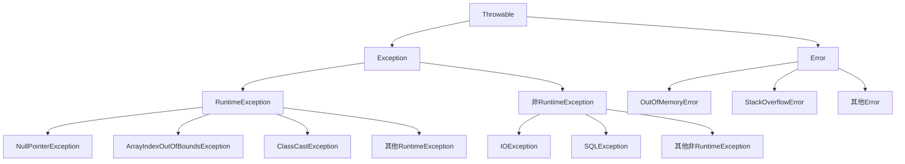

# Java 异常类型

## 什么是异常

在Java程序执行过程中，由于各种原因可能会导致程序出现错误状况，如：文件找不到、网络连接失败、数组下标越界等。这些错误情况在Java中统称为"异常"。

异常是Java提供的一种机制，用于处理程序在运行时可能出现的错误，以提高程序的健壮性和可靠性。Java的异常处理机制让程序能够在出现异常情况时，按照预定的方式响应，而不是直接崩溃。

## Java 异常层次结构

Java的所有异常都源于一个顶层类：`Throwable`。理解异常层次结构是掌握Java异常处理的基础。



### Throwable类

`Throwable`是所有错误和异常类的超类，它有两个重要的子类：`Error`和`Exception`。

主要方法包括：
- `getMessage()`: 返回异常信息
- `printStackTrace()`: 打印异常的堆栈轨迹
- `getStackTrace()`: 获取堆栈轨迹数组

## 主要异常类型

### Error（错误）

`Error`类代表程序运行时可能出现的系统级错误，这些错误通常是严重的，无法通过代码来恢复的。常见的`Error`包括：

1. **OutOfMemoryError**：内存溢出错误，JVM没有足够的内存来分配对象

```java
public class MemoryErrorExample {
    public static void main(String[] args) {
        try {
            int[] array = new int[Integer.MAX_VALUE];
        } catch (OutOfMemoryError e) {
            System.out.println("内存溢出: " + e.getMessage());
            e.printStackTrace();
        }
    }
}
```

2. **StackOverflowError**：栈溢出错误，通常是由于递归调用没有正确的终止条件

```java
public class StackOverflowExample {
    public static void recursiveMethod() {
        recursiveMethod(); // 无限递归调用
    }
    
    public static void main(String[] args) {
        try {
            recursiveMethod();
        } catch (StackOverflowError e) {
            System.out.println("栈溢出: " + e.getMessage());
            e.printStackTrace();
        }
    }
}
```

:::caution 注意
一般情况下，应用程序不应该尝试捕获和处理Error，因为这些错误往往表示严重的问题，可能导致应用程序处于不稳定状态。
:::

### Exception（异常）

`Exception`类是所有异常类的超类，代表程序可能会处理的各种异常情况。`Exception`又分为两大类：

#### 1. 受检异常（Checked Exception）

受检异常是指在编译时就必须被处理的异常，否则程序将无法通过编译。处理方式有两种：
- 使用`try-catch`块捕获异常
- 使用`throws`关键字将异常抛出给调用者

常见的受检异常包括：

**IOException**：输入输出异常，如读写文件时可能发生的问题

```java
import java.io.File;
import java.io.FileInputStream;
import java.io.FileNotFoundException;

public class CheckedExceptionExample {
    public static void main(String[] args) {
        try {
            // 尝试打开一个可能不存在的文件
            File file = new File("不存在的文件.txt");
            FileInputStream fis = new FileInputStream(file);
        } catch (FileNotFoundException e) {
            System.out.println("文件未找到: " + e.getMessage());
        }
    }
}
```

**SQLException**：数据库操作异常

```java
import java.sql.Connection;
import java.sql.DriverManager;
import java.sql.SQLException;

public class SQLExceptionExample {
    public static void main(String[] args) {
        try {
            // 尝试连接到一个不存在的数据库
            Connection conn = DriverManager.getConnection(
                "jdbc:mysql://localhost:3306/不存在的数据库", "username", "password");
        } catch (SQLException e) {
            System.out.println("数据库连接失败: " + e.getMessage());
        }
    }
}
```

#### 2. 非受检异常（Unchecked Exception）

非受检异常也称为运行时异常（RuntimeException），这类异常在编译时不会被检查，但可能在运行时发生。程序员可以选择处理这些异常，但不是必须的。

常见的非受检异常包括：

**NullPointerException**：空指针异常，试图访问一个空引用的对象成员

```java
public class NullPointerExceptionExample {
    public static void main(String[] args) {
        try {
            String str = null;
            System.out.println(str.length()); // 访问空引用的方法
        } catch (NullPointerException e) {
            System.out.println("空指针异常: " + e.getMessage());
            e.printStackTrace();
        }
    }
}

// 输出:
// 空指针异常: null
// java.lang.NullPointerException
//     at NullPointerExceptionExample.main(NullPointerExceptionExample.java:5)
```

**ArrayIndexOutOfBoundsException**：数组下标越界异常

```java
public class ArrayIndexExceptionExample {
    public static void main(String[] args) {
        try {
            int[] arr = new int[5];
            arr[10] = 25; // 访问数组越界位置
        } catch (ArrayIndexOutOfBoundsException e) {
            System.out.println("数组下标越界: " + e.getMessage());
        }
    }
}

// 输出:
// 数组下标越界: Index 10 out of bounds for length 5
```

**ArithmeticException**：算术异常，如除以零

```java
public class ArithmeticExceptionExample {
    public static void main(String[] args) {
        try {
            int result = 10 / 0; // 除以零
        } catch (ArithmeticException e) {
            System.out.println("算术异常: " + e.getMessage());
        }
    }
}

// 输出:
// 算术异常: / by zero
```

**ClassCastException**：类型转换异常，当尝试将对象转换为不兼容的类型时

```java
public class ClassCastExceptionExample {
    public static void main(String[] args) {
        try {
            Object x = new Integer(0);
            System.out.println((String)x); // Integer不能转为String
        } catch (ClassCastException e) {
            System.out.println("类型转换异常: " + e.getMessage());
        }
    }
}

// 输出:
// 类型转换异常: java.lang.Integer cannot be cast to java.lang.String
```

## 自定义异常

Java允许开发者创建自己的异常类，以满足特定的业务需求。自定义异常通常继承自`Exception`(受检异常)或`RuntimeException`(非受检异常)。

```java
// 自定义受检异常
public class InsufficientFundsException extends Exception {
    private double amount;
    
    public InsufficientFundsException(double amount) {
        super("余额不足，还差 " + amount + " 元");
        this.amount = amount;
    }
    
    public double getAmount() {
        return amount;
    }
}

// 使用自定义异常
public class BankAccount {
    private double balance;
    private String accountNumber;
    
    public BankAccount(String accountNumber, double initialBalance) {
        this.accountNumber = accountNumber;
        this.balance = initialBalance;
    }
    
    public void withdraw(double amount) throws InsufficientFundsException {
        if(amount > balance) {
            throw new InsufficientFundsException(amount - balance);
        }
        balance -= amount;
        System.out.println("成功提取 " + amount + " 元，当前余额: " + balance);
    }
    
    public static void main(String[] args) {
        BankAccount account = new BankAccount("12345", 1000);
        try {
            account.withdraw(1500); // 尝试提取超过余额的金额
        } catch (InsufficientFundsException e) {
            System.out.println("操作失败: " + e.getMessage());
        }
    }
}

// 输出:
// 操作失败: 余额不足，还差 500.0 元
```

## 异常类型的选择

在设计自己的代码时，如何选择合适的异常类型是一个重要问题：

1. **使用标准异常**：优先使用Java API中定义的标准异常类，如`IllegalArgumentException`、`UnsupportedOperationException`等。

2. **受检异常 vs 非受检异常**：
   - 对于调用者应该能够合理恢复的情况，使用受检异常
   - 对于编程错误，使用非受检异常
   - 如果不确定，通常建议使用非受检异常

3. **异常命名**：自定义异常应以"Exception"结尾

4. **异常信息**：提供详细的异常信息，帮助调试

## 实际应用案例：文件处理

下面是一个结合多种异常处理的文件读取示例：

```java
import java.io.*;

public class FileProcessingExample {
    public static void main(String[] args) {
        BufferedReader reader = null;
        try {
            // 可能抛出FileNotFoundException (受检异常)
            reader = new BufferedReader(new FileReader("data.txt"));
            
            String line = null;
            int lineNumber = 0;
            
            while ((line = reader.readLine()) != null) {
                lineNumber++;
                // 解析每行数据，可能抛出NumberFormatException (非受检异常)
                try {
                    processLine(line, lineNumber);
                } catch (NumberFormatException e) {
                    System.err.println("第 " + lineNumber + " 行数据格式错误: " + e.getMessage());
                    // 继续处理下一行
                }
            }
        } catch (FileNotFoundException e) {
            System.err.println("文件未找到: " + e.getMessage());
        } catch (IOException e) {
            System.err.println("读取文件时发生错误: " + e.getMessage());
        } finally {
            // 确保资源被关闭
            if (reader != null) {
                try {
                    reader.close();
                } catch (IOException e) {
                    System.err.println("关闭文件时发生错误: " + e.getMessage());
                }
            }
        }
    }
    
    // 处理文件中的一行数据
    private static void processLine(String line, int lineNumber) {
        String[] parts = line.split(",");
        if (parts.length < 2) {
            throw new IllegalArgumentException("数据格式不正确，需要至少2个值，用逗号分隔");
        }
        
        // 尝试将字符串转换为整数，可能抛出NumberFormatException
        int id = Integer.parseInt(parts[0]);
        String name = parts[1];
        
        System.out.println("处理第 " + lineNumber + " 行: ID=" + id + ", Name=" + name);
    }
}
```

:::tip 实用建议
上面的例子还可以使用Java 7引入的try-with-resources语法来简化资源管理：

```java
try (BufferedReader reader = new BufferedReader(new FileReader("data.txt"))) {
    // 使用reader的代码
} catch (IOException e) {
    // 异常处理
}
```

这样可以自动关闭reader，无需显式的finally块。
:::

## 总结

1. Java异常分为`Error`和`Exception`两大类，都继承自`Throwable`类
2. `Error`表示严重的系统级错误，通常不应该被捕获
3. `Exception`又分为受检异常和非受检异常：
   - 受检异常：编译时必须处理，表示程序正常运行中可能出现的情况
   - 非受检异常：继承自`RuntimeException`，表示编程错误或不可预见的错误
4. 选择合适的异常类型有助于设计更健壮的程序
5. 自定义异常可以帮助表达特定的业务逻辑错误

## 练习题

1. 编写一个方法，接收一个整数数组和一个索引，返回该索引处的元素。处理可能的`ArrayIndexOutOfBoundsException`。

2. 创建一个自定义异常`AgeException`，当年龄小于0或大于120时抛出。然后编写一个`Person`类使用这个异常。

3. 编写一个程序，读取一个文本文件的内容，并计算文件中的单词数量。处理可能发生的所有异常。

## 扩展阅读

- Oracle官方Java文档中的[异常处理章节](https://docs.oracle.com/javase/tutorial/essential/exceptions/index.html)
- 《Effective Java》第3版中关于异常处理的章节
- Java核心技术卷I中的异常、断言和日志章节

通过掌握Java异常类型及其使用场景，你将能够编写更加健壮和可维护的代码，有效地处理各种错误情况，提高程序的可靠性。